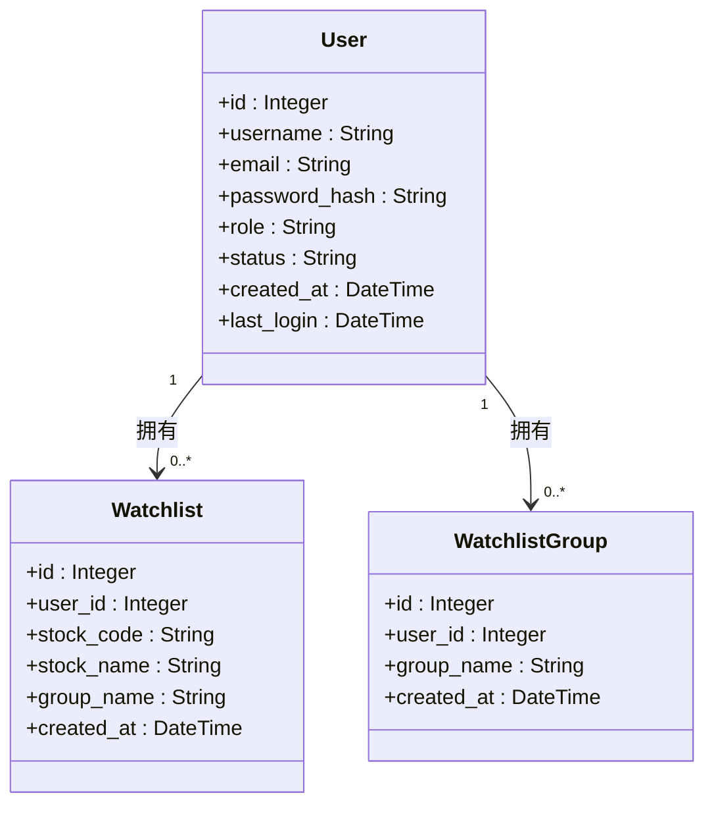
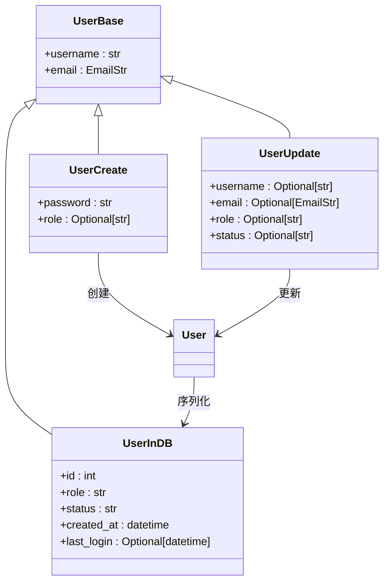

# 用户实体

<cite>
**本文档中引用的文件**  
- [models.py](file://backend_api/models.py#L14-L27)
- [user_manage.py](file://backend_api/user_manage.py#L10-L194)
- [auth.py](file://backend_api/auth.py#L50-L197)
- [users.types.ts](file://admin/src/types/users.types.ts#L0-L9)
</cite>

## 目录
1. [用户实体](#用户实体)
2. [字段定义与业务含义](#字段定义与业务含义)
3. [约束条件与数据完整性](#约束条件与数据完整性)
4. [权限与状态管理](#权限与状态管理)
5. [时间戳行为与用户行为分析](#时间戳行为与用户行为分析)
6. [SQLAlchemy模型与数据库映射](#sqlalchemy模型与数据库映射)
7. [用户操作示例](#用户操作示例)
8. [Pydantic序列化模型转换](#pydantic序列化模型转换)

## 字段定义与业务含义

用户实体（User）是系统核心身份管理模型，定义于 `backend_api/models.py` 中的 `User` 类，对应数据库表 `users`。该实体包含以下字段：

- **id**：用户唯一标识符，整型，主键，自增索引。
- **username**：用户名，字符串类型，用于登录和展示，业务上要求全局唯一。
- **email**：电子邮箱，字符串类型，作为用户联系方式和登录凭证，需保证唯一性。
- **password_hash**：密码哈希值，字符串类型，存储经过加密处理的密码，保障账户安全。
- **role**：角色字段，字符串类型，标识用户权限等级，支持分级访问控制。
- **status**：状态字段，字符串类型，表示用户当前可用性，用于账户启用/禁用管理。
- **created_at**：创建时间戳，日期时间类型，记录用户注册时间。
- **last_login**：最后登录时间，日期时间类型，可为空，用于追踪用户活跃度。

**用户实体字段说明表**

| 字段名 | 数据类型 | 是否可为空 | 默认值 | 业务含义 |
|--------|--------|-----------|--------|----------|
| id | Integer | 否 | - | 用户唯一标识，主键 |
| username | String | 否 | - | 登录用户名，唯一 |
| email | String | 否 | - | 用户邮箱，唯一 |
| password_hash | String | 否 | - | 加密存储的密码 |
| role | String | 否 | "user" | 用户角色（权限等级） |
| status | String | 否 | "active" | 账户状态（启用/禁用） |
| created_at | DateTime | 否 | 当前时间 | 用户创建时间 |
| last_login | DateTime | 是 | - | 最后登录时间 |

**Section sources**
- [models.py](file://backend_api/models.py#L14-L27)

## 约束条件与数据完整性

用户实体通过数据库约束确保数据一致性与完整性：

- **主键约束**：`id` 字段为整型主键，并建立索引以提升查询性能。
- **唯一性约束**：`username` 和 `email` 字段均设置 `unique=True`，防止重复注册，保障用户身份唯一性。
- **非空约束**：除 `last_login` 外，所有字段均设置 `nullable=False`，确保关键信息完整。
- **默认值设置**：
  - `role` 默认为 `"user"`，新用户默认为普通用户。
  - `status` 默认为 `"active"`，注册即启用。
  - `created_at` 使用 `datetime.now` 作为默认值，自动记录创建时间。

这些约束在 SQLAlchemy 模型中通过 `Column` 参数直接声明，映射至数据库层面，确保数据写入时自动校验。

**Section sources**
- [models.py](file://backend_api/models.py#L14-L27)

## 权限与状态管理

### 角色权限分级（role）

`role` 字段实现用户权限分级，当前支持两种角色：

- **user**：普通用户，可访问基础功能，如查看行情、管理自选股等。
- **admin**：管理员，拥有用户管理、系统配置等高级权限。

前端类型定义（`users.types.ts`）中还包含 `'guest'` 角色，表明系统支持更细粒度的权限划分。权限控制通过 `auth.py` 中的 `get_current_admin` 和 `get_current_admin_user` 函数实现，结合 JWT 令牌中的 `is_admin` 声明进行验证。

### 状态管理（status）

`status` 字段用于管理用户账户生命周期，支持以下状态：

- **active**：账户正常，可登录和使用服务。
- **disabled**：账户被禁用，无法登录。
- **suspended**：账户被暂停，通常用于临时限制。

在用户登录流程中（`user_manage.py` 的 `/login` 接口），系统会检查 `status` 是否为 `"active"`，非活跃状态将拒绝登录。管理员可通过 `/api/admin/users/{user_id}/status` 接口修改用户状态，实现灵活的账户管理。

**Section sources**
- [models.py](file://backend_api/models.py#L14-L27)
- [user_manage.py](file://backend_api/user_manage.py#L120-L140)
- [users.types.ts](file://admin/src/types/users.types.ts#L3-L4)

## 时间戳行为与用户行为分析

### created_at 字段

`created_at` 字段使用 `default=datetime.now` 自动填充用户创建时间。该字段为只读，一旦创建不可更改，是用户生命周期的起点。

### last_login 字段

`last_login` 字段记录用户最近一次成功登录的时间，初始为 `NULL`。在用户成功登录后（`user_manage.py` 的 `/login` 接口），系统会更新此字段为当前时间。

### 在用户行为分析中的作用

这两个时间戳字段为用户行为分析提供关键数据：

- **用户增长分析**：按 `created_at` 统计每日/每周新增用户，评估产品增长趋势。
- **用户活跃度分析**：结合 `last_login` 判断用户是否为活跃用户，识别沉默用户。
- **留存率计算**：基于创建时间和后续登录时间，计算次日、7日、30日留存率。
- **登录频率分析**：通过 `last_login` 变更频率，分析用户使用习惯。

**Section sources**
- [models.py](file://backend_api/models.py#L14-L27)
- [user_manage.py](file://backend_api/user_manage.py#L60-L75)

## SQLAlchemy模型与数据库映射

`User` 类继承自 `Base`（由 `declarative_base()` 创建），通过 SQLAlchemy ORM 映射到数据库表 `users`。

### 映射关系说明



**Diagram sources**
- [models.py](file://backend_api/models.py#L14-L27)

### 关键映射配置

- **表名**：`__tablename__ = "users"` 明确指定数据库表名。
- **主键与索引**：`id = Column(Integer, primary_key=True, index=True)` 定义主键并创建索引。
- **关系映射**：
  - `watchlists = relationship("Watchlist", back_populates="user")` 表示一个用户可拥有多个自选股。
  - `watchlist_groups = relationship("WatchlistGroup", back_populates="user")` 表示一个用户可创建多个自选股分组。
- **外键关联**：在 `Watchlist` 和 `WatchlistGroup` 模型中，`user_id` 字段通过 `ForeignKey("users.id")` 关联到用户主键。

**Section sources**
- [models.py](file://backend_api/models.py#L14-L27)

## 用户操作示例

### 用户创建（注册）

通过 `/api/users/register` 接口创建用户。系统会校验用户名和邮箱唯一性，对密码进行哈希加密后存储。

```python
# 示例：创建用户
new_user = User(
    username="alice",
    email="alice@example.com",
    password_hash=get_password_hash("secure_password"),
    status="active"
)
```

### 用户查询

根据用户名或邮箱查询用户信息，用于登录验证或信息展示。

```python
# 示例：查询用户
user = db.query(User).filter(User.username == "alice").first()
```

### 用户更新

用户可更新个人信息，系统会检查更新后的用户名和邮箱是否与其他用户冲突。

```python
# 示例：更新用户邮箱
user.email = "new_email@example.com"
db.commit()
```

**Section sources**
- [user_manage.py](file://backend_api/user_manage.py#L20-L194)

## Pydantic序列化模型转换

为实现API请求/响应的数据验证与序列化，系统定义了多个Pydantic模型，与 `User` SQLAlchemy 模型相互转换。

### 模型关系图



**Diagram sources**
- [models.py](file://backend_api/models.py#L70-L88)

### 模型说明

- **UserBase**：基础模型，包含 `username` 和 `email`，作为其他模型的基类。
- **UserCreate**：用于用户注册请求，包含密码和可选角色。
- **UserUpdate**：用于用户信息更新，所有字段可选，支持部分更新。
- **UserInDB**：用于数据库查询结果的序列化输出，包含完整用户信息，`from_attributes = True` 允许从ORM对象直接构建。

在FastAPI接口中，通过 `response_model=UserInDB` 自动将 `User` ORM 实例转换为JSON响应，确保数据安全（如不暴露 `password_hash`）和格式统一。

**Section sources**
- [models.py](file://backend_api/models.py#L70-L88)
- [user_manage.py](file://backend_api/user_manage.py#L10-L194)