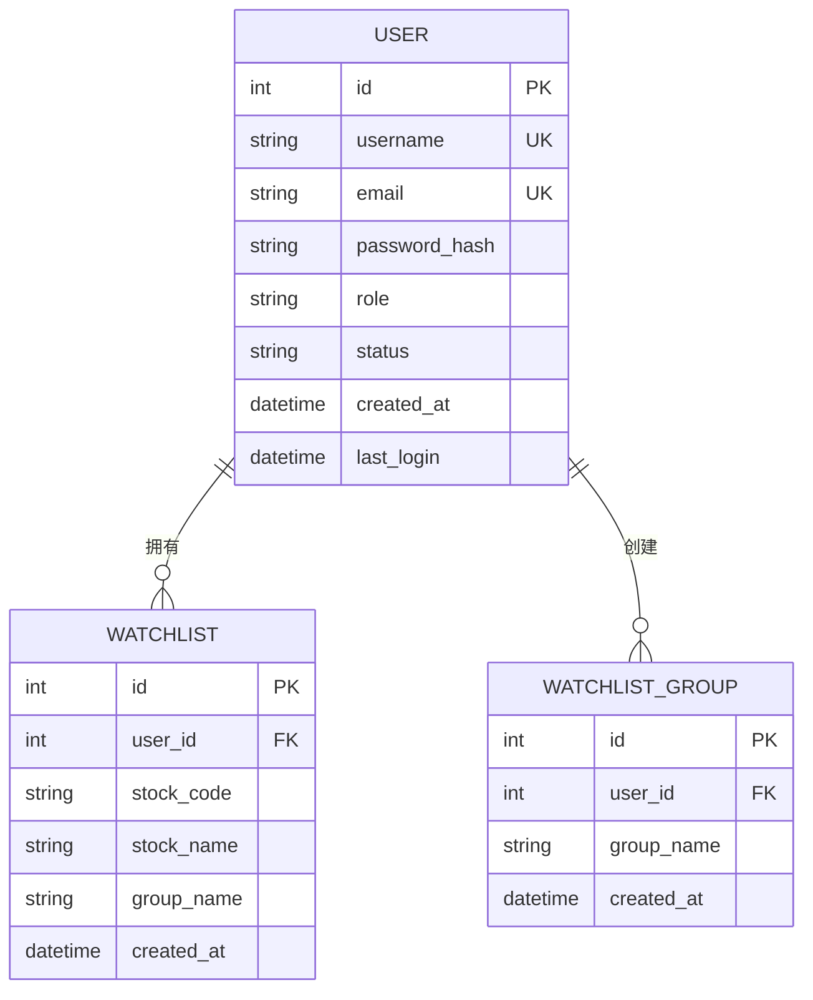
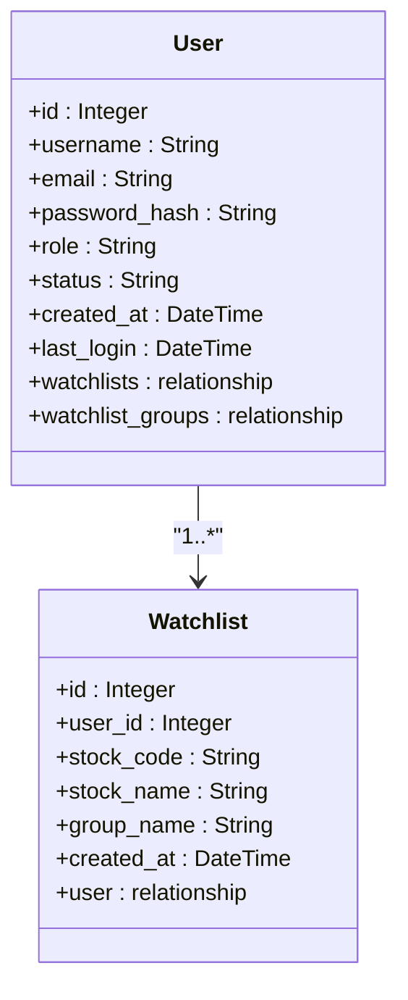
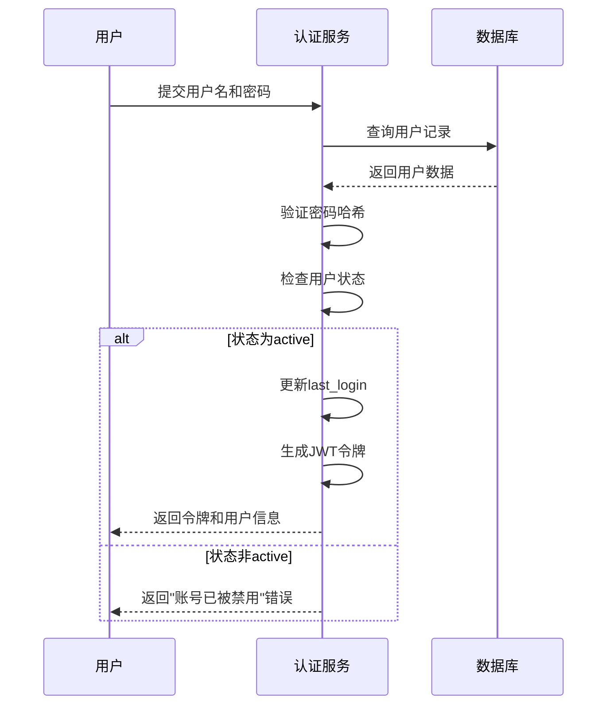

# 用户模型

<cite>
**本文档引用的文件**
- [models.py](file://backend_api/models.py)
- [user_manage.py](file://backend_api/user_manage.py)
- [watchlist_manage.py](file://backend_api/watchlist_manage.py)
- [auth.py](file://backend_api/auth.py)
</cite>

## 目录
1. [简介](#简介)
2. [用户表结构](#用户表结构)
3. [管理员模型](#管理员模型)
4. [自选股模型](#自选股模型)
5. [实体关系](#实体关系)
6. [ORM映射与数据库约束](#orm映射与数据库约束)
7. [用户状态与安全机制](#用户状态与安全机制)
8. [API模型定义](#api模型定义)

## 简介
本文档详细描述了股票分析软件后端系统中的用户相关数据模型，涵盖用户（User）、管理员（Admin）和自选股（Watchlist）三个核心实体。文档重点说明了各实体的字段定义、数据类型、约束条件以及实体间的关联关系。通过SQLAlchemy ORM实现数据库表与Python类的映射，确保数据持久化的一致性和完整性。系统采用分层权限控制机制，区分普通用户和管理员角色，并通过密码哈希存储保障用户账户安全。

## 用户表结构

用户表（users）是系统的核心实体之一，存储所有注册用户的基本信息和账户状态。该表通过SQLAlchemy ORM模型`User`进行定义，包含以下字段：

- **id**: 主键，整数类型，自动递增，建立索引以提高查询性能
- **username**: 用户名，字符串类型，唯一约束且不可为空，作为用户的主要标识
- **email**: 邮箱地址，字符串类型，唯一约束且不可为空，用于账户验证和通信
- **password_hash**: 密码哈希值，字符串类型，不可为空，存储经过加密处理的密码
- **role**: 角色，字符串类型，默认值为"user"，标识用户权限级别
- **status**: 状态，字符串类型，默认值为"active"，表示账户是否可用
- **created_at**: 创建时间，日期时间类型，默认值为当前时间，记录账户创建时间戳
- **last_login**: 最后登录时间，日期时间类型，可为空，记录用户最近一次登录时间

用户表在用户名和邮箱字段上建立了唯一性约束，防止重复注册。同时，这些字段也建立了索引以优化查询性能。

**Section sources**
- [models.py](file://backend_api/models.py#L14-L27)

## 管理员模型

管理员表（admins）专门用于存储系统管理员账户信息，与普通用户表分离以增强安全性。管理员模型`Admin`定义了以下字段：

- **id**: 主键，整数类型，自动递增，建立索引
- **username**: 用户名，字符串类型，唯一约束且不可为空
- **password_hash**: 密码哈希值，字符串类型，不可为空
- **role**: 角色，字符串类型，默认值为"admin"，明确标识管理员身份
- **created_at**: 创建时间，日期时间类型，默认值为当前时间
- **last_login**: 最后登录时间，日期时间类型，可为空

管理员模型与用户模型的关键区别在于：
1. 管理员表不包含邮箱字段，简化了管理员账户的管理
2. 角色字段默认值为"admin"，无需额外设置
3. 两个表物理分离，即使用户名相同也不会冲突
4. 权限验证机制不同，管理员通过独立的认证流程进行验证

系统通过`authenticate_admin`函数验证管理员身份，确保只有授权人员才能访问管理功能。

**Section sources**
- [models.py](file://backend_api/models.py#L29-L37)
- [auth.py](file://backend_api/auth.py#L148-L158)

## 自选股模型

自选股模型包含`Watchlist`和`WatchlistGroup`两个相关实体，用于管理用户的股票关注列表。

### 自选股实体（Watchlist）
- **id**: 主键，整数类型，自动递增，建立索引
- **user_id**: 外键，整数类型，不可为空，关联到用户表的id字段
- **stock_code**: 股票代码，字符串类型，不可为空
- **stock_name**: 股票名称，字符串类型，不可为空
- **group_name**: 分组名称，字符串类型，默认值为"default"
- **created_at**: 创建时间，日期时间类型，默认值为当前时间

### 自选股分组实体（WatchlistGroup）
- **id**: 主键，整数类型，自动递增，建立索引
- **user_id**: 外键，整数类型，不可为空，关联到用户表的id字段
- **group_name**: 分组名称，字符串类型，不可为空
- **created_at**: 创建时间，日期时间类型，默认值为当前时间

每个用户可以创建多个自选股分组，并将股票分配到不同的分组中进行分类管理。

**Section sources**
- [models.py](file://backend_api/models.py#L39-L58)
- [watchlist_manage.py](file://backend_api/watchlist_manage.py#L100-L125)

## 实体关系

系统中的用户相关实体通过明确的关系进行关联，形成完整的数据模型。

### 用户与自选股的一对多关系
用户实体与自选股实体之间存在一对多关系。一个用户可以拥有多个自选股记录，而每个自选股记录只属于一个用户。这种关系通过外键约束实现：

**Diagram sources**
- [models.py](file://backend_api/models.py#L14-L27)
- [models.py](file://backend_api/models.py#L39-L58)

在`User`模型中，通过`watchlists = relationship("Watchlist", back_populates="user")`定义了与自选股的关系。相应地，在`Watchlist`模型中，通过`user = relationship("User", back_populates="watchlists")`建立了反向关系。外键约束`user_id = Column(Integer, ForeignKey("users.id"), nullable=False)`确保了数据引用的完整性，防止出现孤立的自选股记录。

### 用户与自选股分组的关系
类似地，用户与自选股分组之间也是一对多关系。用户可以通过`watchlist_groups`关系访问其创建的所有分组，而每个分组通过`user`关系回溯到创建它的用户。

**Section sources**
- [models.py](file://backend_api/models.py#L14-L27)
- [models.py](file://backend_api/models.py#L39-L58)

## ORM映射与数据库约束

SQLAlchemy ORM模型精确地映射到数据库表结构，确保了对象-关系的透明转换。

### 表名映射
每个ORM模型通过`__tablename__`属性明确指定对应的数据库表名：
- `User`模型映射到"users"表
- `Admin`模型映射到"admins"表  
- `Watchlist`模型映射到"watchlist"表
- `WatchlistGroup`模型映射到"watchlist_groups"表

### 索引与唯一性约束
系统在关键字段上创建了适当的索引和唯一性约束以优化查询性能和数据完整性：

**Diagram sources**
- [models.py](file://backend_api/models.py#L14-L27)
- [models.py](file://backend_api/models.py#L39-L49)

- 用户名和邮箱字段上的唯一索引防止重复注册
- 主键字段自动创建聚簇索引
- 外键字段创建非聚簇索引以优化连接查询性能
- `created_at`字段的默认值由数据库自动填充，确保时间戳的一致性

**Section sources**
- [models.py](file://backend_api/models.py#L14-L58)

## 用户状态与安全机制

系统实现了完善的用户状态管理和安全机制，保障账户的安全性和可用性。

### 用户状态管理
用户状态字段（status）支持以下值：
- **active**: 活跃状态，用户可以正常登录和使用系统
- **inactive**: 非活跃状态，账户被暂时禁用
- **suspended**: 暂停状态，通常因违规行为被管理员锁定

状态管理在登录流程中得到严格执行。`login`函数在验证用户名和密码后，会检查用户状态，只有状态为"active"的用户才能成功登录。

### 安全相关字段设计
系统在安全方面采取了多项措施：

- **密码哈希存储**: 密码从不以明文存储，而是使用`get_password_hash`函数生成哈希值。系统支持bcrypt和SHA-256_crypt两种哈希算法，并优先使用更安全的bcrypt。
- **最后登录时间跟踪**: `last_login`字段记录用户最近一次成功登录的时间，可用于安全审计和异常登录检测。
- **密码迁移机制**: 系统包含密码哈希迁移功能，当检测到旧的SHA-256哈希时，会自动将其升级到更安全的bcrypt算法。

**Diagram sources**
- [models.py](file://backend_api/models.py#L20-L22)
- [user_manage.py](file://backend_api/user_manage.py#L70-L95)
- [auth.py](file://backend_api/auth.py#L100-L120)

**Section sources**
- [models.py](file://backend_api/models.py#L20-L22)
- [user_manage.py](file://backend_api/user_manage.py#L70-L95)

## API模型定义

除了数据库模型外，系统还定义了Pydantic模型用于API请求和响应的数据验证。

### 用户相关API模型
- **UserCreate**: 用于用户注册，包含用户名、邮箱、密码和可选角色
- **UserUpdate**: 用于用户信息更新，所有字段均为可选
- **UserInDB**: 用于数据库查询结果的序列化，包含完整用户信息
- **Token**: 认证令牌模型，包含访问令牌、令牌类型和用户信息

这些Pydantic模型确保了API接口的数据格式一致性，并提供了自动的数据验证功能。

**Section sources**
- [models.py](file://backend_api/models.py#L60-L115)