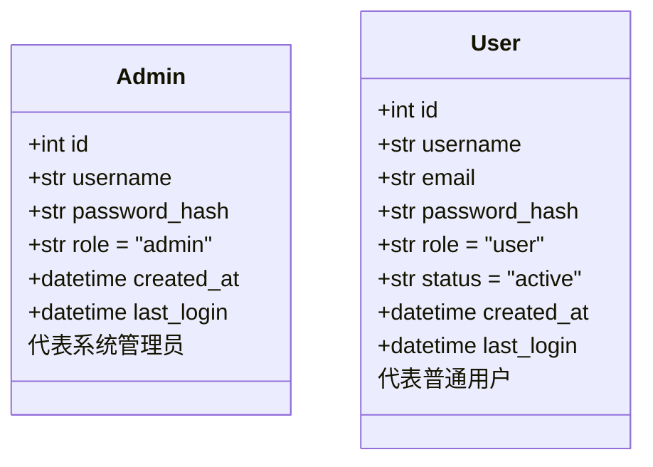
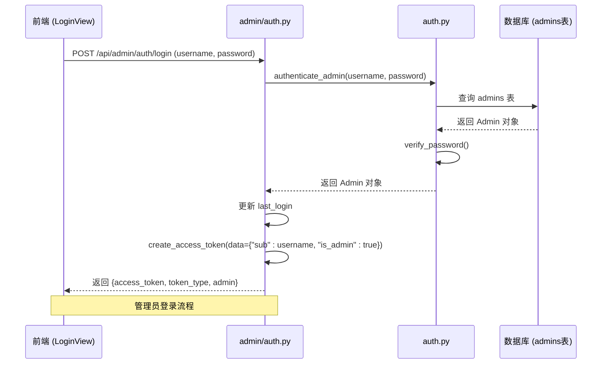
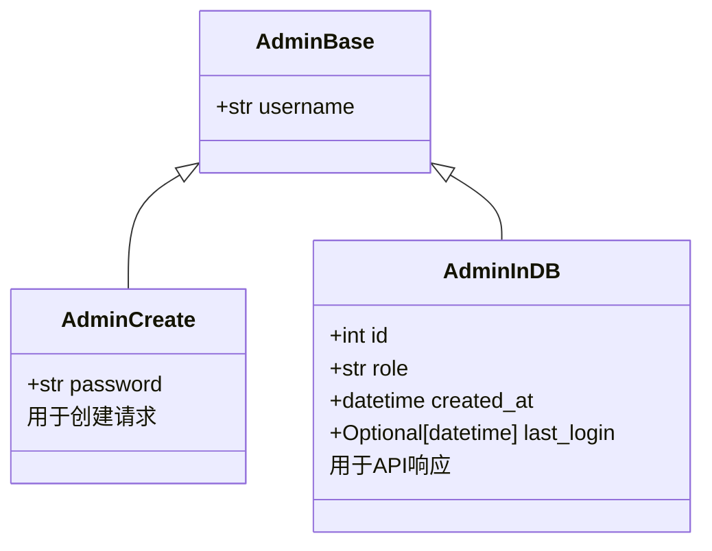

# 管理员实体

<cite>
**本文档中引用的文件**  
- [models.py](file://backend_api/models.py)
- [auth.py](file://backend_api/auth.py)
- [admin/auth.py](file://backend_api/admin/auth.py)
</cite>

## 目录
1. [简介](#简介)
2. [管理员表结构](#管理员表结构)
3. [Admin与User实体对比](#admin与user实体对比)
4. [管理员身份认证流程](#管理员身份认证流程)
5. [登录状态与安全审计](#登录状态与安全审计)
6. [实际使用示例](#实际使用示例)
7. [Pydantic模型与API安全传输](#pydantic模型与api安全传输)
8. [结论](#结论)

## 简介
本文档详细描述了股票分析软件系统中管理员实体的设计与实现，基于 `backend_api/models.py` 中的 `Admin` 类。重点阐述管理员数据模型的字段构成、认证机制、权限控制以及在系统中的实际应用。通过对比普通用户实体，突出管理员角色的特殊性，并说明其在JWT令牌、会话管理和安全审计中的关键作用。

## 管理员表结构

管理员实体在数据库中对应 `admins` 表，其核心字段构成如下：

- **id**: 整数类型，主键，用于唯一标识每个管理员账户。
- **username**: 字符串类型，唯一且非空，作为管理员的登录名。
- **password_hash**: 字符串类型，非空，存储经过哈希加密的密码。
- **role**: 字符串类型，默认值为 `"admin"`，明确标识该账户的管理角色。
- **created_at**: 日期时间类型，默认值为记录创建时的时间，用于追踪账户创建时间。
- **last_login**: 日期时间类型，可为空，记录管理员最后一次成功登录的时间。

该模型设计简洁，专注于管理功能，省略了普通用户所需的 `email` 字段，体现了权限分离的设计原则。

**Section sources**
- [models.py](file://backend_api/models.py#L29-L37)

## Admin与User实体对比

`Admin` 与 `User` 实体在设计上存在显著差异，反映了系统中权限分层的架构思想。

| 特性 | Admin 实体 | User 实体 |
|------|-----------|----------|
| 数据库表名 | `admins` | `users` |
| 角色默认值 | `admin` | `user` |
| 是否包含 email 字段 | 否 | 是 |
| 是否包含 status 字段 | 否 | 是 |
| 主要用途 | 系统管理与配置 | 普通用户行情查看与自选股管理 |

**设计决策说明**：  
`Admin` 实体不包含 `email` 字段，是因为管理员通常通过内部系统进行管理，无需邮件验证或找回密码等流程。其默认角色为 `admin` 的设计，确保了任何通过此表认证的账户都具备最高权限，简化了权限判断逻辑。这种设计增强了系统的安全性与管理效率。

**Diagram sources**
- [models.py](file://backend_api/models.py#L29-L37)
- [models.py](file://backend_api/models.py#L10-L20)

## 管理员身份认证流程

管理员的身份认证流程依赖于 `Admin` 模型和 JWT 令牌机制，具体步骤如下：

1. 管理员通过前端提交用户名和密码。
2. 后端调用 `authenticate_admin` 函数，查询 `admins` 表并验证凭据。
3. 认证成功后，系统更新 `last_login` 时间戳，并生成包含 `is_admin: True` 声明的 JWT 令牌。
4. 该令牌返回给客户端，用于后续所有需要管理员权限的 API 请求。

`is_admin` 声明是权限校验的核心。在 `get_current_admin` 函数中，系统不仅验证 JWT 的有效性，还检查 `is_admin` 是否为 `True`，从而确保只有真正的管理员才能访问受保护的资源。

**Diagram sources**
- [admin/auth.py](file://backend_api/admin/auth.py#L25-L50)
- [auth.py](file://backend_api/auth.py#L151-L158)

**Section sources**
- [auth.py](file://backend_api/auth.py#L151-L158)
- [auth.py](file://backend_api/auth.py#L106-L126)

## 登录状态与安全审计

管理员的登录状态跟踪和安全审计主要依赖于两个时间戳字段：

- **created_at**: 记录管理员账户的创建时间，用于审计账户的生命周期。
- **last_login**: 在每次成功登录时由 `admin/auth.py` 中的登录路由更新为当前时间。

这两个字段为系统提供了关键的审计信息。例如，管理员可以查看所有管理员的 `last_login` 时间，以识别长期未使用的账户，从而进行安全清理。`created_at` 则有助于追踪系统配置的历史变更。

**Section sources**
- [models.py](file://backend_api/models.py#L35-L37)
- [admin/auth.py](file://backend_api/admin/auth.py#L45-L48)

## 实际使用示例

`Admin` 实体在 `backend_api/admin/` 模块中有明确的实际应用。

在 `admin/auth.py` 中，`login_for_access_token` 路由处理管理员登录请求。它调用 `authenticate_admin` 函数验证凭据，成功后更新 `last_login` 并生成 JWT 令牌。`verify_token` 和 `read_admin_me` 路由则用于验证令牌和获取当前管理员信息，这些功能都直接依赖于 `Admin` 模型实例。

权限校验通过 `get_current_admin` 依赖项实现，该函数确保了只有携带有效且 `is_admin` 为 `True` 的 JWT 令牌的请求才能访问受保护的管理员 API。

**Section sources**
- [admin/auth.py](file://backend_api/admin/auth.py#L25-L80)
- [auth.py](file://backend_api/auth.py#L106-L126)

## Pydantic模型与API安全传输

为了确保API层的数据安全传输，系统定义了 `AdminInDB` Pydantic 模型。该模型继承自 `AdminBase`，并包含了 `id`, `role`, `created_at`, 和 `last_login` 字段。

`AdminInDB` 模型的作用是：
1. **数据序列化**：将数据库中的 `Admin` 实体安全地转换为JSON响应，避免暴露内部实现细节。
2. **输入验证**：在接收数据时，确保数据符合预期的结构和类型。
3. **接口契约**：为API定义了清晰的输入输出格式，提高了系统的可维护性。

当管理员登录成功时，系统会返回一个包含 `AdminInDB` 实例的响应，确保前端接收到的管理员信息是经过验证和格式化的。

**Diagram sources**
- [models.py](file://backend_api/models.py#L104-L111)

**Section sources**
- [models.py](file://backend_api/models.py#L104-L111)

## 结论
`Admin` 实体是系统权限管理的核心。其精简的字段设计、与 `User` 实体的明确区分、以及与JWT `is_admin` 声明的紧密结合，共同构建了一个安全、高效的管理员认证与授权体系。通过 `created_at` 和 `last_login` 字段，系统实现了基本的安全审计能力。`AdminInDB` 等Pydantic模型的使用，确保了API层的数据传输安全与一致性。整体设计体现了清晰的职责分离和安全优先的原则。