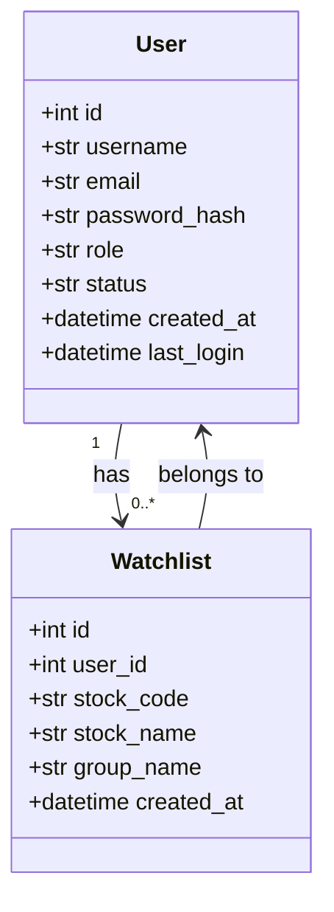
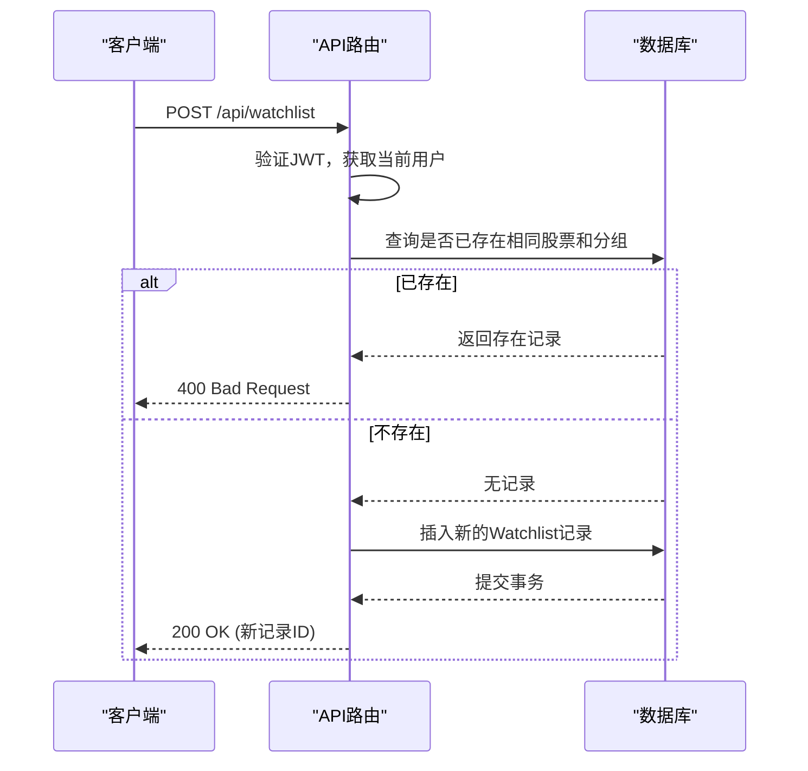
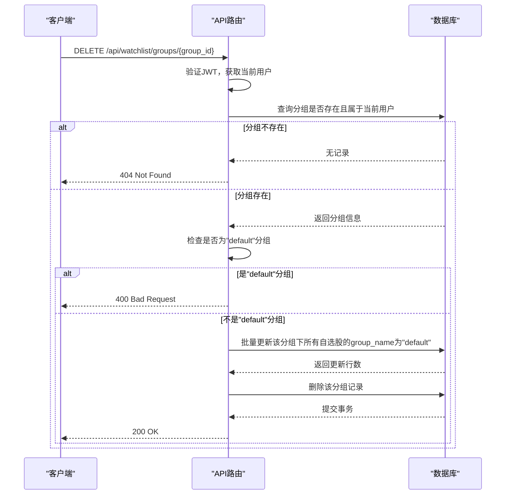
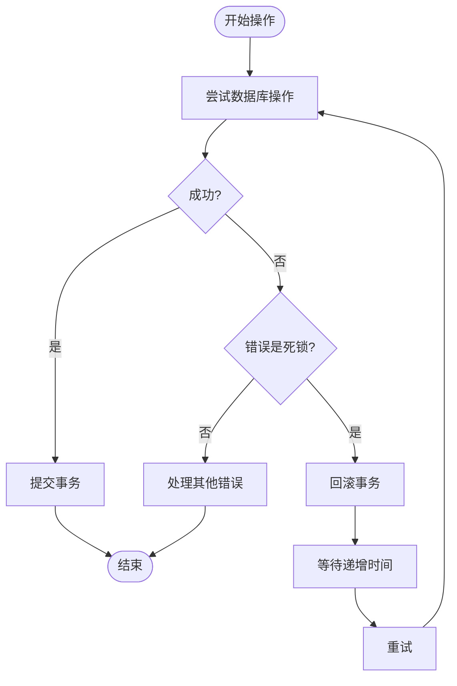

# 用户与自选股关联机制

<cite>
**本文档引用文件**  
- [models.py](file://backend_api/models.py)
- [user_manage.py](file://backend_api/user_manage.py)
- [watchlist_manage.py](file://backend_api/watchlist_manage.py)
- [auth.py](file://backend_api/auth.py)
- [admin/users.py](file://backend_api/admin/users.py)
</cite>

## 目录
1. [引言](#引言)
2. [用户与自选股的双向关联机制](#用户与自选股的双向关联机制)
3. [自选股管理接口分析](#自选股管理接口分析)
4. [用户状态变更时的自选股数据处理策略](#用户状态变更时的自选股数据处理策略)
5. [基于JWT的用户身份认证与数据隔离](#基于jwt的用户身份认证与数据隔离)
6. [典型业务场景实现示例](#典型业务场景实现示例)
7. [高并发下的锁机制与性能优化](#高并发下的锁机制与性能优化)
8. [结论](#结论)

## 引言
本系统为股票分析软件，核心功能之一是为用户提供自选股管理服务。用户可创建、分组、查询和删除自选股，系统需确保数据的完整性、安全性与高性能。本文档系统化地阐述用户与自选股之间的关联管理机制，涵盖模型设计、API实现、数据隔离、状态处理及并发控制等关键方面。

## 用户与自选股的双向关联机制

在 `models.py` 中，`User` 与 `Watchlist` 模型通过 SQLAlchemy 的 `relationship` 实现了双向导航。`back_populates` 参数是实现此功能的核心。



**图示来源**
- [models.py](file://backend_api/models.py#L10-L434)

**Section sources**
- [models.py](file://backend_api/models.py#L10-L434)

### 双向导航实现原理
- **正向导航**：在 `User` 模型中，`watchlists = relationship("Watchlist", back_populates="user")` 定义了用户拥有多个自选股。通过 `user.watchlists` 可直接访问其所有自选股对象。
- **反向导航**：在 `Watchlist` 模型中，`user = relationship("User", back_populates="watchlists")` 定义了自选股属于一个用户。通过 `watchlist.user` 可直接访问其所属用户对象。
- **数据一致性**：`back_populates` 确保了在内存中操作对象时，双方的引用始终保持同步。例如，当一个 `Watchlist` 实例被添加到 `user.watchlists` 列表时，该实例的 `user` 属性会自动被设置为 `user` 对象。

## 自选股管理接口分析

`watchlist_manage.py` 文件提供了完整的自选股管理API，实现了添加、删除、分组等核心功能。

**Section sources**
- [watchlist_manage.py](file://backend_api/watchlist_manage.py#L0-L317)

### 核心功能接口
以下表格总结了主要的自选股管理接口：

| 接口路径 | HTTP方法 | 功能描述 | 认证要求 |
| :--- | :--- | :--- | :--- |
| `/api/watchlist` | GET | 获取当前用户的自选股列表（含实时行情） | 必需 |
| `/api/watchlist` | POST | 添加股票到自选股 | 必需 |
| `/api/watchlist/{watchlist_id}` | DELETE | 从自选股中删除指定股票 | 必需 |
| `/api/watchlist/groups` | GET | 获取用户的自选股分组列表 | 必需 |
| `/api/watchlist/groups` | POST | 创建新的自选股分组 | 必需 |
| `/api/watchlist/{watchlist_id}/group` | PUT | 更新自选股的分组 | 必需 |
| `/api/watchlist/groups/{group_id}` | DELETE | 删除自选股分组（非默认分组） | 必需 |

### 添加自选股流程


**图示来源**
- [watchlist_manage.py](file://backend_api/watchlist_manage.py#L100-L130)

### 删除自选股分组流程
当删除一个分组时，系统会将该分组下的所有自选股移动到“default”分组，确保数据不丢失。



**图示来源**
- [watchlist_manage.py](file://backend_api/watchlist_manage.py#L280-L317)

## 用户状态变更时的自选股数据处理策略

系统对用户状态的变更（如禁用、删除）有明确的处理策略，以保障数据的完整性和业务逻辑的清晰。

**Section sources**
- [admin/users.py](file://backend_api/admin/users.py#L136-L180)
- [user_manager.py](file://user_manager.py#L130-L174)

### 用户禁用（Disable）
当管理员通过 `PUT /api/admin/users/{user_id}/status` 将用户状态更新为 `disabled` 时，用户的自选股数据**被保留**。
- **影响**：用户将无法登录系统，因此无法访问其自选股列表。
- **数据状态**：`Watchlist` 表中的相关记录保持不变，未被删除。
- **目的**：此策略允许管理员在用户违规或休眠时进行临时封禁，未来可随时恢复其账户和所有数据。

### 用户删除（Delete）
当管理员通过 `DELETE /api/admin/users/{user_id}` 删除用户时，用户的自选股数据**被级联删除**。
- **实现方式**：虽然在 `models.py` 中未显式定义 `ondelete="CASCADE"`，但删除用户时，系统会先删除其所有关联的 `Watchlist` 和 `WatchlistGroup` 记录，然后再删除 `User` 记录。这通常在业务逻辑层（如 `admin/users.py`）或数据库外键约束中实现。
- **目的**：彻底清理用户数据，释放存储空间，符合数据最小化原则。

## 基于JWT的用户身份认证与数据隔离

系统采用JWT（JSON Web Token）进行用户身份认证，确保每个用户只能访问和操作自己的数据。

**Section sources**
- [auth.py](file://backend_api/auth.py#L0-L197)
- [user_manage.py](file://backend_api/user_manage.py#L90-L131)

### JWT认证流程
1.  **登录**：用户调用 `POST /api/users/login`，提供用户名和密码。
2.  **验证**：`auth.py` 中的 `authenticate_user` 函数验证凭据。
3.  **签发令牌**：验证成功后，`create_access_token` 函数生成一个JWT，其中包含 `sub` (用户名) 和 `user_id` 等声明。
4.  **返回令牌**：服务器将令牌返回给客户端，客户端在后续请求的 `Authorization` 头中携带此令牌。

### 数据隔离实现
数据隔离是通过 `get_current_user` 依赖注入函数实现的。
- **获取用户**：`auth.py` 中的 `get_current_user` 函数解析JWT，从 `sub` 字段获取用户名，然后查询数据库得到 `User` 对象。
- **绑定上下文**：在 `watchlist_manage.py` 的API函数中，通过 `current_user: User = Depends(get_current_user)` 参数，将当前登录的用户对象注入到函数中。
- **数据过滤**：所有操作都基于 `current_user.id` 进行过滤。例如，在 `get_watchlist` 函数中，查询条件为 `Watchlist.user_id == current_user.id`，这确保了用户A永远无法看到用户B的自选股。

## 典型业务场景实现示例

本节提供两个典型业务场景的实现方式。

**Section sources**
- [watchlist_manage.py](file://backend_api/watchlist_manage.py#L0-L317)
- [user_manage.py](file://backend_api/user_manage.py#L0-L194)

### 场景一：获取用户A的所有科技板块自选股

此场景需要结合自选股数据和股票基本信息。

1.  **API调用**：客户端调用 `GET /api/watchlist`。
2.  **后端逻辑**：
    - 通过JWT获取用户A的 `user_id`。
    - 查询 `Watchlist` 表，获取用户A的所有自选股。
    - 查询 `StockBasicInfo` 表，筛选出行业为“科技”的股票代码。
    - 将两个结果集在内存中进行交集操作，或使用SQL的 `JOIN` 语句。
3.  **SQLAlchemy查询示例**：
    ```python
    # [SPEC SYMBOL](file://backend_api/watchlist_manage.py#L40-L80)
    tech_watchlist = db.query(Watchlist).join(StockBasicInfo).filter(
        Watchlist.user_id == current_user.id,
        StockBasicInfo.industry == '科技'
    ).all()
    ```

### 场景二：将股票XYZ从默认分组移至关注分组

此场景直接由 `watchlist_manage.py` 中的接口支持。

1.  **API调用**：客户端调用 `PUT /api/watchlist/{watchlist_id}/group`，在请求体中指定 `group_name="关注"`。
2.  **后端逻辑**：
    - 通过JWT获取当前用户。
    - 根据 `watchlist_id` 和 `current_user.id` 查询自选股记录。
    - 验证目标分组 `关注` 是否存在且属于当前用户。
    - 更新该记录的 `group_name` 字段。
3.  **SQLAlchemy操作示例**：
    ```python
    # [SPEC SYMBOL](file://backend_api/watchlist_manage.py#L240-L280)
    watchlist = db.query(Watchlist).filter(
        Watchlist.id == watchlist_id,
        Watchlist.user_id == current_user.id
    ).first()
    watchlist.group_name = "关注"
    db.commit()
    ```

## 高并发下的锁机制与性能优化

在高并发环境下，对自选股数据的读写操作可能引发数据竞争和死锁。系统通过数据库连接池和重试机制来应对。

**Section sources**
- [backend_core/database/db.py](file://backend_core/database/db.py#L0-L32)
- [backend_core/data_collectors/akshare/realtime.py](file://backend_core/data_collectors/akshare/realtime.py#L200-L241)

### 数据库连接池配置
`backend_core/database/db.py` 中的 `engine` 配置了连接池，有效管理数据库连接。
- `pool_size=10`：保持10个空闲连接。
- `max_overflow=20`：允许最多20个额外的连接。
- `pool_pre_ping=True`：每次使用连接前都进行ping检查，避免使用已失效的连接。

### 死锁检测与重试
在数据采集模块中，采用了经典的“重试”模式来处理死锁。
- **检测**：捕获包含 `"DeadlockDetected"` 或 `"LockNotAvailable"` 的异常。
- **处理**：执行 `session.rollback()` 回滚当前事务，然后等待一个短暂且递增的时间（`time.sleep(0.2 * retry_count)`），再进行重试。
- **上限**：设置最大重试次数（`max_retries`），避免无限循环。



**图示来源**
- [backend_core/data_collectors/akshare/realtime.py](file://backend_core/data_collectors/akshare/realtime.py#L200-L241)

## 结论
本系统通过精心设计的ORM模型、清晰的API接口、严格的JWT认证和稳健的并发控制，实现了高效、安全的用户与自选股关联管理。`back_populates` 参数确保了对象间导航的便利性，而基于 `user_id` 的数据过滤则从根本上保证了数据隔离。对于用户状态变更，系统采取了“禁用保留、删除级联”的策略，平衡了数据安全与业务灵活性。在高并发场景下，通过连接池和重试机制，系统能够稳定运行。整体设计充分考虑了实际业务需求和潜在的技术挑战。