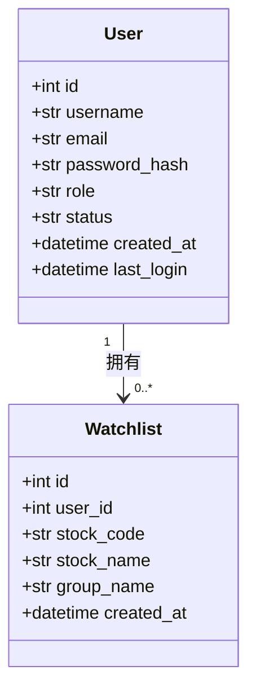
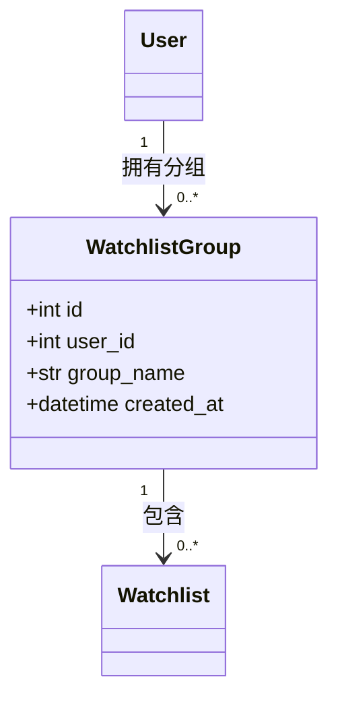

# 自选股关系模型

<cite>
**本文档引用的文件**  
- [backend_api/models.py](file://backend_api/models.py)
- [backend_core/models/watchlist.py](file://backend_core/models/watchlist.py)
- [backend_api/watchlist_manage.py](file://backend_api/watchlist_manage.py)
</cite>

## 目录
1. [引言](#引言)
2. [用户与自选股的一对多关系实现](#用户与自选股的一对多关系实现)
3. [Watchlist模型字段差异分析](#watchlist模型字段差异分析)
4. [自选股分组功能实现](#自选股分组功能实现)
5. [典型关系查询用例](#典型关系查询用例)
6. [结论](#结论)

## 引言
本文档深入分析股票分析软件系统中用户与自选股之间的关系模型，重点整合`backend_api/models.py`和`backend_core/models/watchlist.py`中的`Watchlist`实体。通过详细解析数据库模型定义、外键约束、ORM关系映射及业务逻辑实现，全面阐述自选股功能的数据结构设计与跨层协作机制。

**Section sources**
- [backend_api/models.py](file://backend_api/models.py#L14-L49)
- [backend_core/models/watchlist.py](file://backend_core/models/watchlist.py#L4-L11)

## 用户与自选股的一对多关系实现

### 外键与关系映射机制
在`backend_api/models.py`中，`Watchlist`模型通过`user_id`字段建立与`User`模型的外键关联，具体定义为`Column(Integer, ForeignKey("users.id"), nullable=False)`，确保每条自选股记录必须归属于一个有效用户。同时，在`User`模型中通过`relationship("Watchlist", back_populates="user")`声明反向引用，形成双向导航能力。

该设计实现了用户与其自选股列表之间的一对多关系，支持通过`user.watchlists`直接访问其所有自选股，或通过`watchlist.user`获取所属用户信息。这种双向关系不仅提升了代码可读性，也优化了复杂查询的构建效率。



**Diagram sources**
- [backend_api/models.py](file://backend_api/models.py#L14-L27)
- [backend_api/models.py](file://backend_api/models.py#L39-L49)

**Section sources**
- [backend_api/models.py](file://backend_api/models.py#L14-L49)

## Watchlist模型字段差异分析

### API层与核心引擎层的字段配置差异
对比两个仓库中的`Watchlist`模型，发现其在主键配置上存在显著差异：

- **backend_api/models.py**：`id = Column(Integer, primary_key=True, index=True)`，未显式启用`autoincrement`，依赖数据库默认行为。
- **backend_core/models/watchlist.py**：`id = Column(Integer, primary_key=True, autoincrement=True)`，明确启用自增特性。

此差异反映了不同层级的设计考量：
- **API层**更关注数据完整性与外键约束（`nullable=False`），强调与用户实体的强关联，适用于处理用户请求和事务管理。
- **核心引擎层**则侧重数据采集与批量处理性能，`autoincrement=True`确保在高并发写入场景下主键生成的可靠性，适用于后台任务与数据同步。

尽管配置不同，但两模型共享相同的业务字段（`user_id`, `stock_code`, `stock_name`, `group_name`），保证了数据语义的一致性。

**Section sources**
- [backend_api/models.py](file://backend_api/models.py#L39-L49)
- [backend_core/models/watchlist.py](file://backend_core/models/watchlist.py#L4-L11)

## 自选股分组功能实现

### WatchlistGroup实体设计
自选股分组功能由`WatchlistGroup`实体实现，定义于`backend_api/models.py`中。该模型包含`user_id`（外键）、`group_name`（分组名称）和`created_at`三个核心字段，并通过`relationship("User", back_populates="watchlist_groups")`与用户建立反向引用。

分组管理接口（如`create_watchlist_group`、`delete_watchlist_group`）在`watchlist_manage.py`中实现，支持创建、删除和更新分组。删除分组时会自动将其下的自选股移至“default”分组，防止数据丢失，体现了良好的数据一致性保障策略。



**Diagram sources**
- [backend_api/models.py](file://backend_api/models.py#L51-L59)
- [backend_api/models.py](file://backend_api/models.py#L39-L49)

**Section sources**
- [backend_api/models.py](file://backend_api/models.py#L51-L59)
- [backend_api/watchlist_manage.py](file://backend_api/watchlist_manage.py#L167-L180)

## 典型关系查询用例

### 获取用户所有自选股
通过`db.query(Watchlist).filter(Watchlist.user_id == current_user.id)`可高效获取指定用户的所有自选股记录。结合实时行情表`StockRealtimeQuote`进行联查，可返回包含最新价格、涨跌幅等信息的完整列表。

### 按分组筛选股票
使用`db.query(Watchlist).filter(Watchlist.user_id == user_id, Watchlist.group_name == group_name)`实现按分组查询。前端可通过分组下拉菜单动态加载对应股票，提升用户体验。

### 批量操作与数据一致性
在删除分组时，系统采用先更新后删除的策略：
```python
db.query(Watchlist).filter(
    Watchlist.user_id == current_user.id,
    Watchlist.group_name == group.group_name
).update({"group_name": "default"})
```
此操作确保所有相关自选股被安全迁移，避免因外键约束导致的删除失败，体现了严谨的数据一致性设计。

**Section sources**
- [backend_api/watchlist_manage.py](file://backend_api/watchlist_manage.py#L34-L45)
- [backend_api/watchlist_manage.py](file://backend_api/watchlist_manage.py#L295-L308)

## 结论
本系统通过精心设计的`Watchlist`与`WatchlistGroup`模型，实现了灵活且可靠的自选股管理功能。API层与核心引擎层的模型差异体现了分层架构的设计智慧：API层注重数据完整性与用户交互，核心层关注性能与可靠性。双向关系映射、外键约束及事务性操作共同保障了数据一致性，为用户提供稳定高效的自选股服务。