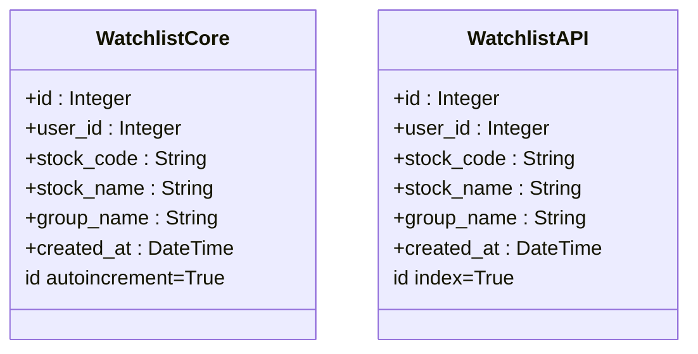
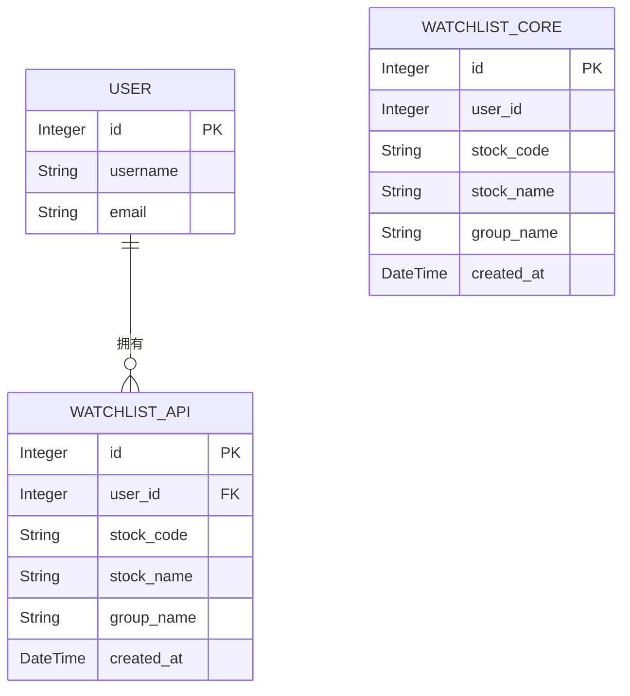

# 自选股数据模型

<cite>
**本文档引用的文件**
- [backend_core/models/watchlist.py](file://backend_core/models/watchlist.py)
- [backend_api/models.py](file://backend_api/models.py)
- [backend_core/database/db.py](file://backend_core/database/db.py)
- [backend_api/database.py](file://backend_api/database.py)
- [backend_api/watchlist_manage.py](file://backend_api/watchlist_manage.py)
</cite>

## 目录
1. [引言](#引言)
2. [核心模型字段对比](#核心模型字段对比)
3. [主键与索引设计差异](#主键与索引设计差异)
4. [共享字段定义一致性分析](#共享字段定义一致性分析)
5. [用户关联字段设计差异](#用户关联字段设计差异)
6. [创建时间字段实现与时区策略](#创建时间字段实现与时区策略)
7. [ORM关系映射与双向关联](#orm关系映射与双向关联)
8. [数据库DDL生成与约束分析](#数据库ddl生成与约束分析)
9. [总结](#总结)

## 引言
本文档深入分析`backend_core/models/watchlist.py`与`backend_api/models.py`中`Watchlist`模型的实现差异。两个模型分别服务于数据采集核心层与API服务层，其设计体现了不同层级对数据完整性、性能和关系管理的不同考量。通过对比字段定义、主键策略、外键关联及时间处理机制，揭示系统在分层架构下的数据模型设计哲学。

## 核心模型字段对比
两个模型均定义了自选股的核心属性，包括股票代码、名称、分组及创建时间，确保业务语义的一致性。

**Section sources**
- [backend_core/models/watchlist.py](file://backend_core/models/watchlist.py#L4-L11)
- [backend_api/models.py](file://backend_api/models.py#L39-L49)

## 主键与索引设计差异
在主键生成策略上，两层模型存在显著差异：

- **数据采集核心层** (`backend_core`)：`id`字段使用`autoincrement=True`，明确依赖数据库的自增机制生成主键。这在批量数据插入时效率更高，且能保证主键的连续性和唯一性，适合后台批处理场景。
- **API服务层** (`backend_api`)：`id`字段使用`index=True`，虽然`primary_key=True`已隐含了唯一索引，但显式声明`index=True`强调了对主键查询性能的优化。这表明API层更关注基于ID的快速检索，符合高并发、低延迟的接口需求。



**Diagram sources**
- [backend_core/models/watchlist.py](file://backend_core/models/watchlist.py#L6)
- [backend_api/models.py](file://backend_api/models.py#L40)

**Section sources**
- [backend_core/models/watchlist.py](file://backend_core/models/watchlist.py#L6)
- [backend_api/models.py](file://backend_api/models.py#L40)

## 共享字段定义一致性分析
`stock_code`、`stock_name`和`group_name`三个字段在两个模型中的定义高度一致，体现了核心业务数据的统一性：

- 三者均定义为`String`类型，且`stock_code`和`stock_name`为`nullable=False`，确保了数据的完整性。
- `group_name`均设置了默认值`"default"`，为用户提供默认分组，简化了初始使用体验。

这种一致性保证了数据在核心层采集和API层服务之间的无缝流转。

**Section sources**
- [backend_core/models/watchlist.py](file://backend_core/models/watchlist.py#L8-L10)
- [backend_api/models.py](file://backend_api/models.py#L42-L44)

## 用户关联字段设计差异
在用户关联的设计上，两层模型体现了抽象层级的差异：

- **数据采集核心层**：`user_id`直接定义为`Integer`类型，不包含外键约束。这表明核心层更关注数据的原始存储，将用户关联视为一个简单的ID引用，降低了与用户管理模块的耦合度，适合独立运行的数据采集任务。
- **API服务层**：`user_id`明确使用`ForeignKey("users.id")`，建立了与`User`表的外键关系。这强制了数据的引用完整性，防止出现孤立的自选股记录，并为ORM提供了关系导航的基础。



**Diagram sources**
- [backend_api/models.py](file://backend_api/models.py#L41)
- [backend_core/models/watchlist.py](file://backend_core/models/watchlist.py#L7)

**Section sources**
- [backend_api/models.py](file://backend_api/models.py#L41)
- [backend_core/models/watchlist.py](file://backend_core/models/watchlist.py#L7)

## 创建时间字段实现与时区策略
两个模型的`created_at`字段均使用`default=datetime.now`作为默认值。

- **实现方式**：`datetime.now`是一个可调用对象（callable），在每次创建新记录时由SQLAlchemy调用，生成记录插入时的服务器本地时间。这确保了时间戳的准确性。
- **时区策略**：`datetime.now`生成的是**无时区（naive）的本地时间**。系统未使用`datetime.utcnow`或`timezone-aware`对象，表明当前设计依赖于数据库服务器或应用服务器的本地时区设置。这种策略简单直接，但在分布式或跨时区部署时可能引发歧义，建议未来考虑统一使用UTC时间。

**Section sources**
- [backend_core/models/watchlist.py](file://backend_core/models/watchlist.py#L11)
- [backend_api/models.py](file://backend_api/models.py#L45)

## ORM关系映射与双向关联
在`backend_api/models.py`中，通过`relationship()`在`User`和`Watchlist`之间建立了双向关联：

- `User`模型中的`watchlists = relationship("Watchlist", back_populates="user")`定义了用户到自选股列表的一对多关系。
- `Watchlist`模型中的`user = relationship("User", back_populates="watchlists")`定义了自选股到用户的多对一关系。

**性能影响分析**：
- **优点**：双向关联极大简化了数据查询。例如，获取用户信息时可直接通过`user.watchlists`访问其所有自选股，反之亦然，代码可读性和开发效率高。
- **缺点**：默认的`relationship`是惰性加载（lazy loading），在访问关联属性时会触发额外的数据库查询，可能导致N+1查询问题。可通过`joinedload`等预加载技术优化，但会增加单次查询的复杂度和数据量。因此，这种设计在便利性和性能之间做了权衡，适用于关联数据量不大的场景。

**Section sources**
- [backend_api/models.py](file://backend_api/models.py#L22-L23)
- [backend_api/models.py](file://backend_api/models.py#L47-L48)

## 数据库DDL生成与约束分析
根据SQLAlchemy模型，生成的数据库表结构如下：

### backend_core.watchlist (核心层)
```sql
CREATE TABLE watchlist (
    id INTEGER NOT NULL PRIMARY KEY AUTOINCREMENT,
    user_id INTEGER NOT NULL,
    stock_code VARCHAR NOT NULL,
    stock_name VARCHAR NOT NULL,
    group_name VARCHAR DEFAULT 'default',
    created_at DATETIME DEFAULT (datetime('now'))
);
```
- **主键**：`id`为自增主键。
- **索引**：无显式索引，仅主键索引。
- **约束**：`NOT NULL`约束确保关键字段非空。

### backend_api.watchlist (API层)
```sql
CREATE TABLE watchlist (
    id INTEGER NOT NULL PRIMARY KEY,
    user_id INTEGER NOT NULL,
    stock_code VARCHAR NOT NULL,
    stock_name VARCHAR NOT NULL,
    group_name VARCHAR DEFAULT 'default',
    created_at DATETIME DEFAULT (datetime('now')),
    FOREIGN KEY(user_id) REFERENCES users (id)
);
-- 通常会为 primary_key 自动创建索引
```
- **主键**：`id`为主键。
- **索引**：主键`id`有索引，`index=True`确保了这一点。
- **约束**：除`NOT NULL`外，还有`FOREIGN KEY`约束，保证`user_id`必须存在于`users`表中。

**Section sources**
- [backend_core/models/watchlist.py](file://backend_core/models/watchlist.py)
- [backend_api/models.py](file://backend_api/models.py)

## 总结
`backend_core`和`backend_api`中的`Watchlist`模型设计差异反映了系统分层架构的精髓：核心层追求数据采集的高效与独立，采用轻量级的自增主键和直接ID引用；API层则注重数据服务的完整性与性能，通过外键约束和显式索引构建健壮的关系模型。两者在共享字段上保持一致，确保了数据语义的统一。`created_at`字段的实现简单直接，但时区处理上存在潜在风险。API层的双向`relationship`极大提升了开发体验，但需注意其对查询性能的影响。整体设计合理，兼顾了不同层级的业务需求。