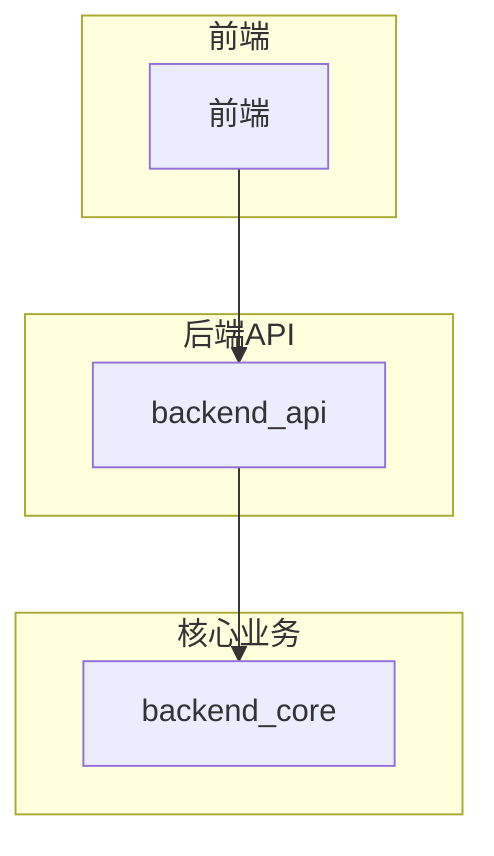
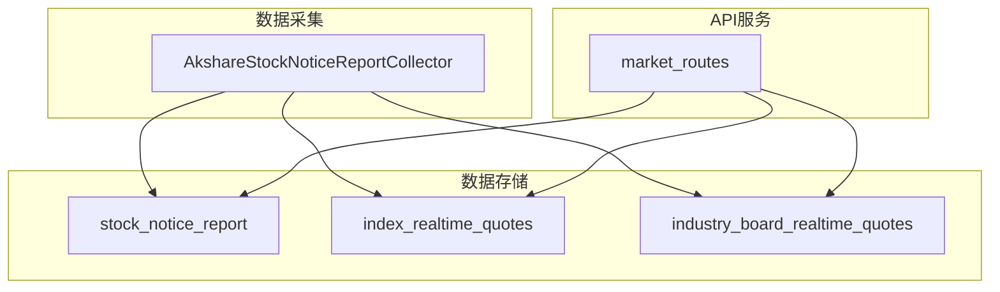
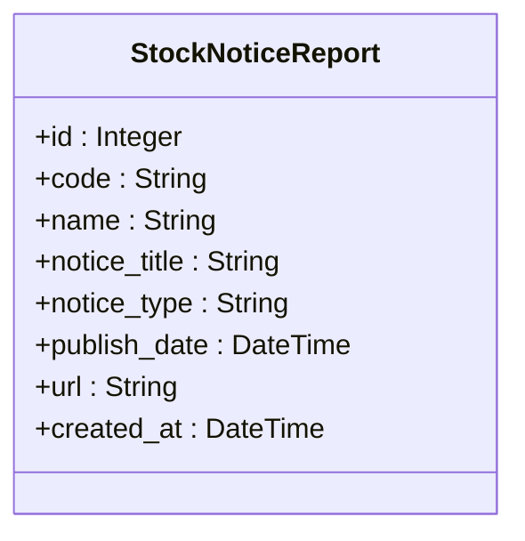
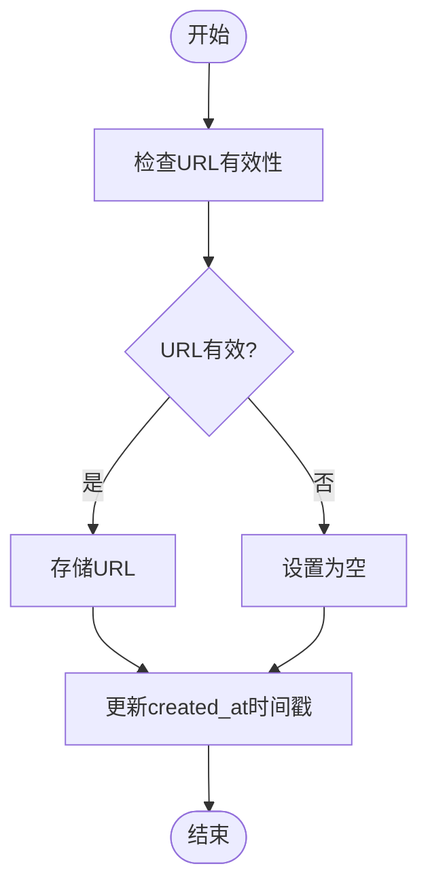
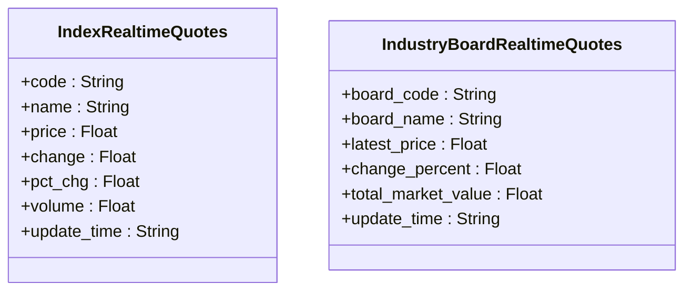
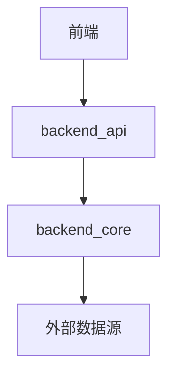

# 市场指数与公告模型

<cite>
**本文档引用的文件**  
- [models.py](file://backend_api/models.py#L300-L320)
- [realtime_stock_notice_report_ak.py](file://backend_core/data_collectors/akshare/realtime_stock_notice_report_ak.py#L50-L150)
- [market_routes.py](file://backend_api/market_routes.py#L20-L50)
- [historical_quotes.py](file://backend_core/models/historical_quotes.py#L10-L25)
</cite>

## 目录
1. [引言](#引言)
2. [项目结构](#项目结构)
3. [核心组件](#核心组件)
4. [架构概述](#架构概述)
5. [详细组件分析](#详细组件分析)
6. [依赖分析](#依赖分析)
7. [性能考虑](#性能考虑)
8. [故障排除指南](#故障排除指南)
9. [结论](#结论)

## 引言
本文档旨在全面阐述股票分析系统中的市场指数与公告模型，重点介绍`StockNoticeReport`实体及其对应的`stock_notice_report`数据表的设计与实现。文档将详细说明公告元数据管理机制、股票代码与名称映射关系、URL持久化策略以及时间戳标准，并结合监管披露场景，说明该模型在重大事件跟踪和合规性监控中的应用。同时，文档还将关联行业板块实时行情和指数行情的数据结构，阐述其更新频率与实时性保障机制。

## 项目结构
本项目采用分层架构设计，主要分为前端、后端API和核心业务逻辑三个部分。公告模型主要位于`backend_api`和`backend_core`模块中，其中`backend_api`负责提供RESTful API接口，`backend_core`负责数据采集和核心业务逻辑处理。

**图示来源**  
- [models.py](file://backend_api/models.py#L300-L320)
- [realtime_stock_notice_report_ak.py](file://backend_core/data_collectors/akshare/realtime_stock_notice_report_ak.py#L50-L150)

**本节来源**  
- [models.py](file://backend_api/models.py#L1-L50)
- [realtime_stock_notice_report_ak.py](file://backend_core/data_collectors/akshare/realtime_stock_notice_report_ak.py#L1-L50)

## 核心组件
核心组件包括`StockNoticeReport`实体、`IndexRealtimeQuotes`和`IndustryBoardRealtimeQuotes`实体，分别用于存储公告数据、市场指数数据和行业板块数据。这些组件通过API接口对外提供服务，并通过数据采集器定期更新数据。

**本节来源**  
- [models.py](file://backend_api/models.py#L300-L320)
- [market_routes.py](file://backend_api/market_routes.py#L20-L50)

## 架构概述
系统架构采用微服务设计模式，各组件通过API进行通信。公告数据通过`AkshareStockNoticeReportCollector`采集器从外部数据源获取，并存储到数据库中。市场指数和行业板块数据通过`market_routes`模块提供的API接口对外提供服务。

**图示来源**  
- [realtime_stock_notice_report_ak.py](file://backend_core/data_collectors/akshare/realtime_stock_notice_report_ak.py#L50-L150)
- [market_routes.py](file://backend_api/market_routes.py#L20-L50)

## 详细组件分析

### 公告模型分析
`StockNoticeReport`实体是公告系统的核心，负责存储和管理所有公告信息。

#### 元数据管理机制
公告标题(`notice_title`)、类型(`notice_type`)和发布日期(`publish_date`)是公告的核心元数据。这些字段在数据库中均设置为非空，并通过唯一索引确保数据的完整性。

**图示来源**  
- [models.py](file://backend_api/models.py#L300-L320)

#### 股票代码与名称映射
股票代码(`code`)与名称(`name`)的映射关系在公告分类中起着关键作用。系统通过股票代码快速定位相关公告，并通过名称提供用户友好的显示。

**本节来源**  
- [models.py](file://backend_api/models.py#L300-L320)
- [realtime_stock_notice_report_ak.py](file://backend_core/data_collectors/akshare/realtime_stock_notice_report_ak.py#L100-L120)

#### URL持久化与时间戳
公告URL链接(`url`)采用文本类型存储，支持完整的URL地址。创建时间(`created_at`)字段采用数据库默认值`CURRENT_TIMESTAMP`，确保每条记录都有准确的时间戳。

**图示来源**  
- [realtime_stock_notice_report_ak.py](file://backend_core/data_collectors/akshare/realtime_stock_notice_report_ak.py#L150-L200)

**本节来源**  
- [models.py](file://backend_api/models.py#L300-L320)
- [realtime_stock_notice_report_ak.py](file://backend_core/data_collectors/akshare/realtime_stock_notice_report_ak.py#L150-L200)

### 市场指数与行业板块分析
市场指数和行业板块数据为市场整体走势分析提供数据基础。

#### 实时行情数据结构
`IndexRealtimeQuotes`和`IndustryBoardRealtimeQuotes`实体分别存储市场指数和行业板块的实时行情数据。这些数据通过定时任务从外部数据源获取并更新。

**图示来源**  
- [models.py](file://backend_api/models.py#L320-L350)

#### 更新频率与实时性保障
市场指数和行业板块数据的更新频率为每分钟一次，通过定时任务和数据采集器确保数据的实时性。系统还提供了操作日志功能，用于监控数据采集过程。

**本节来源**  
- [market_routes.py](file://backend_api/market_routes.py#L20-L50)
- [realtime_stock_notice_report_ak.py](file://backend_core/data_collectors/akshare/realtime_stock_notice_report_ak.py#L200-L250)

## 依赖分析
系统各组件之间存在明确的依赖关系。`backend_api`模块依赖`backend_core`模块提供的数据采集服务，前端依赖`backend_api`提供的API接口。

**图示来源**  
- [market_routes.py](file://backend_api/market_routes.py#L20-L50)
- [realtime_stock_notice_report_ak.py](file://backend_core/data_collectors/akshare/realtime_stock_notice_report_ak.py#L50-L150)

**本节来源**  
- [market_routes.py](file://backend_api/market_routes.py#L1-L20)
- [realtime_stock_notice_report_ak.py](file://backend_core/data_collectors/akshare/realtime_stock_notice_report_ak.py#L1-L50)

## 性能考虑
系统在设计时充分考虑了性能因素。数据库表均建立了适当的索引，以提高查询效率。数据采集过程采用批量处理和错误重试机制，确保数据采集的稳定性和效率。

## 故障排除指南
当系统出现数据采集失败或API响应异常时，可通过查看操作日志来定位问题。操作日志记录了每次数据采集的详细信息，包括操作类型、影响行数、状态和错误信息。

**本节来源**  
- [realtime_stock_notice_report_ak.py](file://backend_core/data_collectors/akshare/realtime_stock_notice_report_ak.py#L250-L300)

## 结论
本文档详细介绍了股票分析系统中的市场指数与公告模型。通过合理的数据结构设计和高效的采集机制，系统能够为用户提供准确、实时的市场信息和公告数据，支持重大事件跟踪和合规性监控，为市场整体走势分析提供坚实的数据基础。