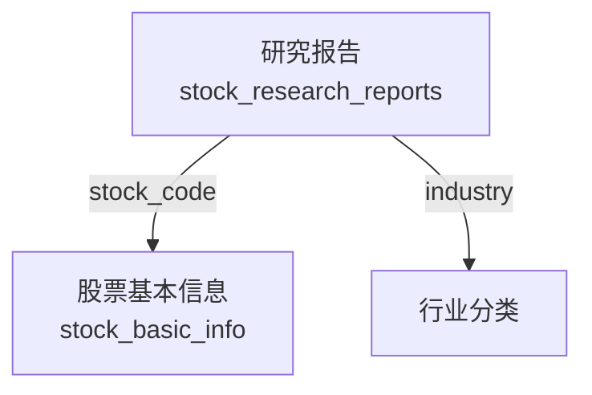

# 研究报告模型

<cite>
**本文档引用的文件**  
- [models.py](file://backend_api/models.py#L300-L322)
- [fix_stock_research_reports_duplicate.py](file://docs/fixed/fix_stock_research_reports_duplicate.py)
</cite>

## 目录
1. [引言](#引言)
2. [核心字段技术定义与业务含义](#核心字段技术定义与业务含义)
3. [报告来源与统计逻辑](#报告来源与统计逻辑)
4. [时间管理机制](#时间管理机制)
5. [PDF链接存储规范](#pdf链接存储规范)
6. [数据查询示例与使用模式](#数据查询示例与使用模式)
7. [模型关联关系](#模型关联关系)
8. [结论](#结论)

## 引言
本报告旨在全面解析`StockResearchReport`实体及其对应的`stock_research_reports`数据表。该模型是股票分析系统中用于存储和管理券商研究报告的核心数据结构，支持投资决策分析、市场情绪追踪和盈利预测整合。通过详细说明各字段的技术定义、业务含义及实际应用场景，本文档为开发人员、数据分析师和投资研究人员提供权威参考。

## 核心字段技术定义与业务含义

### 股票标识字段
- **stock_code**: 股票代码，字符串类型（长度20），建立索引以提升查询性能。用于唯一标识上市公司，是跨表关联的关键字段。
- **stock_name**: 股票名称，字符串类型（长度50），便于用户识别具体公司。

### 评级与预测指标
- **dongcai_rating**: 东方财富评级，字符串类型（长度50），记录券商对股票的投资评级（如“买入”、“增持”、“中性”、“减持”、“卖出”），反映机构整体观点。
- **profit_2024 / profit_2025 / profit_2026**: 分别表示2024、2025、2026年度的每股收益（EPS）预测值，浮点数类型，单位通常为人民币元。这些字段整合多家机构预测均值或加权平均，用于评估企业未来盈利能力趋势。
- **pe_2024 / pe_2025 / pe_2026**: 对应年份的市盈率（PE）预测，浮点数类型，计算方式为当前股价除以对应年份的预测EPS。该指标用于判断估值水平和成长性匹配度。

**Section sources**
- [models.py](file://backend_api/models.py#L300-L322)

## 报告来源与统计逻辑

### 机构信息
- **institution**: 报告发布机构名称，字符串类型（长度100），记录撰写研究报告的证券公司或研究机构（如“中信证券”、“中金公司”），用于分析不同机构的研究倾向和准确性。

### 月度报告计数
- **monthly_report_count**: 月度报告计数，整数类型，表示在当前月份内针对该股票发布的研究报告总数。其统计逻辑基于`report_date`字段进行时间窗口聚合，通常由后台调度任务每日执行统计更新，用于衡量市场关注度热度。

**Section sources**
- [models.py](file://backend_api/models.py#L300-L322)
- [fix_stock_research_reports_duplicate.py](file://docs/fixed/fix_stock_research_reports_duplicate.py#L129-L173)

## 时间管理机制

### 报告日期
- **report_date**: 报告发布日期，DateTime类型，精确记录研究报告对外公开的时间戳。此字段用于时间序列分析、报告时效性评估以及避免使用过期信息。

### 更新时间
- **updated_at**: 记录最后更新时间，DateTime类型，在记录创建或修改时自动更新。结合`report_date`可区分数据录入时间与报告发布时间，支持变更追踪和增量同步。

**Section sources**
- [models.py](file://backend_api/models.py#L300-L322)

## PDF链接存储规范
- **pdf_url**: PDF文件链接，字符串类型（长度300），存储研究报告原始文档的可访问URL地址。链接需确保长期有效性，建议采用对象存储服务（如S3、OSS）托管，并定期校验链接可用性。前端可通过该字段实现报告原文一键查看功能。

**Section sources**
- [models.py](file://backend_api/models.py#L300-L322)

## 数据查询示例与使用模式

### 查询示例：获取某股票最新研究报告
```sql
SELECT * FROM stock_research_reports 
WHERE stock_code = '000001' 
ORDER BY report_date DESC, updated_at DESC 
LIMIT 1;
```

### 查询示例：统计某机构月度覆盖股票数
```sql
SELECT COUNT(*) FROM stock_research_reports 
WHERE institution = '中信证券' 
AND report_date >= '2024-01-01' AND report_date < '2024-02-01';
```

### 使用模式
- **投资决策支持**：结合`profit_*`和`pe_*`字段构建未来三年盈利增长曲线，识别低估值高成长标的。
- **机构行为分析**：聚合`institution`字段分析各券商评级分布，识别一致性预期与分歧点。
- **市场情绪监控**：利用`monthly_report_count`变化趋势判断个股或行业关注度波动。

**Section sources**
- [models.py](file://backend_api/models.py#L300-L322)

## 模型关联关系
`StockResearchReport`模型通过`stock_code`字段与以下核心模型建立关联：
- **股票基本信息模型**（`stock_basic_info`）：关联获取公司所属行业、上市市场等基础属性。
- **行业分类模型**（隐含于系统中）：通过行业字段（`industry`）实现跨行业研究报告聚合分析，支持行业轮动策略研究。

此外，该模型独立于用户系统，不直接关联`users`或`watchlist`表，属于公共数据层，所有用户共享同一份研究报告数据。



**Diagram sources**
- [models.py](file://backend_api/models.py#L300-L322)

**Section sources**
- [models.py](file://backend_api/models.py#L300-L322)

## 结论
`StockResearchReport`模型作为股票分析系统的关键组成部分，系统化地整合了券商研究观点与财务预测数据。通过对`stock_code`、`dongcai_rating`、`profit_*`、`pe_*`等核心字段的结构化存储，结合`institution`、`monthly_report_count`等上下文信息，有效支撑了多维度的投资分析场景。时间字段`report_date`与`updated_at`确保了数据的时效性与可追溯性，而`pdf_url`则保留了原始信息入口。未来可通过增加情感分析标签、目标价变动轨迹等字段进一步增强模型分析能力。