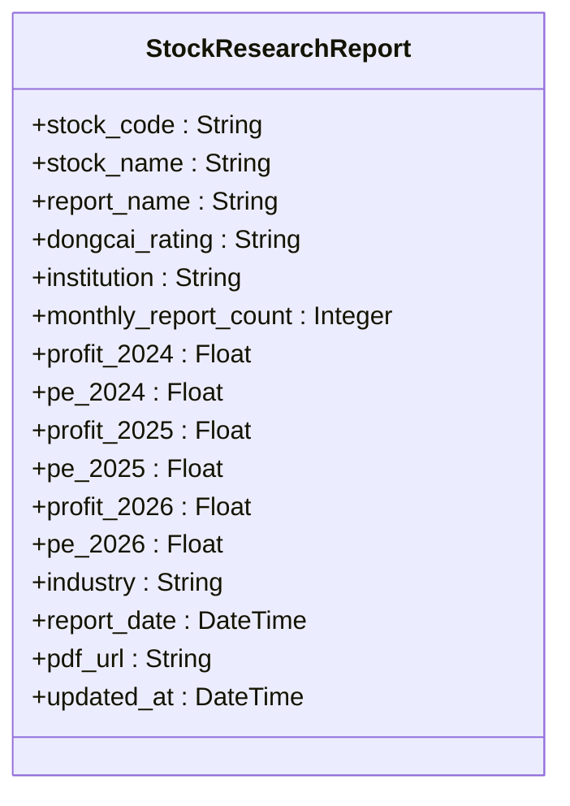
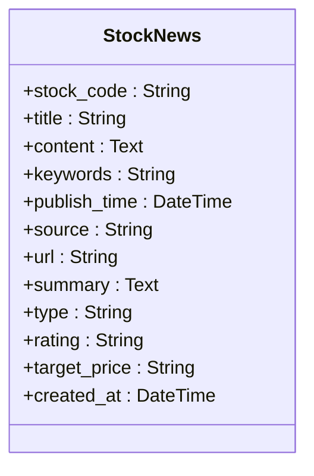
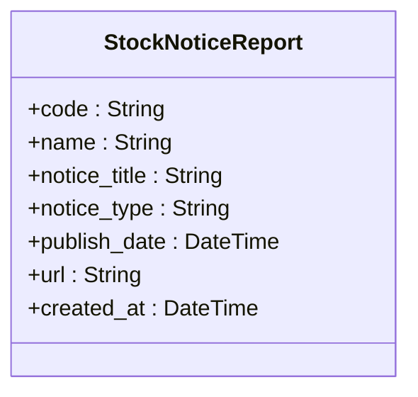
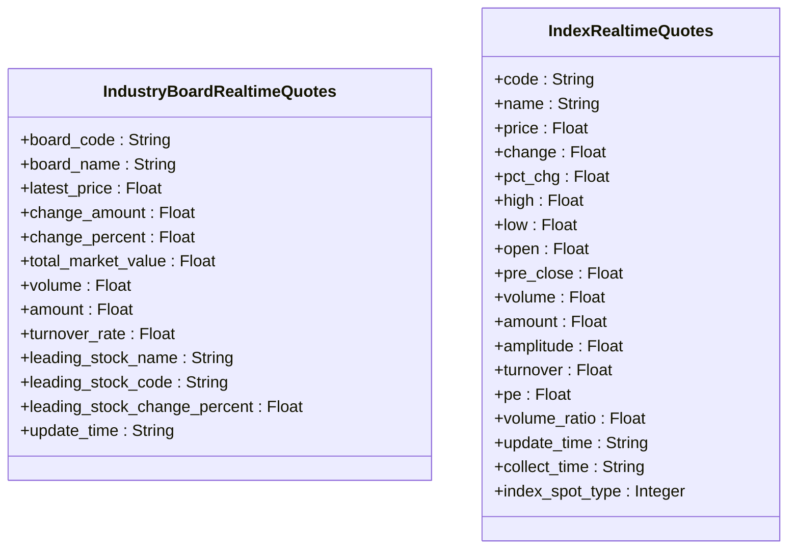
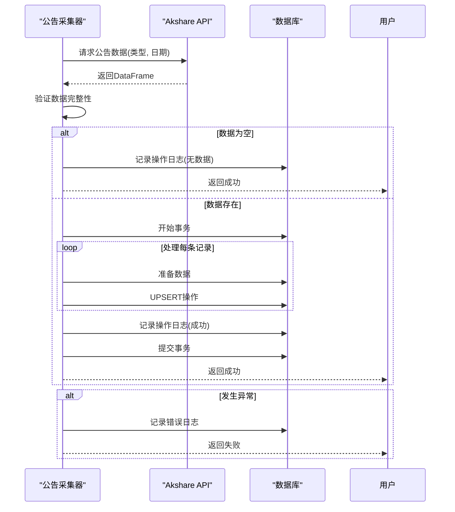

# 股票分析与研究模型

<cite>
**本文档引用的文件**  
- [models.py](file://backend_api/models.py#L1-L435)
- [realtime_stock_notice_report_ak.py](file://backend_core/data_collectors/akshare/realtime_stock_notice_report_ak.py#L1-L340)
</cite>

## 目录
1. [引言](#引言)
2. [核心实体模型](#核心实体模型)
3. [研究报告表结构详解](#研究报告表结构详解)
4. [新闻表智能分析字段说明](#新闻表智能分析字段说明)
5. [公告报告表数据管理](#公告报告表数据管理)
6. [行业板块与指数实时行情](#行业板块与指数实时行情)
7. [数据采集机制](#数据采集机制)
8. [结论](#结论)

## 引言
本文档旨在全面阐述股票分析与研究系统中的核心数据模型，涵盖股票研究报告、新闻、公告及实时行情等关键实体。重点解析各数据表的字段结构、业务含义及数据采集机制，为系统开发、数据分析和模型优化提供权威参考。

## 核心实体模型
系统定义了多个核心实体模型，用于存储和管理股票相关的研究、新闻、公告和行情数据。这些模型通过SQLAlchemy ORM实现，确保数据结构的规范性和一致性。

**Section sources**
- [models.py](file://backend_api/models.py#L1-L435)

## 研究报告表结构详解
`stock_research_reports` 表用于存储专业的股票研究报告数据，其字段结构设计充分考虑了投资分析的专业需求。

### 基本字段
- **stock_code**: 股票代码，用于唯一标识股票
- **stock_name**: 股票名称
- **report_name**: 研究报告名称
- **institution**: 发布报告的机构名称
- **industry**: 所属行业
- **report_date**: 报告发布日期
- **pdf_url**: 报告PDF文件的下载链接
- **updated_at**: 记录最后更新时间

### 专业分析字段
#### 机构评级
- **dongcai_rating**: 东方财富评级，反映机构对股票的投资建议，如"买入"、"增持"、"中性"、"减持"、"卖出"等。

#### 盈利预测
- **profit_2024**: 2024年预测净利润（单位：亿元）
- **profit_2025**: 2025年预测净利润（单位：亿元）
- **profit_2026**: 2026年预测净利润（单位：亿元）

#### 市盈率预测
- **pe_2024**: 2024年预测市盈率
- **pe_2025**: 2025年预测市盈率
- **pe_2026**: 2026年预测市盈率

#### 统计指标
- **monthly_report_count**: 本月报告数量，用于统计机构对某只股票的研究活跃度

**Diagram sources**
- [models.py](file://backend_api/models.py#L200-L220)

**Section sources**
- [models.py](file://backend_api/models.py#L200-L220)

## 新闻表智能分析字段说明
`stock_news` 表不仅存储原始新闻数据，还包含通过智能分析提取的关键信息。

### 基础字段
- **stock_code**: 关联股票代码
- **title**: 新闻标题
- **content**: 新闻正文内容
- **publish_time**: 发布时间
- **source**: 新闻来源
- **url**: 新闻原文链接
- **summary**: 内容摘要
- **type**: 新闻类型（如"公司新闻"、"行业新闻"、"宏观新闻"等）
- **created_at**: 记录创建时间

### 智能分析字段
- **keywords**: 提取的关键词，用于快速了解新闻核心内容
- **rating**: 情感分析评级，评估新闻对股票的正面或负面影响，如"正面"、"中性"、"负面"
- **target_price**: 目标价，从新闻中提取的分析师预测价格，可能包含价格区间

**Diagram sources**
- [models.py](file://backend_api/models.py#L180-L198)

**Section sources**
- [models.py](file://backend_api/models.py#L180-L198)

## 公告报告表数据管理
`stock_notice_report` 表专门用于管理上市公司发布的各类公告信息。

### 字段结构
- **code**: 股票代码
- **name**: 股票名称
- **notice_title**: 公告标题
- **notice_type**: 公告类型，如"重大事项"、"财务报告"、"融资公告"、"风险提示"、"资产重组"、"信息变更"、"持股变动"等
- **publish_date**: 公告发布日期
- **url**: 公告原文链接
- **created_at**: 记录创建时间

### 发布日期管理
系统通过`publish_date`字段精确管理公告的发布时间，支持按日期查询特定时间点的公告信息。数据库层面建立了`idx_stock_notice_date`索引，确保按日期查询的高效性。

**Diagram sources**
- [models.py](file://backend_api/models.py#L160-L178)

**Section sources**
- [models.py](file://backend_api/models.py#L160-L178)

## 行业板块与指数实时行情
系统提供了行业板块和指数的实时行情数据支持，具有特殊的数据结构和更新机制。

### 行业板块实时行情
`industry_board_realtime_quotes` 表存储行业板块的实时行情：

- **board_code**: 板块代码
- **board_name**: 板块名称
- **latest_price**: 最新价格
- **change_amount**: 涨跌额
- **change_percent**: 涨跌幅
- **total_market_value**: 总市值
- **volume**: 成交量
- **amount**: 成交额
- **turnover_rate**: 换手率
- **leading_stock_name**: 领涨股名称
- **leading_stock_code**: 领涨股代码
- **leading_stock_change_percent**: 领涨股涨跌幅
- **update_time**: 更新时间

### 指数行情
`index_realtime_quotes` 表存储指数的实时行情：

- **code**: 指数代码
- **name**: 指数名称
- **price**: 当前价格
- **change**: 涨跌额
- **pct_chg**: 涨跌幅
- **high**: 最高价
- **low**: 最低价
- **open**: 开盘价
- **pre_close**: 昨收价
- **volume**: 成交量
- **amount**: 成交额
- **amplitude**: 振幅
- **turnover**: 换手率
- **pe**: 市盈率
- **volume_ratio**: 量比
- **update_time**: 更新时间
- **collect_time**: 采集时间
- **index_spot_type**: 指数类型

**Diagram sources**
- [models.py](file://backend_api/models.py#L222-L260)

**Section sources**
- [models.py](file://backend_api/models.py#L222-L260)

## 数据采集机制
系统通过专门的数据采集器定期获取最新的公告数据，确保信息的及时性和准确性。

### 公告数据采集器
`AkshareStockNoticeReportCollector` 类负责采集A股公告数据：

- **初始化**: 创建`stock_notice_report`表及必要的索引
- **采集策略**: 支持按公告类型（如"财务报告"、"重大事项"等）和日期采集
- **去重机制**: 基于`code`、`notice_title`和`publish_date`的唯一约束，避免数据重复
- **错误处理**: 完善的异常捕获和日志记录机制
- **频率控制**: 采集不同类型公告之间添加2秒延迟，避免请求过于频繁

### 多类型批量采集
系统支持一次性采集多种类型的公告数据，包括：
- 全部
- 重大事项
- 财务报告
- 融资公告
- 风险提示
- 资产重组
- 信息变更
- 持股变动

**Diagram sources**
- [realtime_stock_notice_report_ak.py](file://backend_core/data_collectors/akshare/realtime_stock_notice_report_ak.py#L1-L340)

**Section sources**
- [realtime_stock_notice_report_ak.py](file://backend_core/data_collectors/akshare/realtime_stock_notice_report_ak.py#L1-L340)

## 结论
本文档详细阐述了股票分析与研究系统的核心数据模型，涵盖了研究报告、新闻、公告及实时行情等关键实体。通过规范化的字段设计和智能化的分析功能，系统能够为投资者提供全面、及时、专业的股票分析支持。各数据表的结构设计充分考虑了实际业务需求，同时通过高效的数据采集机制确保信息的实时更新，为构建智能投资决策系统奠定了坚实的数据基础。