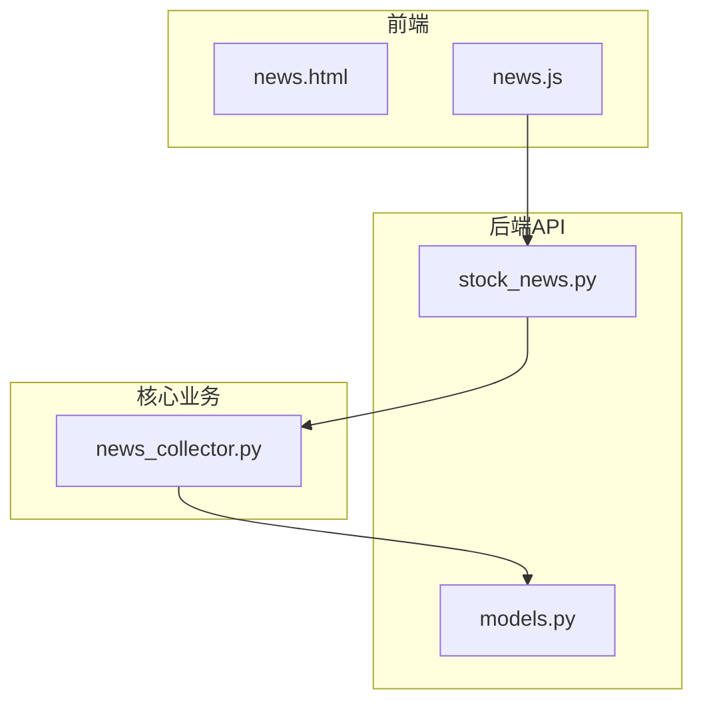
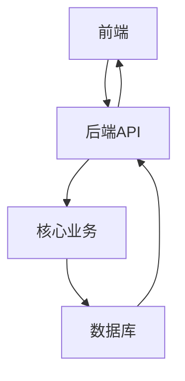
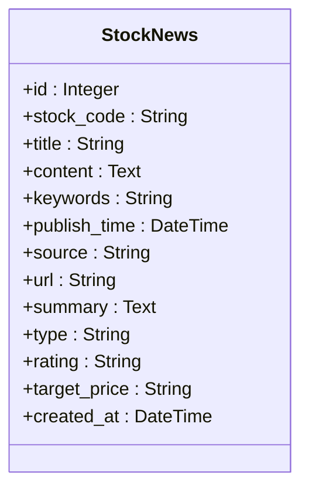
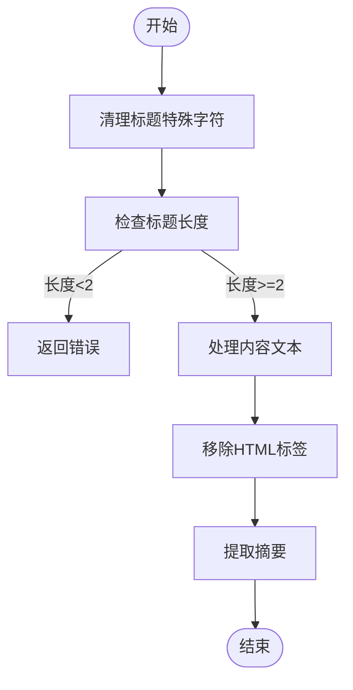
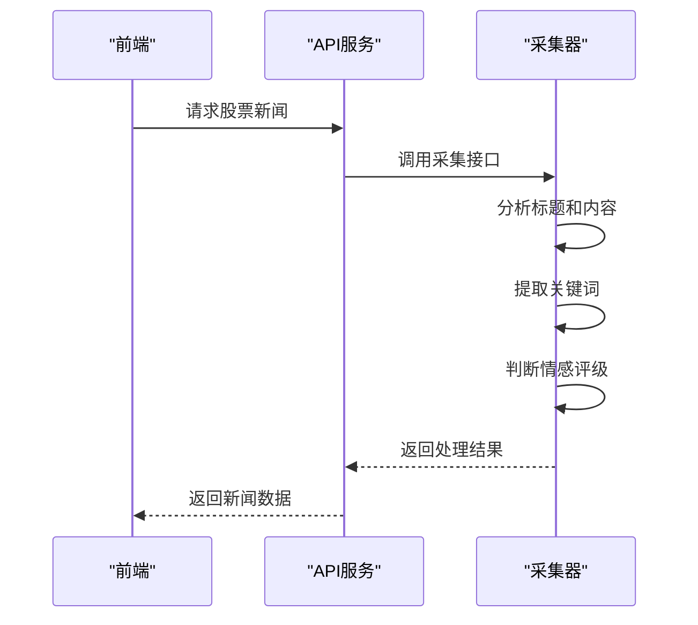
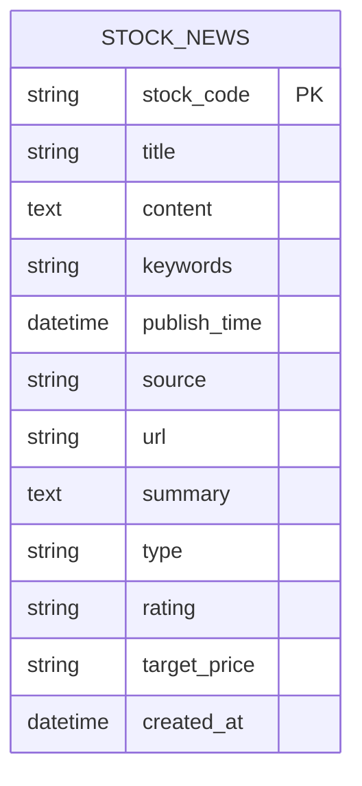
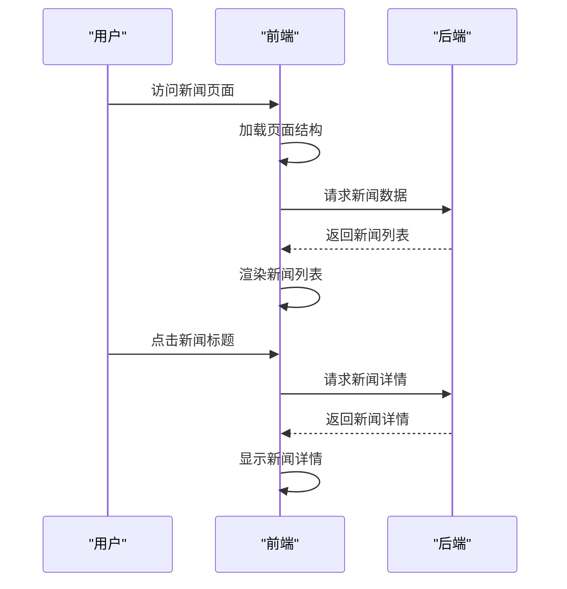
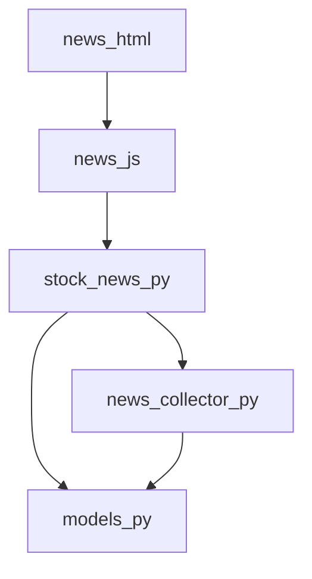

# 股票新闻模型

<cite>
**本文档引用的文件**
- [stock_news.py](file://backend_api/stock/stock_news.py)
- [models.py](file://backend_api/models.py)
- [news_collector.py](file://backend_core/data_collectors/news_collector.py)
- [news.html](file://frontend/news.html)
- [news.js](file://frontend/js/news.js)
</cite>

## 目录
1. [简介](#简介)
2. [项目结构](#项目结构)
3. [核心组件](#核心组件)
4. [架构概述](#架构概述)
5. [详细组件分析](#详细组件分析)
6. [依赖分析](#依赖分析)
7. [性能考虑](#性能考虑)
8. [故障排除指南](#故障排除指南)
9. [结论](#结论)

## 简介
本文档详细阐述了股票新闻模型的设计与实现，围绕`StockNews`实体及其在`stock_news`表中的具体实现展开。重点描述了新闻标题、内容和摘要的文本处理机制，以及关键词提取和情感评级的智能分析流程。说明了信息来源和目标价字段在投资情绪判断中的作用，解释了发布时间与创建时间的区别及其在数据同步中的意义。涵盖了新闻类型分类体系和URL链接的去重策略，并通过实际数据样例展示该模型如何支撑舆情监控和事件驱动型分析，以及其与前端新闻展示组件的集成方式。

## 项目结构
本项目采用分层架构设计，主要分为前端、后端API和核心业务逻辑三个部分。前端负责用户界面展示和交互，后端API提供RESTful接口服务，核心业务逻辑处理数据采集和存储。

**图表来源**
- [news.html](file://frontend/news.html)
- [news.js](file://frontend/js/news.js)
- [stock_news.py](file://backend_api/stock/stock_news.py)
- [news_collector.py](file://backend_core/data_collectors/news_collector.py)
- [models.py](file://backend_api/models.py)

**章节来源**
- [news.html](file://frontend/news.html)
- [news.js](file://frontend/js/news.js)
- [stock_news.py](file://backend_api/stock/stock_news.py)
- [news_collector.py](file://backend_core/data_collectors/news_collector.py)
- [models.py](file://backend_api/models.py)

## 核心组件
股票新闻模型的核心组件包括`StockNews`实体、新闻采集器、去重算法和前端展示组件。这些组件协同工作，实现了从数据采集到用户展示的完整流程。

**章节来源**
- [stock_news.py](file://backend_api/stock/stock_news.py#L1-L100)
- [models.py](file://backend_api/models.py#L1-L50)
- [news_collector.py](file://backend_core/data_collectors/news_collector.py#L1-L50)

## 架构概述
系统采用典型的三层架构，前端通过API调用获取数据，后端API协调数据处理和存储，核心业务模块负责数据采集和清洗。

**图表来源**
- [stock_news.py](file://backend_api/stock/stock_news.py#L1-L20)
- [models.py](file://backend_api/models.py#L1-L10)

## 详细组件分析

### StockNews实体分析
`StockNews`实体是整个系统的核心数据结构，定义了股票相关新闻的所有属性。

**图表来源**
- [models.py](file://backend_api/models.py#L300-L320)

**章节来源**
- [models.py](file://backend_api/models.py#L300-L320)

### 文本处理机制分析
系统对新闻标题、内容和摘要进行了一系列处理，确保数据质量和一致性。

#### 标题和内容处理

**图表来源**
- [news_collector.py](file://backend_core/data_collectors/news_collector.py#L150-L200)

#### 关键词提取和情感分析

**图表来源**
- [stock_news.py](file://backend_api/stock/stock_news.py#L50-L100)
- [news_collector.py](file://backend_core/data_collectors/news_collector.py#L100-L150)

**章节来源**
- [stock_news.py](file://backend_api/stock/stock_news.py#L50-L100)
- [news_collector.py](file://backend_core/data_collectors/news_collector.py#L100-L150)

### 时间字段分析
系统中存在两个关键的时间字段：发布时间和创建时间，它们具有不同的含义和用途。

**图表来源**
- [models.py](file://backend_api/models.py#L300-L320)

**章节来源**
- [models.py](file://backend_api/models.py#L300-L320)

### 前端集成分析
前端组件与后端API紧密集成，实现了新闻的展示和交互功能。

**图表来源**
- [news.html](file://frontend/news.html#L1-L50)
- [news.js](file://frontend/js/news.js#L1-L100)

**章节来源**
- [news.html](file://frontend/news.html#L1-L50)
- [news.js](file://frontend/js/news.js#L1-L100)

## 依赖分析
系统各组件之间存在明确的依赖关系，确保了功能的完整性和数据的一致性。

**图表来源**
- [news.html](file://frontend/news.html)
- [news.js](file://frontend/js/news.js)
- [stock_news.py](file://backend_api/stock/stock_news.py)
- [news_collector.py](file://backend_core/data_collectors/news_collector.py)
- [models.py](file://backend_api/models.py)

**章节来源**
- [news.html](file://frontend/news.html)
- [news.js](file://frontend/js/news.js)
- [stock_news.py](file://backend_api/stock/stock_news.py)
- [news_collector.py](file://backend_core/data_collectors/news_collector.py)
- [models.py](file://backend_api/models.py)

## 性能考虑
系统在设计时充分考虑了性能因素，特别是在数据采集和处理方面。

- **数据去重**：通过`deduplicate_news`函数实现新闻去重，优先保留东方财富网的新闻。
- **缓存机制**：系统会定期清理30天前的旧新闻，保持数据库的高效运行。
- **异步处理**：API接口采用异步方式处理请求，提高响应速度。

## 故障排除指南
当系统出现异常时，可以参考以下常见问题的解决方案：

**章节来源**
- [stock_news.py](file://backend_api/stock/stock_news.py#L800-L900)
- [news_collector.py](file://backend_core/data_collectors/news_collector.py#L400-L420)

## 结论
股票新闻模型通过精心设计的实体结构和高效的处理流程，实现了对股票相关新闻的全面管理和智能分析。系统不仅能够准确提取关键信息，还能有效判断投资情绪，为用户提供有价值的决策支持。前端与后端的紧密集成确保了用户体验的流畅性，使得舆情监控和事件驱动型分析成为可能。