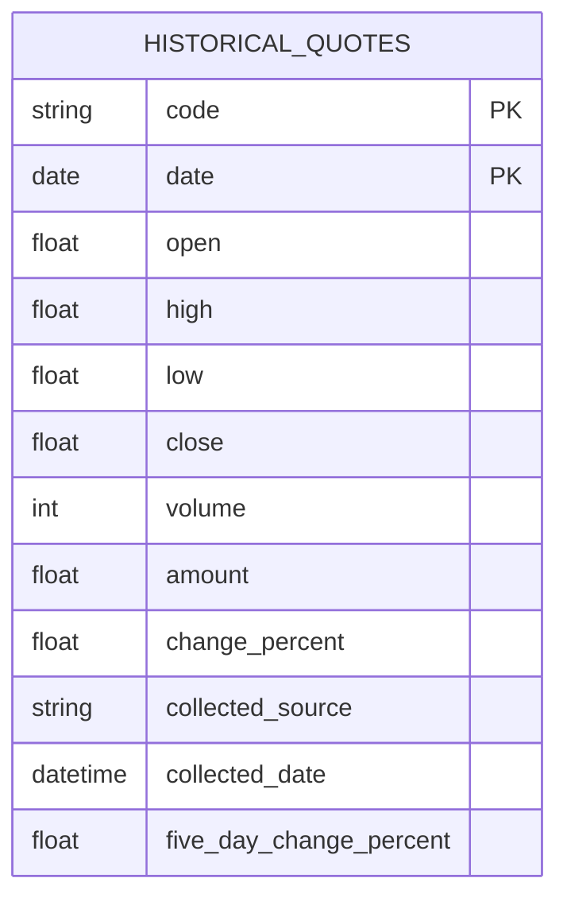
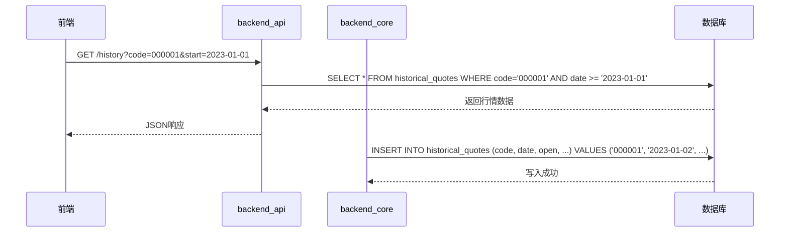

# 历史行情模型

<cite>
**本文档引用的文件**  
- [backend_api/models.py](file://backend_api/models.py#L361-L386)
- [backend_core/models/historical_quotes.py](file://backend_core/models/historical_quotes.py#L4-L27)
- [backend_core/database/db.py](file://backend_core/database/db.py#L1-L32)
</cite>

## 目录
1. [引言](#引言)
2. [核心字段设计](#核心字段设计)
3. [复合主键设计原理](#复合主键设计原理)
4. [衍生指标计算逻辑](#衍生指标计算逻辑)
5. [数据源与采集时间追踪](#数据源与采集时间追踪)
6. [前后端字段映射关系](#前后端字段映射关系)
7. [数据写入与查询流程](#数据写入与查询流程)
8. [结论](#结论)

## 引言
`HistoricalQuotes` 模型是股票分析系统中的核心数据实体，用于存储历史行情数据。该模型在 `backend_api/models.py` 和 `backend_core/models/historical_quotes.py` 中分别定义，确保前后端对数据结构的一致理解。本文档详细说明其设计原理、字段含义、衍生指标计算方式以及数据流转机制。

**Section sources**
- [backend_api/models.py](file://backend_api/models.py#L361-L386)
- [backend_core/models/historical_quotes.py](file://backend_core/models/historical_quotes.py#L4-L27)

## 核心字段设计
`HistoricalQuotes` 模型包含多个核心行情字段，其数据类型与精度设定如下：

| 字段名 | 数据类型 | 精度说明 | 业务含义 |
|--------|--------|---------|--------|
| open | Float | 浮点型，保留小数点后两位 | 开盘价 |
| high | Float | 浮点型，保留小数点后两位 | 最高价 |
| low | Float | 浮点型，保留小数点后两位 | 最低价 |
| close | Float | 浮点型，保留小数点后两位 | 收盘价 |
| volume | Integer | 整型，单位为股 | 成交量（手） |
| amount | Float | 浮点型，单位为元 | 成交金额 |

这些字段采用 `Float` 类型以支持高精度价格计算，`volume` 使用 `Integer` 以避免浮点误差，符合金融数据处理规范。

**Section sources**
- [backend_api/models.py](file://backend_api/models.py#L361-L386)

## 复合主键设计原理
该表采用复合主键 `(code, date)`，即股票代码与交易日期共同构成主键。

### 设计优势：
1. **唯一性保障**：确保每只股票在每个交易日仅有一条记录，防止数据重复。
2. **查询性能优化**：在按股票代码和日期范围查询时，数据库可高效利用复合索引，显著提升查询速度。
3. **自然业务键匹配**：直接反映“某股票某日行情”的业务语义，无需额外生成代理主键（如自增ID）。
4. **存储效率**：避免使用额外的自增ID字段，节省存储空间。



**Diagram sources**
- [backend_api/models.py](file://backend_api/models.py#L361-L386)
- [backend_core/models/historical_quotes.py](file://backend_core/models/historical_quotes.py#L4-L27)

## 衍生指标计算逻辑
模型包含多个预计算的衍生指标，用于支持快速分析：

| 指标字段 | 计算逻辑 | 更新机制 | 业务用途 |
|--------|--------|--------|--------|
| cumulative_change_percent | (当前close - 首日close) / 首日close * 100 | 数据采集完成后批量计算 | 衡量长期趋势 |
| five_day_change_percent | (当前close - 5日前close) / 5日前close * 100 | 由 `backend_core/data_collectors/tushare/five_day_change_calculator.py` 计算 | 短期动量分析 |
| ten_day_change_percent | (当前close - 10日前close) / 10日前close * 100 | 采集器写入时更新 | 中期趋势判断 |
| sixty_day_change_percent | (当前close - 60日前close) / 60日前close * 100 | 批量任务定期更新 | 长期投资参考 |

这些指标在数据采集阶段由后端采集器计算并写入，避免前端或API层实时计算，提升响应性能。

**Section sources**
- [backend_api/models.py](file://backend_api/models.py#L380-L386)
- [backend_core/models/historical_quotes.py](file://backend_core/models/historical_quotes.py#L4-L27)

## 数据源与采集时间追踪
### collected_source 字段
- **功能**：记录数据来源，支持多源追踪（如 AkShare、Tushare）。
- **业务价值**：便于数据质量审计、异常排查及来源对比分析。

### collected_date 字段
- **类型**：DateTime，默认值为 `datetime.now`
- **用途**：记录数据采集时间，用于：
  - 数据新鲜度监控
  - 采集任务审计
  - 历史数据版本追溯

```mermaid
flowchart TD
A[数据采集器] --> B{数据源}
B --> |AkShare| C[HistoricalQuotes]
B --> |Tushare| C
C --> D[collected_source = "AkShare"]
C --> E[collected_date = 当前时间]
```

**Diagram sources**
- [backend_core/models/historical_quotes.py](file://backend_core/models/historical_quotes.py#L4-L27)
- [backend_core/database/db.py](file://backend_core/database/db.py#L1-L32)

## 前后端字段映射关系
尽管 `backend_api` 和 `backend_core` 分别定义了 `HistoricalQuotes` 模型，但字段保持高度一致，确保数据一致性。

| 后端字段 (backend_core) | API字段 (backend_api) | 映射方式 |
|------------------------|----------------------|--------|
| code | code | 直接映射 |
| date | date | 直接映射 |
| open | open | 直接映射 |
| close | close | 直接映射 |
| five_day_change_percent | five_day_change_percent | 直接映射 |
| collected_source | collected_source | 直接映射 |

这种设计避免了DTO转换开销，提升系统性能。

**Section sources**
- [backend_api/models.py](file://backend_api/models.py#L361-L386)
- [backend_core/models/historical_quotes.py](file://backend_core/models/historical_quotes.py#L4-L27)

## 数据写入与查询流程
### 写入流程
1. `backend_core/data_collectors` 中的采集器（如 `historical_collector.py`）从 AkShare/Tushare 获取原始数据。
2. 计算衍生指标（如5日涨跌幅）。
3. 通过 `SessionLocal` 写入 `historical_quotes` 表，设置 `collected_source` 和 `collected_date`。

### 查询流程
1. 前端通过 `backend_api/stock/history_api.py` 发起查询请求。
2. API 层使用 `get_db()` 获取数据库会话。
3. 执行基于 `(code, date)` 的复合主键查询，返回结构化数据。



**Diagram sources**
- [backend_api/models.py](file://backend_api/models.py#L361-L386)
- [backend_core/models/historical_quotes.py](file://backend_core/models/historical_quotes.py#L4-L27)
- [backend_core/database/db.py](file://backend_core/database/db.py#L1-L32)

## 结论
`HistoricalQuotes` 模型通过复合主键设计实现了高效查询与数据唯一性保障。核心字段采用合理的数据类型确保精度，衍生指标预计算提升分析性能。`collected_source` 和 `collected_date` 提供完整的元数据追踪能力。前后端模型一致性简化了数据流转，采集器与API服务协同工作，构建了可靠的历史行情数据管道。