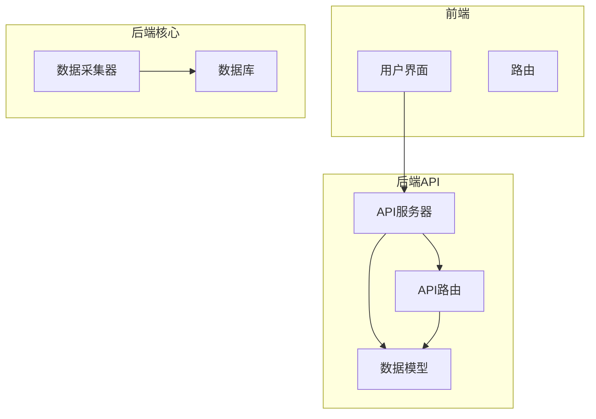
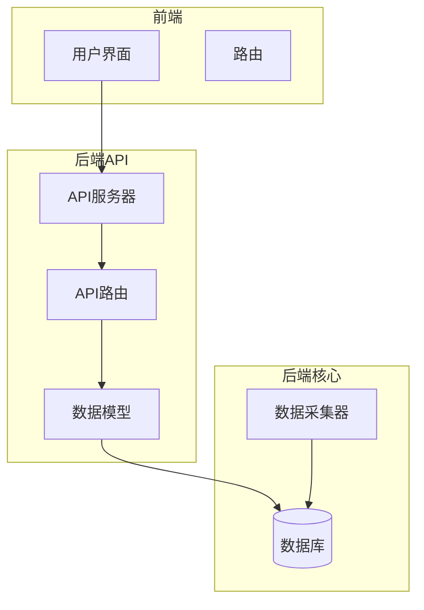
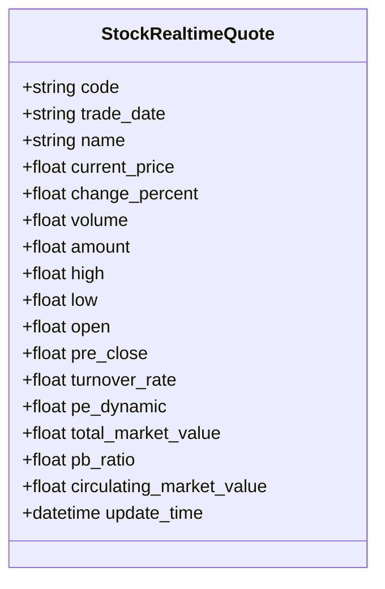
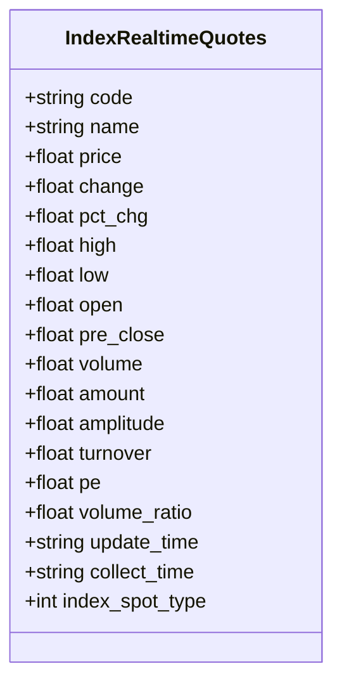
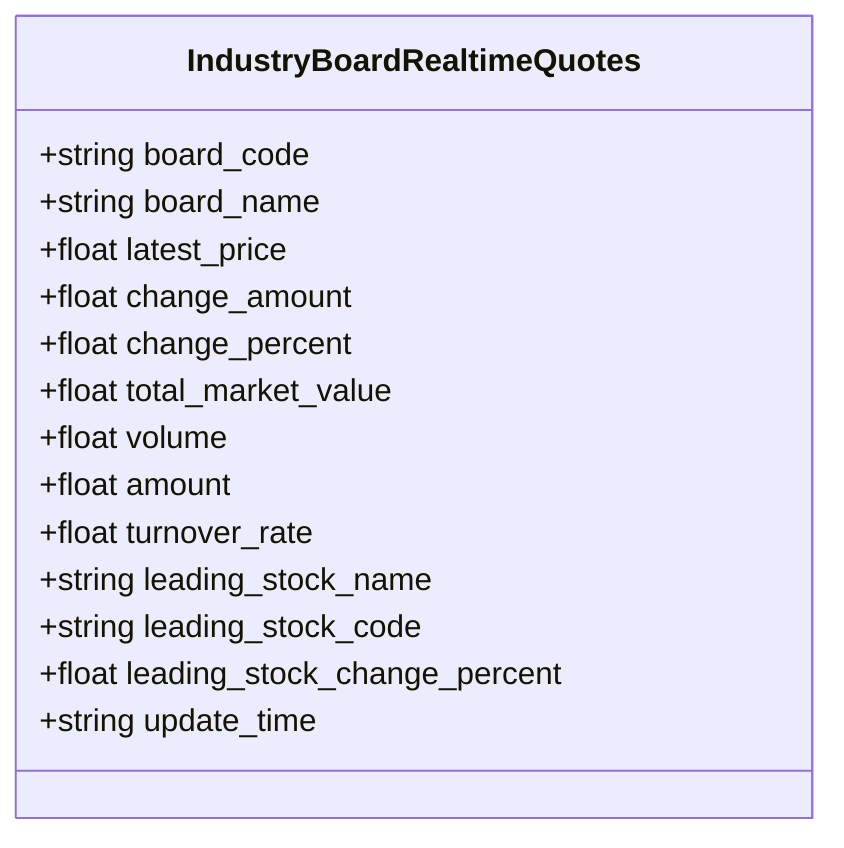
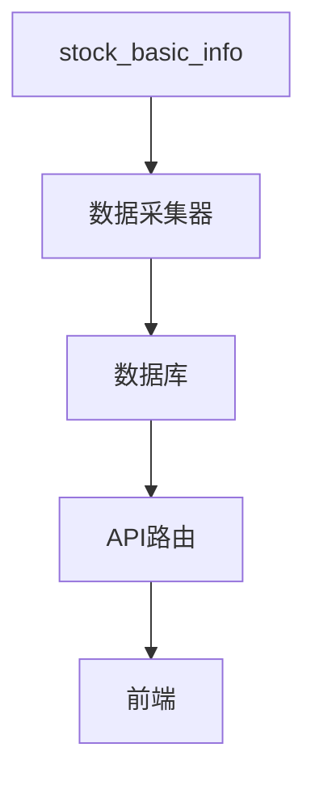

# 实时行情模型

<cite>
**本文档引用的文件**
- [models.py](file://backend_api/models.py#L249-L267)
- [models.py](file://backend_api/models.py#L324-L343)
- [models.py](file://backend_api/models.py#L345-L359)
- [models.py](file://backend_api/models.py#L361-L386)
- [realtime.py](file://backend_core/data_collectors/akshare/realtime.py)
- [realtime_index_spot_ak.py](file://backend_core/data_collectors/akshare/realtime_index_spot_ak.py)
- [realtime_stock_industry_board_ak.py](file://backend_core/data_collectors/akshare/realtime_stock_industry_board_ak.py)
- [quotes_routes.py](file://backend_api/quotes_routes.py)
</cite>

## 目录
1. [引言](#引言)
2. [项目结构](#项目结构)
3. [核心组件](#核心组件)
4. [架构概述](#架构概述)
5. [详细组件分析](#详细组件分析)
6. [依赖分析](#依赖分析)
7. [性能考虑](#性能考虑)
8. [故障排除指南](#故障排除指南)
9. [结论](#结论)

## 引言
本文档详细描述了基于 `backend_api/models.py` 中定义的 `StockRealtimeQuote`、`IndexRealtimeQuotes` 和 `IndustryBoardRealtimeQuotes` 模型的实时行情数据模型。重点解析了 `StockRealtimeQuote` 表以 `code` 和 `trade_date` 为联合主键的设计，分析了 `current_price`、`change_percent`、`volume`、`amount` 等核心字段的实时性要求。同时，深入探讨了 `turnover_rate`（换手率）、`pe_dynamic`（动态市盈率）、`pb_ratio`（市净率）等扩展字段的计算来源与金融意义。文档还对比了实时表与历史行情表在数据粒度、更新频率和存储策略上的差异，并说明了 `IndexRealtimeQuotes` 和 `IndustryBoardRealtimeQuotes` 在指数与行业板块监控中的特殊作用，包括 `volume_ratio`（量比）、`amplitude`（振幅）等技术指标的应用场景。最后，结合 admin 后台的监控视图，说明这些模型如何支撑系统的实时监控功能。

## 项目结构
本项目包含多个模块，主要分为前端、后端 API 和后端核心服务。实时行情数据模型主要位于 `backend_api` 模块的 `models.py` 文件中，而数据采集逻辑则分布在 `backend_core` 模块的 `data_collectors` 目录下。`backend_api` 提供了基于 FastAPI 的 RESTful API 接口，用于查询实时行情数据。

**图表来源**
- [models.py](file://backend_api/models.py#L249-L267)
- [quotes_routes.py](file://backend_api/quotes_routes.py)

**章节来源**
- [models.py](file://backend_api/models.py#L249-L267)
- [quotes_routes.py](file://backend_api/quotes_routes.py)

## 核心组件
实时行情数据模型的核心组件包括 `StockRealtimeQuote`、`IndexRealtimeQuotes` 和 `IndustryBoardRealtimeQuotes` 三个数据库模型。这些模型分别用于存储股票、指数和行业板块的实时行情数据。数据采集由 `backend_core` 模块中的 `AkshareRealtimeQuoteCollector`、`RealtimeIndexSpotAkCollector` 和 `RealtimeStockIndustryBoardCollector` 类负责，它们定期从 AkShare API 获取最新数据并存入数据库。

**章节来源**
- [models.py](file://backend_api/models.py#L249-L267)
- [realtime.py](file://backend_core/data_collectors/akshare/realtime.py)

## 架构概述
系统架构采用分层设计，前端通过 API 调用后端服务，后端服务通过 ORM 操作数据库。实时行情数据的采集、存储和查询形成了一个闭环。数据采集器负责从外部数据源获取数据，后端 API 提供数据查询接口，前端负责展示数据。

**图表来源**
- [models.py](file://backend_api/models.py#L249-L267)
- [quotes_routes.py](file://backend_api/quotes_routes.py)
- [realtime.py](file://backend_core/data_collectors/akshare/realtime.py)

## 详细组件分析
### StockRealtimeQuote 分析
`StockRealtimeQuote` 模型是实时行情数据的核心，其表结构设计以 `code`（股票代码）和 `trade_date`（交易日期）作为联合主键，确保了每个股票在每个交易日的数据唯一性。该模型包含多个核心字段，如 `current_price`（当前价格）、`change_percent`（涨跌幅）、`volume`（成交量）和 `amount`（成交额），这些字段反映了股票的实时交易状态。

#### 核心字段
- `current_price`: 当前交易价格，反映股票的实时价值。
- `change_percent`: 涨跌幅，表示当前价格相对于前收盘价的变化百分比。
- `volume`: 成交量，表示在当前交易日内的总成交量。
- `amount`: 成交额，表示在当前交易日内的总成交金额。

#### 扩展字段
- `turnover_rate`: 换手率，表示股票在一定时间内的交易频率，计算公式为成交量除以流通股本。
- `pe_dynamic`: 动态市盈率，反映股票价格与每股收益的比率，用于评估股票的估值水平。
- `pb_ratio`: 市净率，反映股票价格与每股净资产的比率，用于评估股票的内在价值。

**图表来源**
- [models.py](file://backend_api/models.py#L249-L267)

**章节来源**
- [models.py](file://backend_api/models.py#L249-L267)
- [realtime.py](file://backend_core/data_collectors/akshare/realtime.py)

### IndexRealtimeQuotes 分析
`IndexRealtimeQuotes` 模型用于存储指数的实时行情数据，其主键为 `code`（指数代码）。该模型包含 `price`（价格）、`pct_chg`（涨跌幅）、`volume`（成交量）和 `amount`（成交额）等核心字段，以及 `amplitude`（振幅）、`volume_ratio`（量比）和 `pe`（市盈率）等技术指标。

#### 技术指标
- `amplitude`: 振幅，表示当日最高价与最低价之间的差额占前收盘价的百分比，反映市场的波动性。
- `volume_ratio`: 量比，表示当前成交量与过去一段时间平均成交量的比值，用于判断市场活跃度。

**图表来源**
- [models.py](file://backend_api/models.py#L324-L343)

**章节来源**
- [models.py](file://backend_api/models.py#L324-L343)
- [realtime_index_spot_ak.py](file://backend_core/data_collectors/akshare/realtime_index_spot_ak.py)

### IndustryBoardRealtimeQuotes 分析
`IndustryBoardRealtimeQuotes` 模型用于存储行业板块的实时行情数据，其主键为 `board_code`（板块代码）。该模型包含 `latest_price`（最新价）、`change_percent`（涨跌幅）、`total_market_value`（总市值）和 `volume`（成交量）等核心字段，以及 `turnover_rate`（换手率）和 `leading_stock_change_percent`（领涨股涨跌幅）等扩展字段。

#### 扩展字段
- `turnover_rate`: 换手率，反映行业板块内股票的交易活跃度。
- `leading_stock_change_percent`: 领涨股涨跌幅，表示该板块内涨幅最大的股票的涨跌幅，用于判断板块的整体趋势。

**图表来源**
- [models.py](file://backend_api/models.py#L345-L359)

**章节来源**
- [models.py](file://backend_api/models.py#L345-L359)
- [realtime_stock_industry_board_ak.py](file://backend_core/data_collectors/akshare/realtime_stock_industry_board_ak.py)

## 依赖分析
实时行情数据模型依赖于 `backend_core` 模块中的数据采集器，这些采集器负责从外部数据源获取数据并存入数据库。`backend_api` 模块中的 API 路由依赖于这些模型来提供数据查询服务。此外，`StockRealtimeQuote` 模型还依赖于 `stock_basic_info` 表来获取股票的基本信息。

**图表来源**
- [models.py](file://backend_api/models.py#L249-L267)
- [realtime.py](file://backend_core/data_collectors/akshare/realtime.py)
- [quotes_routes.py](file://backend_api/quotes_routes.py)

**章节来源**
- [models.py](file://backend_api/models.py#L249-L267)
- [realtime.py](file://backend_core/data_collectors/akshare/realtime.py)
- [quotes_routes.py](file://backend_api/quotes_routes.py)

## 性能考虑
为了确保实时行情数据的高效查询，数据库表设计时应考虑索引的使用。例如，`StockRealtimeQuote` 表的 `code` 和 `trade_date` 字段应建立联合索引，以加快按股票代码和交易日期查询的速度。此外，数据采集器应采用批量插入的方式，减少数据库的 I/O 操作，提高数据写入效率。

## 故障排除指南
当实时行情数据出现异常时，首先应检查数据采集器的日志，确认数据采集是否成功。其次，检查数据库连接是否正常，确保数据能够正确写入。最后，检查 API 路由的实现，确保数据查询逻辑正确无误。

**章节来源**
- [realtime.py](file://backend_core/data_collectors/akshare/realtime.py)
- [quotes_routes.py](file://backend_api/quotes_routes.py)

## 结论
本文档详细描述了实时行情数据模型的设计与实现，涵盖了 `StockRealtimeQuote`、`IndexRealtimeQuotes` 和 `IndustryBoardRealtimeQuotes` 三个核心模型。通过联合主键设计、核心字段与扩展字段的合理定义，以及数据采集与查询的高效实现，该模型能够有效支撑系统的实时监控功能，为用户提供准确、及时的行情数据。