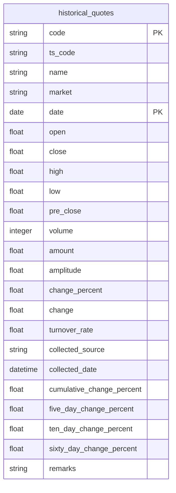
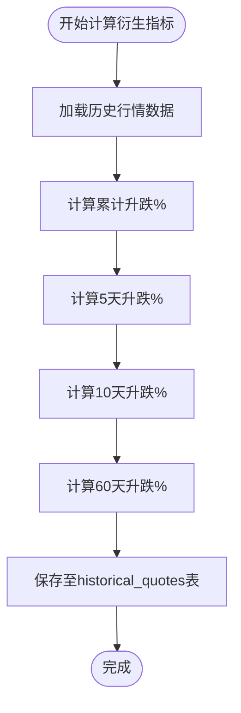
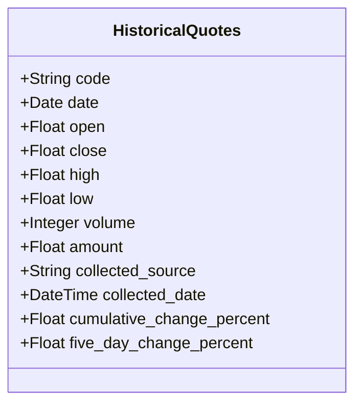

# 行情数据模型

<cite>
**本文档引用的文件**  
- [backend_api/models.py](file://backend_api/models.py#L361-L386)
- [backend_core/models/historical_quotes.py](file://backend_core/models/historical_quotes.py#L4-L27)
</cite>

## 目录
1. [引言](#引言)
2. [历史行情表结构](#历史行情表结构)
3. [复合主键设计](#复合主键设计)
4. [核心字段定义](#核心字段定义)
5. [衍生指标计算逻辑](#衍生指标计算逻辑)
6. [实时行情表结构差异](#实时行情表结构差异)
7. [元数据管理策略](#元数据管理策略)

## 引言
本文档详细描述股票分析系统中的行情数据模型，重点整合 `backend_api/models.py` 和 `backend_core/models/historical_quotes.py` 中定义的 `HistoricalQuotes` 实体。文档涵盖历史行情与实时行情的数据结构、字段精度、主键设计、衍生指标计算方式以及元数据管理机制。

## 历史行情表结构
历史行情数据存储于 `historical_quotes` 表中，由 `backend_api/models.py` 和 `backend_core/models/historical_quotes.py` 两个文件共同定义。两个文件中的模型结构保持一致，确保跨模块数据一致性。

**图表来源**  
- [backend_api/models.py](file://backend_api/models.py#L361-L386)
- [backend_core/models/historical_quotes.py](file://backend_core/models/historical_quotes.py#L4-L27)

**本节来源**  
- [backend_api/models.py](file://backend_api/models.py#L361-L386)
- [backend_core/models/historical_quotes.py](file://backend_core/models/historical_quotes.py#L4-L27)

## 复合主键设计
`historical_quotes` 表采用复合主键设计，由以下两个字段组成：
- **code**：股票代码，字符串类型，作为联合主键的一部分
- **date**：交易日期，日期类型，作为联合主键的另一部分

该设计确保每只股票在每个交易日的数据唯一性，避免重复采集导致的数据冗余。复合主键替代了传统的自增ID，提升了按股票和日期查询的索引效率。

**本节来源**  
- [backend_api/models.py](file://backend_api/models.py#L363-L365)
- [backend_core/models/historical_quotes.py](file://backend_core/models/historical_quotes.py#L6-L8)

## 核心字段定义
历史行情表的核心价格与成交量字段定义如下：

| 字段名 | 数据类型 | 精度说明 | 含义 |
|--------|--------|----------|------|
| open | Float | 浮点数 | 开盘价 |
| high | Float | 浮点数 | 最高价 |
| low | Float | 浮点数 | 最低价 |
| close | Float | 浮点数 | 收盘价 |
| volume | Integer | 整数 | 成交量（股） |
| amount | Float | 浮点数 | 成交金额（元） |
| pre_close | Float | 浮点数 | 昨日收盘价 |
| change_percent | Float | 浮点数 | 涨跌幅（%） |
| change | Float | 浮点数 | 涨跌额 |

所有价格类字段均使用 `Float` 类型以支持小数精度，成交量使用 `Integer` 类型确保整数计数准确性。

**本节来源**  
- [backend_api/models.py](file://backend_api/models.py#L366-L375)
- [backend_core/models/historical_quotes.py](file://backend_core/models/historical_quotes.py#L9-L18)

## 衍生指标计算逻辑
系统在历史行情数据基础上计算并存储多个衍生指标，用于技术分析和投资决策支持。

### 累计升跌%
- **字段名**：`cumulative_change_percent`
- **计算逻辑**：从指定起始日期到当前日期的累计涨跌幅
- **公式**：(当前收盘价 - 起始日收盘价) / 起始日收盘价 × 100%
- **用途**：衡量长期持有收益

### N日升跌%
系统预计算多个周期的涨跌幅，提升查询性能：
- **5天升跌%** (`five_day_change_percent`)：最近5个交易日的涨跌幅
- **10天升跌%** (`ten_day_change_percent`)：最近10个交易日的涨跌幅
- **60天升跌%** (`sixty_day_change_percent`)：最近60个交易日的涨跌幅

这些指标在数据采集过程中由后台任务批量计算并写入数据库，避免前端实时计算带来的性能开销。

**图表来源**  
- [backend_api/models.py](file://backend_api/models.py#L380-L383)

**本节来源**  
- [backend_api/models.py](file://backend_api/models.py#L380-L383)

## 实时行情表结构差异
实时行情数据存储于 `stock_realtime_quote` 表中，与历史行情表相比，具有以下扩展字段：

| 字段名 | 含义 | 数据类型 |
|--------|------|----------|
| turnover_rate | 换手率 | Float |
| pe_dynamic | 动态市盈率 | Float |
| total_market_value | 总市值 | Float |
| pb_ratio | 市净率 | Float |
| circulating_market_value | 流通市值 | Float |
| update_time | 更新时间 | DateTime |

此外，实时表以 `code` 和 `trade_date` 为联合主键，并包含更频繁的更新时间戳，适用于高频数据展示场景。

**本节来源**  
- [backend_api/models.py](file://backend_api/models.py#L287-L305)

## 元数据管理策略
为追踪数据来源和采集时间，系统在 `historical_quotes` 表中引入元数据字段：

- **collected_source**：数据采集来源，记录数据来自哪个接口或供应商（如 akshare、tushare）
- **collected_date**：数据采集时间，默认值为 `datetime.now`，记录该条数据被写入数据库的时间

该策略支持数据溯源、质量审计和异常排查，确保数据链路的可追踪性。

**图表来源**  
- [backend_api/models.py](file://backend_api/models.py#L361-L386)
- [backend_core/models/historical_quotes.py](file://backend_core/models/historical_quotes.py#L4-L27)

**本节来源**  
- [backend_api/models.py](file://backend_api/models.py#L376-L377)
- [backend_core/models/historical_quotes.py](file://backend_core/models/historical_quotes.py#L20-L21)