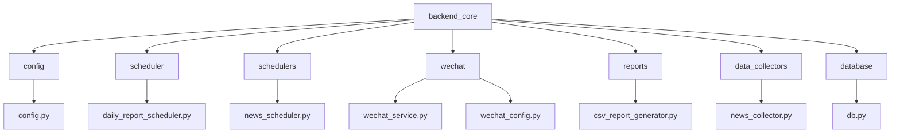
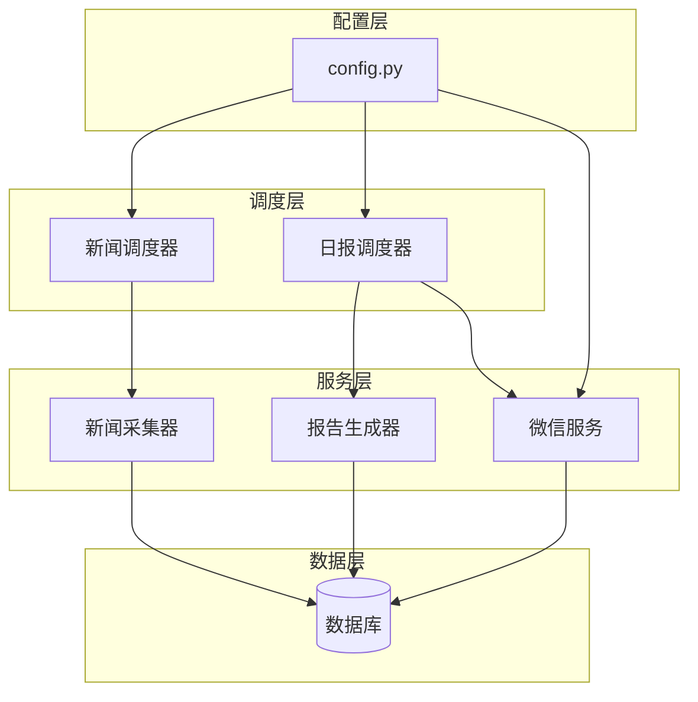
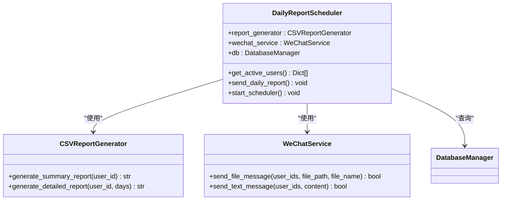
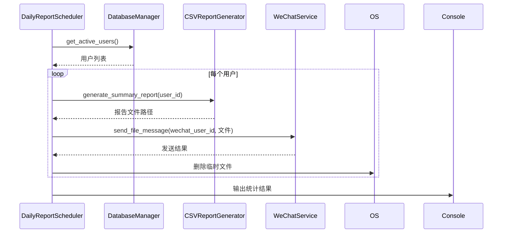
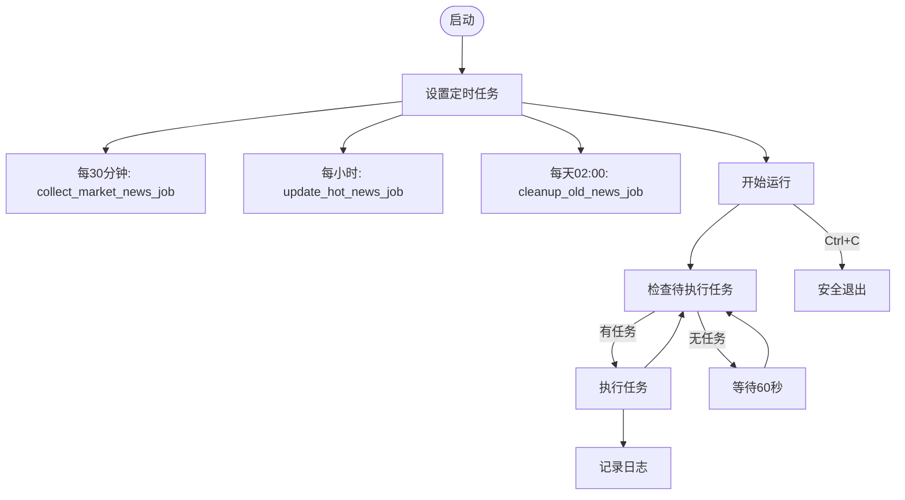
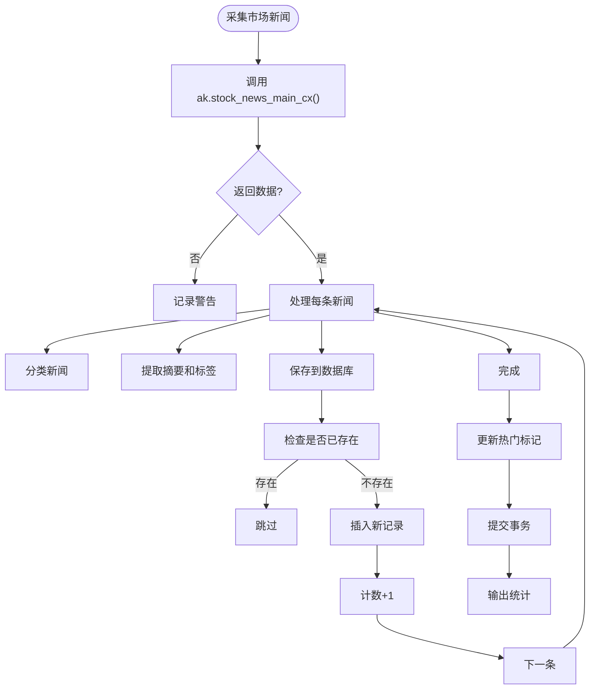
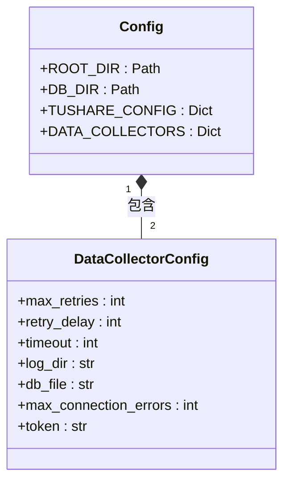
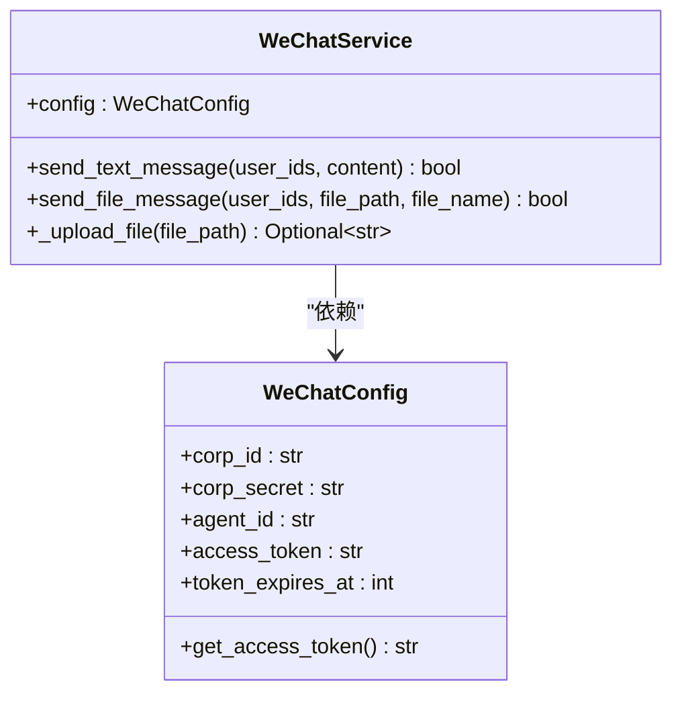
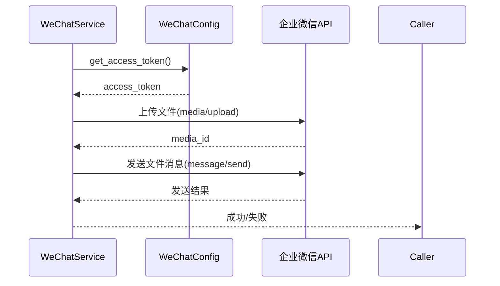
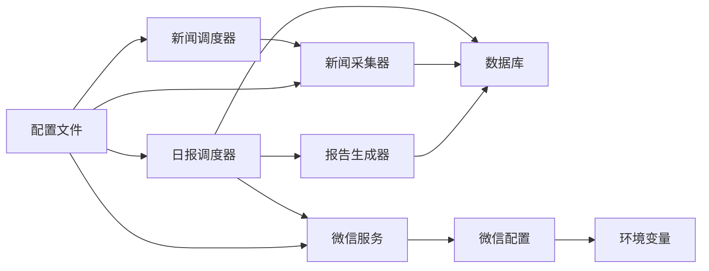

# 任务调度系统

<cite>
**本文档中引用的文件**  
- [daily_report_scheduler.py](file://backend_core/scheduler/daily_report_scheduler.py)
- [news_scheduler.py](file://backend_core/schedulers/news_scheduler.py)
- [config.py](file://backend_core/config/config.py)
- [wechat_service.py](file://backend_core/wechat/wechat_service.py)
- [wechat_config.py](file://backend_core/wechat/wechat_config.py)
- [csv_report_generator.py](file://backend_core/reports/csv_report_generator.py)
- [news_collector.py](file://backend_core/data_collectors/news_collector.py)
- [db.py](file://backend_core/database/db.py)
</cite>

## 目录
1. [简介](#简介)
2. [项目结构](#项目结构)
3. [核心组件](#核心组件)
4. [架构概览](#架构概览)
5. [详细组件分析](#详细组件分析)
6. [依赖分析](#依赖分析)
7. [性能考虑](#性能考虑)
8. [故障排除指南](#故障排除指南)
9. [结论](#结论)

## 简介
本文档详细描述了`backend_core`模块中的任务调度机制，重点涵盖日报生成与推送、新闻采集周期执行、配置驱动的灵活调度策略、企业微信集成、任务注册与执行流程、监控与错误恢复机制。同时说明了调度冲突处理、任务依赖管理、日志记录等运维细节，并提供命令行启动和测试方法。

## 项目结构

**图示来源**  
- [config.py](file://backend_core/config/config.py)
- [daily_report_scheduler.py](file://backend_core/scheduler/daily_report_scheduler.py)
- [news_scheduler.py](file://backend_core/schedulers/news_scheduler.py)
- [wechat_service.py](file://backend_core/wechat/wechat_service.py)
- [csv_report_generator.py](file://backend_core/reports/csv_report_generator.py)
- [news_collector.py](file://backend_core/data_collectors/news_collector.py)
- [db.py](file://backend_core/database/db.py)

**本节来源**  
- [backend_core](file://backend_core)

## 核心组件

本系统由多个核心组件构成，包括日报调度器、新闻调度器、微信服务、报告生成器、新闻采集器和数据库管理模块。这些组件协同工作，实现自动化任务调度与数据推送。

**本节来源**  
- [daily_report_scheduler.py](file://backend_core/scheduler/daily_report_scheduler.py#L1-L98)
- [news_scheduler.py](file://backend_core/schedulers/news_scheduler.py#L1-L112)
- [wechat_service.py](file://backend_core/wechat/wechat_service.py#L1-L71)
- [csv_report_generator.py](file://backend_core/reports/csv_report_generator.py#L1-L175)

## 架构概览

**图示来源**  
- [daily_report_scheduler.py](file://backend_core/scheduler/daily_report_scheduler.py#L1-L98)
- [news_scheduler.py](file://backend_core/schedulers/news_scheduler.py#L1-L112)
- [config.py](file://backend_core/config/config.py#L1-L47)
- [wechat_service.py](file://backend_core/wechat/wechat_service.py#L1-L71)
- [csv_report_generator.py](file://backend_core/reports/csv_report_generator.py#L1-L175)
- [news_collector.py](file://backend_core/data_collectors/news_collector.py#L1-L428)
- [db.py](file://backend_core/database/db.py#L1-L32)

## 详细组件分析

### 日报调度器分析

`DailyReportScheduler` 类负责定时触发日报生成与推送流程。它通过 `schedule` 库注册每日 09:30 和 15:30 的定时任务，在股市开盘前和收盘后向用户发送股票持仓报告。

#### 类图

**图示来源**  
- [daily_report_scheduler.py](file://backend_core/scheduler/daily_report_scheduler.py#L1-L98)
- [csv_report_generator.py](file://backend_core/reports/csv_report_generator.py#L1-L175)
- [wechat_service.py](file://backend_core/wechat/wechat_service.py#L1-L71)

#### 执行流程时序图

**图示来源**  
- [daily_report_scheduler.py](file://backend_core/scheduler/daily_report_scheduler.py#L50-L98)
- [csv_report_generator.py](file://backend_core/reports/csv_report_generator.py#L1-L175)
- [wechat_service.py](file://backend_core/wechat/wechat_service.py#L1-L71)

**本节来源**  
- [daily_report_scheduler.py](file://backend_core/scheduler/daily_report_scheduler.py#L1-L98)
- [csv_report_generator.py](file://backend_core/reports/csv_report_generator.py#L1-L175)
- [wechat_service.py](file://backend_core/wechat/wechat_service.py#L1-L71)

### 新闻调度器分析

`news_scheduler.py` 管理新闻采集的周期性执行，包含三个主要任务：每30分钟采集市场新闻、每小时更新热门资讯、每天凌晨2点清理旧新闻。

#### 任务调度流程图

**图示来源**  
- [news_scheduler.py](file://backend_core/schedulers/news_scheduler.py#L1-L112)
- [news_collector.py](file://backend_core/data_collectors/news_collector.py#L1-L428)

#### 新闻采集与保存流程

**图示来源**  
- [news_collector.py](file://backend_core/data_collectors/news_collector.py#L1-L428)
- [db.py](file://backend_core/database/db.py#L1-L32)

**本节来源**  
- [news_scheduler.py](file://backend_core/schedulers/news_scheduler.py#L1-L112)
- [news_collector.py](file://backend_core/data_collectors/news_collector.py#L1-L428)

### 配置管理分析

系统通过 `config.py` 实现灵活的调度策略配置，各模块从统一配置文件读取参数。

#### 配置结构

**图示来源**  
- [config.py](file://backend_core/config/config.py#L1-L47)

**本节来源**  
- [config.py](file://backend_core/config/config.py#L1-L47)

### 微信服务集成分析

`wechat_service.py` 实现了企业微信消息推送功能，支持文本和文件消息发送。

#### 企业微信服务类图

**图示来源**  
- [wechat_service.py](file://backend_core/wechat/wechat_service.py#L1-L71)
- [wechat_config.py](file://backend_core/wechat/wechat_config.py#L1-L37)

#### 文件消息发送时序

**图示来源**  
- [wechat_service.py](file://backend_core/wechat/wechat_service.py#L1-L71)
- [wechat_config.py](file://backend_core/wechat/wechat_config.py#L1-L37)

**本节来源**  
- [wechat_service.py](file://backend_core/wechat/wechat_service.py#L1-L71)
- [wechat_config.py](file://backend_core/wechat/wechat_config.py#L1-L37)

## 依赖分析

**图示来源**  
- [daily_report_scheduler.py](file://backend_core/scheduler/daily_report_scheduler.py#L1-L98)
- [news_scheduler.py](file://backend_core/schedulers/news_scheduler.py#L1-L112)
- [config.py](file://backend_core/config/config.py#L1-L47)
- [wechat_service.py](file://backend_core/wechat/wechat_service.py#L1-L71)
- [news_collector.py](file://backend_core/data_collectors/news_collector.py#L1-L428)

**本节来源**  
- [daily_report_scheduler.py](file://backend_core/scheduler/daily_report_scheduler.py#L1-L98)
- [news_scheduler.py](file://backend_core/schedulers/news_scheduler.py#L1-L112)
- [config.py](file://backend_core/config/config.py#L1-L47)

## 性能考虑

系统在性能方面进行了多项优化：
- 数据库连接池配置（10个连接，最大溢出20个）
- 连接前ping检查和1小时回收机制
- 死锁超时设置为1秒，语句超时30秒
- 批量处理用户报告，减少数据库查询次数
- 临时文件及时清理，避免磁盘占用

**本节来源**  
- [db.py](file://backend_core/database/db.py#L1-L32)
- [daily_report_scheduler.py](file://backend_core/scheduler/daily_report_scheduler.py#L1-L98)

## 故障排除指南

### 常见问题与解决方案

| 问题现象 | 可能原因 | 解决方案 |
|---------|--------|--------|
| 报告未发送 | 用户无有效微信ID | 检查用户表wechat_user_id字段 |
| 新闻采集失败 | 网络连接问题 | 检查网络，确认akshare可访问 |
| 数据库连接超时 | 连接池耗尽 | 增加pool_size或优化查询 |
| 微信消息发送失败 | token失效 | 检查环境变量WECHAT_CORP_ID等 |
| 任务未执行 | 调度器未启动 | 检查启动脚本和日志 |

### 日志记录
系统在多个层级记录日志：
- `news_scheduler.py` 使用logging模块记录执行过程
- 各组件输出关键操作日志到控制台
- 错误信息包含详细异常堆栈

**本节来源**  
- [news_scheduler.py](file://backend_core/schedulers/news_scheduler.py#L1-L112)
- [daily_report_scheduler.py](file://backend_core/scheduler/daily_report_scheduler.py#L1-L98)
- [news_collector.py](file://backend_core/data_collectors/news_collector.py#L1-L428)

## 结论

本任务调度系统实现了日报生成推送和新闻采集两大核心功能，具有以下特点：
- 基于`schedule`库的灵活定时任务管理
- 配置驱动的可扩展架构
- 完善的错误处理和日志记录机制
- 企业微信集成实现消息推送
- 数据库优化保障系统稳定性

系统可通过命令行直接启动，支持实时监控和故障排查，为股票分析平台提供了可靠的后台自动化支持。