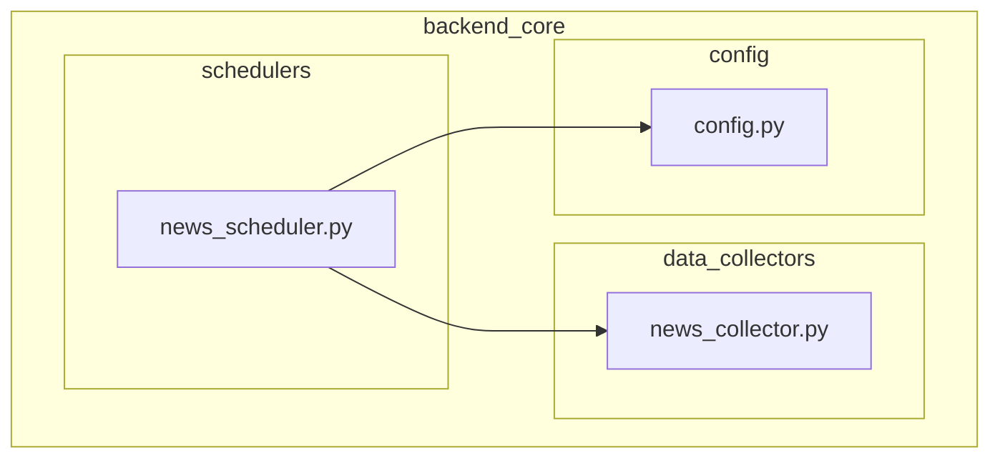
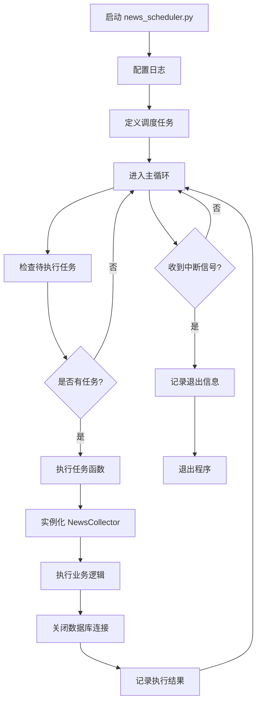
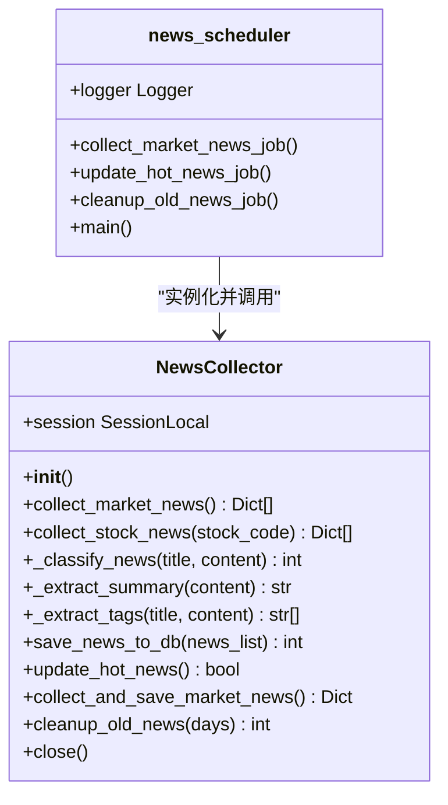
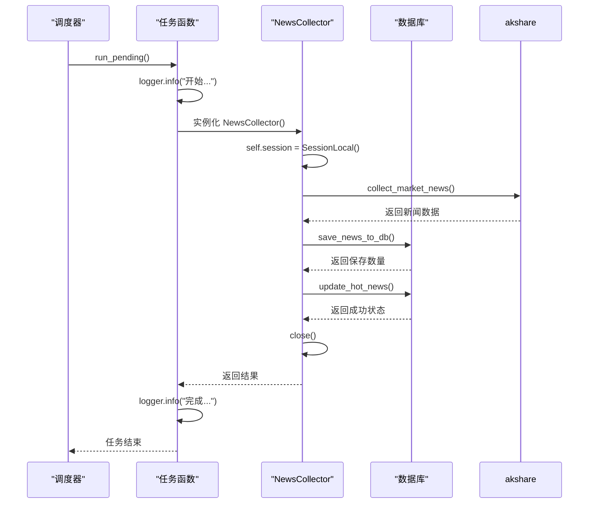
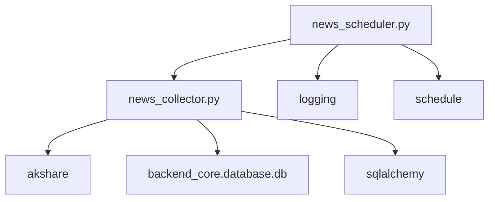

# 新闻调度器

<cite>
**本文档引用的文件**   
- [news_scheduler.py](file://backend_core/schedulers/news_scheduler.py)
- [news_collector.py](file://backend_core/data_collectors/news_collector.py)
- [config.py](file://backend_core/config/config.py)
</cite>

## 目录
1. [简介](#简介)
2. [项目结构](#项目结构)
3. [核心组件](#核心组件)
4. [架构概述](#架构概述)
5. [详细组件分析](#详细组件分析)
6. [依赖分析](#依赖分析)
7. [性能考虑](#性能考虑)
8. [故障排除指南](#故障排除指南)
9. [结论](#结论)

## 简介
本文档深入解析基于 `schedule` 库实现的多任务新闻调度系统，重点阐述 `collect_market_news_job`、`update_hot_news_job` 和 `cleanup_old_news_job` 三大核心任务的触发机制与执行逻辑。系统通过定时调度策略，每30分钟采集市场新闻、每小时更新热门资讯、每日凌晨2点清理过期新闻，保障资讯数据的实时性与存储效率。文档涵盖 `NewsCollector` 组件的完整生命周期管理（初始化-执行-关闭）、日志记录配置（`news_collector.log`）以及 `KeyboardInterrupt` 中断处理机制。同时，分析 `main` 函数中的异常恢复设计、任务冲突规避策略，并提供通过 `config.py` 调整采集频率的配置方法。

## 项目结构
该新闻调度系统是 `backend_core` 模块的一部分，其结构清晰，职责分明。核心调度逻辑位于 `schedulers` 目录下的 `news_scheduler.py` 文件中，它依赖于 `data_collectors` 目录中的 `news_collector.py` 来执行具体的新闻采集、处理和数据库操作。配置信息则由 `config` 目录下的 `config.py` 文件统一管理。



**Diagram sources**
- [news_scheduler.py](file://backend_core/schedulers/news_scheduler.py#L1-L112)
- [news_collector.py](file://backend_core/data_collectors/news_collector.py#L1-L429)
- [config.py](file://backend_core/config/config.py#L1-L48)

**Section sources**
- [news_scheduler.py](file://backend_core/schedulers/news_scheduler.py#L1-L112)
- [news_collector.py](file://backend_core/data_collectors/news_collector.py#L1-L429)
- [config.py](file://backend_core/config/config.py#L1-L48)

## 核心组件
本系统的核心组件是 `NewsCollector` 类，它封装了所有与新闻数据相关的业务逻辑。该组件负责从 `akshare` 数据源采集市场新闻和个股新闻，对新闻内容进行分类、摘要提取和标签生成，然后将处理后的数据持久化到数据库中。此外，它还提供了更新热门资讯标记和清理过期新闻的功能。`news_scheduler.py` 文件中的调度任务通过实例化 `NewsCollector` 来驱动这些功能的执行。

**Section sources**
- [news_collector.py](file://backend_core/data_collectors/news_collector.py#L15-L429)
- [news_scheduler.py](file://backend_core/schedulers/news_scheduler.py#L1-L112)

## 架构概述
该系统采用简单的任务调度架构。`news_scheduler.py` 作为主控程序，利用 `schedule` 库的轻量级调度能力，根据预设的时间表周期性地调用 `NewsCollector` 的方法。`NewsCollector` 作为数据处理引擎，负责与外部数据源（`akshare`）和内部数据库进行交互。整个流程是线性的：调度器触发任务 -> 创建 `NewsCollector` 实例 -> 执行具体操作（采集、更新、清理）-> 关闭数据库连接 -> 任务结束。这种设计确保了任务的独立性和资源的及时释放。



**Diagram sources**
- [news_scheduler.py](file://backend_core/schedulers/news_scheduler.py#L1-L112)
- [news_collector.py](file://backend_core/data_collectors/news_collector.py#L15-L429)

## 详细组件分析

### 核心调度任务分析
`news_scheduler.py` 文件定义了三个核心调度任务，它们共同构成了资讯系统的数据流转闭环。

#### 调度任务类图


**Diagram sources**
- [news_collector.py](file://backend_core/data_collectors/news_collector.py#L15-L429)
- [news_scheduler.py](file://backend_core/schedulers/news_scheduler.py#L1-L112)

#### 任务执行时序图


**Diagram sources**
- [news_scheduler.py](file://backend_core/schedulers/news_scheduler.py#L25-L38)
- [news_collector.py](file://backend_core/data_collectors/news_collector.py#L20-L180)

### NewsCollector 生命周期与日志分析
`NewsCollector` 组件的生命周期严格遵循“初始化-执行-关闭”的模式。在 `__init__` 方法中，它会创建一个数据库会话（`SessionLocal`），这是与数据库交互的唯一通道。在执行完所有业务逻辑后，`close` 方法会被调用，确保数据库会话被正确关闭，防止资源泄露。日志系统通过 `logging` 模块配置，输出到 `news_collector.log` 文件和控制台，日志级别为 `INFO`，格式包含时间戳、模块名、日志级别和消息内容，便于问题追踪和系统监控。

**Section sources**
- [news_collector.py](file://backend_core/data_collectors/news_collector.py#L15-L30)
- [news_scheduler.py](file://backend_core/schedulers/news_scheduler.py#L10-L20)

### 异常处理与中断机制分析
`main` 函数实现了稳健的异常恢复设计。主循环 `while True` 中，`schedule.run_pending()` 被包裹在 `try-except` 块中。它能捕获 `KeyboardInterrupt` 异常（如用户按 `Ctrl+C`），优雅地记录退出信息并终止程序。同时，它还能捕获其他未预期的异常，记录错误日志，并在等待60秒后继续循环，确保单个任务的失败不会导致整个调度器崩溃，体现了高可用性设计。

```mermaid
flowchart TD
A[开始运行定时任务] --> B[run_pending()]
B --> C{发生异常?}
C --> |KeyboardInterrupt| D[记录退出信息]
D --> E[退出循环]
C --> |其他异常| F[记录错误日志]
F --> G[等待60秒]
G --> B
C --> |无异常| H[继续循环]
H --> B
E --> I[程序结束]
```

**Diagram sources**
- [news_scheduler.py](file://backend_core/schedulers/news_scheduler.py#L90-L105)

## 依赖分析
该系统的主要依赖关系如下：`news_scheduler.py` 依赖于 `news_collector.py` 提供的 `NewsCollector` 类来执行具体的数据操作。`news_collector.py` 本身又依赖于 `akshare` 库来获取新闻数据，以及 `sqlalchemy` 和 `backend_core.database.db` 来进行数据库操作。配置文件 `config.py` 为系统提供了路径和参数配置，但 `news_scheduler.py` 并未直接使用它，这表明当前的调度频率是硬编码的。



**Diagram sources**
- [news_scheduler.py](file://backend_core/schedulers/news_scheduler.py#L1-L112)
- [news_collector.py](file://backend_core/data_collectors/news_collector.py#L1-L429)

**Section sources**
- [news_scheduler.py](file://backend_core/schedulers/news_scheduler.py#L1-L112)
- [news_collector.py](file://backend_core/data_collectors/news_collector.py#L1-L429)

## 性能考虑
系统的性能主要受数据源响应速度和数据库操作效率的影响。调度器每分钟检查一次任务，对于每30分钟执行一次的任务，这种检查频率是合理的。`NewsCollector` 在每次任务执行时都会创建和关闭数据库会话，虽然保证了独立性，但在高频率任务中可能会产生开销。建议对于更频繁的任务，可以考虑使用长连接或连接池。清理旧新闻任务通过单条 `DELETE` SQL 语句完成，效率较高。

## 故障排除指南
- **问题：** `news_collector.log` 中出现 `akshare返回空数据`。
  - **原因：** `akshare` API 暂时不可用或网络问题。
  - **解决：** 检查网络连接，稍后重试，或查看 `akshare` 官方文档确认服务状态。
- **问题：** 日志中频繁出现 `保存单条新闻失败`。
  - **原因：** 数据库连接异常或数据约束冲突。
  - **解决：** 检查数据库服务是否正常运行，确认 `stock_news` 表结构是否正确。
- **问题：** 调度器进程意外退出。
  - **原因：** 可能是未捕获的致命异常或系统资源不足。
  - **解决：** 查看日志末尾的错误信息，检查系统资源（内存、磁盘），并确保 `main` 函数的异常处理覆盖了所有可能的错误路径。

**Section sources**
- [news_scheduler.py](file://backend_core/schedulers/news_scheduler.py#L90-L105)
- [news_collector.py](file://backend_core/data_collectors/news_collector.py#L20-L180)

## 结论
`news_scheduler.py` 实现了一个稳定、可靠的多任务资讯调度系统。它通过清晰的职责划分和稳健的异常处理，确保了市场新闻的持续采集、热门资讯的及时更新以及过期数据的有效清理。`NewsCollector` 组件的设计合理，封装了复杂的业务逻辑，使得调度器可以专注于任务的编排。尽管当前的调度频率是硬编码的，但其模块化的设计为未来通过 `config.py` 进行动态配置提供了良好的基础。整体系统架构简洁高效，是后端数据自动化处理的典范。