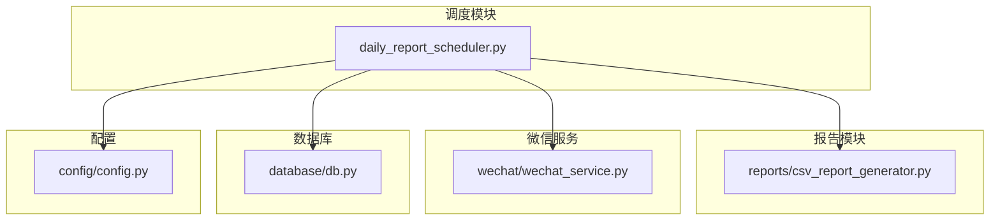
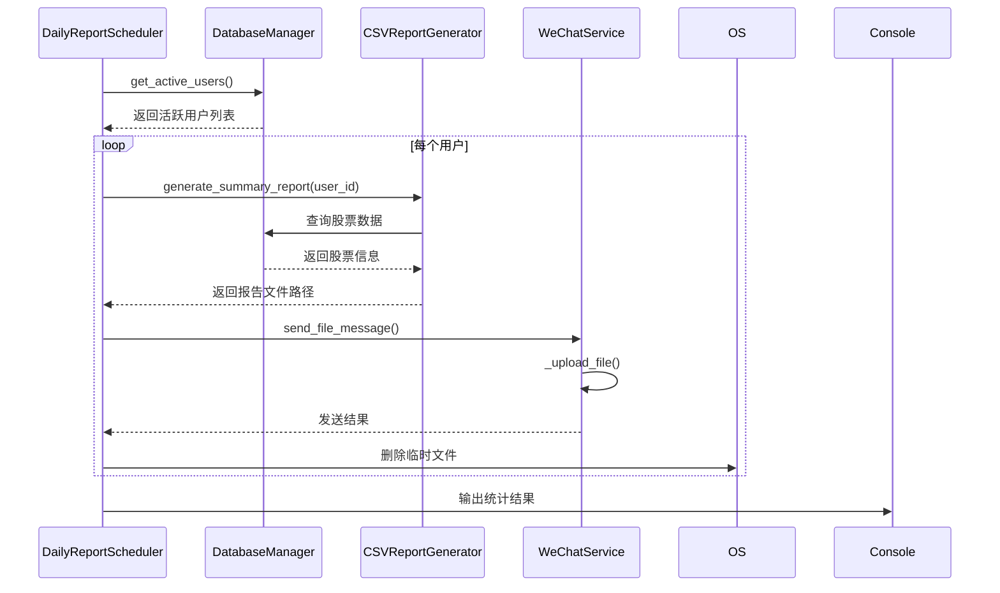
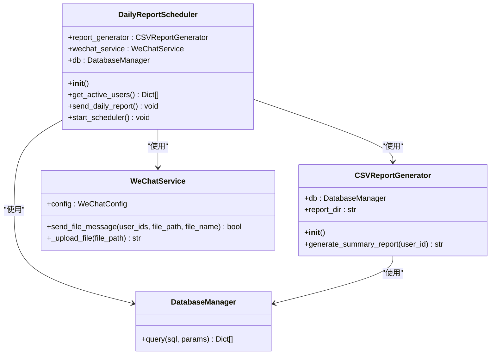
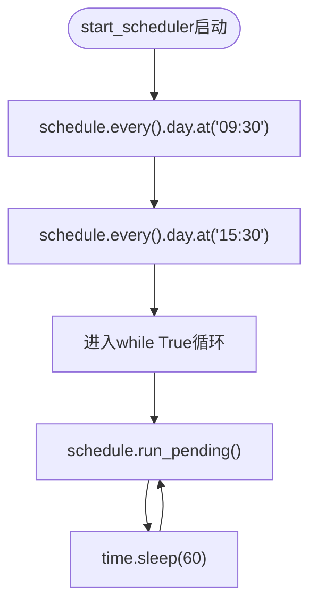
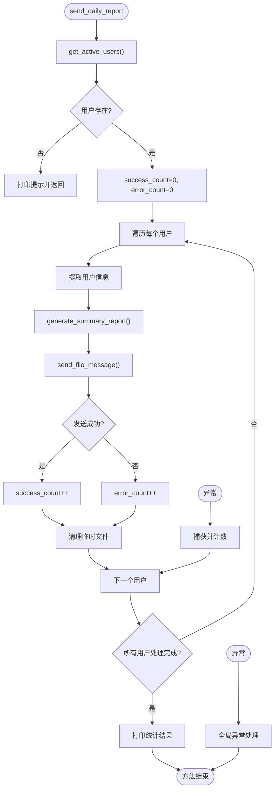
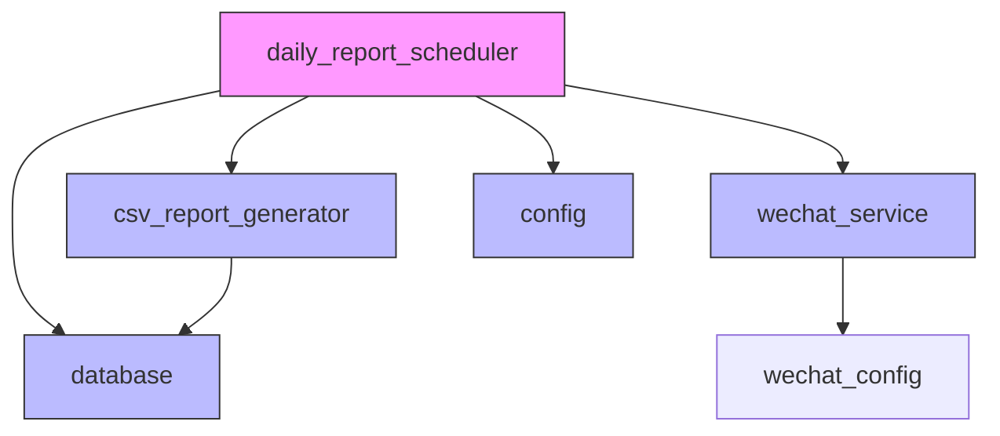
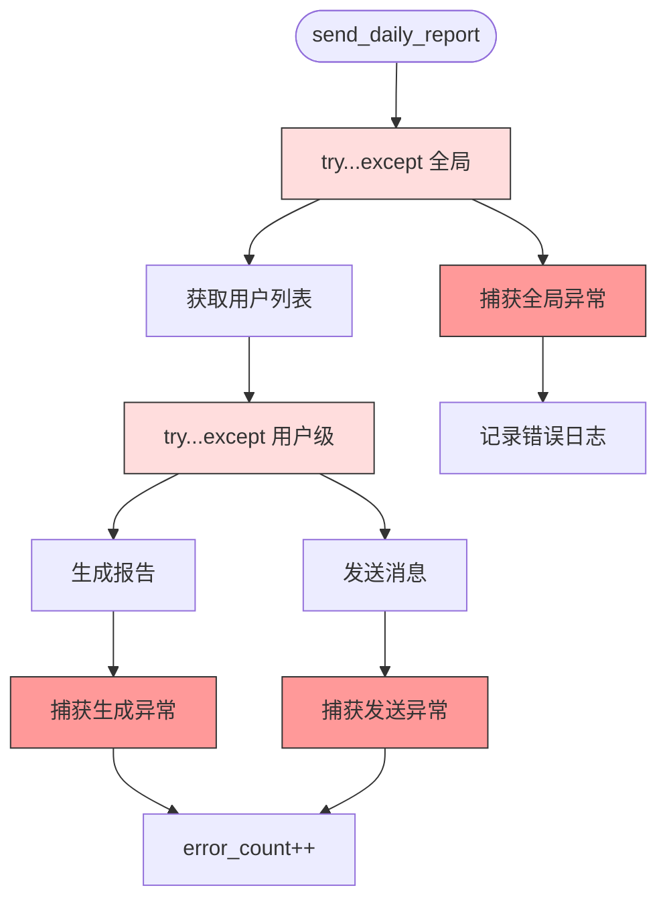

# 日报调度器

<cite>
**本文档引用文件**  
- [daily_report_scheduler.py](file://backend_core/scheduler/daily_report_scheduler.py)
- [csv_report_generator.py](file://backend_core/reports/csv_report_generator.py)
- [wechat_service.py](file://backend_core/wechat/wechat_service.py)
- [db.py](file://backend_core/database/db.py)
- [config.py](file://backend_core/config/config.py)
</cite>

## 目录
1. [简介](#简介)
2. [项目结构](#项目结构)
3. [核心组件](#核心组件)
4. [架构概览](#架构概览)
5. [详细组件分析](#详细组件分析)
6. [依赖分析](#依赖分析)
7. [性能考虑](#性能考虑)
8. [故障排查指南](#故障排查指南)
9. [结论](#结论)

## 简介
本系统实现了一个基于定时任务的股票日报自动发送机制，通过`DailyReportScheduler`类协调报告生成、消息推送和用户管理三大核心功能。系统每日在09:30和15:30两个关键时间点自动执行，分别对应股市开盘前与收盘后，为用户提供及时的股票持仓分析报告。

## 项目结构
系统采用模块化设计，各功能组件分布清晰，职责明确。



**Diagram sources **  
- [daily_report_scheduler.py](file://backend_core/scheduler/daily_report_scheduler.py#L1-L98)
- [csv_report_generator.py](file://backend_core/reports/csv_report_generator.py#L1-L176)
- [wechat_service.py](file://backend_core/wechat/wechat_service.py#L1-L71)
- [db.py](file://backend_core/database/db.py#L1-L32)
- [config.py](file://backend_core/config/config.py#L1-L47)

**Section sources**
- [daily_report_scheduler.py](file://backend_core/scheduler/daily_report_scheduler.py#L1-L98)

## 核心组件
`DailyReportScheduler`类是整个日报系统的控制中枢，负责协调报告生成、用户筛选、消息推送和异常处理等全流程。该类通过依赖注入方式整合了`CSVReportGenerator`、`WeChatService`和`DatabaseManager`三个核心服务，实现了高内聚、低耦合的设计目标。

**Section sources**
- [daily_report_scheduler.py](file://backend_core/scheduler/daily_report_scheduler.py#L8-L97)

## 架构概览
系统采用分层架构设计，各组件协同工作完成日报发送任务。



**Diagram sources **  
- [daily_report_scheduler.py](file://backend_core/scheduler/daily_report_scheduler.py#L8-L97)
- [csv_report_generator.py](file://backend_core/reports/csv_report_generator.py#L8-L176)
- [wechat_service.py](file://backend_core/wechat/wechat_service.py#L8-L71)

## 详细组件分析

### DailyReportScheduler 类分析
`DailyReportScheduler`类实现了完整的日报调度逻辑，包含用户筛选、报告生成、消息推送和资源清理等关键功能。

#### 类结构与依赖关系


**Diagram sources **  
- [daily_report_scheduler.py](file://backend_core/scheduler/daily_report_scheduler.py#L8-L97)
- [csv_report_generator.py](file://backend_core/reports/csv_report_generator.py#L8-L176)
- [wechat_service.py](file://backend_core/wechat/wechat_service.py#L8-L71)

#### 任务调度机制
系统通过`schedule`库实现定时任务调度，在每天09:30和15:30执行日报发送任务。



**Diagram sources **  
- [daily_report_scheduler.py](file://backend_core/scheduler/daily_report_scheduler.py#L75-L97)

**Section sources**
- [daily_report_scheduler.py](file://backend_core/scheduler/daily_report_scheduler.py#L75-L97)

### send_daily_report 方法流程分析
该方法协调多个组件完成完整的日报发送流程。



**Diagram sources **  
- [daily_report_scheduler.py](file://backend_core/scheduler/daily_report_scheduler.py#L35-L73)

**Section sources**
- [daily_report_scheduler.py](file://backend_core/scheduler/daily_report_scheduler.py#L35-L73)

### 活跃用户筛选逻辑
系统通过SQL查询筛选出需要接收日报的活跃用户。

```mermaid
erDiagram
USERS ||--o{ USER_WATCHLIST : "拥有"
USERS {
int user_id PK
string username
string wechat_user_id
boolean is_active
}
USER_WATCHLIST {
int user_id FK
string stock_code
boolean is_active
}
note right of USERS
筛选条件:
- is_active = 1
- wechat_user_id 非空
end note
note right of USER_WATCHLIST
筛选条件:
- is_active = 1
end note
```

**Diagram sources **  
- [daily_report_scheduler.py](file://backend_core/scheduler/daily_report_scheduler.py#L15-L27)

## 依赖分析
系统各组件之间存在明确的依赖关系，形成了清晰的服务调用链。



**Diagram sources **  
- [daily_report_scheduler.py](file://backend_core/scheduler/daily_report_scheduler.py#L1-L98)
- [csv_report_generator.py](file://backend_core/reports/csv_report_generator.py#L1-L176)
- [wechat_service.py](file://backend_core/wechat/wechat_service.py#L1-L71)
- [db.py](file://backend_core/database/db.py#L1-L32)
- [config.py](file://backend_core/config/config.py#L1-L47)

**Section sources**
- [daily_report_scheduler.py](file://backend_core/scheduler/daily_report_scheduler.py#L1-L98)

## 性能考虑
系统在设计时考虑了多个性能和稳定性因素：

1. **轮询间隔**：`start_scheduler`中每分钟轮询一次，平衡了及时性与系统资源消耗
2. **数据库连接**：通过连接池配置优化数据库访问性能
3. **文件清理**：及时删除临时报告文件，避免磁盘空间耗尽
4. **异常隔离**：单个用户处理失败不影响其他用户，提高整体成功率

## 故障排查指南
系统实现了完善的错误处理机制，便于问题定位和排查。



**Diagram sources **  
- [daily_report_scheduler.py](file://backend_core/scheduler/daily_report_scheduler.py#L35-L73)

**Section sources**
- [daily_report_scheduler.py](file://backend_core/scheduler/daily_report_scheduler.py#L35-L73)

## 结论
`DailyReportScheduler`系统通过模块化设计和清晰的职责划分，实现了可靠的日报自动发送功能。系统具备良好的扩展性，可通过配置文件轻松调整调度时间，同时完善的错误处理机制确保了系统的稳定性。建议未来可增加失败重试机制和更详细的监控指标，进一步提升系统可靠性。