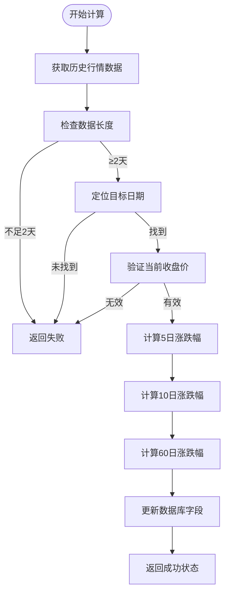
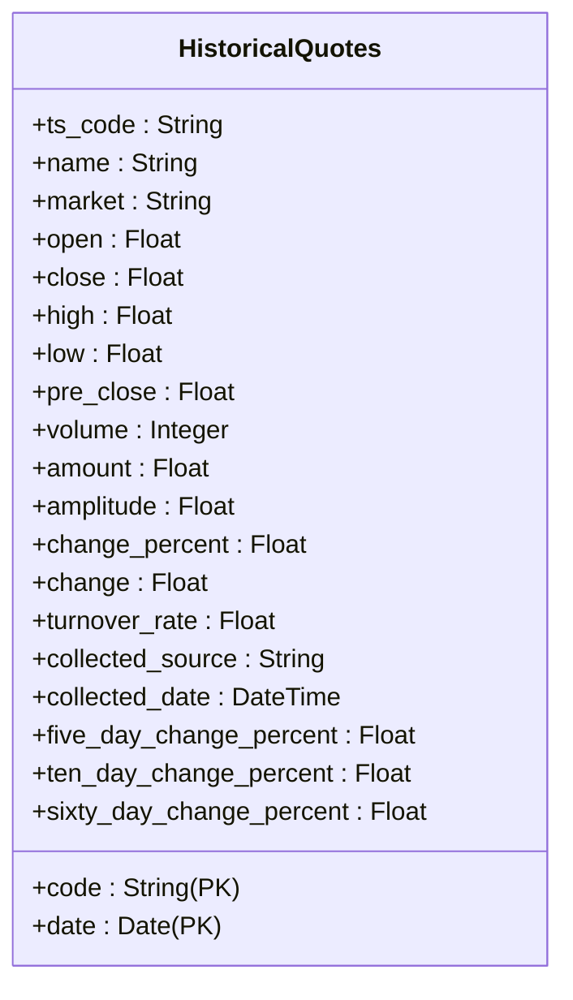
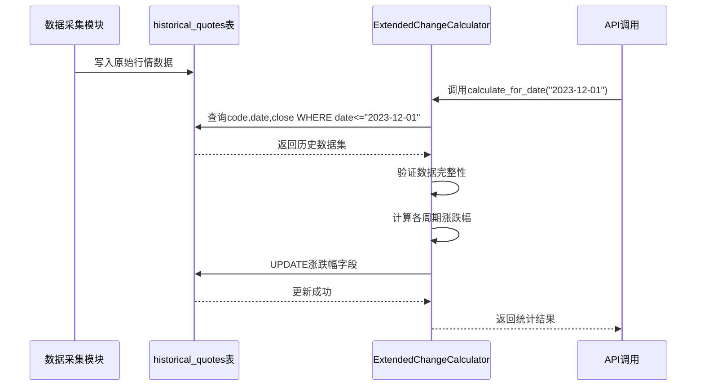
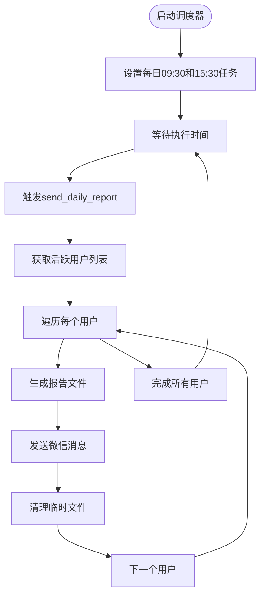

# 分析计算引擎

<cite>
**本文档引用的文件**  
- [five_day_change_calculator.py](file://backend_core/data_collectors/tushare/five_day_change_calculator.py)
- [extended_change_calculator.py](file://backend_core/data_collectors/tushare/extended_change_calculator.py)
- [historical_quotes.py](file://backend_core/models/historical_quotes.py)
- [csv_report_generator.py](file://backend_core/reports/csv_report_generator.py)
- [daily_report_scheduler.py](file://backend_core/scheduler/daily_report_scheduler.py)
</cite>

## 目录
1. [引言](#引言)
2. [核心计算模块](#核心计算模块)
3. [数据模型与技术指标推导](#数据模型与技术指标推导)
4. [报告生成机制](#报告生成机制)
5. [调度系统集成](#调度系统集成)
6. [性能优化与边界处理](#性能优化与边界处理)
7. [结果验证策略](#结果验证策略)
8. [总结](#总结)

## 引言
本文档深入解析 `backend_core` 模块中的分析计算能力，重点阐述 `five_day_change_calculator.py` 和 `extended_change_calculator.py` 中实现的股价变动率计算逻辑，以及如何基于 `historical_quotes.py` 模型进行技术指标推导。同时说明 `csv_report_generator.py` 如何生成结构化分析报告，并展示其在 `daily_report_scheduler.py` 中的集成方式。文档涵盖从原始行情数据到分析结果的完整流程，包括数据预处理、指标计算和结果输出。

## 核心计算模块

### 五日涨跌幅计算逻辑
`FiveDayChangeCalculator` 类负责为指定日期的所有股票计算5日涨跌幅。其核心流程如下：

1. **目标股票筛选**：查询在目标日期存在历史数据但尚未计算5日涨跌幅的股票。
2. **数据获取**：从数据库中提取该股票截至目标日期的所有历史收盘价数据。
3. **边界条件检查**：确保数据长度不少于6天，且目标日期在数据序列中存在且位置至少为第6个。
4. **涨跌幅计算**：使用公式 `((当前收盘价 - 5日前收盘价) / 5日前收盘价) * 100` 计算百分比变化。
5. **结果更新**：将计算结果四舍五入至两位小数后写入数据库。

该类支持单日计算与批量日期范围计算，具备完善的日志记录和异常处理机制。

**Section sources**
- [five_day_change_calculator.py](file://backend_core/data_collectors/tushare/five_day_change_calculator.py#L1-L297)

### 扩展涨跌幅计算逻辑
`ExtendedChangeCalculator` 类扩展了基础功能，支持5日、10日、60日三种周期的涨跌幅计算。其主要特点包括：

1. **多周期并行计算**：在一个事务中同时计算多个周期的涨跌幅。
2. **灵活的数据要求**：不要求所有周期都满足最长周期（60天）的数据长度，允许部分计算成功。
3. **分层判断机制**：
   - 5日涨跌幅：需至少6天数据
   - 10日涨跌幅：需至少11天数据
   - 60日涨跌幅：需至少61天数据
4. **部分成功策略**：即使某些周期无法计算，只要至少一个周期成功即视为整体成功。
5. **字段统一更新**：通过一条SQL语句批量更新三个涨跌幅字段，提高数据库操作效率。

**Diagram sources**
- [extended_change_calculator.py](file://backend_core/data_collectors/tushare/extended_change_calculator.py#L1-L383)

**Section sources**
- [extended_change_calculator.py](file://backend_core/data_collectors/tushare/extended_change_calculator.py#L1-L383)

## 数据模型与技术指标推导

### 历史行情数据模型
`HistoricalQuotes` 模型定义了存储股票历史行情的核心数据结构，关键字段包括：

- **code**: 股票代码（主键）
- **date**: 交易日期（主键）
- **open/close/high/low**: 开盘价、收盘价、最高价、最低价
- **volume/amount**: 成交量、成交额
- **change_percent**: 单日涨跌幅
- **five_day_change_percent**: 5日累计涨跌幅
- **ten_day_change_percent**: 10日累计涨跌幅
- **sixty_day_change_percent**: 60日累计涨跌幅

该模型采用复合主键（code + date），确保每只股票每天只有一条记录。

**Diagram sources**
- [historical_quotes.py](file://backend_core/models/historical_quotes.py#L1-L27)

**Section sources**
- [historical_quotes.py](file://backend_core/models/historical_quotes.py#L1-L27)

### 技术指标推导流程
从原始数据到技术指标的完整推导流程如下：

**Diagram sources**
- [historical_quotes.py](file://backend_core/models/historical_quotes.py#L1-L27)
- [extended_change_calculator.py](file://backend_core/data_collectors/tushare/extended_change_calculator.py#L1-L383)

## 报告生成机制

### CSV报告生成器
`CSVReportGenerator` 类负责生成结构化的分析报告，主要功能包括：

1. **用户自选股获取**：根据用户ID查询其关注的股票列表。
2. **数据查询服务**：
   - `get_stock_summary_data`: 获取最新行情摘要
   - `get_stock_history_data`: 获取指定天数的历史数据
3. **报告类型**：
   - **汇总报告**：生成包含最新价格、涨跌幅等信息的CSV文件
   - **详细报告**：生成包含历史数据的Excel文件，含“历史数据”和“股票汇总”两个工作表

报告文件命名规范为 `stock_summary_{user_id}_{timestamp}.csv` 或 `stock_report_{user_id}_{timestamp}.xlsx`，并自动创建报告目录。

**Section sources**
- [csv_report_generator.py](file://backend_core/reports/csv_report_generator.py#L1-L175)

## 调度系统集成

### 日报调度器
`DailyReportScheduler` 实现了自动化报告发送机制，其工作流程如下：

1. **定时任务配置**：
   - 每日上午9:30（开盘前）
   - 每日下午15:30（收盘后）
2. **用户筛选**：查询活跃用户及其微信ID。
3. **报告生成与发送**：
   - 调用 `CSVReportGenerator.generate_summary_report`
   - 通过 `WeChatService.send_file_message` 发送文件
4. **资源清理**：发送后立即删除临时生成的报告文件。

**Diagram sources**
- [daily_report_scheduler.py](file://backend_core/scheduler/daily_report_scheduler.py#L1-L98)

**Section sources**
- [daily_report_scheduler.py](file://backend_core/scheduler/daily_report_scheduler.py#L1-L98)

## 性能优化与边界处理

### 计算性能优化策略
- **批量处理**：提供 `calculate_batch_for_date_range` 方法支持日期范围批量计算。
- **数据库优化**：使用参数化SQL查询防止注入，通过 `DISTINCT code` 减少重复计算。
- **内存效率**：逐只股票处理而非一次性加载所有数据，降低内存占用。
- **事务管理**：每个股票的计算独立进行，避免长事务锁定。

### 边界条件处理
- **数据不足**：当历史数据少于所需天数时跳过计算。
- **空值处理**：检查收盘价是否为 `None` 或非正数。
- **日期匹配**：确保目标日期存在于历史数据中。
- **异常捕获**：每个股票的计算都包裹在 `try-catch` 中，防止单个错误影响整体流程。
- **进度追踪**：提供 `get_calculation_status` 方法实时监控计算完成率。

**Section sources**
- [five_day_change_calculator.py](file://backend_core/data_collectors/tushare/five_day_change_calculator.py#L1-L297)
- [extended_change_calculator.py](file://backend_core/data_collectors/tushare/extended_change_calculator.py#L1-L383)

## 结果验证策略

### 准确性验证方法
- **日志审计**：详细记录每只股票的计算过程和结果。
- **状态查询**：通过 `get_calculation_status` 验证特定日期的计算完成率。
- **数据一致性**：对比手动计算结果与系统输出。
- **单元测试**：对核心计算逻辑进行边界值和异常情况测试。
- **完整性检查**：确保所有应计算的记录最终都有非空的涨跌幅值。

### 监控与告警
- **成功/失败统计**：返回详细的统计信息，包括总数、成功数、失败详情。
- **错误详情记录**：失败原因具体到股票代码级别。
- **时间戳跟踪**：所有操作均有时间记录，便于问题追溯。

**Section sources**
- [five_day_change_calculator.py](file://backend_core/data_collectors/tushare/five_day_change_calculator.py#L1-L297)
- [extended_change_calculator.py](file://backend_core/data_collectors/tushare/extended_change_calculator.py#L1-L383)

## 总结
本系统构建了一个完整的股价变动率分析计算引擎，实现了从原始行情数据采集、多周期技术指标计算、结构化报告生成到自动化调度发送的全流程。通过模块化设计和严谨的边界处理，确保了计算的准确性与系统的稳定性。未来可扩展更多技术指标（如移动平均线、布林带等），并支持更灵活的报告模板配置。