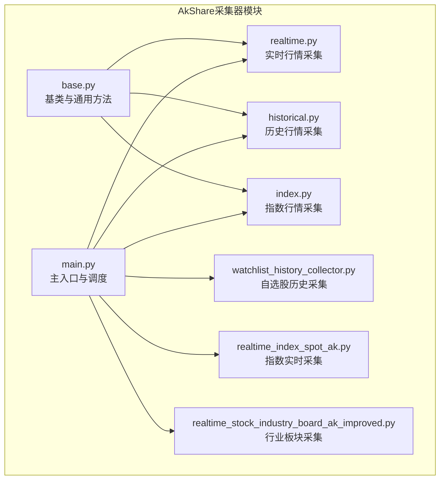
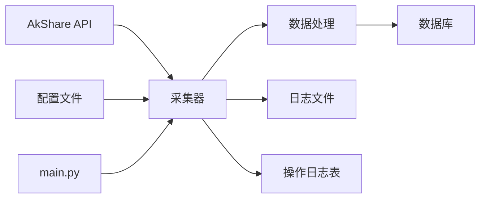
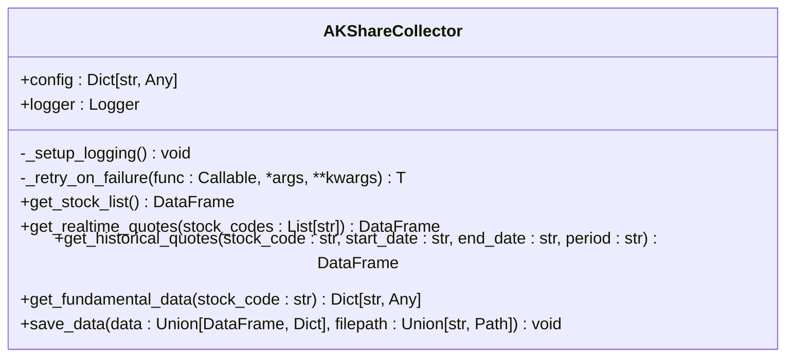
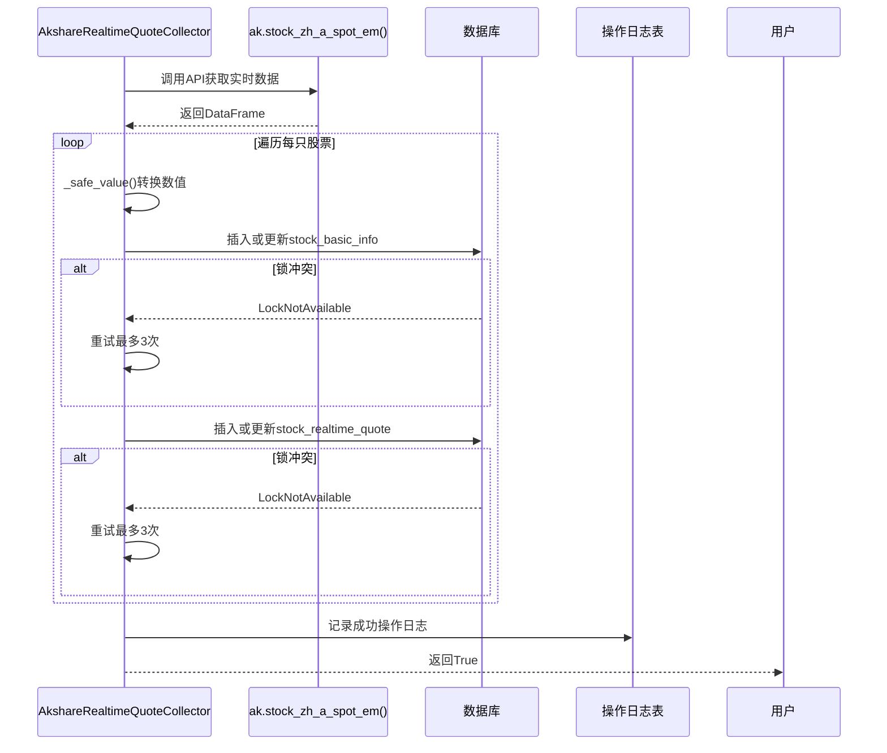
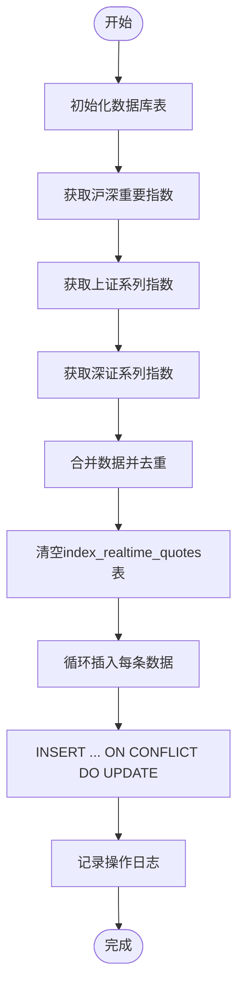
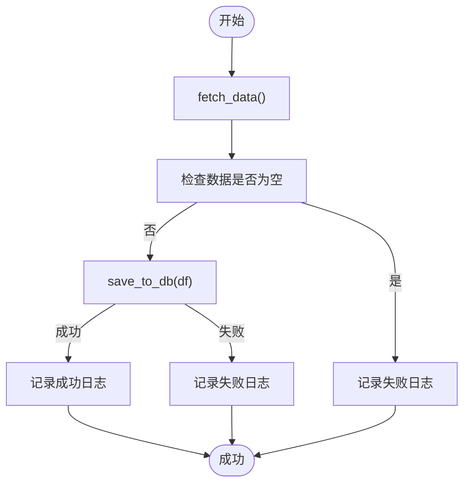
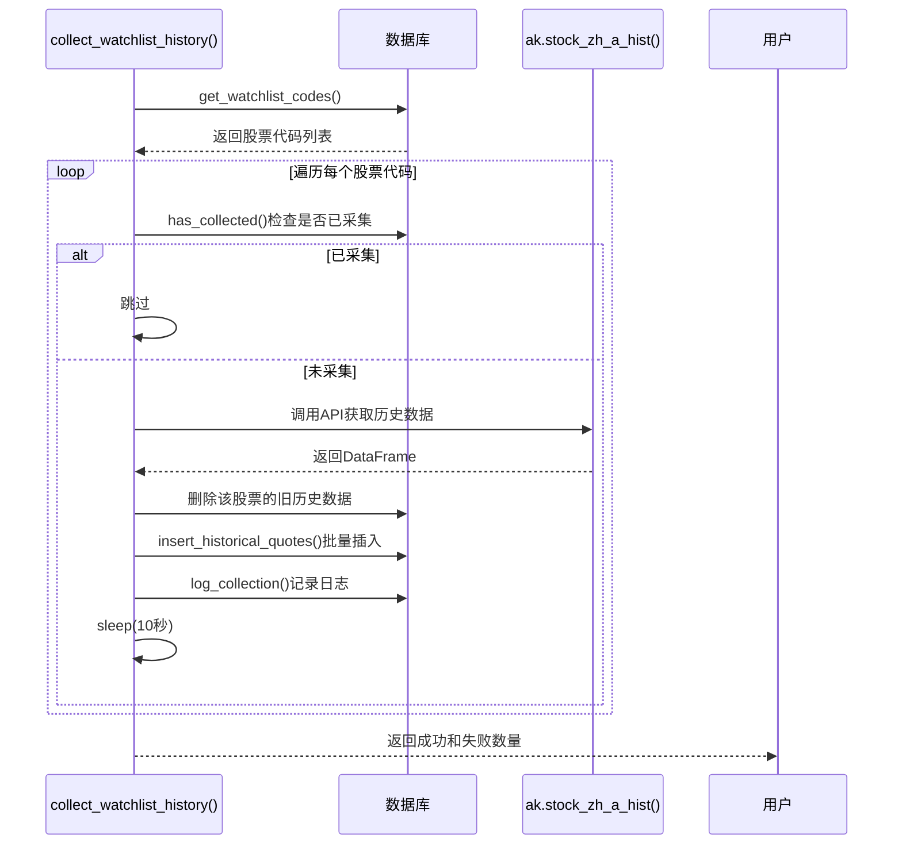
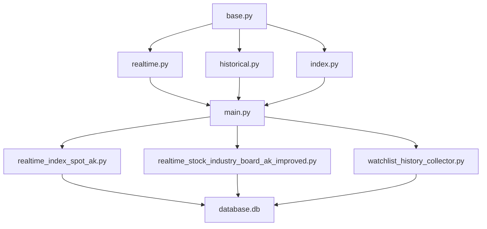

# AkShare数据采集器

<cite>
**本文档引用的文件**
- [base.py](file://backend_core/data_collectors/akshare/base.py)
- [realtime.py](file://backend_core/data_collectors/akshare/realtime.py)
- [realtime_index_spot_ak.py](file://backend_core/data_collectors/akshare/realtime_index_spot_ak.py)
- [realtime_stock_industry_board_ak_improved.py](file://backend_core/data_collectors/akshare/realtime_stock_industry_board_ak_improved.py)
- [watchlist_history_collector.py](file://backend_core/data_collectors/akshare/watchlist_history_collector.py)
- [main.py](file://backend_core/data_collectors/akshare/main.py)
</cite>

## 目录
1. [引言](#引言)
2. [项目结构](#项目结构)
3. [核心组件](#核心组件)
4. [架构概览](#架构概览)
5. [详细组件分析](#详细组件分析)
6. [依赖分析](#依赖分析)
7. [性能考量](#性能考量)
8. [故障排除指南](#故障排除指南)
9. [结论](#结论)

## 引言
本文档全面记录了基于AkShare的数据采集器实现。重点说明了`base.py`中定义的采集器基类如何提供统一接口规范，`realtime.py`中实时行情采集的实现逻辑与性能优化策略，`realtime_index_spot_ak.py`中的指数实时数据采集机制，以及`realtime_stock_industry_board_ak_improved.py`中针对行业板块数据的改进型采集算法。同时阐述了`watchlist_history_collector.py`如何实现自选股历史数据的批量采集与错误重试机制，并结合`main.py`中的定时任务配置，说明各采集器的调用时机与调度策略。此外，还提供了采集频率控制、异常处理、数据清洗和质量验证的具体实现，并通过测试用例验证关键路径的可靠性。

## 项目结构
`backend_core/data_collectors/akshare/`目录是AkShare数据采集器的核心实现区域，包含多个模块化采集器，分别负责不同类型的数据采集任务。该目录下的`base.py`提供了所有采集器共享的基类和通用功能，而`realtime.py`、`historical.py`等文件则实现了特定类型数据的采集逻辑。`main.py`作为入口文件，负责调度和运行这些采集任务。

**Diagram sources**
- [base.py](file://backend_core/data_collectors/akshare/base.py)
- [realtime.py](file://backend_core/data_collectors/akshare/realtime.py)
- [realtime_index_spot_ak.py](file://backend_core/data_collectors/akshare/realtime_index_spot_ak.py)
- [realtime_stock_industry_board_ak_improved.py](file://backend_core/data_collectors/akshare/realtime_stock_industry_board_ak_improved.py)
- [watchlist_history_collector.py](file://backend_core/data_collectors/akshare/watchlist_history_collector.py)
- [main.py](file://backend_core/data_collectors/akshare/main.py)

**Section sources**
- [base.py](file://backend_core/data_collectors/akshare/base.py)
- [realtime.py](file://backend_core/data_collectors/akshare/realtime.py)
- [realtime_index_spot_ak.py](file://backend_core/data_collectors/akshare/realtime_index_spot_ak.py)
- [realtime_stock_industry_board_ak_improved.py](file://backend_core/data_collectors/akshare/realtime_stock_industry_board_ak_improved.py)
- [watchlist_history_collector.py](file://backend_core/data_collectors/akshare/watchlist_history_collector.py)
- [main.py](file://backend_core/data_collectors/akshare/main.py)

## 核心组件
本系统的核心组件是`AKShareCollector`基类，它定义了所有数据采集器的统一接口和通用功能，如日志记录、失败重试机制和数据保存。基于此基类，实现了多个具体的采集器，如`AkshareRealtimeQuoteCollector`用于实时行情采集，`RealtimeIndexSpotAkCollector`用于指数实时数据采集，以及`ImprovedRealtimeStockIndustryBoardCollector`用于行业板块数据采集。此外，`collect_watchlist_history`函数实现了自选股历史数据的批量采集。

**Section sources**
- [base.py](file://backend_core/data_collectors/akshare/base.py#L25-L231)
- [realtime.py](file://backend_core/data_collectors/akshare/realtime.py#L25-L262)
- [realtime_index_spot_ak.py](file://backend_core/data_collectors/akshare/realtime_index_spot_ak.py#L1-L157)
- [realtime_stock_industry_board_ak_improved.py](file://backend_core/data_collectors/akshare/realtime_stock_industry_board_ak_improved.py#L1-L233)
- [watchlist_history_collector.py](file://backend_core/data_collectors/akshare/watchlist_history_collector.py#L1-L135)

## 架构概览
系统采用模块化设计，以`AKShareCollector`基类为核心，通过继承实现功能复用。各具体采集器负责特定数据源的采集逻辑，并通过`main.py`进行统一调度。数据流从AkShare API获取原始数据，经过采集器处理后，最终存储到数据库中。整个过程由配置文件驱动，并通过日志和操作日志表进行监控。

**Diagram sources**
- [base.py](file://backend_core/data_collectors/akshare/base.py#L25-L231)
- [realtime.py](file://backend_core/data_collectors/akshare/realtime.py#L25-L262)
- [main.py](file://backend_core/data_collectors/akshare/main.py#L1-L71)

## 详细组件分析

### AKShareCollector 基类分析
`AKShareCollector`基类为所有数据采集器提供了统一的接口和基础功能。它通过`__init__`方法接收配置，`_setup_logging`方法初始化日志系统，并通过`_retry_on_failure`方法实现核心的失败重试机制。

**Diagram sources**
- [base.py](file://backend_core/data_collectors/akshare/base.py#L25-L231)

**Section sources**
- [base.py](file://backend_core/data_collectors/akshare/base.py#L25-L231)

### 实时行情采集器分析
`AkshareRealtimeQuoteCollector`继承自`AKShareCollector`，专门负责采集沪深京A股的实时行情数据。其核心方法`collect_quotes`实现了从AkShare API获取数据、安全转换数值、处理数据库锁冲突以及记录操作日志的完整流程。

**Diagram sources**
- [realtime.py](file://backend_core/data_collectors/akshare/realtime.py#L25-L262)

**Section sources**
- [realtime.py](file://backend_core/data_collectors/akshare/realtime.py#L25-L262)

### 指数实时数据采集器分析
`RealtimeIndexSpotAkCollector`独立于基类，直接实现了指数实时数据的采集。它通过调用`ak.stock_zh_index_spot_em()`三次，分别获取“沪深重要指数”、“上证系列指数”和“深证系列指数”的数据，并通过`index_spot_type`字段进行区分。

**Diagram sources**
- [realtime_index_spot_ak.py](file://backend_core/data_collectors/akshare/realtime_index_spot_ak.py#L1-L157)

**Section sources**
- [realtime_index_spot_ak.py](file://backend_core/data_collectors/akshare/realtime_index_spot_ak.py#L1-L157)

### 行业板块数据采集器分析
`ImprovedRealtimeStockIndustryBoardCollector`是一个改进型的行业板块采集器，其`run`方法是主入口，依次调用`fetch_data`、`save_to_db`和`write_log`来完成整个采集流程。它特别增加了详细的调试信息输出，便于问题排查。

**Diagram sources**
- [realtime_stock_industry_board_ak_improved.py](file://backend_core/data_collectors/akshare/realtime_stock_industry_board_ak_improved.py#L1-L233)

**Section sources**
- [realtime_stock_industry_board_ak_improved.py](file://backend_core/data_collectors/akshare/realtime_stock_industry_board_ak_improved.py#L1-L233)

### 自选股历史数据采集器分析
`collect_watchlist_history`函数实现了自选股历史数据的批量采集。它首先从`watchlist`表获取所有股票代码，然后对每个未采集过的股票，调用AkShare API获取其历史数据，并通过upsert操作批量插入到`historical_quotes`表中。

**Diagram sources**
- [watchlist_history_collector.py](file://backend_core/data_collectors/akshare/watchlist_history_collector.py#L1-L135)

**Section sources**
- [watchlist_history_collector.py](file://backend_core/data_collectors/akshare/watchlist_history_collector.py#L1-L135)

## 依赖分析
各采集器模块之间存在明确的依赖关系。`realtime.py`、`historical.py`等模块依赖于`base.py`中的`AKShareCollector`基类。`main.py`作为调度中心，依赖于所有具体的采集器模块。`realtime_index_spot_ak.py`和`realtime_stock_industry_board_ak_improved.py`则直接依赖于数据库模块进行数据存储。

**Diagram sources**
- [base.py](file://backend_core/data_collectors/akshare/base.py)
- [realtime.py](file://backend_core/data_collectors/akshare/realtime.py)
- [main.py](file://backend_core/data_collectors/akshare/main.py)
- [realtime_index_spot_ak.py](file://backend_core/data_collectors/akshare/realtime_index_spot_ak.py)
- [realtime_stock_industry_board_ak_improved.py](file://backend_core/data_collectors/akshare/realtime_stock_industry_board_ak_improved.py)
- [watchlist_history_collector.py](file://backend_core/data_collectors/akshare/watchlist_history_collector.py)

**Section sources**
- [base.py](file://backend_core/data_collectors/akshare/base.py)
- [realtime.py](file://backend_core/data_collectors/akshare/realtime.py)
- [main.py](file://backend_core/data_collectors/akshare/main.py)

## 性能考量
系统的性能主要体现在以下几个方面：首先，`_retry_on_failure`机制通过指数退避策略（`retry_delay`）避免了对API的过度请求；其次，`collect_quotes`方法在处理数据库插入时，对`LockNotAvailable`和`DeadlockDetected`异常进行了专门的重试处理，提高了在高并发环境下的稳定性；最后，`collect_watchlist_history`函数在每次采集后`sleep(10)`秒，有效控制了采集频率，防止对AkShare API造成过大压力。

## 故障排除指南
当数据采集失败时，应首先检查日志文件（位于`logs/`目录下）和数据库中的操作日志表（如`realtime_collect_operation_logs`）。对于实时行情采集，常见的错误是数据库锁冲突，系统已内置重试机制。对于自选股历史采集，失败通常源于网络问题或AkShare API返回异常，可通过检查`error_message`字段定位具体原因。若问题持续存在，可运行`main.py`脚本进行手动测试。

**Section sources**
- [base.py](file://backend_core/data_collectors/akshare/base.py#L25-L231)
- [realtime.py](file://backend_core/data_collectors/akshare/realtime.py#L25-L262)
- [watchlist_history_collector.py](file://backend_core/data_collectors/akshare/watchlist_history_collector.py#L1-L135)

## 结论
本文档详细解析了基于AkShare的数据采集器实现。系统通过`AKShareCollector`基类提供了统一的接口和强大的失败重试能力，各具体采集器在此基础上实现了高效、稳定的数据采集。无论是实时行情、指数数据还是自选股历史数据，系统都通过合理的架构设计和错误处理机制，确保了数据的完整性和可靠性。`main.py`作为调度入口，使得这些采集任务可以被自动化地执行，为后续的数据分析和应用提供了坚实的基础。