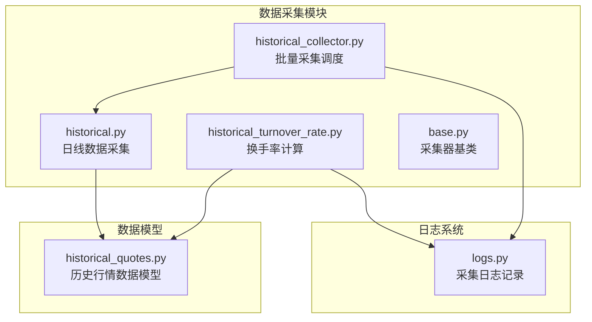
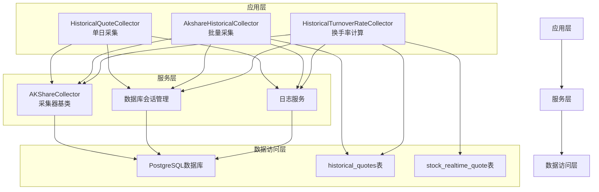
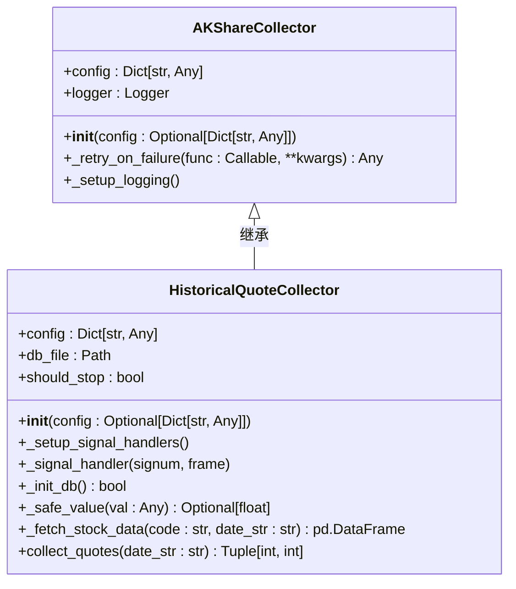
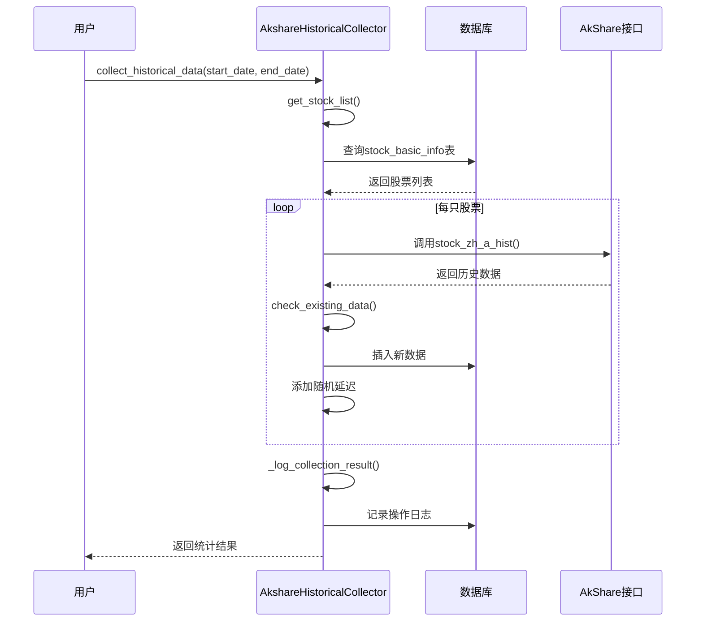
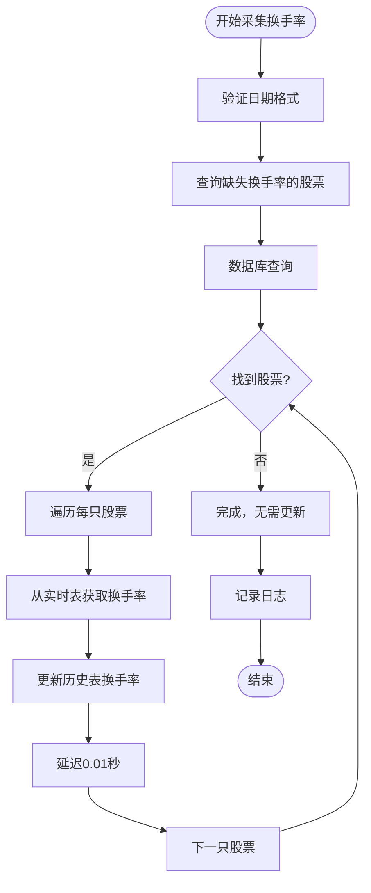
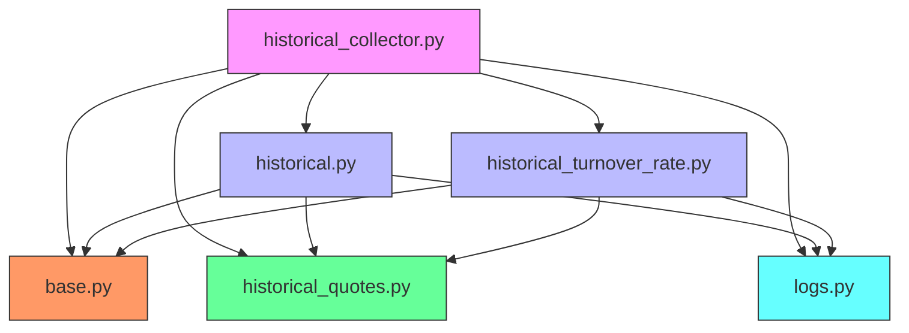

# 历史数据采集

<cite>
**本文档引用的文件**   
- [historical.py](file://backend_core/data_collectors/akshare/historical.py)
- [historical_collector.py](file://backend_core/data_collectors/akshare/historical_collector.py)
- [historical_turnover_rate.py](file://backend_core/data_collectors/akshare/historical_turnover_rate.py)
- [historical_quotes.py](file://backend_core/models/historical_quotes.py)
- [base.py](file://backend_core/data_collectors/akshare/base.py)
- [logs.py](file://backend_api/admin/logs.py)
</cite>

## 目录
1. [简介](#简介)
2. [项目结构](#项目结构)
3. [核心组件](#核心组件)
4. [架构概述](#架构概述)
5. [详细组件分析](#详细组件分析)
6. [依赖分析](#依赖分析)
7. [性能考虑](#性能考虑)
8. [故障排除指南](#故障排除指南)
9. [结论](#结论)

## 简介
本文档全面记录了股票历史数据采集系统的实现机制，重点阐述了基于AkShare接口的历史行情数据采集流程。系统实现了日线、周线、月线等不同周期K线数据的获取与存储，支持批量股票的历史数据调度采集，并提供了换手率等衍生指标的计算逻辑。文档详细说明了数据时间范围控制、分页策略和增量更新机制，以及确保数据一致性的校验方法。通过分析实际调用场景，展示了如何配置采集任务参数，并通过错误日志分析典型问题如数据缺失、接口返回异常等。

## 项目结构
系统的历史数据采集功能主要集中在`backend_core/data_collectors/akshare/`目录下，由多个模块协同工作完成数据采集、处理和存储任务。

**Diagram sources**
- [historical.py](file://backend_core/data_collectors/akshare/historical.py)
- [historical_collector.py](file://backend_core/data_collectors/akshare/historical_collector.py)
- [historical_turnover_rate.py](file://backend_core/data_collectors/akshare/historical_turnover_rate.py)
- [historical_quotes.py](file://backend_core/models/historical_quotes.py)
- [logs.py](file://backend_api/admin/logs.py)

**Section sources**
- [historical.py](file://backend_core/data_collectors/akshare/historical.py)
- [historical_collector.py](file://backend_core/data_collectors/akshare/historical_collector.py)
- [historical_turnover_rate.py](file://backend_core/data_collectors/akshare/historical_turnover_rate.py)

## 核心组件
系统的核心组件包括`HistoricalQuoteCollector`用于单日历史数据采集，`AkshareHistoricalCollector`用于批量历史数据采集，以及`HistoricalTurnoverRateCollector`用于换手率等衍生指标的计算与补充。这些组件共同构成了完整的历史数据采集体系，实现了从数据获取、处理到存储的全流程自动化。

**Section sources**
- [historical.py](file://backend_core/data_collectors/akshare/historical.py#L25-L226)
- [historical_collector.py](file://backend_core/data_collectors/akshare/historical_collector.py#L25-L399)
- [historical_turnover_rate.py](file://backend_core/data_collectors/akshare/historical_turnover_rate.py#L25-L252)

## 架构概述
系统采用分层架构设计，上层为具体的采集器实现，中层为通用的采集器基类，底层为数据库访问和日志记录服务。这种设计实现了功能的解耦和代码的复用，提高了系统的可维护性和扩展性。

**Diagram sources**
- [historical.py](file://backend_core/data_collectors/akshare/historical.py)
- [historical_collector.py](file://backend_core/data_collectors/akshare/historical_collector.py)
- [historical_turnover_rate.py](file://backend_core/data_collectors/akshare/historical_turnover_rate.py)
- [base.py](file://backend_core/data_collectors/akshare/base.py)
- [historical_quotes.py](file://backend_core/models/historical_quotes.py)

## 详细组件分析

### HistoricalQuoteCollector分析
`HistoricalQuoteCollector`是负责采集单日历史行情数据的核心类，继承自`AKShareCollector`基类，实现了对指定日期所有股票日线数据的采集功能。

**Diagram sources**
- [historical.py](file://backend_core/data_collectors/akshare/historical.py#L25-L226)
- [base.py](file://backend_core/data_collectors/akshare/base.py)

**Section sources**
- [historical.py](file://backend_core/data_collectors/akshare/historical.py#L25-L226)

### AkshareHistoricalCollector分析
`AkshareHistoricalCollector`类实现了批量采集历史行情数据的功能，支持指定日期范围内的批量采集，是系统进行大规模历史数据补全的核心组件。

**Diagram sources**
- [historical_collector.py](file://backend_core/data_collectors/akshare/historical_collector.py#L25-L399)

**Section sources**
- [historical_collector.py](file://backend_core/data_collectors/akshare/historical_collector.py#L25-L399)

### HistoricalTurnoverRateCollector分析
`HistoricalTurnoverRateCollector`类负责采集和补充历史换手率数据，从实时数据表中获取换手率信息并补充到历史行情表中，解决了历史数据中换手率缺失的问题。

**Diagram sources**
- [historical_turnover_rate.py](file://backend_core/data_collectors/akshare/historical_turnover_rate.py#L25-L252)

**Section sources**
- [historical_turnover_rate.py](file://backend_core/data_collectors/akshare/historical_turnover_rate.py#L25-L252)

## 依赖分析
系统各组件之间存在明确的依赖关系，形成了一个完整的数据采集链条。核心依赖关系如下图所示：

**Diagram sources**
- [historical_collector.py](file://backend_core/data_collectors/akshare/historical_collector.py)
- [historical.py](file://backend_core/data_collectors/akshare/historical.py)
- [historical_turnover_rate.py](file://backend_core/data_collectors/akshare/historical_turnover_rate.py)
- [base.py](file://backend_core/data_collectors/akshare/base.py)
- [historical_quotes.py](file://backend_core/models/historical_quotes.py)
- [logs.py](file://backend_api/admin/logs.py)

**Section sources**
- [historical_collector.py](file://backend_core/data_collectors/akshare/historical_collector.py)
- [historical.py](file://backend_core/data_collectors/akshare/historical.py)
- [historical_turnover_rate.py](file://backend_core/data_collectors/akshare/historical_turnover_rate.py)

## 性能考虑
系统在设计时充分考虑了性能优化，采用了多种策略来提高数据采集效率和系统稳定性。包括批量处理、连接池管理、重试机制和随机延迟等。特别是`AkshareHistoricalCollector`在处理每10只股票后输出进度信息，以及在每次请求后添加0.5-1.5秒的随机延迟，有效避免了对AkShare接口的过度请求，保证了系统的稳定运行。

## 故障排除指南
系统提供了完善的日志记录机制，便于排查和解决数据采集过程中出现的问题。常见问题及解决方案如下：

**Section sources**
- [historical.py](file://backend_core/data_collectors/akshare/historical.py#L150-L160)
- [historical_collector.py](file://backend_core/data_collectors/akshare/historical_collector.py#L180-L190)
- [historical_turnover_rate.py](file://backend_core/data_collectors/akshare/historical_turnover_rate.py#L100-L110)

| 问题类型 | 可能原因 | 解决方案 |
|---------|--------|--------|
| 数据缺失 | 股票在指定日期无交易 | 检查日期是否为交易日，确认股票状态 |
| 接口返回异常 | 网络连接问题或AkShare接口限制 | 检查网络连接，实现重试机制，添加请求延迟 |
| 数据库插入失败 | 主键冲突或字段类型不匹配 | 检查数据库表结构，确保字段类型匹配 |
| 换手率数据为空 | 实时数据表中无对应数据 | 确认实时数据采集是否正常运行 |

## 结论
本文档详细阐述了历史数据采集系统的架构设计和实现细节。系统通过`HistoricalQuoteCollector`、`AkshareHistoricalCollector`和`HistoricalTurnoverRateCollector`三个核心组件，实现了从单日数据采集到批量数据补全，再到衍生指标计算的完整数据采集流程。系统设计合理，功能完整，具有良好的可维护性和扩展性，为股票分析系统提供了可靠的历史数据支持。