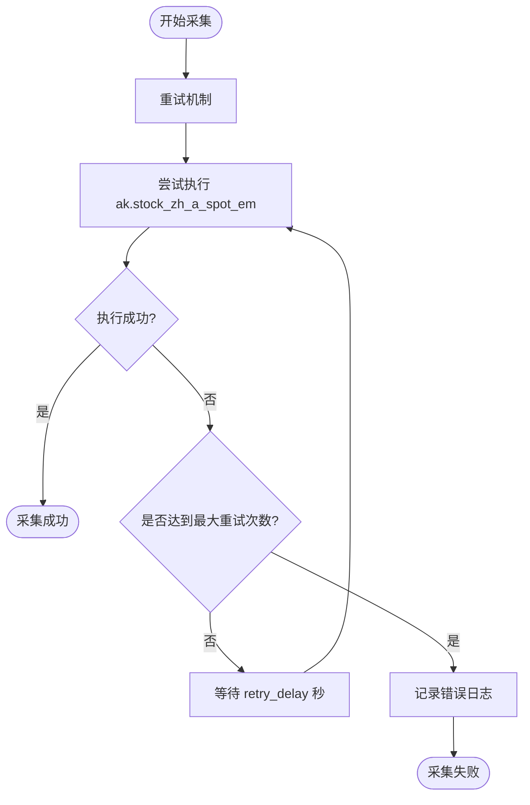
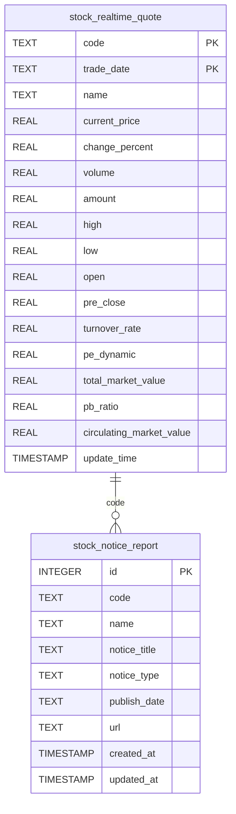
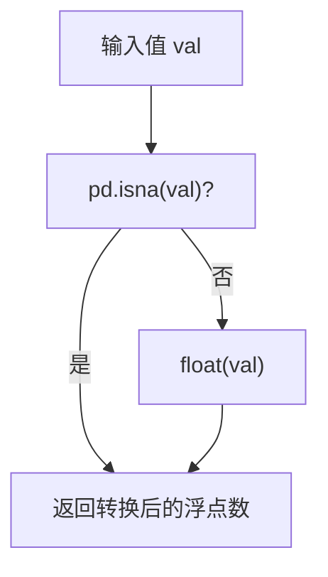
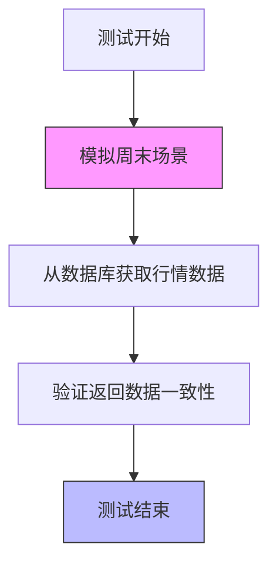
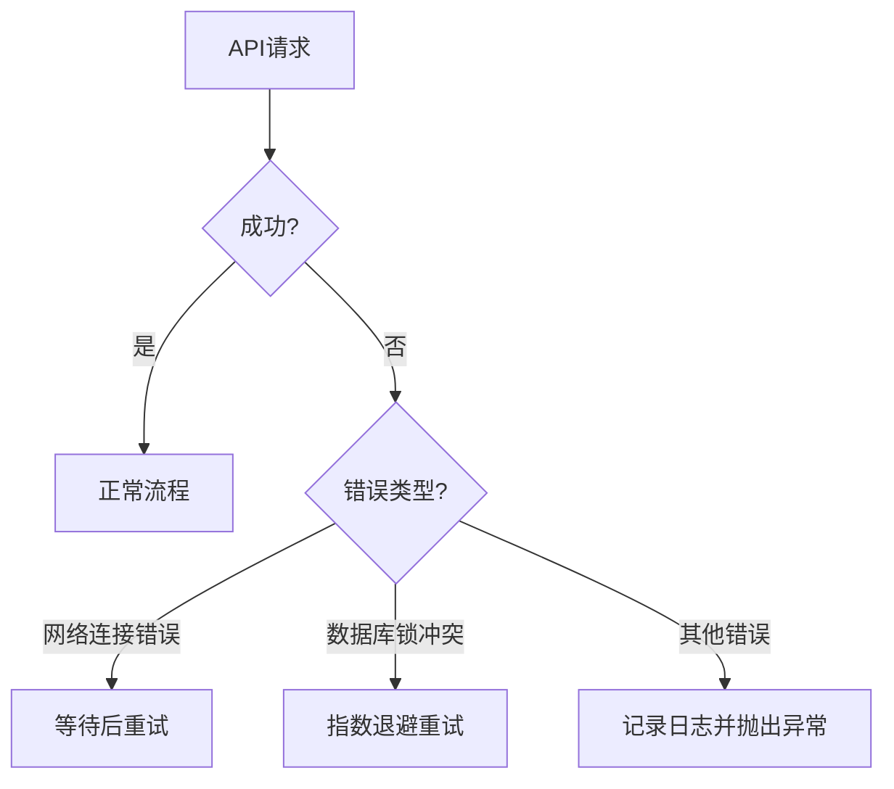

# 实时行情采集

<cite>
**本文档引用的文件**
- [realtime.py](file://backend_core/data_collectors/akshare/realtime.py)
- [realtime_stock_notice_report_ak.py](file://backend_core/data_collectors/akshare/realtime_stock_notice_report_ak.py)
- [base.py](file://backend_core/data_collectors/akshare/base.py)
- [test_stock_info_realtime_collect_ak.py](file://backend_api/test/test_stock_info_realtime_collect_ak.py)
</cite>

## 目录
1. [简介](#简介)
2. [核心组件](#核心组件)
3. [实时行情采集逻辑](#实时行情采集逻辑)
4. [公告与研报信息采集](#公告与研报信息采集)
5. [性能优化实践](#性能优化实践)
6. [调用方式与测试用例](#调用方式与测试用例)
7. [错误处理机制](#错误处理机制)
8. [结论](#结论)

## 简介
本文档深入解析基于AkShare接口实现的实时行情采集系统，重点阐述个股、指数实时报价数据的获取机制。详细说明数据请求频率控制、并发处理策略与网络异常重试方案。结合公告与研报类信息的实时抓取流程，分析其与主行情数据的整合方式。提供连接池管理、响应缓存和数据解析效率提升等性能优化实践，并通过测试用例展示关键错误处理路径。

## 核心组件

**Section sources**
- [realtime.py](file://backend_core/data_collectors/akshare/realtime.py#L1-L262)
- [realtime_stock_notice_report_ak.py](file://backend_core/data_collectors/akshare/realtime_stock_notice_report_ak.py#L1-L339)
- [base.py](file://backend_core/data_collectors/akshare/base.py#L1-L231)

## 实时行情采集逻辑

### 数据获取与处理流程
实时行情采集器 `AkshareRealtimeQuoteCollector` 继承自 `AKShareCollector` 基类，通过 `ak.stock_zh_a_spot_em` 接口批量获取沪深京A股的实时行情数据。采集过程包含数据清洗、类型转换和数据库持久化三个主要阶段。

```mermaid
sequenceDiagram
participant Collector as "AkshareRealtimeQuoteCollector"
participant AKShare as "AkShare API"
participant DB as "数据库"
Collector->>AKShare : 调用 stock_zh_a_spot_em()
AKShare-->>Collector : 返回实时行情DataFrame
Collector->>Collector : 遍历每行数据
loop 处理每只股票
Collector->>Collector : _safe_value() 转换数值
Collector->>DB : 插入或更新 stock_basic_info
Collector->>DB : 插入或更新 stock_realtime_quote
end
Collector->>DB : 记录操作日志
Collector-->> : 返回采集结果
```

**Diagram sources**
- [realtime.py](file://backend_core/data_collectors/akshare/realtime.py#L17-L262)

### 请求频率与并发控制
系统通过基类 `AKShareCollector` 中的 `_retry_on_failure` 方法实现请求频率控制和失败重试。该方法支持配置最大重试次数（`max_retries`）和重试延迟（`retry_delay`），默认值分别为3次和5秒。



**Diagram sources**
- [base.py](file://backend_core/data_collectors/akshare/base.py#L23-L231)

**Section sources**
- [base.py](file://backend_core/data_collectors/akshare/base.py#L23-L231)

## 公告与研报信息采集

### 采集流程与整合方式
`AkshareStockNoticeReportCollector` 负责采集A股公告与研报信息，通过 `ak.stock_notice_report` 接口按类型和日期获取数据。采集器支持多种公告类型（财务报告、资产重组等）的批量采集，并将结果存储在 `stock_notice_report` 表中。

```mermaid
sequenceDiagram
participant Collector as "AkshareStockNoticeReportCollector"
participant AKShare as "AkShare API"
participant DB as "数据库"
Collector->>Collector : collect_multiple_types()
loop 遍历公告类型
Collector->>AKShare : 调用 stock_notice_report(symbol, date)
AKShare-->>Collector : 返回公告DataFrame
Collector->>DB : 批量插入或更新 stock_notice_report
Collector->>Collector : time.sleep(2) 避免请求过频
end
Collector->>DB : 记录操作日志
Collector-->> : 返回采集结果
```

**Diagram sources**
- [realtime_stock_notice_report_ak.py](file://backend_core/data_collectors/akshare/realtime_stock_notice_report_ak.py#L30-L339)

### 数据库表结构


**Diagram sources**
- [realtime.py](file://backend_core/data_collectors/akshare/realtime.py#L17-L262)
- [realtime_stock_notice_report_ak.py](file://backend_core/data_collectors/akshare/realtime_stock_notice_report_ak.py#L30-L339)

**Section sources**
- [realtime.py](file://backend_core/data_collectors/akshare/realtime.py#L17-L262)
- [realtime_stock_notice_report_ak.py](file://backend_core/data_collectors/akshare/realtime_stock_notice_report_ak.py#L30-L339)

## 性能优化实践

### 连接池与事务管理
系统采用数据库连接池管理机制，通过 `SessionLocal()` 获取数据库会话。在批量插入操作中，使用事务提交（`session.commit()`）确保数据一致性，并在发生锁冲突时实现自动重试。

### 响应缓存与解析优化
通过 `_safe_value` 方法对数值型字段进行安全转换，避免因空值或类型错误导致的数据解析失败。该方法利用 `pd.isna()` 检测缺失值，并将有效值转换为浮点数。



**Diagram sources**
- [realtime.py](file://backend_core/data_collectors/akshare/realtime.py#L17-L262)

**Section sources**
- [realtime.py](file://backend_core/data_collectors/akshare/realtime.py#L17-L262)

## 调用方式与测试用例

### 采集器调用示例
```python
# 初始化实时行情采集器
collector = AkshareRealtimeQuoteCollector(config)
# 执行采集
success = collector.collect_quotes()

# 初始化公告信息采集器
notice_collector = AkshareStockNoticeReportCollector(config)
# 采集指定类型的公告
success = notice_collector.collect_stock_notices(symbol="财务报告", date_str="2024-06-15")
```

### 测试用例分析
系统提供了完整的测试用例，覆盖正常采集、异常处理和边界条件。测试用例验证了在周末、非交易日等特殊情况下，系统能够正确处理数据获取逻辑。



**Diagram sources**
- [test_stock_info_realtime_collect_ak.py](file://backend_api/test/test_stock_info_realtime_collect_ak.py#L1-L220)

**Section sources**
- [test_stock_info_realtime_collect_ak.py](file://backend_api/test/test_stock_info_realtime_collect_ak.py#L1-L220)

## 错误处理机制

### 网络异常重试策略
当网络请求失败时，系统按照配置的重试策略进行自动重试。对于数据库锁冲突（`LockNotAvailable`）或死锁（`DeadlockDetected`）等特定异常，采集器会进行指数级退避重试。

### 接口限流应对方案
通过在不同类型公告采集之间添加 `time.sleep(2)` 的延迟，避免因请求过于频繁而被接口限流。同时，系统记录详细的错误日志，便于后续问题排查。



**Section sources**
- [base.py](file://backend_core/data_collectors/akshare/base.py#L23-L231)
- [realtime.py](file://backend_core/data_collectors/akshare/realtime.py#L17-L262)

## 结论
本系统通过AkShare接口实现了高效、稳定的实时行情与公告信息采集。采用重试机制、并发控制和性能优化技术，确保了数据采集的可靠性和效率。完善的错误处理和日志记录机制为系统维护提供了有力支持，测试用例覆盖了主要使用场景，保障了系统的稳定性。