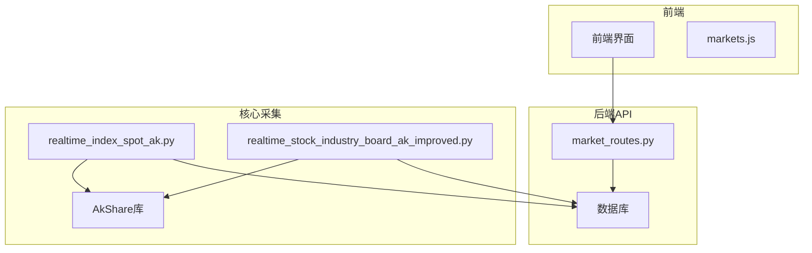
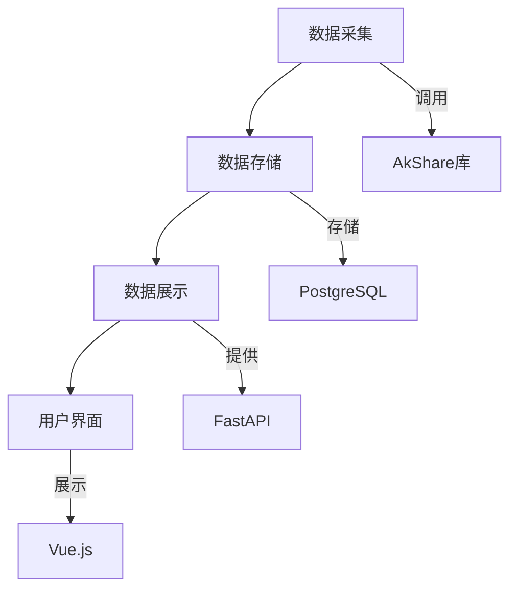
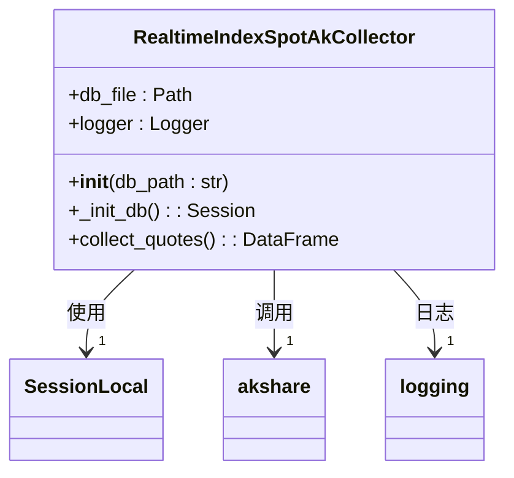
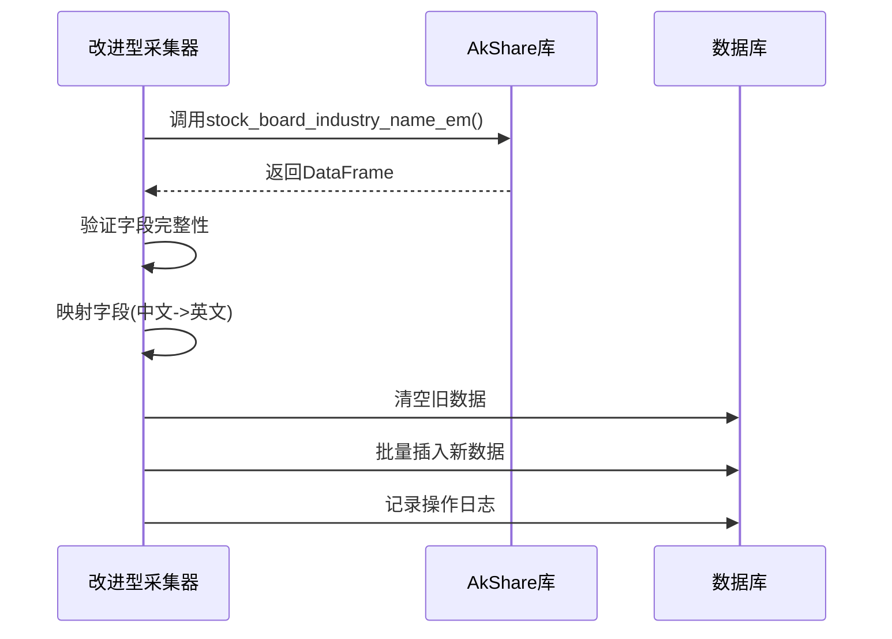
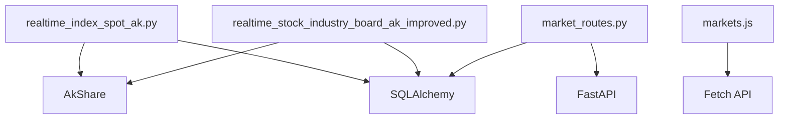

# 指数与行业板块采集

<cite>
**本文档引用文件**  
- [realtime_index_spot_ak.py](file://backend_core/data_collectors/akshare/realtime_index_spot_ak.py)
- [realtime_stock_industry_board_ak.py](file://backend_core/data_collectors/akshare/realtime_stock_industry_board_ak.py)
- [realtime_stock_industry_board_ak_improved.py](file://backend_core/data_collectors/akshare/realtime_stock_industry_board_ak_improved.py)
- [market_routes.py](file://backend_api/market_routes.py)
- [markets.js](file://frontend/js/markets.js)
</cite>

## 目录
1. [引言](#引言)
2. [项目结构](#项目结构)
3. [核心组件](#核心组件)
4. [架构概述](#架构概述)
5. [详细组件分析](#详细组件分析)
6. [依赖分析](#依赖分析)
7. [性能考量](#性能考量)
8. [故障排除指南](#故障排除指南)
9. [结论](#结论)

## 引言
本文档详细说明了股票指数与行业板块实时数据采集机制，重点解析了上证指数、深证成指等主要指数的实时点位采集流程，以及行业板块数据的改进型采集算法。涵盖数据更新频率、字段映射、标准化处理、板块分类体系、成分股动态更新和涨跌幅聚合计算等核心逻辑。同时对比了原始版本与改进版本在稳定性、数据完整性和性能方面的优化，并展示了数据在前端监控界面的集成方式。

## 项目结构
系统采用分层架构，包含前端、后端API和核心数据采集模块。数据采集功能集中在`backend_core/data_collectors/akshare`目录下，通过AkShare库获取实时市场数据，并存储到数据库中。后端API提供数据查询接口，前端通过JavaScript调用这些接口实现动态展示。

**图示来源**  
- [realtime_index_spot_ak.py](file://backend_core/data_collectors/akshare/realtime_index_spot_ak.py)
- [realtime_stock_industry_board_ak_improved.py](file://backend_core/data_collectors/akshare/realtime_stock_industry_board_ak_improved.py)
- [market_routes.py](file://backend_api/market_routes.py)
- [markets.js](file://frontend/js/markets.js)

**本节来源**  
- [project_structure](file://workspace_path)

## 核心组件
系统核心组件包括指数实时采集器（RealtimeIndexSpotAkCollector）和行业板块采集器（ImprovedRealtimeStockIndustryBoardCollector）。前者负责采集上证指数、深证成指等主要指数的实时行情，后者负责采集各行业板块的实时数据。两个组件均通过AkShare库获取数据，经过字段映射和标准化处理后存入数据库，并通过API供前端调用。

**本节来源**  
- [realtime_index_spot_ak.py](file://backend_core/data_collectors/akshare/realtime_index_spot_ak.py#L1-L157)
- [realtime_stock_industry_board_ak_improved.py](file://backend_core/data_collectors/akshare/realtime_stock_industry_board_ak_improved.py#L1-L233)

## 架构概述
系统采用数据采集-存储-展示的三层架构。数据采集层通过定时任务调用AkShare接口获取实时市场数据；数据存储层使用关系型数据库保存采集结果，并记录操作日志；数据展示层通过RESTful API提供数据查询服务，前端页面通过JavaScript定时请求API实现数据的动态更新。

**图示来源**  
- [realtime_index_spot_ak.py](file://backend_core/data_collectors/akshare/realtime_index_spot_ak.py)
- [realtime_stock_industry_board_ak_improved.py](file://backend_core/data_collectors/akshare/realtime_stock_industry_board_ak_improved.py)
- [market_routes.py](file://backend_api/market_routes.py)

## 详细组件分析

### 指数实时采集器分析
RealtimeIndexSpotAkCollector类负责采集沪深重要指数、上证系列指数和深证系列指数的实时行情数据。采集器通过AkShare的`stock_zh_index_spot_em`接口获取数据，支持三种指数类型（沪深重要指数、上证系列指数、深证系列指数），并为每条记录标记`index_spot_type`字段以区分来源。

**图示来源**  
- [realtime_index_spot_ak.py](file://backend_core/data_collectors/akshare/realtime_index_spot_ak.py#L1-L157)

**本节来源**  
- [realtime_index_spot_ak.py](file://backend_core/data_collectors/akshare/realtime_index_spot_ak.py#L1-L157)

### 改进型行业板块采集器分析
ImprovedRealtimeStockIndustryBoardCollector类是对原始行业板块采集器的全面改进。新版本增加了详细的调试信息输出，包括数据获取状态、字段存在性检查和数据预览，大大提高了问题排查效率。采集器通过`stock_board_industry_name_em`接口获取行业板块数据，包含板块代码、名称、最新价、涨跌幅、领涨股等关键信息。

**图示来源**  
- [realtime_stock_industry_board_ak_improved.py](file://backend_core/data_collectors/akshare/realtime_stock_industry_board_ak_improved.py#L1-L233)

**本节来源**  
- [realtime_stock_industry_board_ak_improved.py](file://backend_core/data_collectors/akshare/realtime_stock_industry_board_ak_improved.py#L1-L233)

### 原始与改进版本对比
改进型行业板块采集器在多个方面优于原始版本，主要体现在增强的调试能力、更完善的错误处理和更详细的日志记录。这些改进显著提高了系统的稳定性和可维护性。

| 对比维度 | 原始版本 | 改进版本 |
|---------|--------|--------|
| **调试信息** | 简单打印 | 详细状态、字段检查、数据预览 |
| **错误处理** | 基本异常捕获 | 完整的异常堆栈跟踪 |
| **日志记录** | 基本操作日志 | 详细的采集过程日志 |
| **数据验证** | 无 | 字段存在性检查 |
| **进度反馈** | 无 | 每100条记录进度提示 |

**本节来源**  
- [realtime_stock_industry_board_ak.py](file://backend_core/data_collectors/akshare/realtime_stock_industry_board_ak.py#L1-L124)
- [realtime_stock_industry_board_ak_improved.py](file://backend_core/data_collectors/akshare/realtime_stock_industry_board_ak_improved.py#L1-L233)

## 依赖分析
系统依赖于AkShare库获取金融数据，通过SQLAlchemy与数据库交互，并使用FastAPI提供RESTful服务。前端依赖JavaScript实现动态数据展示。各组件之间通过清晰的接口定义进行通信，降低了耦合度。

**图示来源**  
- [realtime_index_spot_ak.py](file://backend_core/data_collectors/akshare/realtime_index_spot_ak.py)
- [realtime_stock_industry_board_ak_improved.py](file://backend_core/data_collectors/akshare/realtime_stock_industry_board_ak_improved.py)
- [market_routes.py](file://backend_api/market_routes.py)
- [markets.js](file://frontend/js/markets.js)

**本节来源**  
- [realtime_index_spot_ak.py](file://backend_core/data_collectors/akshare/realtime_index_spot_ak.py#L1-L157)
- [realtime_stock_industry_board_ak_improved.py](file://backend_core/data_collectors/akshare/realtime_stock_industry_board_ak_improved.py#L1-L233)
- [market_routes.py](file://backend_api/market_routes.py#L1-L168)
- [markets.js](file://frontend/js/markets.js#L1-L799)

## 性能考量
数据采集任务设计为定时执行，避免频繁请求导致的性能问题。数据库操作采用批量插入和upsert模式，确保数据一致性的同时优化了写入性能。前端通过合理的缓存策略和数据更新频率，平衡了实时性与系统负载。

## 故障排除指南
当数据采集出现问题时，应首先检查日志文件中的错误信息。对于行业板块采集，特别关注"领涨股"相关字段是否存在。数据库连接问题可通过检查配置文件和网络连接来解决。API访问问题应验证端点URL和请求参数。

**本节来源**  
- [realtime_index_spot_ak.py](file://backend_core/data_collectors/akshare/realtime_index_spot_ak.py#L1-L157)
- [realtime_stock_industry_board_ak_improved.py](file://backend_core/data_collectors/akshare/realtime_stock_industry_board_ak_improved.py#L1-L233)

## 结论
本文档详细分析了股票指数与行业板块的实时数据采集机制。改进型行业板块采集器通过增强的调试能力和完善的错误处理，显著提升了系统的稳定性和可维护性。系统通过清晰的分层架构和标准化的数据处理流程，实现了高效、可靠的数据采集与展示。