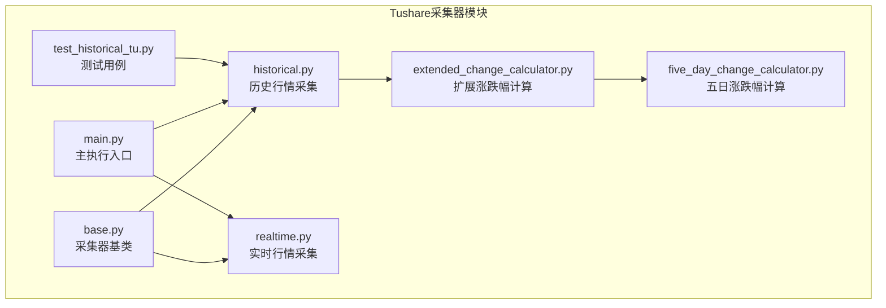
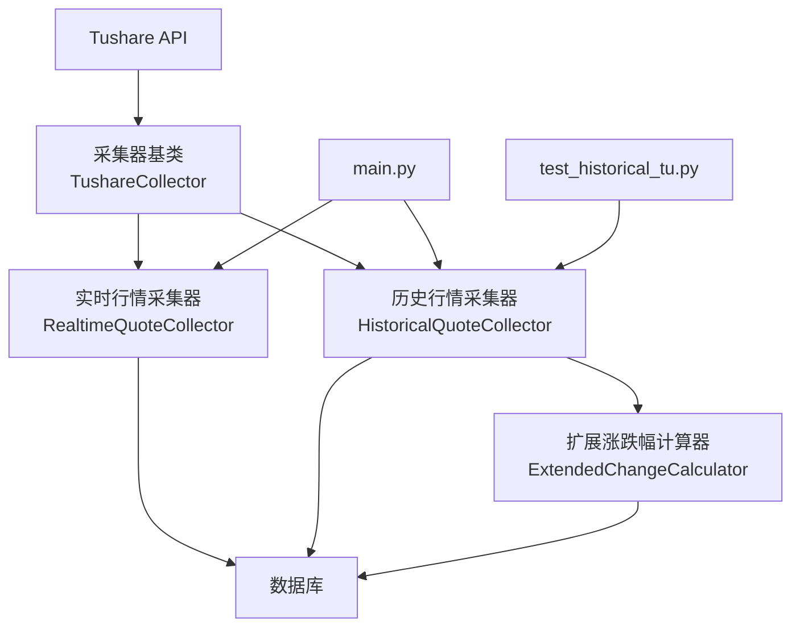
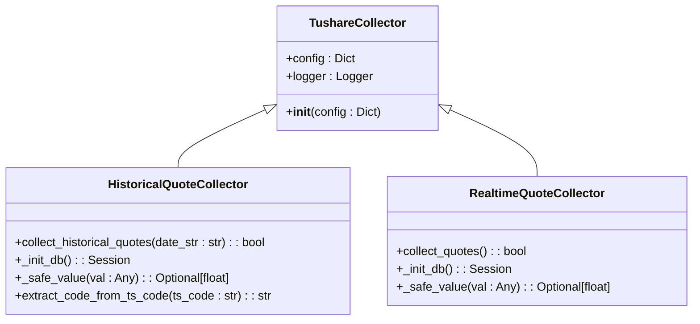
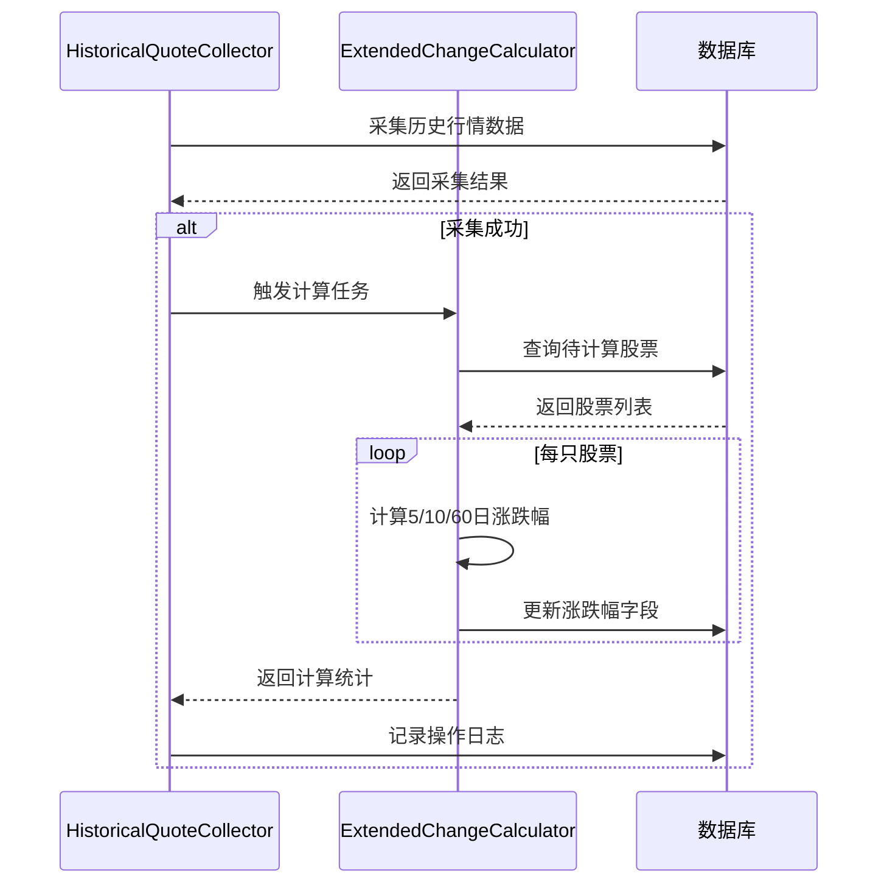
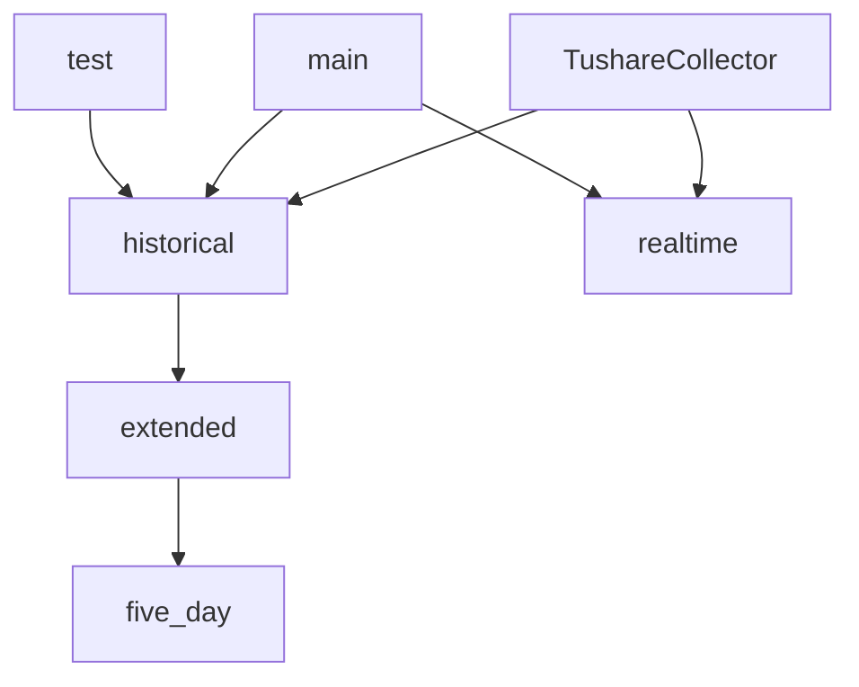

# Tushare数据采集器

<cite>
**本文档中引用的文件**  
- [base.py](file://backend_core/data_collectors/tushare/base.py)
- [historical.py](file://backend_core/data_collectors/tushare/historical.py)
- [realtime.py](file://backend_core/data_collectors/tushare/realtime.py)
- [five_day_change_calculator.py](file://backend_core/data_collectors/tushare/five_day_change_calculator.py)
- [extended_change_calculator.py](file://backend_core/data_collectors/tushare/extended_change_calculator.py)
- [main.py](file://backend_core/data_collectors/tushare/main.py)
- [test_historical_tu.py](file://backend_core/test/data_collectors/tushare/test_historical_tu.py)
</cite>

## 目录
1. [引言](#引言)
2. [项目结构](#项目结构)
3. [核心组件](#核心组件)
4. [架构概述](#架构概述)
5. [详细组件分析](#详细组件分析)
6. [依赖分析](#依赖分析)
7. [性能考虑](#性能考虑)
8. [故障排除指南](#故障排除指南)
9. [结论](#结论)

## 引言
本文档深入解析基于Tushare的股票行情数据采集系统，涵盖历史数据与实时数据采集、五日涨跌幅计算、定时任务调度及异常恢复机制。系统采用模块化设计，通过基类封装通用功能，实现高内聚、低耦合的采集架构。重点分析数据完整性校验、API配额兼容性处理、错误重试策略等关键实现细节，并结合测试用例验证功能正确性。

## 项目结构
Tushare数据采集器位于`backend_core/data_collectors/tushare/`目录下，采用分层模块化设计。核心模块包括基类定义、历史行情采集、实时行情采集、涨跌幅计算服务及主执行入口。系统通过配置驱动，支持灵活扩展与维护。

**图示来源**  
- [base.py](file://backend_core/data_collectors/tushare/base.py)
- [historical.py](file://backend_core/data_collectors/tushare/historical.py)
- [realtime.py](file://backend_core/data_collectors/tushare/realtime.py)
- [five_day_change_calculator.py](file://backend_core/data_collectors/tushare/five_day_change_calculator.py)
- [extended_change_calculator.py](file://backend_core/data_collectors/tushare/extended_change_calculator.py)
- [main.py](file://backend_core/data_collectors/tushare/main.py)
- [test_historical_tu.py](file://backend_core/test/data_collectors/tushare/test_historical_tu.py)

**本节来源**  
- [backend_core/data_collectors/tushare/](file://backend_core/data_collectors/tushare/)

## 核心组件
系统核心由采集器基类、历史行情采集器、实时行情采集器及涨跌幅计算器构成。基类`TushareCollector`封装了日志、配置初始化与Tushare API认证；`HistoricalQuoteCollector`负责历史数据的增量采集与入库；`RealtimeQuoteCollector`处理实时行情获取；`ExtendedChangeCalculator`在数据采集后自动计算多周期涨跌幅，确保数据完整性。

**本节来源**  
- [base.py](file://backend_core/data_collectors/tushare/base.py#L1-L20)
- [historical.py](file://backend_core/data_collectors/tushare/historical.py#L1-L316)
- [realtime.py](file://backend_core/data_collectors/tushare/realtime.py#L1-L157)
- [extended_change_calculator.py](file://backend_core/data_collectors/tushare/extended_change_calculator.py#L1-L383)

## 架构概述
系统采用分层架构，分为数据采集层、业务逻辑层与数据存储层。采集层通过Tushare API获取原始数据；业务逻辑层处理数据清洗、转换与涨跌幅计算；存储层负责数据持久化与完整性校验。各组件通过依赖注入与配置管理实现松耦合。

**图示来源**  
- [base.py](file://backend_core/data_collectors/tushare/base.py#L1-L20)
- [historical.py](file://backend_core/data_collectors/tushare/historical.py#L1-L316)
- [realtime.py](file://backend_core/data_collectors/tushare/realtime.py#L1-L157)
- [extended_change_calculator.py](file://backend_core/data_collectors/tushare/extended_change_calculator.py#L1-L383)
- [main.py](file://backend_core/data_collectors/tushare/main.py#L1-L36)
- [test_historical_tu.py](file://backend_core/test/data_collectors/tushare/test_historical_tu.py#L1-L73)

## 详细组件分析

### 采集器基类设计
`TushareCollector`作为所有采集器的基类，提供统一的初始化逻辑，包括Tushare Token设置、日志系统配置与数据库会话管理。通过配置文件注入参数，实现环境隔离与灵活配置。

**图示来源**  
- [base.py](file://backend_core/data_collectors/tushare/base.py#L1-L20)
- [historical.py](file://backend_core/data_collectors/tushare/historical.py#L1-L316)
- [realtime.py](file://backend_core/data_collectors/tushare/realtime.py#L1-L157)

**本节来源**  
- [base.py](file://backend_core/data_collectors/tushare/base.py#L1-L20)

### 历史行情数据采集流程
`HistoricalQuoteCollector`实现增量采集策略，支持按交易日采集。流程包括：初始化数据库表结构、调用Tushare Pro API获取指定日期数据、数据清洗与转换、批量插入或更新历史行情表，并自动触发扩展涨跌幅计算。

#### 日期处理与增量采集
系统通过`date_str`参数指定采集日期（格式YYYYMMDD），转换为标准日期格式后查询。采用`ON CONFLICT (code, date) DO UPDATE`策略实现增量更新，避免重复数据。每100条记录提交一次事务，平衡性能与一致性。

#### 数据完整性校验
在数据入库前，通过`_safe_value`方法处理缺失值（NaN），确保数值字段为`None`或`float`类型。对换手率等衍生字段，尝试从实时表关联获取，若失败则置为`None`，保证主数据完整性。

#### 死锁重试机制
为应对高并发下的数据库死锁，系统实现三重重试机制：捕获`DeadlockDetected`异常后回滚事务，等待递增时间（0.1秒倍增）后重试，最多三次。确保在资源竞争环境下仍能完成数据写入。

**本节来源**  
- [historical.py](file://backend_core/data_collectors/tushare/historical.py#L1-L316)

### 实时行情采集与API配额兼容性
`RealtimeQuoteCollector`通过Tushare免费接口`ts.get_realtime_quotes`获取实时数据，避免使用受限的Pro API，规避配额限制。采集流程为：获取股票列表、批量获取实时行情、逐条处理并插入数据库。

#### 兼容性处理
系统未使用Pro API的实时接口（需积分），而是采用免费的`get_realtime_quotes`，确保可持续运行。通过`INSERT OR REPLACE`语句实现数据覆盖，简化实时数据更新逻辑。

#### 错误重试策略
虽未显式实现重试，但通过`try-except`捕获单条记录异常，记录失败详情并继续处理后续数据，实现“尽力而为”的采集策略，防止个别股票异常导致整体任务失败。

**本节来源**  
- [realtime.py](file://backend_core/data_collectors/tushare/realtime.py#L1-L157)

### 五日涨跌幅计算业务逻辑
`FiveDayChangeCalculator`与`ExtendedChangeCalculator`负责在历史数据采集后自动计算涨跌幅。核心逻辑为：查询目标日期前5日（或10日、60日）的收盘价，计算相对变化率。

#### 计算流程
1. 查询指定日期所有`five_day_change_percent`为空的股票。
2. 对每只股票，获取其历史收盘价序列。
3. 定位目标日期索引，检查前5日数据是否存在且有效。
4. 计算涨跌幅：(当日收盘价 - 5日前收盘价) / 5日前收盘价 * 100。
5. 更新数据库字段，支持部分成功（如仅5日可算，10日不足则跳过）。

#### 集成方式
在`HistoricalQuoteCollector.collect_historical_quotes`方法末尾，若采集成功，则自动实例化`ExtendedChangeCalculator`并调用`calculate_for_date`，实现采集-计算流水线。

**图示来源**  
- [historical.py](file://backend_core/data_collectors/tushare/historical.py#L1-L316)
- [extended_change_calculator.py](file://backend_core/data_collectors/tushare/extended_change_calculator.py#L1-L383)

**本节来源**  
- [five_day_change_calculator.py](file://backend_core/data_collectors/tushare/five_day_change_calculator.py#L1-L297)
- [extended_change_calculator.py](file://backend_core/data_collectors/tushare/extended_change_calculator.py#L1-L383)

### 定时任务与异常恢复
`main.py`作为命令行入口，支持四种采集类型：实时、历史、指数、文件导入。通过`argparse`解析参数，驱动相应采集器执行。

#### 执行周期
系统未内置调度器，但可通过外部工具（如cron）定时调用`main.py`。例如，每日收盘后执行`python main.py --type historical --date 20240101`完成历史数据采集。

#### 异常恢复机制
- **日志记录**：所有操作写入`historical_collect_operation_logs`表，包含操作类型、影响行数、状态与错误信息，便于追溯。
- **事务管理**：使用数据库事务，确保批量操作的原子性。死锁重试机制提升容错能力。
- **部分成功处理**：允许单条记录失败，继续处理后续数据，并在日志中记录失败详情，支持后续补采。

**本节来源**  
- [main.py](file://backend_core/data_collectors/tushare/main.py#L1-L36)

## 依赖分析
系统依赖关系清晰，`HistoricalQuoteCollector`和`RealtimeQuoteCollector`继承自`TushareCollector`，`ExtendedChangeCalculator`被历史采集器调用。测试用例独立验证核心功能，不引入运行时依赖。

**图示来源**  
- [base.py](file://backend_core/data_collectors/tushare/base.py)
- [historical.py](file://backend_core/data_collectors/tushare/historical.py)
- [realtime.py](file://backend_core/data_collectors/tushare/realtime.py)
- [extended_change_calculator.py](file://backend_core/data_collectors/tushare/extended_change_calculator.py)
- [main.py](file://backend_core/data_collectors/tushare/main.py)
- [test_historical_tu.py](file://backend_core/test/data_collectors/tushare/test_historical_tu.py)

**本节来源**  
- [base.py](file://backend_core/data_collectors/tushare/base.py)
- [historical.py](file://backend_core/data_collectors/tushare/historical.py)
- [realtime.py](file://backend_core/data_collectors/tushare/realtime.py)
- [extended_change_calculator.py](file://backend_core/data_collectors/tushare/extended_change_calculator.py)
- [main.py](file://backend_core/data_collectors/tushare/main.py)
- [test_historical_tu.py](file://backend_core/test/data_collectors/tushare/test_historical_tu.py)

## 性能考虑
- **批量提交**：历史采集每100条提交一次，减少事务开销。
- **索引优化**：`historical_quotes`表以`(code, date)`为主键，加速查询。
- **内存效率**：使用生成器逐行处理DataFrame，避免全量加载。
- **并发控制**：死锁重试机制适应高并发写入场景。

## 故障排除指南
- **采集无数据**：检查Tushare Token有效性及API返回状态。
- **数据库死锁**：增加重试等待时间或降低并发度。
- **涨跌幅为空**：确认历史数据是否完整，目标日期前是否有足够数据。
- **日志缺失**：检查`log_dir`配置及文件系统权限。

**本节来源**  
- [historical.py](file://backend_core/data_collectors/tushare/historical.py#L1-L316)
- [realtime.py](file://backend_core/data_collectors/tushare/realtime.py#L1-L157)
- [extended_change_calculator.py](file://backend_core/data_collectors/tushare/extended_change_calculator.py#L1-L383)

## 结论
Tushare数据采集器架构清晰，模块职责分明。通过基类复用、增量采集、自动计算涨跌幅等设计，实现了高效、可靠的数据采集流程。系统具备良好的可维护性与扩展性，关键环节均配有日志与异常处理，为上层分析提供高质量数据支持。