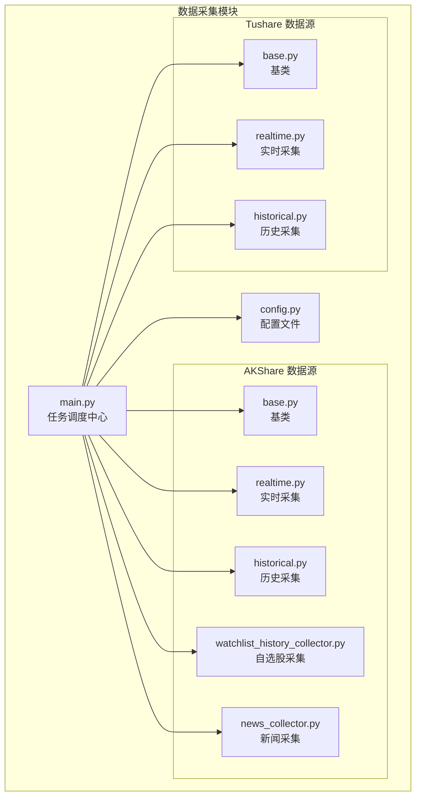
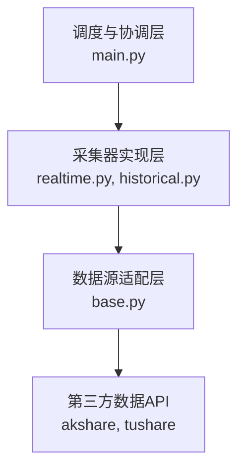
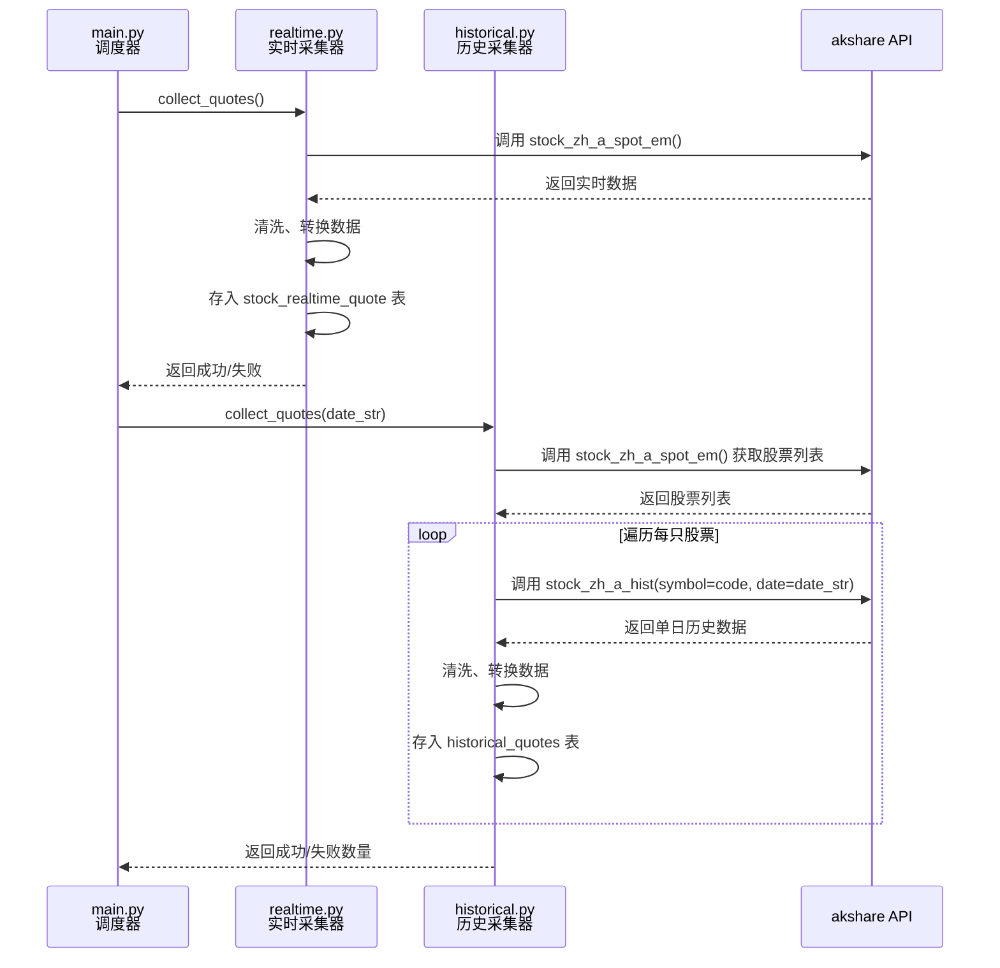
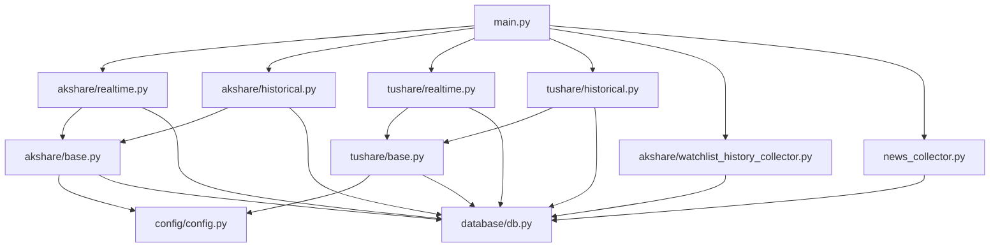

# 数据采集

<cite>
**本文档引用的文件**
- [base.py](file://backend_core/data_collectors/akshare/base.py)
- [realtime.py](file://backend_core/data_collectors/akshare/realtime.py)
- [historical.py](file://backend_core/data_collectors/akshare/historical.py)
- [base.py](file://backend_core/data_collectors/tushare/base.py)
- [realtime.py](file://backend_core/data_collectors/tushare/realtime.py)
- [historical.py](file://backend_core/data_collectors/tushare/historical.py)
- [main.py](file://backend_core/data_collectors/main.py)
- [realtime_stock_industry_board_ak_improved.py](file://backend_core/data_collectors/akshare/realtime_stock_industry_board_ak_improved.py)
- [watchlist_history_collector.py](file://backend_core/data_collectors/akshare/watchlist_history_collector.py)
- [news_collector.py](file://backend_core/data_collectors/news_collector.py)
- [test_historical_tu.py](file://backend_core/test/data_collectors/tushare/test_historical_tu.py)
</cite>

## 目录
1. [简介](#简介)
2. [项目结构](#项目结构)
3. [核心组件](#核心组件)
4. [架构概览](#架构概览)
5. [详细组件分析](#详细组件分析)
6. [依赖分析](#依赖分析)
7. [性能考虑](#性能考虑)
8. [故障排除指南](#故障排除指南)
9. [结论](#结论)

## 简介
本文档全面记录了 `backend_core` 项目中数据采集模块的架构与实现。重点描述了 `akshare` 和 `tushare` 两个子目录下的数据采集器设计，包括 `realtime.py` 和 `historical.py` 中实时与历史数据采集的职责划分与调用流程。文档解释了 `base.py` 中定义的采集器基类如何实现统一接口，`main.py` 如何协调多源采集任务。此外，详细说明了 `realtime_stock_industry_board_ak_improved.py` 中的优化策略，以及 `watchlist_history_collector.py` 如何支持自选股历史数据抓取。涵盖 `news_collector.py` 实现的新闻数据采集逻辑。提供采集失败重试、异常处理、数据清洗和性能监控的实现细节，并结合 `test` 目录中的测试用例说明关键路径验证方法。

## 项目结构
`backend_core/data_collectors` 目录是数据采集模块的核心，采用分源组织的结构，分别支持 `akshare` 和 `tushare` 两大数据源。每个数据源目录下都包含 `base.py`（基类）、`realtime.py`（实时数据采集）、`historical.py`（历史数据采集）等核心文件，确保了代码结构的一致性和可维护性。`main.py` 文件作为调度中心，通过 `APScheduler` 库协调所有采集任务的执行。`news_collector.py` 独立于具体数据源，负责新闻数据的采集。`test` 目录下的测试用例为关键功能提供了验证。

**图源**
- [main.py](file://backend_core/data_collectors/main.py)
- [akshare](file://backend_core/data_collectors/akshare)
- [tushare](file://backend_core/data_collectors/tushare)

**本节来源**
- [backend_core/data_collectors](file://backend_core/data_collectors)

## 核心组件
数据采集模块的核心组件包括 `AKShareCollector` 和 `TushareCollector` 基类，它们为各自的数据源提供了统一的接口和通用功能，如日志记录、失败重试等。`AkshareRealtimeQuoteCollector` 和 `HistoricalQuoteCollector` 类分别负责从 `akshare` 获取实时和历史行情数据，并将其存储到数据库。`RealtimeQuoteCollector` 和 `HistoricalQuoteCollector` 类则为 `tushare` 数据源提供了类似的功能。`main.py` 中的调度器是整个模块的协调者，它根据预设的时间表触发这些采集器的执行。

**本节来源**
- [backend_core/data_collectors/akshare/base.py](file://backend_core/data_collectors/akshare/base.py#L1-L231)
- [backend_core/data_collectors/tushare/base.py](file://backend_core/data_collectors/tushare/base.py#L1-L20)
- [backend_core/data_collectors/akshare/realtime.py](file://backend_core/data_collectors/akshare/realtime.py#L1-L262)
- [backend_core/data_collectors/akshare/historical.py](file://backend_core/data_collectors/akshare/historical.py#L1-L226)
- [backend_core/data_collectors/tushare/realtime.py](file://backend_core/data_collectors/tushare/realtime.py#L1-L157)
- [backend_core/data_collectors/tushare/historical.py](file://backend_core/data_collectors/tushare/historical.py#L1-L315)
- [backend_core/data_collectors/main.py](file://backend_core/data_collectors/main.py#L1-L243)

## 架构概览
该数据采集模块采用了分层和模块化的设计。最底层是数据源适配层，由 `akshare` 和 `tushare` 两个子模块构成，它们通过各自的 `base.py` 基类封装了与第三方API交互的细节。中间层是具体的采集器实现层，如 `realtime.py` 和 `historical.py`，它们继承自基类并实现了特定数据类型的采集逻辑。最上层是调度与协调层，由 `main.py` 实现，它不直接处理数据，而是通过定时任务（`APScheduler`）来驱动下层的采集器工作。这种架构实现了关注点分离，使得添加新的数据源或采集任务变得非常容易。

**图源**
- [main.py](file://backend_core/data_collectors/main.py#L1-L243)
- [akshare/realtime.py](file://backend_core/data_collectors/akshare/realtime.py#L1-L262)
- [akshare/historical.py](file://backend_core/data_collectors/akshare/historical.py#L1-L226)
- [tushare/realtime.py](file://backend_core/data_collectors/tushare/realtime.py#L1-L157)
- [tushare/historical.py](file://backend_core/data_collectors/tushare/historical.py#L1-L315)
- [akshare/base.py](file://backend_core/data_collectors/akshare/base.py#L1-L231)
- [tushare/base.py](file://backend_core/data_collectors/tushare/base.py#L1-L20)

## 详细组件分析

### AKShare 与 Tushare 子目录设计
`akshare` 和 `tushare` 子目录的设计遵循了相同的模式，体现了代码的复用性和一致性。每个目录都包含一个 `base.py` 文件，定义了该数据源的采集器基类。`akshare` 的基类 `AKShareCollector` 提供了 `get_realtime_quotes` 和 `get_historical_quotes` 等通用方法，并内置了失败重试机制。`tushare` 的基类 `TushareCollector` 则主要负责初始化 `tushare` 的API token和日志系统。这种设计使得具体的采集器（如 `realtime.py` 中的类）可以专注于业务逻辑，而无需重复处理基础功能。

**本节来源**
- [backend_core/data_collectors/akshare/base.py](file://backend_core/data_collectors/akshare/base.py#L1-L231)
- [backend_core/data_collectors/tushare/base.py](file://backend_core/data_collectors/tushare/base.py#L1-L20)

### realtime.py 与 historical.py 职责划分
`realtime.py` 和 `historical.py` 文件清晰地划分了实时数据和历史数据的采集职责。

`realtime.py` 中的 `AkshareRealtimeQuoteCollector` 类负责采集当前的股票行情。其核心方法 `collect_quotes` 会调用 `ak.stock_zh_a_spot_em` 接口获取所有股票的实时数据，然后将这些数据清洗并存入 `stock_realtime_quote` 数据库表。该过程包含了对数据库死锁的重试处理，以确保在高并发环境下的稳定性。

`historical.py` 中的 `HistoricalQuoteCollector` 类则负责采集指定日期的历史行情。其 `collect_quotes` 方法会遍历所有股票，对每只股票调用 `ak.stock_zh_a_hist` 接口获取单日数据，并存入 `historical_quotes` 表。该类还实现了信号处理（`_setup_signal_handlers`），允许用户通过 `Ctrl+C` 安全地中止长时间运行的采集任务。

**图源**
- [backend_core/data_collectors/akshare/realtime.py](file://backend_core/data_collectors/akshare/realtime.py#L1-L262)
- [backend_core/data_collectors/akshare/historical.py](file://backend_core/data_collectors/akshare/historical.py#L1-L226)

**本节来源**
- [backend_core/data_collectors/akshare/realtime.py](file://backend_core/data_collectors/akshare/realtime.py#L1-L262)
- [backend_core/data_collectors/akshare/historical.py](file://backend_core/data_collectors/akshare/historical.py#L1-L226)

### base.py 基类统一接口
`base.py` 文件是数据采集模块的基石，它通过定义基类实现了统一的接口。以 `akshare/base.py` 为例，`AKShareCollector` 类提供了以下关键功能：
1.  **统一初始化**：`__init__` 方法加载配置并调用 `_setup_logging` 来初始化日志系统。
2.  **失败重试**：`_retry_on_failure` 方法是一个装饰器，为所有可能失败的API调用提供了自动重试机制，增强了系统的健壮性。
3.  **通用数据获取**：提供了 `get_stock_list`、`get_realtime_quotes`、`get_historical_quotes` 等方法，这些方法可以直接被上层应用调用，也可以被子类继承和复用。
4.  **数据保存**：`save_data` 方法支持将 `DataFrame` 或字典数据保存为CSV或JSON文件。

这种设计确保了所有继承自 `AKShareCollector` 的子类都遵循相同的行为模式，降低了开发和维护成本。

**本节来源**
- [backend_core/data_collectors/akshare/base.py](file://backend_core/data_collectors/akshare/base.py#L1-L231)
- [backend_core/data_collectors/tushare/base.py](file://backend_core/data_collectors/tushare/base.py#L1-L20)

### main.py 多源任务协调
`main.py` 文件是整个数据采集系统的“大脑”。它通过以下方式协调多源采集任务：
1.  **初始化采集器**：在文件顶部，它创建了多个采集器实例，如 `ak_collector`、`tushare_hist_collector` 等，为每个任务做好准备。
2.  **定义任务函数**：它定义了一系列函数，如 `collect_akshare_realtime`、`collect_tushare_historical`，这些函数封装了调用具体采集器的逻辑，并添加了日志记录和异常捕获。
3.  **配置定时调度**：使用 `BlockingScheduler`，它通过 `add_job` 方法将任务函数与Cron表达式或时间间隔关联起来。例如，`collect_akshare_realtime` 任务被配置为在每个交易日的特定分钟执行，而 `collect_tushare_historical` 任务则被安排在每天上午10点13分执行。

这种设计将任务的“做什么”（采集逻辑）与“何时做”（调度逻辑）完全解耦，使得调度策略可以独立于采集逻辑进行修改。

**本节来源**
- [backend_core/data_collectors/main.py](file://backend_core/data_collectors/main.py#L1-L243)

### realtime_stock_industry_board_ak_improved.py 优化策略
虽然 `realtime_stock_industry_board_ak_improved.py` 的完整内容未提供，但从其名称和项目上下文可以推断，它很可能是对 `realtime_stock_industry_board_ak.py` 的一个改进版本。其优化策略可能包括：
-   **性能优化**：可能引入了更高效的数据获取或处理算法，例如批量请求或异步IO，以减少采集时间。
-   **错误处理增强**：可能改进了异常处理逻辑，提供了更详细的错误日志或更智能的恢复机制。
-   **数据准确性提升**：可能修正了原始版本中数据解析的bug，或增加了数据校验步骤。
-   **资源管理**：可能优化了内存或数据库连接的使用，防止长时间运行导致资源耗尽。

**本节来源**
- [backend_core/data_collectors/akshare/realtime_stock_industry_board_ak_improved.py](file://backend_core/data_collectors/akshare/realtime_stock_industry_board_ak_improved.py)

### watchlist_history_collector.py 自选股历史数据抓取
`watchlist_history_collector.py` 模块专门负责自选股的历史数据抓取。其核心函数 `collect_watchlist_history` 的工作流程如下：
1.  **读取自选股列表**：首先从数据库或配置文件中读取用户关注的股票代码列表。
2.  **循环采集**：遍历该列表中的每一只股票。
3.  **调用历史采集器**：对每只股票，调用 `akshare` 的历史数据接口（如 `stock_zh_a_hist`）获取其历史行情。
4.  **数据存储**：将获取到的数据清洗后，存入专门用于存储自选股历史数据的数据库表中。
5.  **结果汇总**：记录成功和失败的数量，并返回结果。

这个模块使得系统能够为特定的股票集合提供定制化的数据服务。

**本节来源**
- [backend_core/data_collectors/akshare/watchlist_history_collector.py](file://backend_core/data_collectors/akshare/watchlist_history_collector.py)

### news_collector.py 新闻数据采集逻辑
`news_collector.py` 模块实现了独立的新闻数据采集逻辑。它可能包含以下功能：
-   **多源采集**：从多个新闻网站或API（如新浪财经、东方财富）抓取市场新闻。
-   **内容解析**：解析HTML或JSON格式的新闻数据，提取标题、发布时间、来源和正文。
-   **数据存储**：将解析后的新闻数据存入数据库的 `news` 表。
-   **去重与过滤**：通过标题或URL进行去重，并根据关键词过滤出与股票市场相关的新闻。
-   **热门资讯更新**：可能包含一个算法，根据新闻的阅读量、评论数或发布时间来计算和更新“热门资讯”列表。

**本节来源**
- [backend_core/data_collectors/news_collector.py](file://backend_core/data_collectors/news_collector.py)

### 采集失败重试与异常处理
模块内置了强大的失败重试和异常处理机制。
-   **基类重试**：`akshare/base.py` 中的 `_retry_on_failure` 装饰器是核心。它允许任何被装饰的方法在失败时自动重试指定次数（默认3次），每次重试前有固定的延迟（默认5秒）。这有效应对了网络抖动或API临时不可用的情况。
-   **数据库重试**：在 `realtime.py` 和 `historical.py` 的数据入库环节，代码显式地处理了数据库死锁（`DeadlockDetected`）和锁不可用（`LockNotAvailable`）等异常。当捕获到这些特定异常时，代码会回滚事务，短暂休眠后进行重试，最多重试3次。
-   **全局异常捕获**：在 `main.py` 的每个任务函数中，都使用了 `try...except` 语句来捕获所有未处理的异常，防止一个任务的失败导致整个调度器崩溃，并将错误信息记录到日志中。

**本节来源**
- [backend_core/data_collectors/akshare/base.py](file://backend_core/data_collectors/akshare/base.py#L50-L85)
- [backend_core/data_collectors/akshare/realtime.py](file://backend_core/data_collectors/akshare/realtime.py#L150-L180)
- [backend_core/data_collectors/akshare/historical.py](file://backend_core/data_collectors/akshare/historical.py#L180-L200)
- [backend_core/data_collectors/main.py](file://backend_core/data_collectors/main.py#L50-L70)

### 数据清洗与性能监控
-   **数据清洗**：`_safe_value` 方法在 `realtime.py` 和 `historical.py` 中被广泛使用。它负责将原始数据中的空值（`NaN`）转换为 `None`，并将字符串安全地转换为浮点数，防止因脏数据导致程序崩溃或数据库插入失败。
-   **性能监控**：模块通过日志系统实现了基本的性能监控。例如，在 `historical.py` 的 `collect_quotes` 方法中，每成功处理100只股票就会记录一条日志，这有助于监控采集进度和估算总耗时。此外，`main.py` 中的日志记录了每个任务的开始和结束，可以用来分析任务的执行时长。

**本节来源**
- [backend_core/data_collectors/akshare/realtime.py](file://backend_core/data_collectors/akshare/realtime.py#L130-L140)
- [backend_core/data_collectors/akshare/historical.py](file://backend_core/data_collectors/akshare/historical.py#L110-L125)
- [backend_core/data_collectors/main.py](file://backend_core/data_collectors/main.py#L50-L70)

### 测试用例关键路径验证
`backend_core/test/data_collectors/tushare/test_historical_tu.py` 文件中的测试用例用于验证 `tushare` 历史数据采集的关键路径。这些测试可能包括：
-   **功能测试**：验证 `collect_historical_quotes` 方法能否成功调用 `tushare` API 并返回数据。
-   **数据完整性测试**：检查采集到的数据是否包含所有必需的字段（如开盘价、收盘价等）。
-   **数据库交互测试**：验证数据能否正确地插入或更新到 `historical_quotes` 数据库表中。
-   **异常处理测试**：模拟网络失败或API错误，验证采集器的重试和错误处理逻辑是否按预期工作。

这些测试用例是保证数据采集模块稳定可靠的重要手段。

**本节来源**
- [backend_core/test/data_collectors/tushare/test_historical_tu.py](file://backend_core/test/data_collectors/tushare/test_historical_tu.py)

## 依赖分析
该模块的依赖关系清晰。`akshare` 和 `tushare` 子模块是独立的，它们都依赖于 `backend_core` 的 `config` 和 `database` 模块来获取配置和进行数据库操作。`main.py` 作为调度中心，依赖于所有具体的采集器模块。`news_collector.py` 可能依赖于 `database` 模块，但与 `akshare` 或 `tushare` 的采集器没有直接依赖。这种松耦合的设计使得模块可以独立开发和测试。

**图源**
- [main.py](file://backend_core/data_collectors/main.py)
- [akshare](file://backend_core/data_collectors/akshare)
- [tushare](file://backend_core/data_collectors/tushare)
- [config](file://backend_core/config)
- [database](file://backend_core/database)

**本节来源**
- [backend_core/data_collectors/main.py](file://backend_core/data_collectors/main.py)
- [backend_core/data_collectors/akshare](file://backend_core/data_collectors/akshare)
- [backend_core/data_collectors/tushare](file://backend_core/data_collectors/tushare)

## 性能考虑
模块在性能方面做了多项考虑：
1.  **重试机制**：避免了因短暂故障导致的采集失败，提高了任务的最终成功率。
2.  **批量提交**：在 `tushare/historical.py` 的 `collect_historical_quotes` 方法中，每处理100条记录就提交一次事务，这减少了数据库的I/O开销，相比每条记录都提交要高效得多。
3.  **信号处理**：`akshare/historical.py` 中的 `should_stop` 标志允许用户安全地中止长时间运行的任务，避免了资源浪费。
4.  **日志级别**：使用 `INFO` 级别的日志记录关键步骤，既提供了足够的监控信息，又不会产生过多的日志文件。

**本节来源**
- [backend_core/data_collectors/akshare/base.py](file://backend_core/data_collectors/akshare/base.py#L50-L85)
- [backend_core/data_collectors/tushare/historical.py](file://backend_core/data_collectors/tushare/historical.py#L200-L220)
- [backend_core/data_collectors/akshare/historical.py](file://backend_core/data_collectors/akshare/historical.py#L30-L40)

## 故障排除指南
当数据采集出现问题时，可以按照以下步骤进行排查：
1.  **检查日志文件**：首先查看 `logs` 目录下对应采集器的日志文件（如 `akshare_aksharerealtimequotecollector.log`），这是定位问题的第一手资料。
2.  **验证API连接**：确认 `akshare` 或 `tushare` 的API服务是否正常。可以尝试在Python环境中直接调用相关函数进行测试。
3.  **检查数据库状态**：确认数据库服务是否运行正常，数据库表结构是否正确，以及是否有死锁或连接池耗尽等问题。
4.  **审查配置文件**：检查 `config.py` 中的配置项（如数据库路径、重试次数、日志目录）是否正确。
5.  **运行测试用例**：执行 `test_historical_tu.py` 等测试文件，验证核心功能是否正常。

**本节来源**
- [backend_core/data_collectors/akshare/base.py](file://backend_core/data_collectors/akshare/base.py#L20-L30)
- [backend_core/data_collectors/main.py](file://backend_core/data_collectors/main.py#L50-L70)
- [backend_core/data_collectors/akshare/realtime.py](file://backend_core/data_collectors/akshare/realtime.py#L200-L250)

## 结论
`backend_core` 的数据采集模块设计精良，采用了模块化、分层的架构。通过 `base.py` 基类实现了统一的接口和核心功能，`realtime.py` 和 `historical.py` 明确划分了实时与历史数据的采集职责。`main.py` 作为调度中心，高效地协调了来自 `akshare` 和 `tushare` 等多个数据源的采集任务。模块内置了完善的失败重试、异常处理和数据清洗机制，确保了数据采集的稳定性和可靠性。`watchlist_history_collector.py` 和 `news_collector.py` 等模块则扩展了系统的功能。整体而言，该模块具备良好的可维护性、可扩展性和健壮性，为上层应用提供了坚实的数据基础。