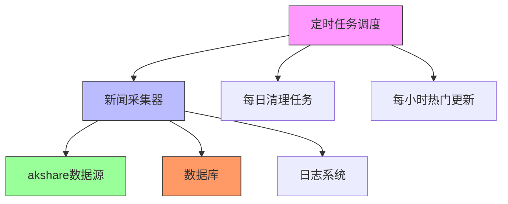
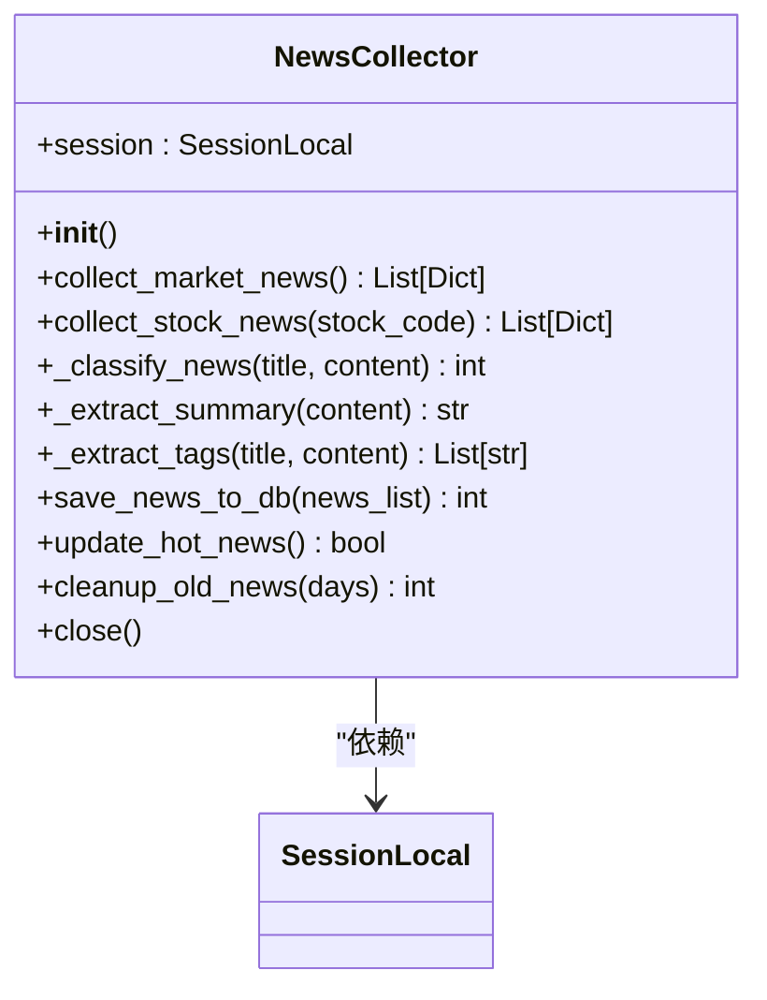
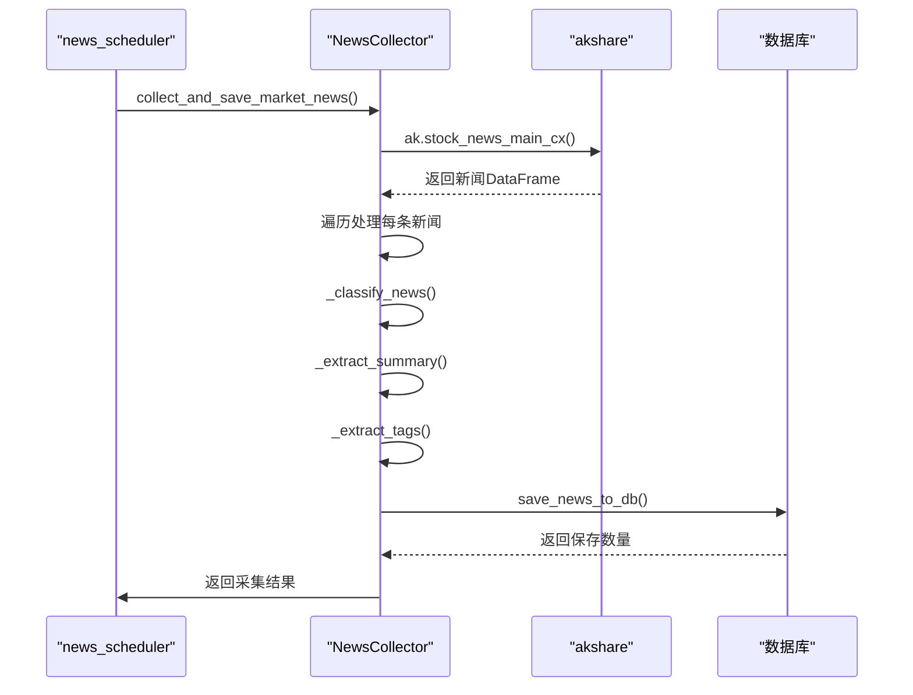
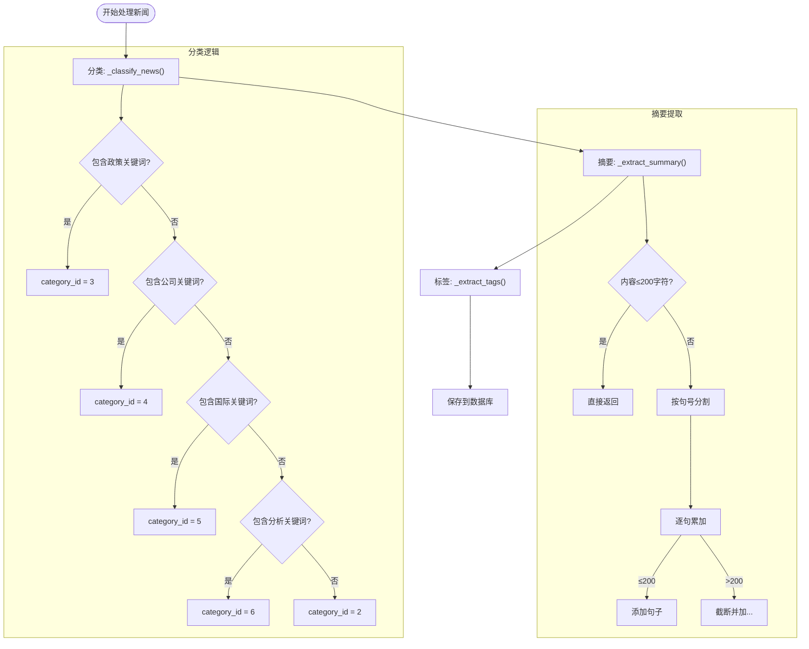
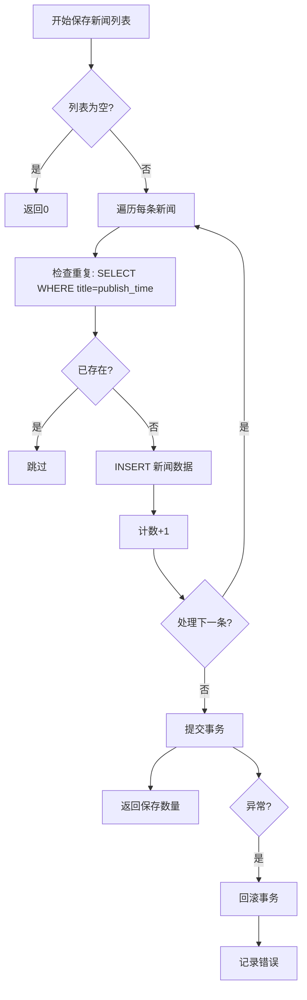
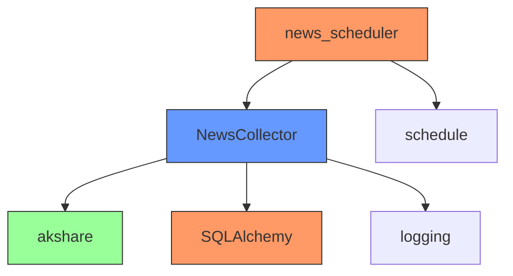

# 新闻数据采集器

<cite>
**本文档引用的文件**
- [news_collector.py](file://backend_core/data_collectors/news_collector.py)
- [news_scheduler.py](file://backend_core/schedulers/news_scheduler.py)
- [config.py](file://backend_core/config/config.py)
</cite>

## 目录
1. [简介](#简介)
2. [项目结构](#项目结构)
3. [核心组件](#核心组件)
4. [架构概述](#架构概述)
5. [详细组件分析](#详细组件分析)
6. [依赖分析](#依赖分析)
7. [性能考虑](#性能考虑)
8. [故障排除指南](#故障排除指南)
9. [结论](#结论)

## 简介
本文档全面记录了新闻数据采集器的实现细节，重点分析`NewsCollector`类的整体架构、初始化流程、市场新闻采集、新闻分类与处理、数据库操作以及定时任务调度策略。系统基于akshare库从财新网等来源采集市场新闻，并通过结构化处理、分类、摘要提取和标签生成，实现高质量新闻数据的自动化采集与管理。

## 项目结构
新闻采集功能主要分布在`backend_core/data_collectors/`和`backend_core/schedulers/`目录下，采用模块化设计，分离数据采集逻辑与调度逻辑，确保系统的可维护性和扩展性。

```mermaid
graph TB
subgraph "数据采集模块"
NC[news_collector.py]
Base[base.py]
end
subgraph "调度模块"
NS[news_scheduler.py]
end
NC --> NS : "提供采集接口"
NS --> NC : "调用采集任务"
```

**图示来源**
- [news_collector.py](file://backend_core/data_collectors/news_collector.py#L1-L50)
- [news_scheduler.py](file://backend_core/schedulers/news_scheduler.py#L1-L30)

**本节来源**
- [news_collector.py](file://backend_core/data_collectors/news_collector.py#L1-L50)
- [news_scheduler.py](file://backend_core/schedulers/news_scheduler.py#L1-L30)

## 核心组件
`NewsCollector`类是新闻采集系统的核心，负责从akshare获取新闻数据、进行结构化处理、分类、摘要提取、标签生成，并将结果保存至数据库。同时提供热门资讯更新和旧新闻清理功能。

**本节来源**
- [news_collector.py](file://backend_core/data_collectors/news_collector.py#L25-L100)

## 架构概述
系统采用分层架构，分为数据采集层、数据处理层、数据存储层和任务调度层。`NewsCollector`类封装了从数据获取到存储的完整流程，`news_scheduler.py`通过`schedule`库实现定时任务调度。



**图示来源**
- [news_collector.py](file://backend_core/data_collectors/news_collector.py#L1-L50)
- [news_scheduler.py](file://backend_core/schedulers/news_scheduler.py#L1-L50)

## 详细组件分析

### NewsCollector 类分析
`NewsCollector`类实现了完整的新闻采集与处理流程，包含初始化、新闻采集、分类、摘要提取、标签生成、数据库操作等核心功能。

#### 初始化流程


**图示来源**
- [news_collector.py](file://backend_core/data_collectors/news_collector.py#L15-L40)

#### 市场新闻采集流程


**图示来源**
- [news_collector.py](file://backend_core/data_collectors/news_collector.py#L50-L150)
- [news_scheduler.py](file://backend_core/schedulers/news_scheduler.py#L30-L50)

#### 新闻处理算法


**图示来源**
- [news_collector.py](file://backend_core/data_collectors/news_collector.py#L200-L350)

### 数据库操作分析
`save_news_to_db()`方法实现了新闻数据的去重插入机制，通过标题和发布时间的组合判断是否为重复新闻，确保数据的唯一性。



**图示来源**
- [news_collector.py](file://backend_core/data_collectors/news_collector.py#L350-L400)

**本节来源**
- [news_collector.py](file://backend_core/data_collectors/news_collector.py#L1-L428)

## 依赖分析
系统主要依赖akshare库获取新闻数据，SQLAlchemy进行数据库操作，schedule库实现定时任务。`NewsCollector`类依赖数据库会话，`news_scheduler`依赖`NewsCollector`提供的接口。



**图示来源**
- [news_collector.py](file://backend_core/data_collectors/news_collector.py#L1-L20)
- [news_scheduler.py](file://backend_core/schedulers/news_scheduler.py#L1-L20)

**本节来源**
- [news_collector.py](file://backend_core/data_collectors/news_collector.py#L1-L50)
- [news_scheduler.py](file://backend_core/schedulers/news_scheduler.py#L1-L50)

## 性能考虑
系统在性能方面进行了多项优化：批量处理新闻数据、使用数据库事务、合理的异常处理机制、定时任务的合理调度间隔（30分钟采集、1小时更新、每日清理），避免对源站和数据库造成过大压力。

## 故障排除指南
常见问题包括akshare连接失败、数据库连接异常、新闻重复采集等。系统通过完善的日志记录（INFO、ERROR级别）和异常捕获机制，便于问题定位。建议检查网络连接、数据库状态、akshare服务可用性。

**本节来源**
- [news_collector.py](file://backend_core/data_collectors/news_collector.py#L100-L200)
- [news_scheduler.py](file://backend_core/schedulers/news_scheduler.py#L80-L110)

## 结论
新闻数据采集器实现了从财新网等来源自动化采集市场新闻的完整流程，具备新闻分类、摘要提取、标签生成、去重存储、热门更新和旧新闻清理等完整功能。通过`news_scheduler`的定时任务配置，实现了市场新闻采集、热门资讯更新和旧新闻清理的自动化调度，为股票分析系统提供了稳定可靠的新闻数据支持。