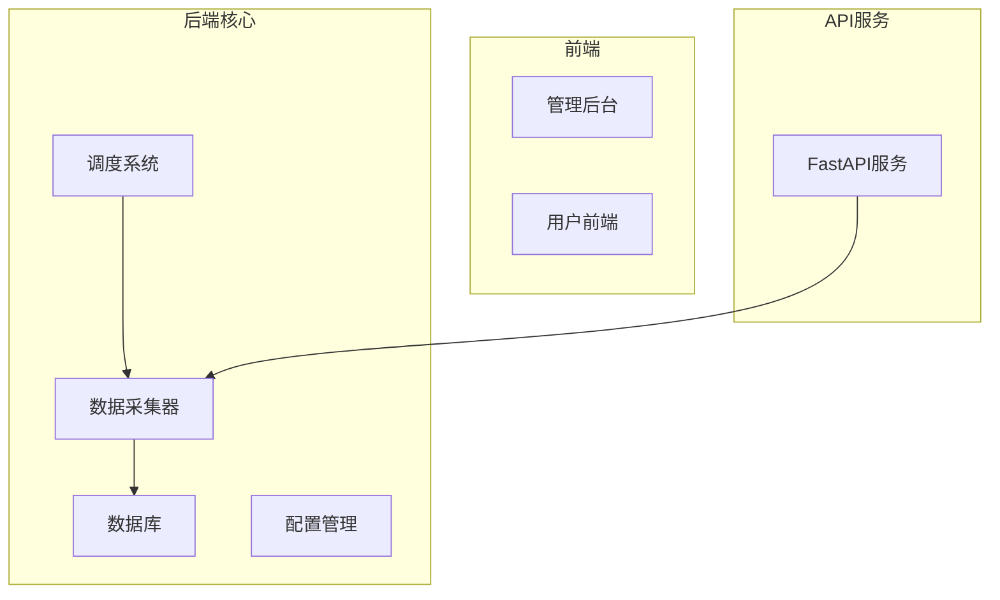
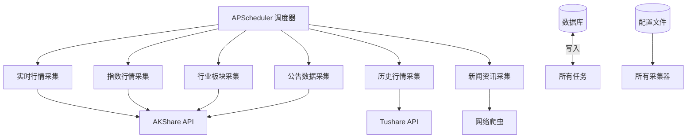
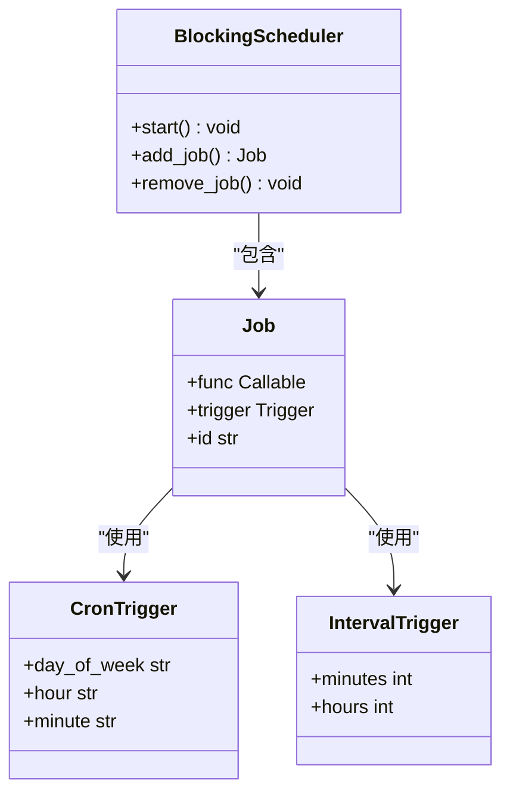
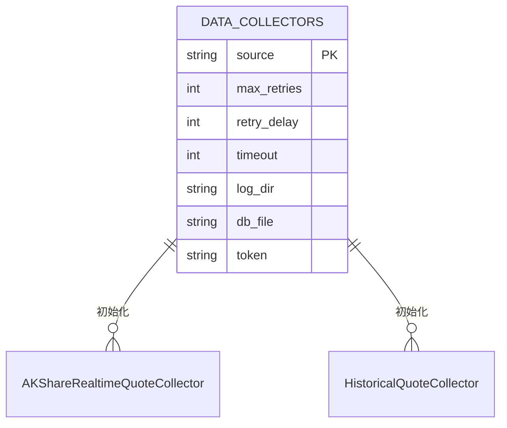
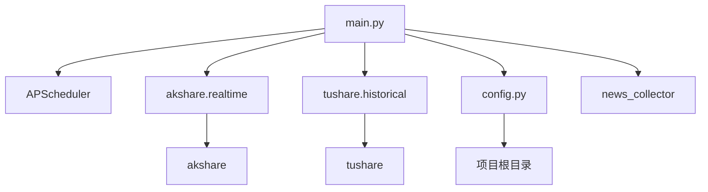

# 采集任务调度

<cite>
**本文档引用文件**   
- [main.py](file://backend_core/data_collectors/main.py)
- [news_scheduler.py](file://backend_core/schedulers/news_scheduler.py)
- [config.py](file://backend_core/config/config.py)
- [realtime.py](file://backend_core/data_collectors/akshare/realtime.py)
- [historical.py](file://backend_core/data_collectors/tushare/historical.py)
- [akshare/base.py](file://backend_core/data_collectors/akshare/base.py)
- [tushare/base.py](file://backend_core/data_collectors/tushare/base.py)
</cite>

## 目录
1. [引言](#引言)
2. [项目结构](#项目结构)
3. [核心组件](#核心组件)
4. [架构概述](#架构概述)
5. [详细组件分析](#详细组件分析)
6. [依赖分析](#依赖分析)
7. [性能考量](#性能考量)
8. [故障排查指南](#故障排查指南)
9. [结论](#结论)

## 引言
本文档深入解析股票分析软件中数据采集任务的调度机制。重点分析基于APScheduler的定时任务管理系统，涵盖任务触发策略、采集器初始化、异常处理与运维监控等方面，旨在为开发者和运维人员提供全面的技术参考。

## 项目结构
项目采用分层架构设计，核心数据采集功能集中于`backend_core`模块。调度系统通过`data_collectors/main.py`统一管理各类采集任务，配置信息由`config/config.py`提供，各数据源（如AKShare、Tushare）拥有独立的采集器实现。

**图示来源**
- [main.py](file://backend_core/data_collectors/main.py#L1-L243)
- [config.py](file://backend_core/config/config.py#L1-L47)

**本节来源**
- [main.py](file://backend_core/data_collectors/main.py#L1-L243)
- [config.py](file://backend_core/config/config.py#L1-L47)

## 核心组件
系统核心组件包括基于APScheduler的调度器、各类数据采集器（实时、历史、新闻等）以及统一的配置管理模块。调度器负责按预设策略触发采集任务，采集器负责具体的数据获取与存储，配置管理则为各组件提供运行时参数。

**本节来源**
- [main.py](file://backend_core/data_collectors/main.py#L1-L243)
- [config.py](file://backend_core/config/config.py#L1-L47)

## 架构概述
系统采用模块化设计，以`BlockingScheduler`为核心，集成多个独立的数据采集任务。通过`cron`表达式和`interval`间隔两种方式灵活调度任务，确保不同类型的数据按需采集。采集器通过统一的基类实现重试、日志等通用功能，保证了系统的健壮性。

**图示来源**
- [main.py](file://backend_core/data_collectors/main.py#L1-L243)
- [news_scheduler.py](file://backend_core/schedulers/news_scheduler.py#L1-L112)

## 详细组件分析

### 采集任务调度机制分析
系统使用APScheduler库实现任务调度，`BlockingScheduler`确保调度器在主线程中持续运行，适合长期驻留的后台服务。

#### 调度器选择依据
`BlockingScheduler`被选为默认调度器，因其简单可靠，适用于单进程、长时间运行的应用场景。所有任务均在主线程中执行，避免了多线程环境下的复杂同步问题。

**图示来源**
- [main.py](file://backend_core/data_collectors/main.py#L1-L243)

#### 采集任务函数分析
各采集任务函数封装了具体的业务逻辑，通过异常捕获确保单个任务失败不影响整体调度。

##### 实时行情采集任务
`collect_akshare_realtime`函数负责采集A股实时行情，每15分钟在交易时段执行一次。

**本节来源**
- [main.py](file://backend_core/data_collectors/main.py#L25-L45)

##### 历史行情采集任务
`collect_tushare_historical`函数负责采集前一日的历史行情数据，每日上午10:13执行。

**本节来源**
- [main.py](file://backend_core/data_collectors/main.py#L47-L69)

### 任务触发策略分析
系统根据数据特性和业务需求，采用不同的触发策略。

#### Cron表达式应用
用于精确控制任务执行时间，如：
- `day_of_week='mon-fri', hour='9-12,13-17', minute='1,16,31,46'`：在交易日的交易时段内，每15分钟执行一次实时行情采集。
- `hour=10, minute=13`：每天上午10:13执行历史行情采集。

**本节来源**
- [main.py](file://backend_core/data_collectors/main.py#L150-L155)

#### Interval间隔应用
用于周期性但无需精确到分钟的任务，如：
- `minutes=240`：每4小时采集一次A股公告数据。
- `hours=1`：每小时更新一次热门资讯。

**本节来源**
- [main.py](file://backend_core/data_collectors/main.py#L200-L205)

### 配置管理分析
`DATA_COLLECTORS`配置项为各采集器提供初始化参数，如重试次数、日志目录、数据库路径等。

**图示来源**
- [config.py](file://backend_core/config/config.py#L30-L47)
- [base.py](file://backend_core/data_collectors/akshare/base.py#L1-L231)

### 异常处理与日志记录
所有任务函数均使用try-except块捕获异常，确保调度器的稳定性。日志记录采用`logging`模块，输出到文件和控制台。

**本节来源**
- [main.py](file://backend_core/data_collectors/main.py#L25-L45)
- [base.py](file://backend_core/data_collectors/akshare/base.py#L1-L231)

### 运维功能说明
#### 调度器启动流程
1. 初始化所有采集器实例。
2. 创建`BlockingScheduler`实例。
3. 添加所有定时任务。
4. 调用`scheduler.start()`启动调度循环。

**本节来源**
- [main.py](file://backend_core/data_collectors/main.py#L220-L243)

#### 任务增删改查
通过`scheduler.add_job()`、`scheduler.remove_job()`等方法实现任务的动态管理。

**本节来源**
- [main.py](file://backend_core/data_collectors/main.py#L150-L215)

#### 运行状态监控
通过日志文件和控制台输出监控任务执行状态，未来可扩展为API接口查询。

**本节来源**
- [main.py](file://backend_core/data_collectors/main.py#L25-L45)

## 依赖分析
系统依赖关系清晰，`main.py`作为调度中枢，依赖于各采集器模块和配置模块。采集器模块又依赖于APScheduler、akshare、tushare等第三方库。

**图示来源**
- [main.py](file://backend_core/data_collectors/main.py#L1-L243)
- [config.py](file://backend_core/config/config.py#L1-L47)

## 性能考量
- **重试机制**：基类`AKShareCollector`提供`_retry_on_failure`方法，避免因网络波动导致任务失败。
- **数据库优化**：批量提交事务，减少I/O开销。
- **资源管理**：合理设置任务间隔，避免API调用频率超限。

**本节来源**
- [base.py](file://backend_core/data_collectors/akshare/base.py#L1-L231)
- [historical.py](file://backend_core/data_collectors/tushare/historical.py#L1-L315)

## 故障排查指南
- **任务未执行**：检查cron表达式是否正确，确认系统时间与交易日历。
- **采集失败**：查看日志文件，确认网络连接和API密钥状态。
- **数据库错误**：检查数据库连接和表结构，确认外键约束。

**本节来源**
- [main.py](file://backend_core/data_collectors/main.py#L25-L45)
- [base.py](file://backend_core/data_collectors/akshare/base.py#L1-L231)

## 结论
本文档详细解析了股票分析软件的数据采集调度机制。系统通过APScheduler实现了灵活、可靠的定时任务管理，结合合理的异常处理和日志记录，确保了数据采集的稳定性和可维护性。建议未来增加任务状态持久化和动态配置功能，以提升系统的灵活性。