# 核心引擎架构

<cite>
**本文档引用的文件**
- [realtime.py](file://backend_core/data_collectors/akshare/realtime.py)
- [historical.py](file://backend_core/data_collectors/akshare/historical.py)
- [daily_report_scheduler.py](file://backend_core/scheduler/daily_report_scheduler.py)
- [news_scheduler.py](file://backend_core/schedulers/news_scheduler.py)
- [historical_quotes.py](file://backend_core/models/historical_quotes.py)
- [watchlist.py](file://backend_core/models/watchlist.py)
- [config.py](file://backend_core/config/config.py)
- [db.py](file://backend_core/database/db.py)
- [base.py](file://backend_core/data_collectors/akshare/base.py)
- [tushare/realtime.py](file://backend_core/data_collectors/tushare/realtime.py)
- [tushare/historical.py](file://backend_core/data_collectors/tushare/historical.py)
- [main.py](file://backend_core/data_collectors/main.py)
</cite>

## 目录
1. [项目结构](#项目结构)
2. [数据采集器实现](#数据采集器实现)
3. [定时任务调度机制](#定时任务调度机制)
4. [核心数据模型](#核心数据模型)
5. [配置注入机制](#配置注入机制)
6. [与backend_api的集成](#与backend_api的集成)
7. [数据采集失败处理与重试机制](#数据采集失败处理与重试机制)
8. [性能监控实现](#性能监控实现)

## 项目结构

backend_core股票分析核心引擎采用模块化设计，主要包含以下几个核心目录：

- **data_collectors**: 数据采集器模块，包含基于AkShare和Tushare的数据采集实现
- **scheduler** 和 **schedulers**: 定时任务调度模块
- **models**: 核心数据模型定义
- **config**: 配置管理模块
- **database**: 数据库连接和管理模块

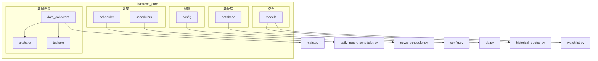

**图示来源**
- [realtime.py](file://backend_core/data_collectors/akshare/realtime.py)
- [historical.py](file://backend_core/data_collectors/akshare/historical.py)
- [daily_report_scheduler.py](file://backend_core/scheduler/daily_report_scheduler.py)
- [news_scheduler.py](file://backend_core/schedulers/news_scheduler.py)
- [historical_quotes.py](file://backend_core/models/historical_quotes.py)
- [watchlist.py](file://backend_core/models/watchlist.py)
- [config.py](file://backend_core/config/config.py)
- [db.py](file://backend_core/database/db.py)

**本节来源**
- [realtime.py](file://backend_core/data_collectors/akshare/realtime.py)
- [historical.py](file://backend_core/data_collectors/akshare/historical.py)
- [daily_report_scheduler.py](file://backend_core/scheduler/daily_report_scheduler.py)
- [news_scheduler.py](file://backend_core/schedulers/news_scheduler.py)

## 数据采集器实现

backend_core引擎实现了基于AkShare和Tushare两个数据源的数据采集器，分别负责实时数据和历史数据的采集。

### AkShare数据采集器

AkShare数据采集器通过`akshare`目录下的模块实现，主要包含实时数据采集和历史数据采集两个部分。

#### 实时数据采集

`AkshareRealtimeQuoteCollector`类负责采集股票实时行情数据。该类继承自`AKShareCollector`基类，实现了`collect_quotes`方法来获取实时行情数据。

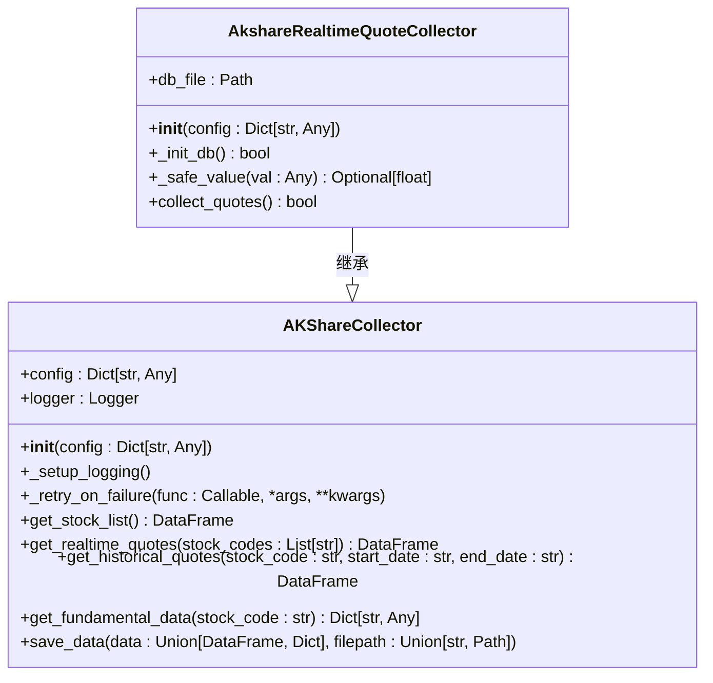

**图示来源**
- [realtime.py](file://backend_core/data_collectors/akshare/realtime.py)
- [base.py](file://backend_core/data_collectors/akshare/base.py)

**本节来源**
- [realtime.py](file://backend_core/data_collectors/akshare/realtime.py)
- [base.py](file://backend_core/data_collectors/akshare/base.py)

#### 历史数据采集

`HistoricalQuoteCollector`类负责采集指定日期的历史行情数据。该类同样继承自`AKShareCollector`基类，实现了`collect_quotes`方法来获取历史行情数据。

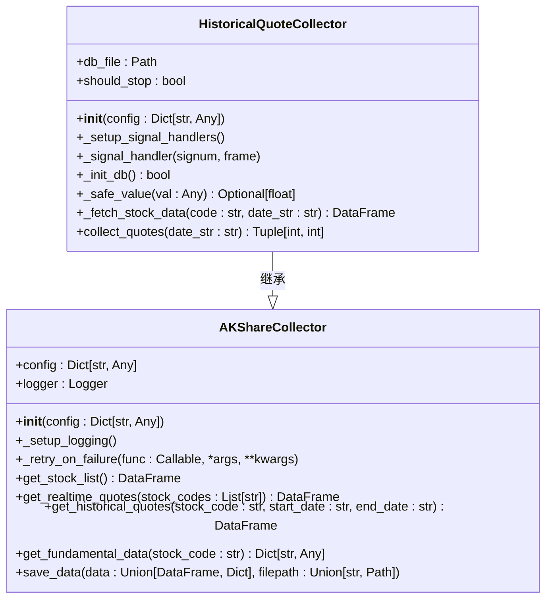

**图示来源**
- [historical.py](file://backend_core/data_collectors/akshare/historical.py)
- [base.py](file://backend_core/data_collectors/akshare/base.py)

**本节来源**
- [historical.py](file://backend_core/data_collectors/akshare/historical.py)
- [base.py](file://backend_core/data_collectors/akshare/base.py)

### Tushare数据采集器

Tushare数据采集器通过`tushare`目录下的模块实现，同样包含实时数据采集和历史数据采集两个部分。

#### 实时数据采集

`RealtimeQuoteCollector`类负责通过Tushare接口采集实时行情数据。

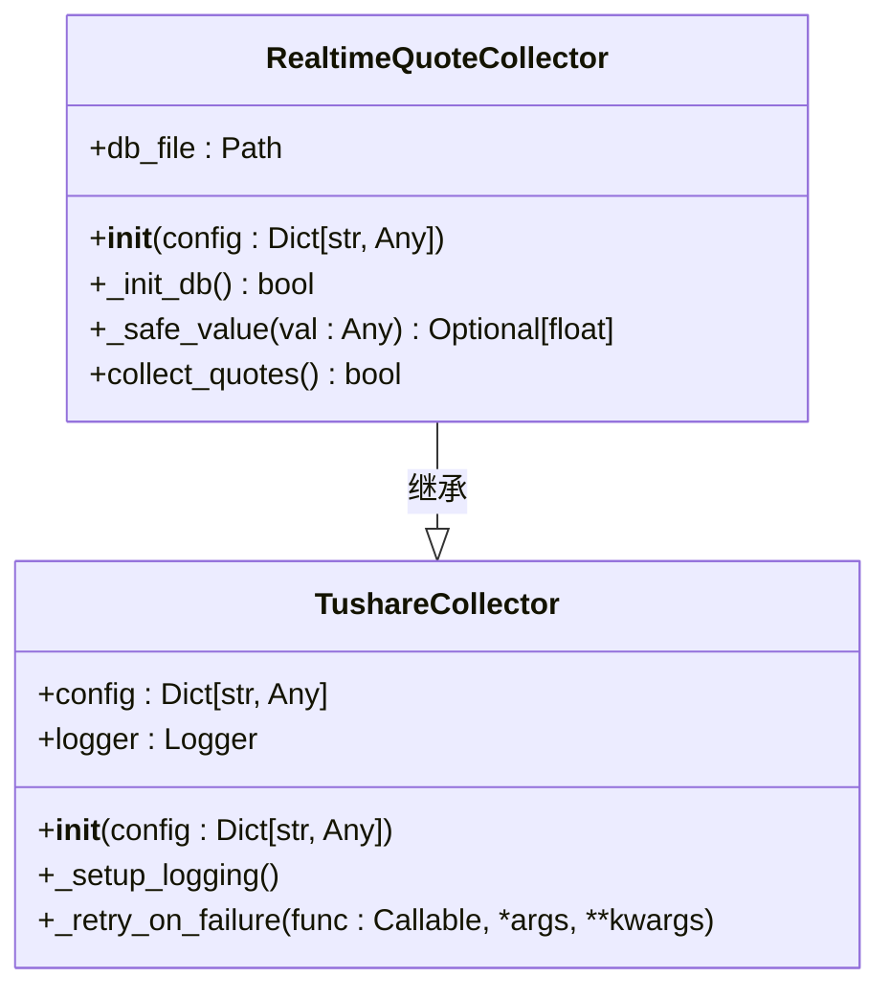

**图示来源**
- [tushare/realtime.py](file://backend_core/data_collectors/tushare/realtime.py)
- [tushare/base.py](file://backend_core/data_collectors/tushare/base.py)

**本节来源**
- [tushare/realtime.py](file://backend_core/data_collectors/tushare/realtime.py)

#### 历史数据采集

`HistoricalQuoteCollector`类负责通过Tushare接口采集历史行情数据，并在数据采集完成后自动计算扩展涨跌幅（5日、10日、60日）。

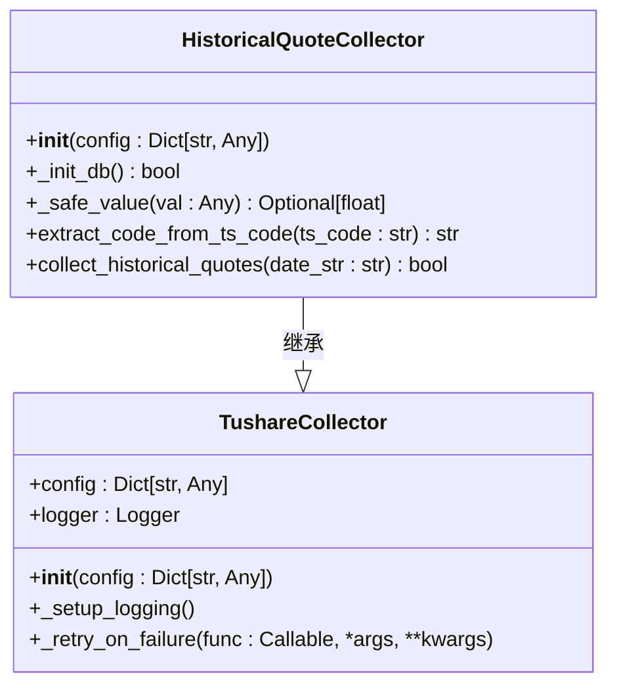

**图示来源**
- [tushare/historical.py](file://backend_core/data_collectors/tushare/historical.py)
- [tushare/base.py](file://backend_core/data_collectors/tushare/base.py)

**本节来源**
- [tushare/historical.py](file://backend_core/data_collectors/tushare/historical.py)

## 定时任务调度机制

backend_core引擎通过`scheduler`和`schedulers`目录中的模块实现定时任务调度机制。

### 日报生成调度

`DailyReportScheduler`类负责每日报告的生成和发送。该类使用`schedule`库来安排定时任务，在每天上午9:30和下午15:30发送每日股票报告。

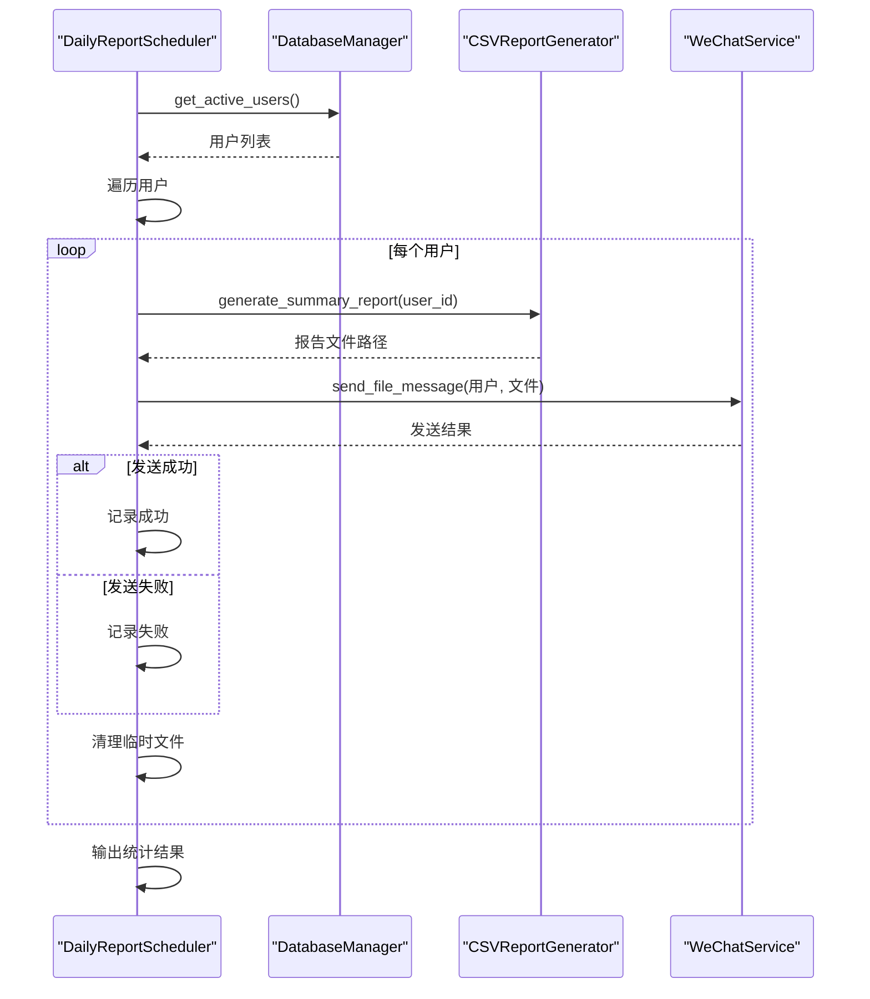

**图示来源**
- [daily_report_scheduler.py](file://backend_core/scheduler/daily_report_scheduler.py)

**本节来源**
- [daily_report_scheduler.py](file://backend_core/scheduler/daily_report_scheduler.py)

### 资讯采集调度

`news_scheduler.py`模块负责资讯采集的定时任务，包括市场新闻采集、热门资讯更新和旧新闻清理。

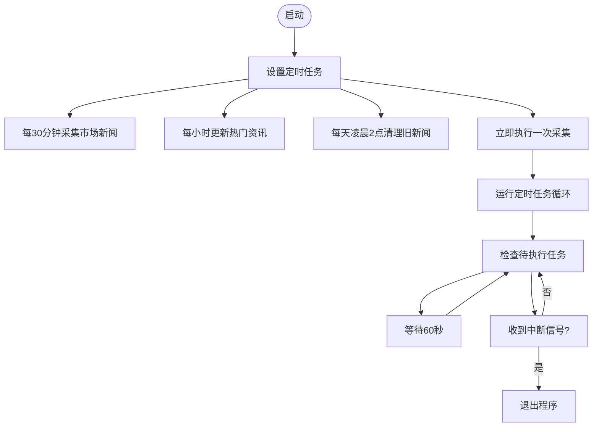

**图示来源**
- [news_scheduler.py](file://backend_core/schedulers/news_scheduler.py)

**本节来源**
- [news_scheduler.py](file://backend_core/schedulers/news_scheduler.py)

## 核心数据模型

backend_core引擎在`models`目录中定义了核心数据模型，主要包括历史行情和自选股列表。

### 历史行情数据模型

`HistoricalQuotes`类定义了历史行情数据的结构，映射到数据库中的`historical_quotes`表。

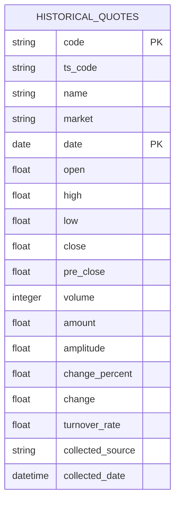

**图示来源**
- [historical_quotes.py](file://backend_core/models/historical_quotes.py)

**本节来源**
- [historical_quotes.py](file://backend_core/models/historical_quotes.py)

### 自选股数据模型

`Watchlist`类定义了自选股列表的结构，映射到数据库中的`watchlist`表。

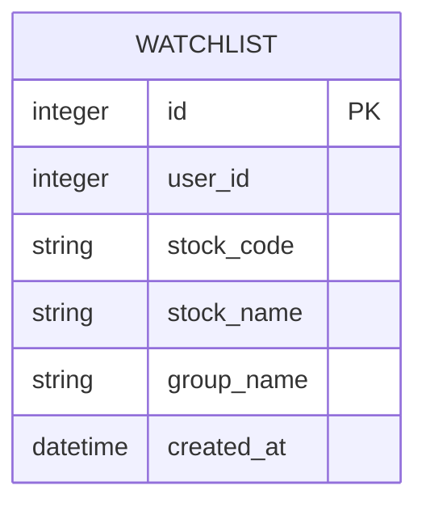

**图示来源**
- [watchlist.py](file://backend_core/models/watchlist.py)

**本节来源**
- [watchlist.py](file://backend_core/models/watchlist.py)

## 配置注入机制

backend_core引擎通过`config.py`文件实现配置注入机制，支持多环境部署。

### 配置结构

配置文件定义了项目根目录、数据库目录以及Tushare和数据采集器的具体配置。

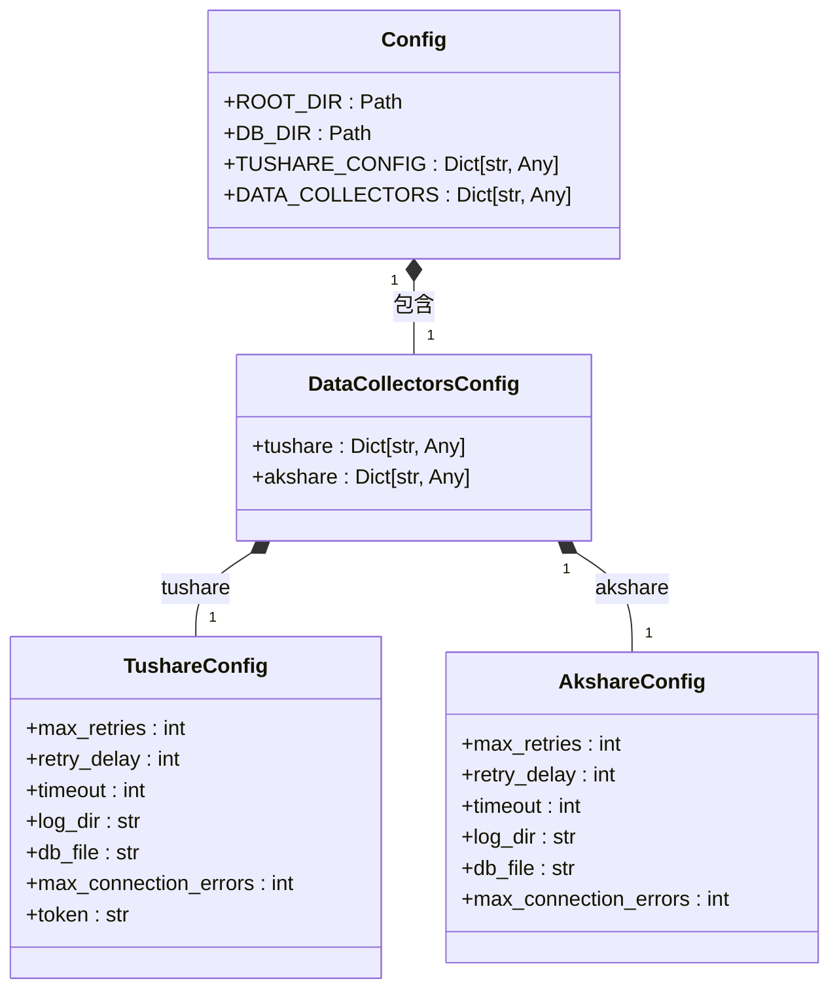

**图示来源**
- [config.py](file://backend_core/config/config.py)

**本节来源**
- [config.py](file://backend_core/config/config.py)

## 与backend_api的集成

backend_core核心引擎可以被backend_api调用，也可以独立运行数据采集任务。

### 核心引擎调用流程

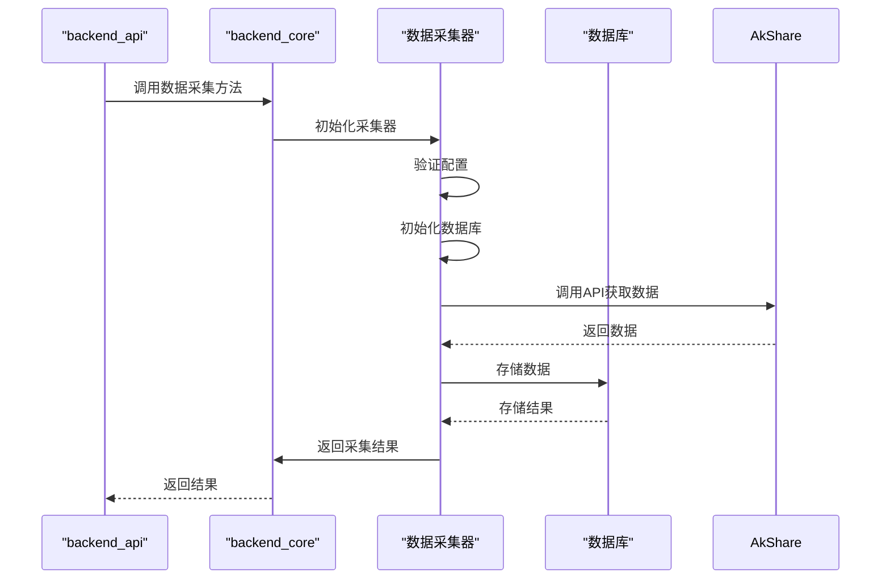

**本节来源**
- [realtime.py](file://backend_core/data_collectors/akshare/realtime.py)
- [historical.py](file://backend_core/data_collectors/akshare/historical.py)
- [main.py](file://backend_core/data_collectors/main.py)

## 数据采集失败处理与重试机制

backend_core引擎实现了完善的数据采集失败处理和重试机制。

### 重试机制实现

`AKShareCollector`基类中的`_retry_on_failure`方法实现了通用的重试机制，支持配置最大重试次数和重试延迟。

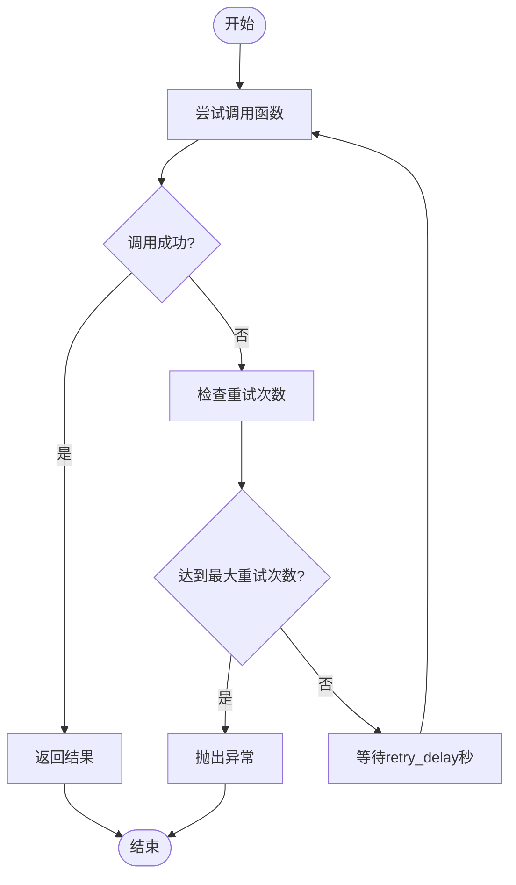

**图示来源**
- [base.py](file://backend_core/data_collectors/akshare/base.py)

**本节来源**
- [base.py](file://backend_core/data_collectors/akshare/base.py)

### 数据库操作重试

在处理数据库操作时，特别是插入操作，引擎实现了针对锁冲突和死锁的重试机制。

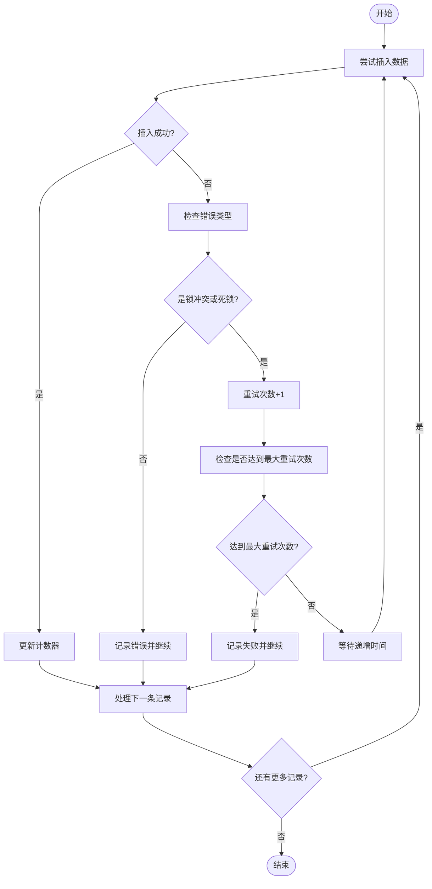

**本节来源**
- [realtime.py](file://backend_core/data_collectors/akshare/realtime.py)
- [tushare/historical.py](file://backend_core/data_collectors/tushare/historical.py)

## 性能监控实现

backend_core引擎通过多种方式实现性能监控。

### 数据库连接优化

在`db.py`文件中，数据库连接配置包含了多项性能优化参数：

```python
engine = create_engine(
    DATABASE_URL, 
    echo=False,
    pool_size=10,
    max_overflow=20,
    pool_pre_ping=True,
    pool_recycle=3600,
    connect_args={
        "options": "-c deadlock_timeout=1s -c lock_timeout=5s -c statement_timeout=30s"
    }
)
```

这些配置参数包括：
- **连接池大小**: 10个连接
- **最大溢出连接数**: 20个
- **连接前ping检查**: 确保连接有效性
- **连接回收时间**: 3600秒
- **死锁超时**: 1秒
- **锁超时**: 5秒
- **语句超时**: 30秒

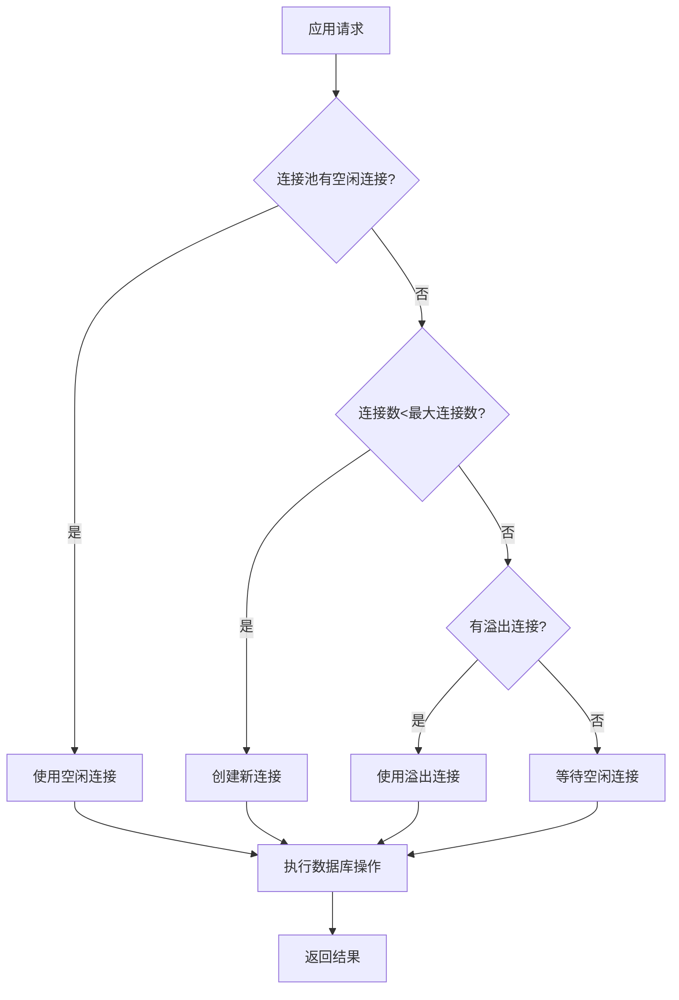

**图示来源**
- [db.py](file://backend_core/database/db.py)

**本节来源**
- [db.py](file://backend_core/database/db.py)

### 日志监控

引擎通过详细的日志记录来监控性能和错误情况。每个采集器都有独立的日志文件，记录关键操作的执行情况。

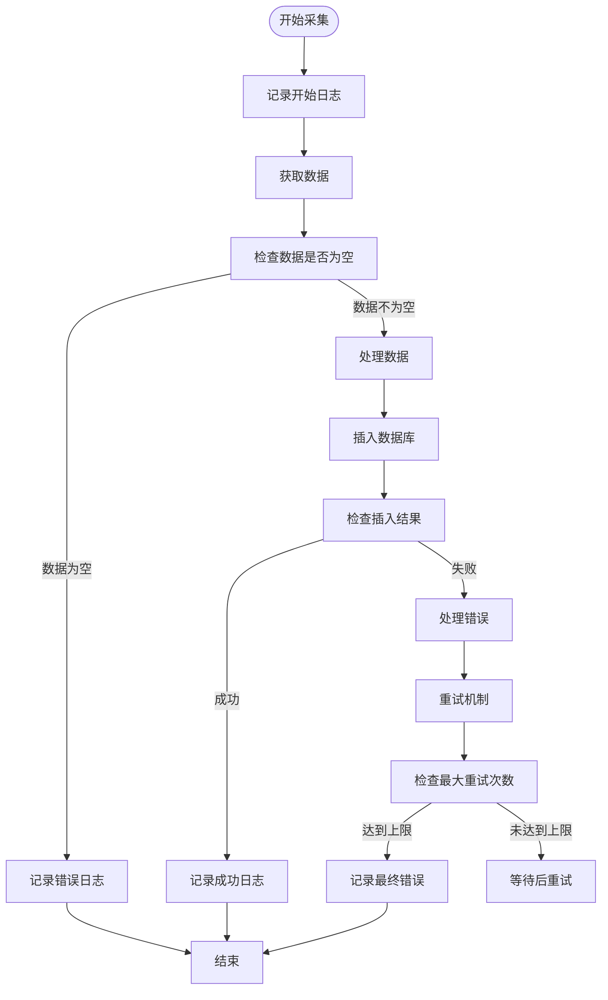

**本节来源**
- [realtime.py](file://backend_core/data_collectors/akshare/realtime.py)
- [historical.py](file://backend_core/data_collectors/akshare/historical.py)