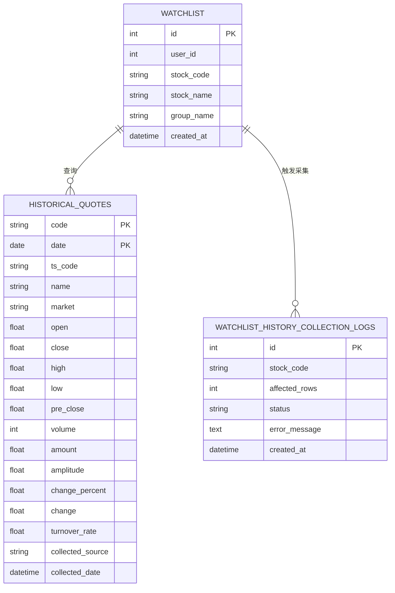

# 核心数据模型

<cite>
**本文档引用的文件**  
- [historical_quotes.py](file://backend_core/models/historical_quotes.py)
- [watchlist.py](file://backend_core/models/watchlist.py)
- [watchlist_history_collection_logs.py](file://backend_core/models/watchlist_history_collection_logs.py)
- [db.py](file://backend_core/database/db.py)
</cite>

## 目录
1. [引言](#引言)
2. [项目结构概述](#项目结构概述)
3. [核心数据模型详解](#核心数据模型详解)
4. [数据库连接与会话管理](#数据库连接与会话管理)
5. [实体关系图与字段字典](#实体关系图与字段字典)
6. [数据生命周期与存储优化](#数据生命周期与存储优化)
7. [查询性能考量](#查询性能考量)
8. [模型迁移与版本升级](#模型迁移与版本升级)
9. [数据一致性保障方案](#数据一致性保障方案)
10. [结论](#结论)

## 引言
本文档旨在全面阐述`backend_core`模块中的核心数据模型设计，涵盖历史行情数据、自选股列表、采集日志记录以及数据库连接机制。通过详细分析各模型的字段定义、索引策略、关联关系及生命周期管理，为系统维护、性能优化和后续扩展提供权威参考。

## 项目结构概述
`backend_core`作为股票分析系统的核心数据处理模块，其主要结构包括：
- `models/`：定义所有数据库实体模型
- `database/`：提供数据库连接与会话管理
- `data_collectors/`：实现多源数据采集逻辑
- `config/`：系统配置管理
- `schedulers/`：定时任务调度

**Section sources**
- [historical_quotes.py](file://backend_core/models/historical_quotes.py#L1-L27)
- [watchlist.py](file://backend_core/models/watchlist.py#L1-L11)
- [watchlist_history_collection_logs.py](file://backend_core/models/watchlist_history_collection_logs.py#L1-L11)
- [db.py](file://backend_core/database/db.py#L1-L32)

## 核心数据模型详解

### 历史行情数据模型 (historical_quotes.py)
`HistoricalQuotes`模型用于存储股票的历史交易数据，其核心设计特点如下：

- **复合主键**：由`code`（股票代码）和`date`（交易日期）共同构成，确保每日行情数据的唯一性
- **关键行情字段**：包含开盘价(`open`)、收盘价(`close`)、最高价(`high`)、最低价(`low`)、成交量(`volume`)、成交额(`amount`)等标准K线数据
- **衍生指标**：提供振幅(`amplitude`)、涨跌额(`change`)、涨跌幅(`change_percent`)、换手率(`turnover_rate`)等计算字段
- **元数据**：记录数据来源(`collected_source`)和入库时间(`collected_date`)
- **扩展字段**：包含`ts_code`（TS代码）、`name`（股票名称）、`market`（市场类型）等辅助信息

该模型支持高效的时间序列查询和跨市场数据整合。

**Section sources**
- [historical_quotes.py](file://backend_core/models/historical_quotes.py#L1-L27)

### 自选股列表模型 (watchlist.py)
`Watchlist`模型实现用户自选股功能，关键设计如下：

- **用户关联**：通过`user_id`字段与用户系统建立关联，支持多用户独立管理
- **股票标识**：使用`stock_code`和`stock_name`存储股票代码和名称
- **分组管理**：`group_name`字段支持用户自定义分组，默认为"default"
- **时间戳**：`created_at`记录条目创建时间，支持按时间排序和审计
- **主键设计**：采用自增整数`id`作为主键，保证数据插入效率

该模型支持用户个性化投资组合管理。

**Section sources**
- [watchlist.py](file://backend_core/models/watchlist.py#L1-L11)

### 采集任务日志模型 (watchlist_history_collection_logs.py)
`WatchlistHistoryCollectionLogs`模型用于追踪自选股历史数据采集任务的执行情况：

- **任务标识**：`stock_code`记录被采集的股票代码
- **执行结果**：`affected_rows`统计影响的行数，`status`记录任务状态（如"success"、"failed"）
- **错误处理**：`error_message`存储详细的错误信息，便于故障排查
- **时间追踪**：`created_at`记录日志生成时间，支持按时间范围查询
- **主键设计**：自增`id`确保每条日志的唯一性

该模型为系统监控和运维提供了关键数据支持。

**Section sources**
- [watchlist_history_collection_logs.py](file://backend_core/models/watchlist_history_collection_logs.py#L1-L11)

## 数据库连接与会话管理
`db.py`模块实现了稳健的数据库连接和会话管理机制：

- **连接配置**：使用PostgreSQL作为后端数据库，通过`DATABASE_URL`配置连接字符串
- **连接池优化**：
  - `pool_size=10`：基础连接池大小
  - `max_overflow=20`：最大溢出连接数
  - `pool_pre_ping=True`：连接前健康检查
  - `pool_recycle=3600`：每小时回收连接，防止长连接问题
- **死锁预防**：通过`connect_args`设置关键超时参数：
  - `deadlock_timeout=1s`：死锁检测超时
  - `lock_timeout=5s`：锁等待超时
  - `statement_timeout=30s`：SQL执行超时
- **事务隔离**：会话级别设置`READ COMMITTED`隔离级别，平衡一致性和性能
- **依赖注入**：`get_db()`函数采用生成器模式，确保会话正确关闭，防止资源泄漏

该实现确保了高并发场景下的数据库稳定性和性能。

**Section sources**
- [db.py](file://backend_core/database/db.py#L1-L32)

## 实体关系图与字段字典

**Diagram sources**
- [historical_quotes.py](file://backend_core/models/historical_quotes.py#L1-L27)
- [watchlist.py](file://backend_core/models/watchlist.py#L1-L11)
- [watchlist_history_collection_logs.py](file://backend_core/models/watchlist_history_collection_logs.py#L1-L11)

### 字段字典

| 模型 | 字段 | 类型 | 是否主键 | 是否可为空 | 说明 |
|------|------|------|----------|------------|------|
| HistoricalQuotes | code | String | 是 | 否 | 股票代码 |
| HistoricalQuotes | date | Date | 是 | 否 | 交易日期 |
| HistoricalQuotes | open | Float | 否 | 是 | 开盘价 |
| HistoricalQuotes | close | Float | 否 | 是 | 收盘价 |
| HistoricalQuotes | high | Float | 否 | 是 | 最高价 |
| HistoricalQuotes | low | Float | 否 | 是 | 最低价 |
| HistoricalQuotes | volume | Integer | 否 | 是 | 成交量 |
| HistoricalQuotes | amount | Float | 否 | 是 | 成交额 |
| HistoricalQuotes | change_percent | Float | 否 | 是 | 涨跌幅 |
| HistoricalQuotes | turnover_rate | Float | 否 | 是 | 换手率 |
| HistoricalQuotes | collected_source | String | 否 | 是 | 数据来源 |
| HistoricalQuotes | collected_date | DateTime | 否 | 是 | 入库时间 |
| Watchlist | id | Integer | 是 | 否 | 自增主键 |
| Watchlist | user_id | Integer | 否 | 否 | 用户ID |
| Watchlist | stock_code | String | 否 | 否 | 股票代码 |
| Watchlist | stock_name | String | 否 | 否 | 股票名称 |
| Watchlist | group_name | String | 否 | 是 | 分组名称 |
| Watchlist | created_at | DateTime | 否 | 是 | 创建时间 |
| WatchlistHistoryCollectionLogs | id | Integer | 是 | 否 | 自增主键 |
| WatchlistHistoryCollectionLogs | stock_code | String | 否 | 否 | 股票代码 |
| WatchlistHistoryCollectionLogs | affected_rows | Integer | 否 | 是 | 影响行数 |
| WatchlistHistoryCollectionLogs | status | String | 否 | 是 | 任务状态 |
| WatchlistHistoryCollectionLogs | error_message | Text | 否 | 是 | 错误信息 |
| WatchlistHistoryCollectionLogs | created_at | DateTime | 否 | 是 | 创建时间 |

**Section sources**
- [historical_quotes.py](file://backend_core/models/historical_quotes.py#L1-L27)
- [watchlist.py](file://backend_core/models/watchlist.py#L1-L11)
- [watchlist_history_collection_logs.py](file://backend_core/models/watchlist_history_collection_logs.py#L1-L11)

## 数据生命周期与存储优化

### 数据生命周期
- **历史行情数据**：长期存储，支持多年历史数据分析
- **自选股列表**：永久存储，随用户账户生命周期管理
- **采集日志**：保留30天，定期归档或清理

### 存储优化策略
1. **索引优化**：
   - `historical_quotes`表：在`code`和`date`上建立复合索引（主键自动索引）
   - `watchlist`表：在`user_id`和`stock_code`上建立复合索引
   - `watchlist_history_collection_logs`表：在`stock_code`和`created_at`上建立复合索引

2. **分区策略**：
   - 建议对`historical_quotes`表按年份进行范围分区，提升大数据量查询性能
   - 建议对`watchlist_history_collection_logs`表按月份进行分区，便于日志清理

3. **数据类型优化**：
   - 使用`Date`类型存储交易日期，减少存储空间
   - 使用`Integer`存储成交量，避免浮点数精度问题
   - 使用`Text`类型存储长错误信息，避免长度限制

**Section sources**
- [historical_quotes.py](file://backend_core/models/historical_quotes.py#L1-L27)
- [watchlist.py](file://backend_core/models/watchlist.py#L1-L11)
- [watchlist_history_collection_logs.py](file://backend_core/models/watchlist_history_collection_logs.py#L1-L11)

## 查询性能考量
1. **高频查询优化**：
   - 历史行情查询：确保`code`和`date`的复合主键能高效支持按股票和时间范围的查询
   - 自选股查询：通过`user_id`索引快速定位用户专属数据

2. **连接查询优化**：
   - 避免在高并发场景下进行多表JOIN
   - 必要时使用缓存层减少数据库压力

3. **批量操作优化**：
   - 数据采集使用批量插入而非单条插入
   - 日志记录采用异步写入或批量提交

4. **监控指标**：
   - 监控慢查询日志
   - 跟踪连接池使用率
   - 监测索引命中率

**Section sources**
- [historical_quotes.py](file://backend_core/models/historical_quotes.py#L1-L27)
- [watchlist.py](file://backend_core/models/watchlist.py#L1-L11)
- [watchlist_history_collection_logs.py](file://backend_core/models/watchlist_history_collection_logs.py#L1-L11)

## 模型迁移与版本升级
1. **迁移工具**：
   - 建议采用Alembic进行数据库迁移管理
   - 所有模型变更需通过迁移脚本执行

2. **版本控制**：
   - 每次模型变更生成新的迁移版本
   - 迁移脚本需包含升级和降级逻辑

3. **变更流程**：
   - 开发环境测试迁移脚本
   - 预发布环境验证数据一致性
   - 生产环境在低峰期执行

4. **兼容性考虑**：
   - 新增字段应允许为空或提供默认值
   - 删除字段前需确认无下游依赖
   - 修改字段类型需评估数据转换影响

**Section sources**
- [historical_quotes.py](file://backend_core/models/historical_quotes.py#L1-L27)
- [watchlist.py](file://backend_core/models/watchlist.py#L1-L11)
- [watchlist_history_collection_logs.py](file://backend_core/models/watchlist_history_collection_logs.py#L1-L11)

## 数据一致性保障方案
1. **事务管理**：
   - 关键操作使用数据库事务
   - 通过`get_db()`确保会话正确提交或回滚

2. **约束机制**：
   - 主键约束确保数据唯一性
   - 非空约束保证关键字段完整性

3. **应用层校验**：
   - 在数据写入前进行业务规则校验
   - 对异常情况提供明确的错误反馈

4. **监控与告警**：
   - 监控数据采集成功率
   - 对连续失败的任务触发告警
   - 定期校验数据完整性

5. **备份策略**：
   - 每日全量备份
   - 每小时增量备份
   - 备份数据异地存储

**Section sources**
- [db.py](file://backend_core/database/db.py#L1-L32)
- [historical_quotes.py](file://backend_core/models/historical_quotes.py#L1-L27)

## 结论
`backend_core`的核心数据模型设计充分考虑了股票分析系统的业务需求和技术要求。通过合理的实体设计、高效的索引策略和稳健的连接管理，为系统提供了可靠的数据基础。建议后续重点关注大数据量下的查询性能优化和自动化迁移流程的完善，以支持系统的持续演进。