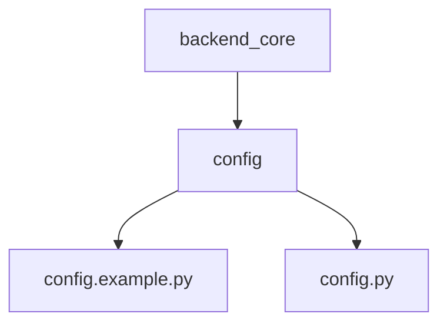
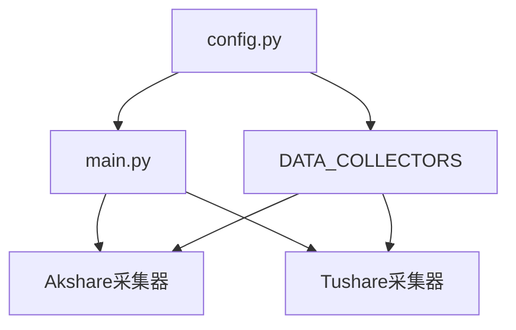

# 配置管理

<cite>
**本文档引用的文件**  
- [config.py](file://backend_core/config/config.py)
- [config.example.py](file://backend_core/config/config.example.py)
- [main.py](file://backend_core/data_collectors/main.py)
</cite>

## 目录
1. [简介](#简介)
2. [项目结构与配置文件组织](#项目结构与配置文件组织)
3. [核心配置项详解](#核心配置项详解)
4. [多环境配置支持机制](#多环境配置支持机制)
5. [敏感信息保护策略](#敏感信息保护策略)
6. [配置验证与动态加载](#配置验证与动态加载)
7. [实际配置示例](#实际配置示例)
8. [常见错误排查指南](#常见错误排查指南)
9. [总结](#总结)

## 简介
本系统通过 `backend_core` 模块中的配置管理系统实现对数据库连接、API密钥、调度参数等关键配置项的集中管理。配置系统设计支持开发、测试、生产等多环境切换，确保部署灵活性与安全性。本文档详细说明配置文件的结构、加载机制、安全策略及使用方法，帮助开发者正确配置和维护系统运行环境。

## 项目结构与配置文件组织



**Diagram sources**  
- [config.example.py](file://backend_core/config/config.example.py#L1-L153)
- [config.py](file://backend_core/config/config.py#L1-L48)

**Section sources**  
- [config.example.py](file://backend_core/config/config.example.py#L1-L153)
- [config.py](file://backend_core/config/config.py#L1-L48)

## 核心配置项详解

### 基础路径配置
系统使用 `pathlib.Path` 动态计算项目根目录和相关子目录路径，确保跨平台兼容性：
- `ROOT_DIR`：指向项目根目录
- `DB_DIR`：数据库文件存储路径，自动创建目录结构

### Tushare API 配置
```python
TUSHARE_CONFIG = {
    'token': '9701deb356e76d8d9918d797aff060ce90bd1a24339866c02444014f',
    'max_retries': 3,
    'timeout': 30
}
```
包含API访问令牌、最大重试次数和请求超时时间。

### 数据采集器配置
`DATA_COLLECTORS` 字典定义了多个数据源的采集参数：
- **akshare**：配置重试机制、超时、日志路径、数据库路径
- **tushare**：继承Tushare全局token，设置独立的采集参数

所有采集器通过 `main.py` 中的调度任务调用，并传入对应配置。

**Section sources**  
- [config.py](file://backend_core/config/config.py#L15-L48)
- [main.py](file://backend_core/data_collectors/main.py#L1-L244)

## 多环境配置支持机制

系统采用模板文件 `config.example.py` 作为配置原型，开发者需复制该文件为 `config.py` 并根据实际环境修改。此机制实现：
- **环境隔离**：不同部署环境使用独立的 `config.py`
- **版本控制安全**：`config.py` 被 `.gitignore` 忽略，防止敏感信息泄露
- **快速切换**：只需替换 `config.py` 即可切换环境

`config.example.py` 提供完整的配置结构示例，包括：
- 数据库连接（SQLite、Redis、MongoDB）
- 多个数据源（akshare、tushare、sina）
- 分析引擎参数
- 模型训练配置
- Celery任务队列设置
- 日志系统配置

**Section sources**  
- [config.example.py](file://backend_core/config/config.example.py#L1-L153)
- [config.py](file://backend_core/config/config.py#L1-L48)

## 敏感信息保护策略

### 敏感信息处理
- **API密钥**：在 `config.example.py` 中使用占位符 `'your_tushare_token'`
- **数据库凭证**：未在代码中硬编码，通过配置文件注入
- **JWT密钥**：在 `backend_api` 中使用临时密钥提示

### 安全实践
- `config.py` 不纳入版本控制
- 所有敏感字段在模板中明确标注
- 使用环境变量或外部密钥管理服务作为可选扩展方案

### 配置加载流程
1. 系统启动时导入 `config.py`
2. 若文件不存在，提示用户从 `config.example.py` 复制
3. 运行时动态解析路径和参数
4. 传递配置到各采集模块

**Section sources**  
- [config.example.py](file://backend_core/config/config.example.py#L1-L153)
- [config.py](file://backend_core/config/config.py#L1-L48)

## 配置验证与动态加载

### 配置验证规则
系统在启动时执行以下验证：
- 检查必要目录是否存在，自动创建缺失目录
- 验证数据库路径可写
- 检查API token是否为非默认值（开发建议）

### 动态加载能力
配置以模块形式导入，支持：
- 运行时读取最新配置值
- 重启服务后生效新配置
- 模块化引用（如 `DATA_COLLECTORS.get('akshare', {})`）

### 配置依赖关系


**Diagram sources**  
- [config.py](file://backend_core/config/config.py#L1-L48)
- [main.py](file://backend_core/data_collectors/main.py#L1-L244)

**Section sources**  
- [config.py](file://backend_core/config/config.py#L1-L48)
- [main.py](file://backend_core/data_collectors/main.py#L1-L244)

## 实际配置示例

### 开发环境配置建议
```python
# config.py (开发环境)
TUSHARE_CONFIG = {
    'token': 'dev_token_123',
    'max_retries': 2,
    'timeout': 15
}

DATA_COLLECTORS = {
    'akshare': {
        'timeout': 15,
        'retry_delay': 3,
        'log_dir': './logs/dev',
        'db_file': './database/test.db'
    }
}
```

### 生产环境配置建议
```python
# config.py (生产环境)
TUSHARE_CONFIG = {
    'token': os.getenv('TUSHARE_TOKEN'),  # 推荐使用环境变量
    'max_retries': 5,
    'timeout': 60
}
```

## 常见错误排查指南

### 配置文件缺失
**现象**：启动时报 `ModuleNotFoundError: No module named 'config'`  
**解决方案**：复制 `config.example.py` 为 `config.py`

### API调用失败
**现象**：采集任务报错“Invalid token”  
**检查项**：
- 确认 `config.py` 中的 `token` 已替换为有效值
- 检查Tushare账户权限是否支持所需接口

### 数据库连接失败
**现象**：无法写入数据库  
**检查项**：
- 确认 `DB_DIR` 路径有写权限
- 检查磁盘空间是否充足
- 验证数据库文件路径是否正确

### 调度任务未执行
**现象**：定时任务未触发  
**检查项**：
- 确认 `main.py` 正在运行
- 检查日志输出是否正常
- 验证系统时间与cron表达式匹配

**Section sources**  
- [config.py](file://backend_core/config/config.py#L1-L48)
- [main.py](file://backend_core/data_collectors/main.py#L1-L244)

## 总结
`backend_core` 的配置管理系统通过清晰的分层设计和安全的实践，实现了对复杂金融数据采集系统的有效管理。采用模板化配置方式，既保证了部署灵活性，又避免了敏感信息泄露风险。系统具备良好的可扩展性，未来可集成环境变量、加密存储等高级特性以进一步提升安全性。