# 故障排查

<cite>
**本文档引用的文件**
- [fix_production_issue.bat](file://fix_production_issue.bat)
- [nginx_complete.conf](file://nginx_complete.conf)
- [日常运维.md](file://日常运维.md)
- [生产环境说明.md](file://生产环境说明.md)
- [README.md](file://README.md)
</cite>

## 目录
1. [Nginx 502 Bad Gateway 错误诊断与解决](#nginx-502-bad-gateway-错误诊断与解决)
2. [关键端口状态检查与修复流程](#关键端口状态检查与修复流程)
3. [fix_production_issue.bat 脚本逻辑详解](#fix_production_issuebat-脚本逻辑详解)
4. [常见问题及解决方案](#常见问题及解决方案)

## Nginx 502 Bad Gateway 错误诊断与解决

Nginx 502 Bad Gateway 错误通常表示 Nginx 作为反向代理服务器无法从后端服务接收到有效响应。在本系统中，该错误可能由以下两种主要原因导致：

1. **后端服务未启动或异常**：Nginx 配置中定义的上游服务（upstream）包括前端服务（8000端口）、后端API（5000端口）和管理后台（8001端口）。若这些服务未正常运行，Nginx 将无法代理请求，从而返回502错误。
2. **Nginx 配置问题**：配置文件中的代理设置、SSL证书路径或服务器监听配置错误也可能导致502错误。

诊断步骤：
- 首先使用 `netstat -ano | findstr :<端口号>` 检查 80、443、5000、8000、8001 等关键端口是否处于监听状态。
- 若后端端口（5000、8000、8001）未监听，表明对应服务未启动，需启动相应服务。
- 若仅 80/443 端口未监听，则问题出在 Nginx 本身，需检查其配置和进程状态。

通过 `tasklist | findstr <PID>` 可根据端口占用的 PID 定位具体进程，确认是否为预期服务。若发现异常进程占用端口，可使用 `taskkill /PID <PID> /F` 强制终止。

**Section sources**
- [日常运维.md](file://日常运维.md#L1-L38)
- [生产环境说明.md](file://生产环境说明.md#L1-L187)

## 关键端口状态检查与修复流程

系统依赖多个关键端口，其正常运行是服务可用性的基础。各端口作用如下：
- **80端口**：HTTP 流量入口，由 Nginx 监听，负责重定向到 HTTPS。
- **443端口**：HTTPS 流量入口，由 Nginx 监听，提供 SSL 加密服务。
- **5000端口**：后端API服务，处理所有业务逻辑和数据访问。
- **8000端口**：前端应用服务，提供主站静态资源。
- **8001端口**：管理后台服务，提供管理界面。

检查与修复流程应遵循以下顺序：
1. 检查 5000 端口（后端API）是否监听，若否，进入其运行目录并启动 `start_backend_api.py`。
2. 检查 8000 端口（前端）是否监听，若否，进入前端运行目录并启动 `start_frontend.py`。
3. 检查 8001 端口（管理后台）是否监听，若否，进入管理后台目录并启动 `python -m http.server 8001`。
4. 检查 80 和 443 端口（Nginx）是否监听，若否，进入 Nginx 安装目录并执行 `nginx.exe` 启动。

此流程确保了后端服务先于 Nginx 启动，避免了因上游服务不可达而导致的 502 错误。

**Section sources**
- [生产环境说明.md](file://生产环境说明.md#L1-L187)
- [日常运维.md](file://日常运维.md#L1-L38)

## fix_production_issue.bat 脚本逻辑详解

`fix_production_issue.bat` 是一个用于自动化检查和修复生产环境问题的批处理脚本，其核心逻辑是按顺序检查并修复关键服务。

```mermaid
flowchart TD
Start([开始]) --> Check8000["检查8000端口"]
Check8000 --> Port8000Up{"8000端口正常?"}
Port8000Up --> |是| Check5000["检查5000端口"]
Port8000Up --> |否| StartFrontend["启动前端服务"]
StartFrontend --> Wait3s["等待3秒"]
Wait3s --> Check5000
Check5000 --> Port5000Up{"5000端口正常?"}
Port5000Up --> |是| Check8001["检查8001端口"]
Port5000Up --> |否| StartBackend["启动后端API"]
StartBackend --> Wait3s_2["等待3秒"]
Wait3s_2 --> Check8001
Check8001 --> Port8001Up{"8001端口正常?"}
Port8001Up --> |是| Check80["检查80端口"]
Port8001Up --> |否| StartAdmin["启动管理后台"]
StartAdmin --> Wait3s_3["等待3秒"]
Wait3s_3 --> Check80
Check80 --> Port80Up{"80端口正常?"}
Port80Up --> |是| Check443["检查443端口"]
Port80Up --> |否| StartNginx["启动Nginx"]
StartNginx --> Wait3s_4["等待3秒"]
Wait3s_4 --> Check443
Check443 --> Port443Up{"443端口正常?"}
Port443Up --> |是| FinalCheck["最终状态检查"]
Port443Up --> |否| Warn443["HTTPS服务未启动"]
Warn443 --> FinalCheck
FinalCheck --> End([结束])
```

**Diagram sources**
- [fix_production_issue.bat](file://fix_production_issue.bat#L1-L96)

**Section sources**
- [fix_production_issue.bat](file://fix_production_issue.bat#L1-L96)

## 常见问题及解决方案

### SSL证书缺失
**问题现象**：Nginx 启动失败或443端口无法监听，日志中出现 `SSL certificate not found` 错误。
**解决方案**：根据 `nginx_complete.conf` 文件中的配置，确保 SSL 证书文件存在于 `C:/work/stock_quote_analayze/tools/nginx/ssl/` 目录下，且文件名为 `www.icemaplecity.com-chain.pem` 和 `www.icemaplecity.com-key.pem`。若证书丢失，需重新申请或从备份恢复。

### 防火墙拦截
**问题现象**：服务在本地可访问，但外部无法连接。
**解决方案**：检查 Windows 防火墙设置，确保已为 80、443、5000、8000、8001 端口添加入站规则。可使用 `netsh advfirewall firewall add rule` 命令或通过控制面板手动添加。

### 配置文件路径错误
**问题现象**：Nginx 启动时报告 `cannot open file` 或 `No such file or directory`。
**解决方案**：核对 `nginx_complete.conf` 中所有路径，特别是 `ssl_certificate`、`ssl_certificate_key` 和 `root` 指令的路径，确保与实际文件系统路径一致。注意路径分隔符应使用正斜杠 `/` 或双反斜杠 `\\`。

### 端口被占用
**问题现象**：服务无法启动，提示 `Address already in use`。
**解决方案**：使用 `netstat -ano | findstr :<端口号>` 查找占用端口的 PID，再用 `tasklist | findstr <PID>` 确认进程。若为异常进程，使用 `taskkill /PID <PID> /F` 强制终止。

**Section sources**
- [nginx_complete.conf](file://nginx_complete.conf#L1-L241)
- [生产环境说明.md](file://生产环境说明.md#L1-L187)
- [日常运维.md](file://日常运维.md#L1-L38)