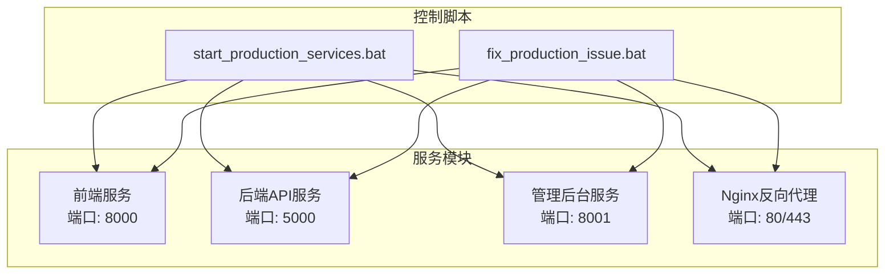
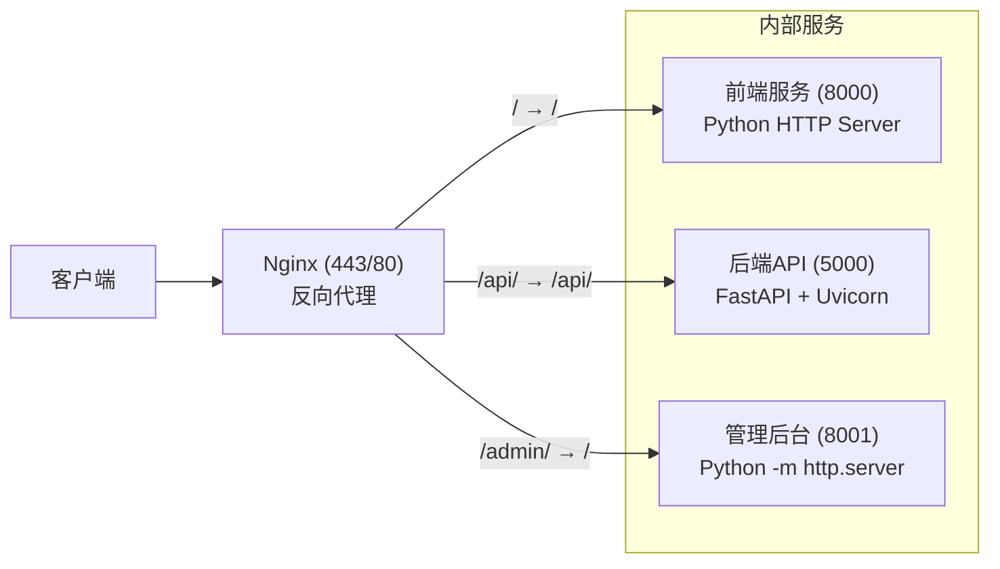
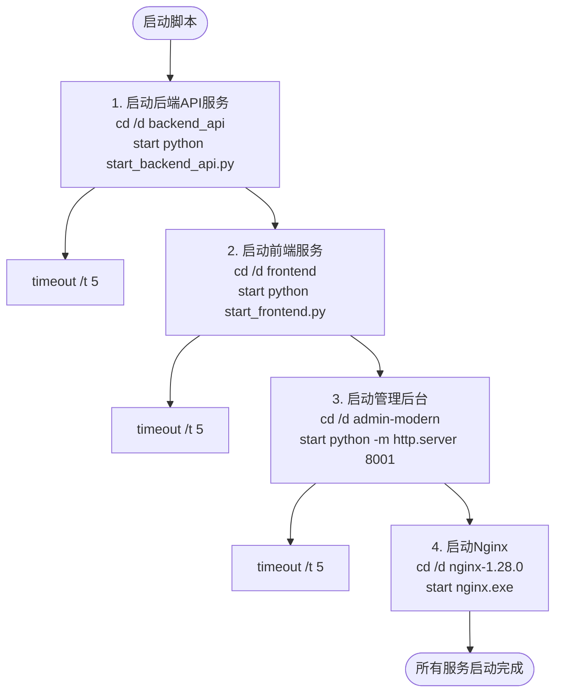
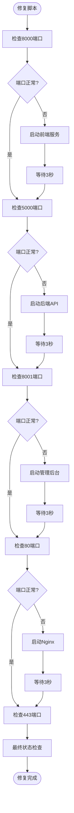
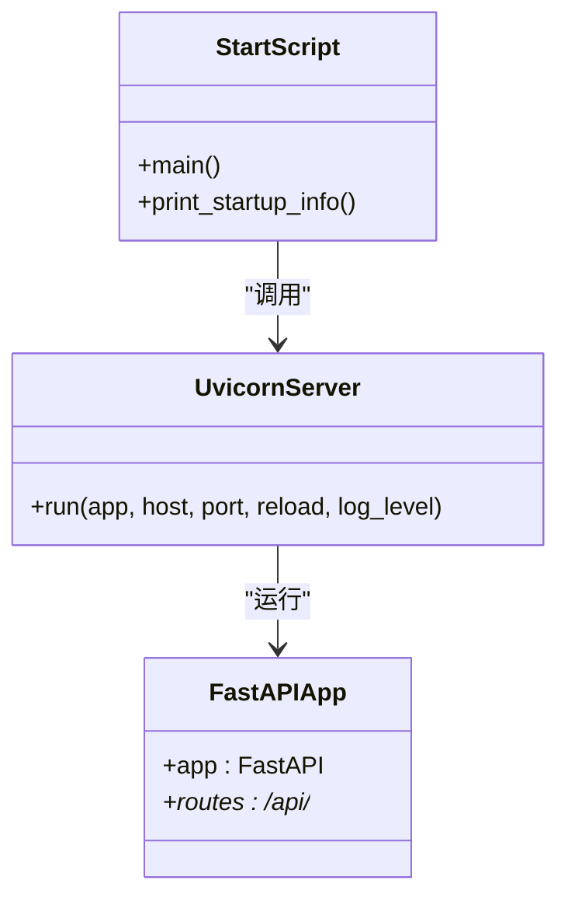
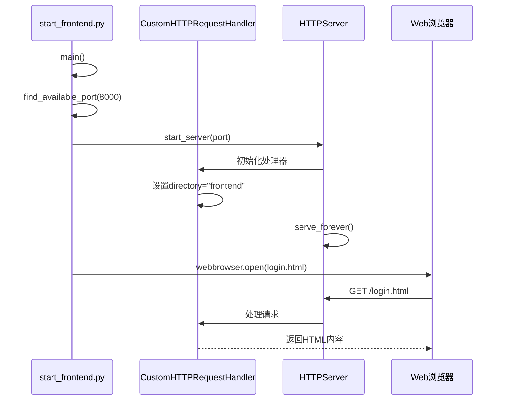
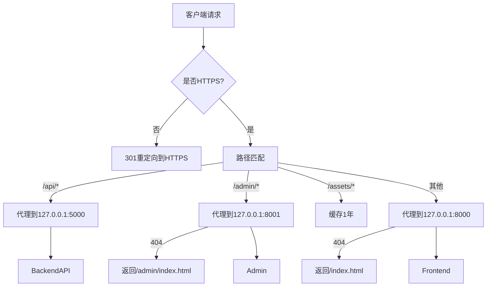
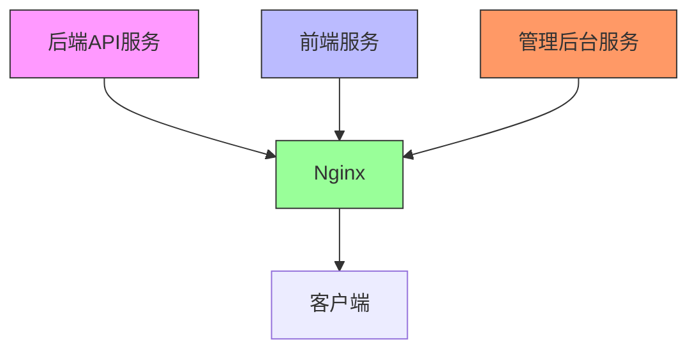

# 服务管理

<cite>
**本文档引用文件**  
- [start_production_services.bat](file://start_production_services.bat)
- [fix_production_issue.bat](file://fix_production_issue.bat)
- [start_backend_api.py](file://start_backend_api.py)
- [start_frontend.py](file://start_frontend.py)
- [nginx_complete.conf](file://nginx_complete.conf)
</cite>

## 目录
1. [简介](#简介)
2. [项目结构](#项目结构)
3. [核心组件](#核心组件)
4. [架构概览](#架构概览)
5. [详细组件分析](#详细组件分析)
6. [依赖关系分析](#依赖关系分析)
7. [性能考虑](#性能考虑)
8. [故障排查指南](#故障排查指南)
9. [结论](#结论)

## 简介
本文档详细说明了股票分析系统在生产环境下的服务管理操作流程。基于 `start_production_services.bat` 和 `fix_production_issue.bat` 脚本，全面阐述了前端、后端API、管理后台及Nginx反向代理服务的启动、检查与修复机制。文档涵盖服务依赖顺序、端口状态验证、进程控制命令以及Windows平台下的最佳实践，确保运维人员能够高效、安全地维护系统运行。

## 项目结构
本项目采用微服务架构，包含多个独立运行的服务模块，通过Nginx统一对外提供HTTPS访问。各服务分别位于不同目录，通过批处理脚本集中管理。



**图示来源**  
- [start_production_services.bat](file://start_production_services.bat#L1-L35)
- [fix_production_issue.bat](file://fix_production_issue.bat#L1-L95)

**本节来源**  
- [start_production_services.bat](file://start_production_services.bat#L1-L35)
- [fix_production_issue.bat](file://fix_production_issue.bat#L1-L95)

## 核心组件
系统由四个核心服务组成：前端应用、后端API、管理后台和Nginx反向代理。`start_production_services.bat` 脚本按依赖顺序依次启动这些服务，而 `fix_production_issue.bat` 脚本则用于检测并修复异常服务。Nginx作为入口网关，将外部请求路由至对应内部服务。

**本节来源**  
- [start_production_services.bat](file://start_production_services.bat#L1-L35)
- [fix_production_issue.bat](file://fix_production_issue.bat#L1-L95)

## 架构概览
系统采用典型的前后端分离架构，Nginx作为反向代理服务器统一对外暴露HTTPS服务，并将请求转发至内部不同端口的服务。各服务之间无直接调用，全部通过Nginx进行流量调度。



**图示来源**  
- [nginx_complete.conf](file://nginx_complete.conf#L1-L240)
- [start_production_services.bat](file://start_production_services.bat#L1-L35)

## 详细组件分析

### 启动脚本分析
`start_production_services.bat` 是系统主启动脚本，负责按顺序启动所有服务。脚本通过 `start` 命令在新窗口中运行各服务，并使用 `timeout` 命令设置5秒延迟，确保服务有足够时间初始化。

#### 启动流程图


**图示来源**  
- [start_production_services.bat](file://start_production_services.bat#L1-L35)

**本节来源**  
- [start_production_services.bat](file://start_production_services.bat#L1-L35)

### 修复脚本分析
`fix_production_issue.bat` 是生产环境故障修复脚本，通过 `netstat` 检查关键端口状态，并自动重启异常服务。该脚本可用于日常巡检或服务异常后的快速恢复。

#### 修复流程图


**图示来源**  
- [fix_production_issue.bat](file://fix_production_issue.bat#L1-L95)

**本节来源**  
- [fix_production_issue.bat](file://fix_production_issue.bat#L1-L95)

### 后端API服务分析
后端API服务由 `start_backend_api.py` 脚本启动，基于FastAPI框架并通过Uvicorn服务器运行。服务监听5000端口，支持热重载功能，便于开发调试。



**图示来源**  
- [start_backend_api.py](file://start_backend_api.py#L1-L32)

**本节来源**  
- [start_backend_api.py](file://start_backend_api.py#L1-L32)

### 前端服务分析
前端服务由 `start_frontend.py` 脚本启动，内置HTTP服务器并支持自定义路由处理。脚本会自动查找8000起始的可用端口，处理根路径重定向，并添加必要的CORS头。

#### 前端服务启动序列


**图示来源**  
- [start_frontend.py](file://start_frontend.py#L1-L90)

**本节来源**  
- [start_frontend.py](file://start_frontend.py#L1-L90)

### Nginx配置分析
`nginx_complete.conf` 文件定义了完整的反向代理规则，包括HTTP到HTTPS重定向、API代理、静态资源缓存及Vue Router的history模式支持。

#### Nginx请求处理流程


**图示来源**  
- [nginx_complete.conf](file://nginx_complete.conf#L1-L240)

**本节来源**  
- [nginx_complete.conf](file://nginx_complete.conf#L1-L240)

## 依赖关系分析
系统各服务存在明确的启动依赖关系：后端API需先于前端启动，Nginx必须在所有后端服务就绪后启动。Nginx作为唯一对外暴露的服务，依赖于内部所有服务的正常运行。



**图示来源**  
- [start_production_services.bat](file://start_production_services.bat#L1-L35)
- [nginx_complete.conf](file://nginx_complete.conf#L1-L240)

**本节来源**  
- [start_production_services.bat](file://start_production_services.bat#L1-L35)
- [nginx_complete.conf](file://nginx_complete.conf#L1-L240)

## 性能考虑
- **端口检查延迟**：`fix_production_issue.bat` 中使用 `timeout /t 3` 确保服务有足够时间响应，避免频繁重启。
- **静态资源缓存**：Nginx配置对 `/assets/` 和 `/favicon.ico` 启用1年缓存，提升前端性能。
- **连接超时设置**：Nginx代理设置30秒超时，防止后端服务响应缓慢影响整体性能。
- **进程隔离**：各服务在独立窗口运行，便于监控和故障隔离。

## 故障排查指南
当服务异常时，可按以下步骤排查：

1. **检查端口占用**：
   ```cmd
   netstat -ano | findstr :5000
   ```
   若端口被占用，使用以下命令终止进程：
   ```cmd
   tasklist | findstr :5000
   taskkill /PID <进程ID> /F
   ```

2. **验证服务状态**：
   访问健康检查端点：
   ```
   https://www.icemaplecity.com/health
   ```

3. **查看Nginx日志**：
   检查 `logs/access.log` 和 `logs/error.log` 获取详细错误信息。

4. **手动重启服务**：
   若自动修复失败，可手动执行 `start_production_services.bat`。

**本节来源**  
- [fix_production_issue.bat](file://fix_production_issue.bat#L1-L95)
- [nginx_complete.conf](file://nginx_complete.conf#L1-L240)

## 结论
本文档详细解析了股票分析系统的服务管理机制。通过标准化的批处理脚本，实现了服务的自动化启动与故障修复。Nginx作为统一入口，有效整合了多个微服务。建议运维人员熟悉各脚本逻辑，并定期执行健康检查，确保系统稳定运行。