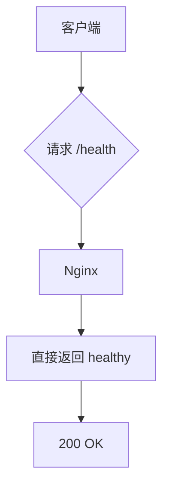
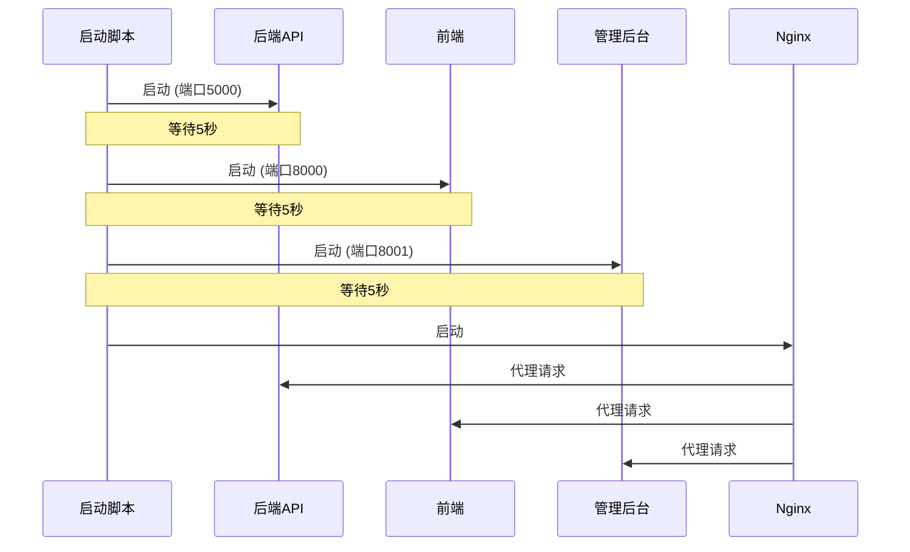

# 监控维护

<cite>
**本文档引用的文件**  
- [start_production_services.bat](file://start_production_services.bat)
- [nginx_complete.conf](file://nginx_complete.conf)
- [start_backend_api.py](file://start_backend_api.py)
- [start_frontend.py](file://start_frontend.py)
- [deploy.py](file://deploy.py)
</cite>

## 目录
1. [引言](#引言)
2. [服务健康检查方法](#服务健康检查方法)
3. [系统健康评估流程](#系统健康评估流程)
4. [生产环境日常巡检清单](#生产环境日常巡检清单)
5. [服务启动顺序分析](#服务启动顺序分析)
6. [自动化健康检查与告警建议](#自动化健康检查与告警建议)

## 引言
本指南旨在为股票分析系统的生产环境提供全面的监控与日常维护方案。系统由前端、后端API、管理后台及Nginx反向代理构成，各组件协同工作以确保服务稳定运行。通过定期检查服务状态、分析日志、检测端口与响应时间，可及时发现潜在问题并预防故障。本文档详细说明了各项监控措施，并提出自动化巡检建议，以提升系统可靠性与运维效率。

## 服务健康检查方法

### 前端服务健康检查
前端服务通过Python内置HTTP服务器在8000端口运行，可通过访问`http://localhost:8000/login.html`验证其可用性。若页面正常加载且无JavaScript错误，则服务运行正常。此外，可通过发送HTTP请求至根路径（/）并验证是否返回301重定向至`/login.html`来确认服务状态。

**Section sources**  
- [start_frontend.py](file://start_frontend.py#L45-L55)

### 后端API健康检查
后端API基于FastAPI框架运行于5000端口，提供`/health`端点用于健康检查。可通过以下命令进行检测：
```bash
curl -f http://localhost:5000/health
```
若返回"healthy"文本及200状态码，则表明API服务正常。

**Section sources**  
- [start_backend_api.py](file://start_backend_api.py#L15-L25)
- [deploy.py](file://deploy.py#L420-L421)

### 管理后台健康检查
管理后台使用Python HTTP服务器在8001端口运行，可通过访问`http://localhost:8001`或`https://www.icemaplecity.com/admin`验证其可用性。检查页面资源（CSS、JS）是否正常加载，并确认Vue Router的history模式路由跳转功能正常。

**Section sources**  
- [start_production_services.bat](file://start_production_services.bat#L15-L18)

### Nginx健康检查
Nginx作为反向代理服务器，监听80和443端口，提供统一入口。可通过访问`https://www.icemaplecity.com/health`获取健康状态。该端点直接返回"healthy"文本，不经过后端服务，用于快速判断Nginx自身运行状态。



**Diagram sources**  
- [nginx_complete.conf](file://nginx_complete.conf#L220-L224)

**Section sources**  
- [nginx_complete.conf](file://nginx_complete.conf#L220-L224)

## 系统健康评估流程

### 日志观察
各服务均输出运行日志，建议定期检查以下日志文件：
- **后端API日志**：关注错误堆栈、数据库连接异常、认证失败等信息。
- **Nginx访问与错误日志**：分析`logs/access.log`和`logs/error.log`，识别高频4xx/5xx状态码或异常请求模式。
- **前端控制台日志**：通过浏览器开发者工具查看JavaScript错误、资源加载失败等问题。

### 端口检测
使用`netstat`或`lsof`命令检查关键端口占用情况：
- 5000端口：后端API
- 8000端口：前端服务
- 8001端口：管理后台
- 80/443端口：Nginx

若端口未被监听，说明对应服务未启动或启动失败。

### 响应时间测试
对核心接口进行响应时间监测，例如：
- 登录接口 `/api/auth/login`
- 行情数据接口 `/api/quotes/latest`
- 用户信息接口 `/api/users/profile`

可使用`curl`结合`time`命令进行测试：
```bash
time curl -o /dev/null -s -w "%{time_total}s\n" https://www.icemaplecity.com/api/quotes/latest
```
建议平均响应时间低于500ms。

**Section sources**  
- [nginx_complete.conf](file://nginx_complete.conf#L100-L120)
- [start_backend_api.py](file://start_backend_api.py#L20-L25)

## 生产环境日常巡检清单

| 检查项 | 检查方法 | 正常标准 | 备注 |
|--------|---------|--------|------|
| 服务进程状态 | `ps` 或 `tasklist` 查看进程 | 所有服务进程存在且运行中 | 包括Python、Nginx进程 |
| 磁盘空间 | `df -h` 或 `dir` | 使用率 < 80% | 特别关注日志目录 |
| 内存使用率 | `free -m` 或任务管理器 | 使用率 < 75% | 避免内存泄漏 |
| CPU使用率 | `top` 或任务管理器 | 平均负载 < 3.0 | 结合历史趋势分析 |
| Nginx运行状态 | `nginx -t` 验证配置 | 配置正确，服务运行 | 定期重载配置 |
| HTTPS证书有效期 | `openssl x509 -enddate -noout -in cert.pem` | 剩余 > 30天 | 防止证书过期 |
| 数据库连接 | 尝试执行简单查询 | 连接成功，响应正常 | 验证数据库健康 |
| 健康检查端点 | 访问 `/health` | 返回200及"healthy" | 全链路基础检测 |

**Section sources**  
- [start_production_services.bat](file://start_production_services.bat#L1-L35)
- [nginx_complete.conf](file://nginx_complete.conf#L220-L224)

## 服务启动顺序分析

`start_production_services.bat`脚本定义了服务启动顺序，其合理性如下：

1. **先启动后端API（5000端口）**：作为数据服务提供者，必须优先就绪，以便前端和管理后台调用。
2. **再启动前端服务（8000端口）**：依赖后端API提供数据支持，需在API启动后启动。
3. **接着启动管理后台（8001端口）**：同样依赖后端API，顺序合理。
4. **最后启动Nginx**：作为反向代理，必须在所有后端服务启动后再启动，以确保代理目标可达。

启动间隔5秒（`timeout /t 5`）为服务初始化预留时间，避免因启动延迟导致连接失败。



**Diagram sources**  
- [start_production_services.bat](file://start_production_services.bat#L7-L25)

**Section sources**  
- [start_production_services.bat](file://start_production_services.bat#L7-L25)

## 自动化健康检查与告警建议

建议设置定时任务（如Windows任务计划程序或Linux crontab）执行自动化健康检查脚本，频率为每5分钟一次。脚本应包含以下检查项：

1. **服务进程检查**：验证Python和Nginx进程是否存在。
2. **端口监听检查**：使用`netstat`确认关键端口处于LISTEN状态。
3. **HTTP健康检查**：
   - 请求`https://www.icemaplecity.com/health`验证Nginx
   - 请求`http://localhost:5000/health`验证后端API
4. **响应时间监控**：记录核心接口响应时间，超过阈值时记录告警。
5. **日志异常扫描**：搜索日志中的ERROR、Exception等关键字。

告警方式建议：
- 邮件通知运维人员
- 企业微信/钉钉机器人消息推送
- 记录到中央日志系统（如ELK）

当连续3次检查失败时触发告警，并尝试自动重启相关服务。

**Section sources**  
- [start_production_services.bat](file://start_production_services.bat#L1-L35)
- [nginx_complete.conf](file://nginx_complete.conf#L220-L224)
- [deploy.py](file://deploy.py#L418-L421)