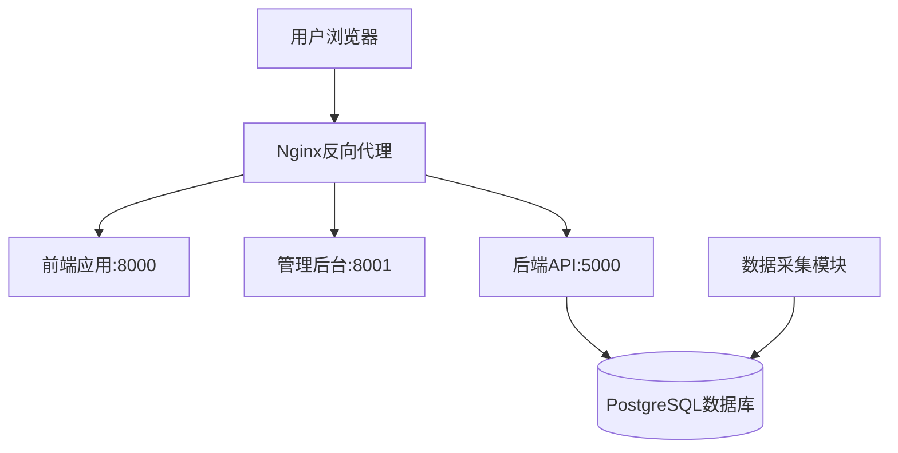
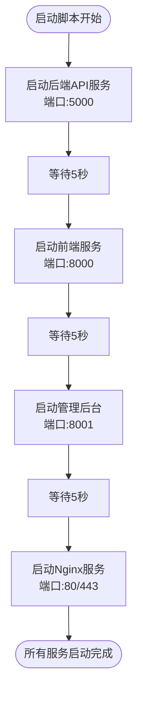
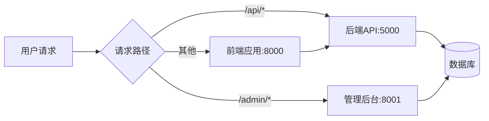
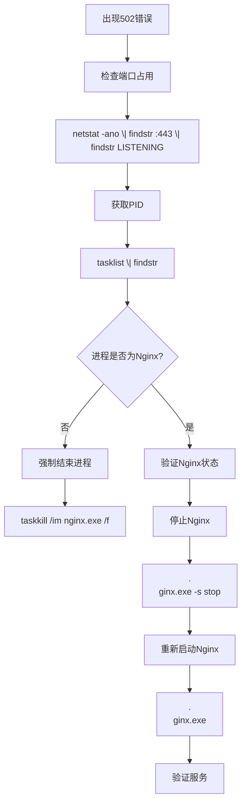
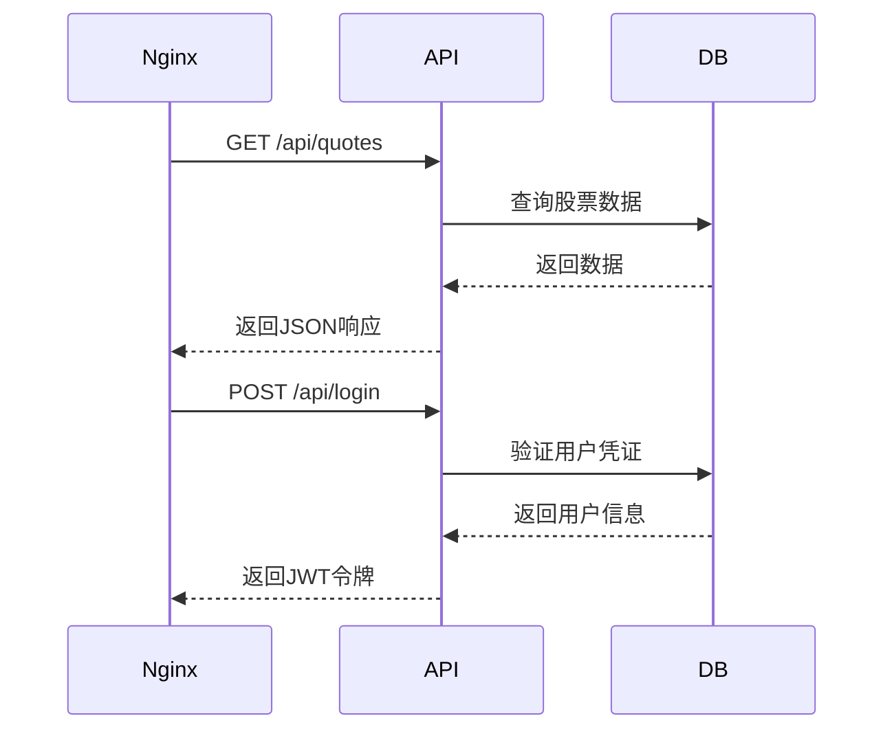
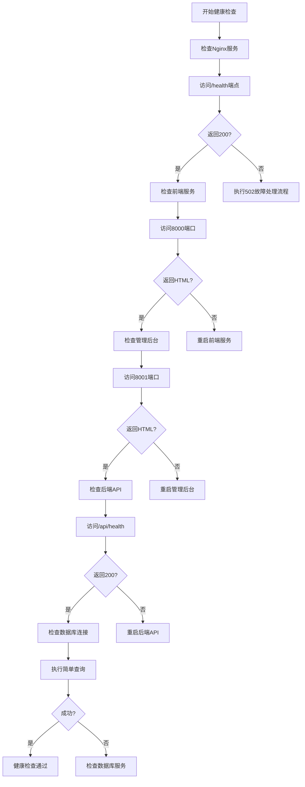
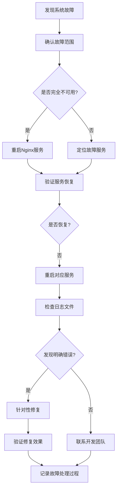

# 运维指南

<cite>
**本文档引用文件**  
- [日常运维.md](file://日常运维.md)
- [start_production_services.bat](file://start_production_services.bat)
- [生产环境说明.md](file://生产环境说明.md)
- [nginx_complete.conf](file://nginx_complete.conf)
- [start_backend_api.py](file://start_backend_api.py)
- [start_frontend.py](file://start_frontend.py)
</cite>

## 目录
1. [系统概述](#系统概述)
2. [服务启动与停止](#服务启动与停止)
3. [Nginx服务管理](#nginx服务管理)
4. [常见问题诊断与处理](#常见问题诊断与处理)
5. [微服务监控与故障排查](#微服务监控与故障排查)
6. [系统健康检查](#系统健康检查)
7. [日志查看与分析](#日志查看与分析)
8. [性能监控](#性能监控)
9. [紧急故障处理](#紧急故障处理)

## 系统概述

本系统为股票分析平台，采用前后端分离架构，通过Nginx实现反向代理与HTTPS访问。系统包含前端应用、管理后台、后端API和数据采集模块四大核心组件，所有服务部署在IP为192.168.16.4的服务器上。

系统通过Nginx（80/443端口）对外提供统一访问入口，反向代理至各内部服务：
- 前端应用：8000端口
- 管理后台：8001端口
- 后端API：5000端口
- 数据库：PostgreSQL 5432端口



**Diagram sources**
- [生产环境说明.md](file://生产环境说明.md#L1-L187)
- [nginx_complete.conf](file://nginx_complete.conf#L1-L241)

**Section sources**
- [生产环境说明.md](file://生产环境说明.md#L1-L187)

## 服务启动与停止

### 启动脚本使用说明

`start_production_services.bat` 是生产环境的一键启动脚本，按正确顺序启动所有服务。



**Diagram sources**
- [start_production_services.bat](file://start_production_services.bat#L1-L36)

**Section sources**
- [start_production_services.bat](file://start_production_services.bat#L1-L36)
- [生产环境说明.md](file://生产环境说明.md#L1-L187)

### 启动顺序与注意事项

1. **启动顺序**：
   - 确保PostgreSQL数据库服务已运行
   - 启动后端API服务（5000端口）
   - 启动前端服务（8000端口）
   - 启动管理后台服务（8001端口）
   - 启动Nginx反向代理服务

2. **注意事项**：
   - 必须按顺序启动，避免服务依赖问题
   - 启动后需验证各服务端口是否正常监听
   - Nginx必须最后启动，确保后端服务已就绪
   - 脚本使用`cmd /k`保持窗口打开，便于查看日志

### 服务启动命令

| 服务类型 | 启动命令 | 工作目录 |
|---------|---------|---------|
| 后端API | `python start_backend_api.py` | `C:\work\stock_quote_analayze\run\backend_api` |
| 前端应用 | `python start_frontend.py` | `C:\work\stock_quote_analayze\run\frontend` |
| 管理后台 | `python -m http.server 8001` | `C:\work\stock_quote_analayze\run\admin-modern` |
| Nginx | `nginx.exe` | `C:\work\stock_quote_analayze\tools\nginx-1.28.0` |

**Section sources**
- [生产环境说明.md](file://生产环境说明.md#L1-L187)
- [start_backend_api.py](file://start_backend_api.py#L1-L33)
- [start_frontend.py](file://start_frontend.py#L1-L91)

## Nginx服务管理

### Nginx配置要点

Nginx配置文件`nginx_complete.conf`定义了HTTPS重定向、反向代理和安全策略：

- HTTP（80端口）自动重定向到HTTPS（443端口）
- API请求 `/api/` 代理至后端API服务（5000端口）
- 前端请求 `/` 代理至前端服务（8000端口）
- 管理后台请求 `/admin/` 代理至管理后台服务（8001端口）
- 启用HSTS、X-Frame-Options等安全头



**Diagram sources**
- [nginx_complete.conf](file://nginx_complete.conf#L1-L241)
- [生产环境说明.md](file://生产环境说明.md#L1-L187)

**Section sources**
- [nginx_complete.conf](file://nginx_complete.conf#L1-L241)
- [生产环境说明.md](file://生产环境说明.md#L1-L187)

### Nginx常用命令

| 操作 | 命令 | 说明 |
|------|------|------|
| 启动 | `nginx.exe` | 在Nginx安装目录执行 |
| 停止 | `nginx.exe -s stop` | 快速停止 |
| 优雅停止 | `nginx.exe -s quit` | 等待请求处理完成 |
| 重启 | `nginx.exe -s reload` | 重新加载配置 |
| 测试配置 | `nginx.exe -t` | 验证配置文件语法 |

## 常见问题诊断与处理

### 502 Bad Gateway问题处理

502错误通常表示Nginx无法连接到后端服务，处理步骤如下：



**Diagram sources**
- [日常运维.md](file://日常运维.md#L1-L38)

**Section sources**
- [日常运维.md](file://日常运维.md#L1-L38)
- [nginx_complete.conf](file://nginx_complete.conf#L1-L241)

### 处理流程

1. **检查端口占用**：
   ```cmd
   netstat -ano | findstr :443 | findstr LISTENING
   ```

2. **查找进程名称**：
   ```cmd
   tasklist | findstr <PID>
   ```

3. **强制结束旧进程**：
   ```cmd
   taskkill /im nginx.exe /f
   ```

4. **验证进程已结束**：
   ```cmd
   tasklist /fi "imagename eq nginx.exe"
   ```

5. **重新启动Nginx**：
   ```cmd
   .\nginx.exe
   ```

6. **优雅停止（未来使用）**：
   ```cmd
   .\nginx.exe -s stop
   ```

## 微服务监控与故障排查

### 前端服务监控

前端服务运行在8000端口，通过Python内置HTTP服务器提供静态文件服务。

**监控要点**：
- 端口8000是否处于监听状态
- `start_frontend.py`进程是否正常运行
- 访问`http://localhost:8000`是否返回登录页面

**故障排查**：
- 检查`frontend`目录是否存在且包含HTML文件
- 验证端口未被其他进程占用
- 查看控制台输出是否有错误信息

### 管理后台监控

管理后台运行在8001端口，使用Python内置服务器提供服务。

**监控要点**：
- 端口8001是否处于监听状态
- `python -m http.server 8001`进程是否运行
- 访问`http://localhost:8001`是否正常

**部署注意事项**：
1. 执行 `.\admin\deploy-env.bat production`
2. 运行 `npm run build` 生成dist目录
3. 将dist目录上传至`run\admin-modern`目录

### 后端API监控

后端API服务使用FastAPI框架，运行在5000端口。



**Diagram sources**
- [start_backend_api.py](file://start_backend_api.py#L1-L33)
- [生产环境说明.md](file://生产环境说明.md#L1-L187)

**Section sources**
- [start_backend_api.py](file://start_backend_api.py#L1-L33)
- [生产环境说明.md](file://生产环境说明.md#L1-L187)

## 系统健康检查

### 健康检查标准流程

定期执行以下健康检查，确保系统稳定运行：



**Section sources**
- [生产环境说明.md](file://生产环境说明.md#L1-L187)
- [nginx_complete.conf](file://nginx_complete.conf#L1-L241)

### 健康检查命令

| 检查项 | 命令/URL | 预期结果 |
|-------|---------|---------|
| Nginx健康检查 | `curl https://www.icemaplecity.com/health` | 返回"healthy" |
| Nginx配置测试 | `nginx.exe -t` | 显示"successful" |
| 前端服务 | `curl http://localhost:8000/login.html` | 返回HTML内容 |
| 管理后台 | `curl http://localhost:8001/index.html` | 返回HTML内容 |
| 后端API | `curl http://localhost:5000/api/health` | 返回JSON健康状态 |
| 数据库连接 | `psql -h 192.168.16.4 -U postgres -d stock_analysis -c "SELECT 1;"` | 返回查询结果 |

## 日志查看与分析

### 日志文件位置

| 服务类型 | 日志路径 | 说明 |
|---------|---------|------|
| Nginx | `C:\work\stock_quote_analayze\tools\nginx-1.28.0\logs\` | 包含access.log和error.log |
| 后端API | `backend_api\app.log`, `backend_api\auth.log` | 应用和认证日志 |
| 数据采集 | `backend_core\logs\` | 各数据采集器日志 |
| 数据库 | `C:\Program Files\PostgreSQL\17\data\pg_log\` | PostgreSQL数据库日志 |

### 日志分析要点

1. **Nginx日志**：
   - `error.log`：查找502、504等错误
   - `access.log`：分析请求模式和流量

2. **后端API日志**：
   - `app.log`：记录API请求和响应
   - `auth.log`：记录用户认证事件
   - `quotes.log`：记录行情数据请求

3. **数据采集日志**：
   - `akshare_*`：东财数据采集日志
   - `tushare_*`：通联数据采集日志
   - 关注采集成功率和异常信息

## 性能监控

### 关键性能指标

| 指标 | 监控方法 | 告警阈值 |
|------|---------|---------|
| 服务响应时间 | Nginx日志 `$request_time` | 平均>2s |
| API响应时间 | 后端日志记录 | 单次>5s |
| 服务器CPU使用率 | Windows任务管理器 | 持续>80% |
| 服务器内存使用率 | Windows任务管理器 | 持续>85% |
| 数据库连接数 | `SELECT COUNT(*) FROM pg_stat_activity;` | >50 |
| 请求错误率 | 分析Nginx 5xx状态码 | >5% |

### 性能优化建议

1. **Nginx优化**：
   - 调整`worker_processes`和`worker_connections`
   - 启用gzip压缩
   - 优化静态资源缓存策略

2. **数据库优化**：
   - 定期分析慢查询
   - 添加必要索引
   - 监控表空间使用

3. **应用优化**：
   - 实现数据缓存机制
   - 优化API响应数据结构
   - 批量处理数据请求

## 紧急故障处理

### 故障处理流程



**Section sources**
- [日常运维.md](file://日常运维.md#L1-L38)
- [生产环境说明.md](file://生产环境说明.md#L1-L187)

### 紧急重启流程

当系统出现严重故障时，执行以下紧急重启流程：

1. **停止所有服务**：
   ```cmd
   # 停止Nginx
   cd C:\work\stock_quote_analayze\tools\nginx-1.28.0
   nginx.exe -s stop
   
   # 强制结束残留进程
   taskkill /im nginx.exe /f
   taskkill /im python.exe /f
   ```

2. **验证服务已停止**：
   ```cmd
   tasklist /fi "imagename eq nginx.exe"
   tasklist /fi "imagename eq python.exe"
   ```

3. **按顺序重新启动**：
   - 启动后端API服务
   - 启动前端服务
   - 启动管理后台服务
   - 启动Nginx服务

4. **验证系统状态**：
   - 访问各服务URL
   - 检查关键功能
   - 监控日志输出

### 系统恢复验证

故障处理后，必须验证以下关键功能：

1. **前端访问**：`https://www.icemaplecity.com/` 能正常加载
2. **用户登录**：能成功登录并获取JWT令牌
3. **行情数据**：能正常获取股票行情数据
4. **管理后台**：`https://www.icemaplecity.com/admin` 能正常访问
5. **API接口**：关键API端点返回正常响应