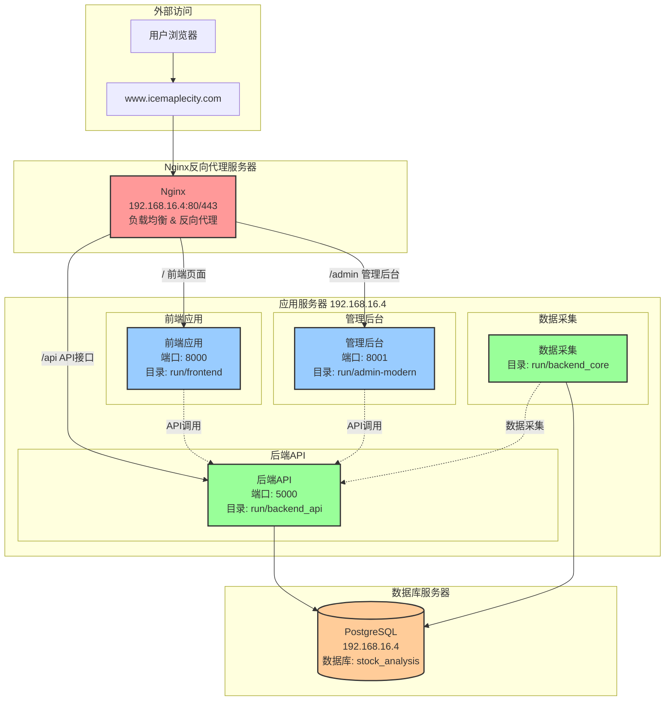
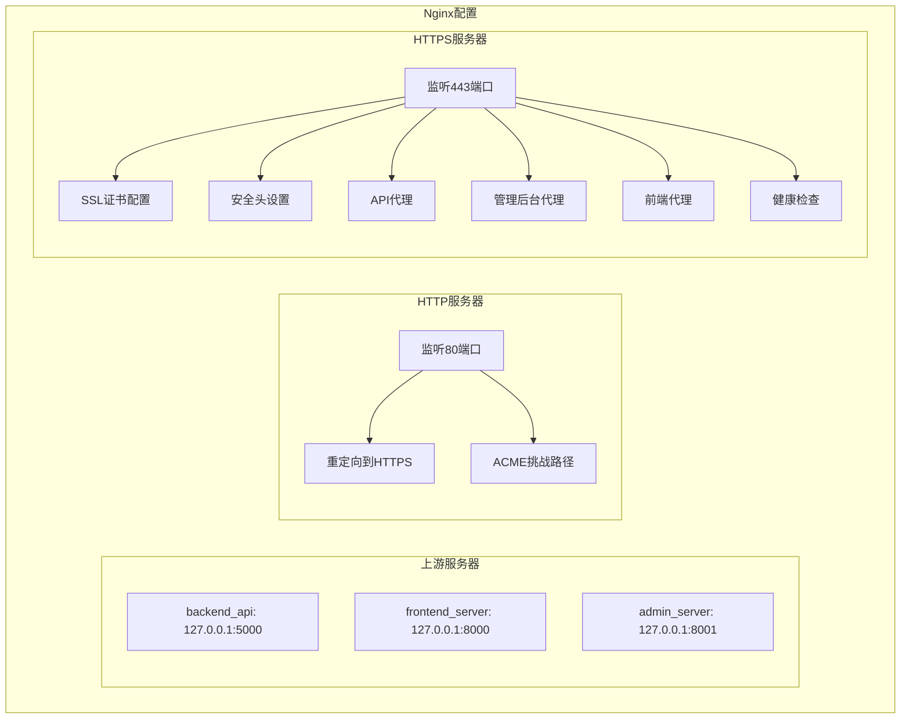

# 部署架构与运维

<cite>
**本文档中引用的文件**   
- [系统部署架构图.md](file://系统部署架构图.md)
- [生产环境说明.md](file://生产环境说明.md)
- [deploy.py](file://deploy.py)
- [deploy.sh](file://admin/deploy.sh)
- [nginx_complete.conf](file://nginx_complete.conf)
- [start_production_services.bat](file://start_production_services.bat)
- [deploy-env.bat](file://admin/deploy-env.bat)
- [deploy-env.sh](file://admin/deploy-env.sh)
- [start_backend_api.py](file://start_backend_api.py)
- [start_backend_core.py](file://start_backend_core.py)
- [start_frontend.py](file://start_frontend.py)
</cite>

## 目录

1. [生产环境拓扑结构](#生产环境拓扑结构)
2. [自动化部署脚本使用方法](#自动化部署脚本使用方法)
3. [Nginx反向代理配置详解](#nginx反向代理配置详解)
4. [服务启停操作指南](#服务启停操作指南)
5. [日常运维任务](#日常运维任务)
6. [高可用性与容灾方案](#高可用性与容灾方案)
7. [性能调优建议](#性能调优建议)

## 生产环境拓扑结构

根据系统部署架构和生产环境说明，本系统采用单服务器集中部署模式，所有组件均部署在IP地址为192.168.16.4的服务器上。系统通过Nginx实现反向代理和负载均衡，对外提供统一的访问入口。



**图源**
- [系统部署架构图.md](file://系统部署架构图.md)

**本节来源**
- [系统部署架构图.md](file://系统部署架构图.md)
- [生产环境说明.md](file://生产环境说明.md)

## 自动化部署脚本使用方法

### deploy.py 脚本

`deploy.py` 是系统的主要部署脚本，支持新环境的一键部署。该脚本执行完整的部署流程，包括环境检查、依赖安装、数据库初始化、启动脚本创建等。

**主要功能**：
- 环境检查：验证Python版本（需3.8+）和必要目录/文件的存在
- 依赖安装：根据环境类型安装相应的依赖包
- 数据库初始化：配置PostgreSQL数据库并运行迁移
- 启动脚本创建：根据操作系统类型生成相应的启动脚本
- Docker支持：可选择创建Docker部署文件

**使用方法**：
```bash
# 基本部署
python deploy.py

# 创建Docker部署文件
python deploy.py --docker

# 仅运行测试
python deploy.py --test-only

# 详细输出
python deploy.py --verbose
```

**配置文件**：`deploy_config.json` 包含Python版本、端口配置、数据库连接信息等。

**本节来源**
- [deploy.py](file://deploy.py)

### deploy.sh 脚本

`admin/deploy.sh` 是管理后台的生产环境部署脚本，主要用于构建和验证前端应用。

**执行流程**：
1. 安装npm依赖
2. 构建生产版本（`npm run build`）
3. 验证构建结果和资源路径配置
4. 输出部署完成提示

**使用方法**：
```bash
cd admin
./deploy.sh
```

**本节来源**
- [admin/deploy.sh](file://admin/deploy.sh)

### 环境配置脚本

系统提供 `deploy-env.bat` (Windows) 和 `deploy-env.sh` (Unix) 脚本用于配置不同环境的API地址。

**功能**：
- 根据参数设置生产或开发环境
- 生成 `.env.local` 配置文件，包含API基础URL和环境标识
- 支持Vite环境变量配置

**使用方法**：
```bash
# Windows
deploy-env.bat production
deploy-env.bat development

# Unix
./deploy-env.sh production
./deploy-env.sh development
```

**本节来源**
- [admin/deploy-env.bat](file://admin/deploy-env.bat)
- [admin/deploy-env.sh](file://admin/deploy-env.sh)

## Nginx反向代理配置详解

`nginx_complete.conf` 文件定义了完整的Nginx配置，实现HTTP到HTTPS重定向、反向代理、静态资源缓存和安全头设置。

### 主要配置模块



**图源**
- [nginx_complete.conf](file://nginx_complete.conf)

### 关键配置说明

**上游服务器配置**：
- `backend_api`: 代理到后端API服务（端口5000）
- `frontend_server`: 代理到前端应用（端口8000）
- `admin_server`: 代理到管理后台（端口8001）

**HTTP服务器**：
- 监听80端口，将所有请求重定向到HTTPS
- 配置ACME挑战路径用于SSL证书申请

**HTTPS服务器**：
- 使用SSL证书实现HTTPS加密
- 设置严格的安全头（HSTS、X-Frame-Options等）
- 实现API、前端和管理后台的反向代理

**反向代理规则**：
- `/api/`: 代理到后端API，处理CORS预检请求
- `/admin/`: 代理到管理后台，支持Vue Router的history模式
- `/`: 代理到前端应用，支持Vue Router的history模式
- 静态资源路径（如`/assets/`）设置长期缓存

**本节来源**
- [nginx_complete.conf](file://nginx_complete.conf)

## 服务启停操作指南

### start_production_services.bat

`start_production_services.bat` 是生产环境的批量启动脚本，按正确顺序启动所有服务。

**启动顺序**：
1. 后端API服务（端口5000）
2. 前端服务（端口8000）
3. 管理后台（端口8001）
4. Nginx反向代理

**使用方法**：
```bash
start_production_services.bat
```

**本节来源**
- [start_production_services.bat](file://start_production_services.bat)

### 单个服务启动脚本

#### 后端API启动
`start_backend_api.py` 使用Uvicorn启动FastAPI后端服务。

```python
uvicorn.run(
    "main:app",
    host="0.0.0.0",
    port=5000,
    reload=True,
    reload_dirs=["backend_api"],
    log_level="info"
)
```

**本节来源**
- [start_backend_api.py](file://start_backend_api.py)

#### 数据采集启动
`start_backend_core.py` 启动数据采集服务，自动拉起定时采集进程。

**功能**：
- 检查必要依赖（apscheduler, akshare, tushare等）
- 启动定时采集进程
- 保持进程存活

**本节来源**
- [start_backend_core.py](file://start_backend_core.py)

#### 前端服务启动
`start_frontend.py` 使用Python内置HTTP服务器启动前端应用。

**特性**：
- 自定义请求处理器，支持路径重定向
- 添加CORS头和缓存控制
- 自动打开浏览器访问登录页面
- 查找可用端口避免冲突

**本节来源**
- [start_frontend.py](file://start_frontend.py)

## 日常运维任务

### 日志查看

**日志文件位置**：
- **Nginx日志**: `C:\work\stock_quote_analayze\tools\nginx-1.28.0\logs\`
- **应用日志**: 各应用目录下的`logs`文件夹
- **数据库日志**: `C:\Program Files\PostgreSQL\17\data\pg_log\`
- **部署日志**: 项目根目录的`deploy.log`

**查看方法**：
```bash
# Windows
type logs/app.log
# 或使用文本编辑器打开

# Unix
tail -f logs/app.log
```

### 服务监控

**监控方法**：
1. **端口监控**：使用`netstat`检查各服务端口是否正常监听
   ```bash
   netstat -an | findstr :5000
   ```
2. **进程监控**：检查关键进程是否运行
3. **健康检查**：访问`/health`端点验证服务状态
4. **资源监控**：监控CPU、内存和磁盘使用情况

**本节来源**
- [生产环境说明.md](file://生产环境说明.md)

### 备份恢复

**备份策略**：
- **数据库备份**：定期备份PostgreSQL数据库
- **应用备份**：备份应用代码和配置文件
- **SSL证书备份**：备份SSL证书文件

**备份方法**：
```bash
# 数据库备份
pg_dump -h 192.168.16.4 -U postgres -d stock_analysis > backup.sql

# 应用备份
xcopy run\* backup\run\ /E /I
```

**恢复方法**：
```bash
# 数据库恢复
psql -h 192.168.16.4 -U postgres -d stock_analysis < backup.sql
```

**本节来源**
- [生产环境说明.md](file://生产环境说明.md)

### 版本升级

**升级流程**：
1. 停止所有服务
2. 备份当前版本和数据库
3. 部署新版本代码
4. 运行数据库迁移（如有）
5. 启动所有服务
6. 验证功能正常

**自动化升级**：
```bash
# 使用部署脚本
python deploy.py
```

## 高可用性与容灾方案

### 高可用性设计

**当前架构特点**：
- 单服务器部署，所有组件集中运行
- Nginx作为反向代理，提供统一入口
- 数据库与应用同服务器，减少网络延迟

**潜在风险**：
- 单点故障：服务器故障导致整个系统不可用
- 性能瓶颈：高并发时可能影响响应速度

**改进建议**：
1. **服务分离**：将数据库、应用服务、Nginx部署在不同服务器
2. **负载均衡**：使用多台应用服务器，Nginx实现负载均衡
3. **数据库主从**：配置PostgreSQL主从复制，实现读写分离
4. **容器化**：使用Docker和Kubernetes实现服务编排和自动恢复

### 容灾方案

**数据保护**：
- 定期数据库备份，保留多个时间点的备份
- 异地备份：将重要数据备份到不同地理位置
- 事务日志：启用PostgreSQL WAL归档，支持时间点恢复

**服务恢复**：
- 自动化部署脚本确保快速重建环境
- 配置文件版本控制，便于恢复配置
- 监控告警：及时发现并响应服务异常

**灾难恢复流程**：
1. 评估故障范围和影响
2. 启动备用系统（如有）
3. 从最近备份恢复数据
4. 重新部署应用服务
5. 验证系统功能
6. 通知用户恢复情况

## 性能调优建议

### Nginx优化

1. **连接优化**：
   ```nginx
   keepalive_timeout 65;
   worker_connections 1024;
   ```

2. **静态资源缓存**：
   ```nginx
   location /admin/assets/ {
       expires 1y;
       add_header Cache-Control "public, immutable";
   }
   ```

3. **Gzip压缩**（建议启用）：
   ```nginx
   gzip on;
   gzip_types text/plain text/css application/json application/javascript text/xml application/xml;
   ```

### 数据库优化

1. **连接池**：配置适当的连接池大小
2. **索引优化**：为常用查询字段创建索引
3. **查询优化**：避免N+1查询，使用批量操作
4. **定期维护**：执行VACUUM和ANALYZE

### 应用性能

1. **API响应**：优化数据库查询，减少响应时间
2. **前端性能**：启用资源压缩和缓存，减少加载时间
3. **异步处理**：将耗时操作（如数据采集）放入后台任务
4. **监控指标**：添加性能监控，及时发现瓶颈

### 生产环境部署建议

1. **使用Gunicorn**替代开发服务器：
   ```bash
   gunicorn -w 4 -k uvicorn.workers.UvicornWorker backend_api.main:app
   ```

2. **使用Supervisor**管理进程：
   ```ini
   [program:stock-analyzer]
   command=python /path/to/start_system.py
   autostart=true
   autorestart=true
   stdout_logfile=/var/log/stock-analyzer.log
   ```

3. **资源监控**：使用htop、netstat等工具监控系统资源