# Docker部署

<cite>
**本文档引用的文件**   
- [deploy.py](file://deploy.py)
- [DEPLOYMENT_SUMMARY.md](file://DEPLOYMENT_SUMMARY.md)
</cite>

## 目录
1. [Docker部署概述](#docker部署概述)
2. [Docker文件生成](#docker文件生成)
3. [Docker镜像构建](#docker镜像构建)
4. [容器运行与编排](#容器运行与编排)
5. [服务依赖与健康检查](#服务依赖与健康检查)
6. [端口映射与环境变量](#端口映射与环境变量)
7. [常见问题排查](#常见问题排查)

## Docker部署概述

本文档详细说明如何使用Docker部署股票分析系统。基于`deploy.py`脚本中的`create_docker_files`方法和`DEPLOYMENT_SUMMARY.md`中的Docker部署方案，全面介绍Docker部署所需的文件生成、镜像构建、容器运行和服务配置。

**Section sources**
- [deploy.py](file://deploy.py#L300-L380)
- [DEPLOYMENT_SUMMARY.md](file://DEPLOYMENT_SUMMARY.md#L20-L50)

## Docker文件生成

### Dockerfile生成

`deploy.py`脚本中的`create_docker_files`方法会自动生成Dockerfile，该文件定义了应用的构建环境和运行时配置。

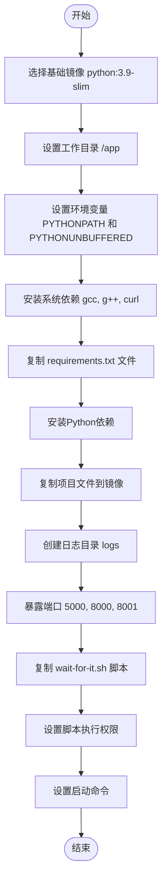

**Diagram sources**
- [deploy.py](file://deploy.py#L310-L330)

### docker-compose.yml生成

`create_docker_files`方法还会生成docker-compose.yml文件，用于定义多容器应用的配置。

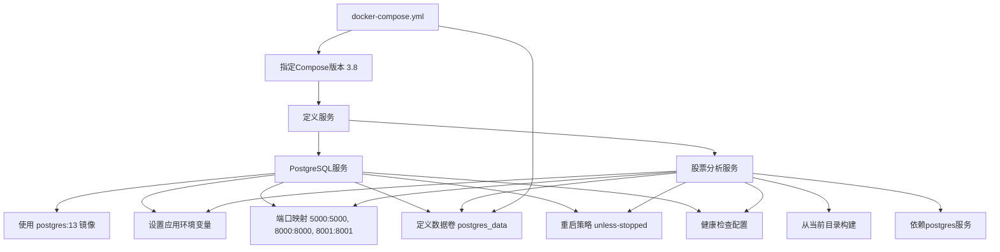

**Diagram sources**
- [deploy.py](file://deploy.py#L332-L360)

### .dockerignore生成

`.dockerignore`文件用于指定在构建镜像时需要忽略的文件和目录。

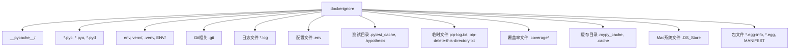

**Diagram sources**
- [deploy.py](file://deploy.py#L362-L380)

**Section sources**
- [deploy.py](file://deploy.py#L300-L380)

## Docker镜像构建

### 构建过程详解

Docker镜像构建过程遵循最佳实践，确保镜像的轻量化和安全性。

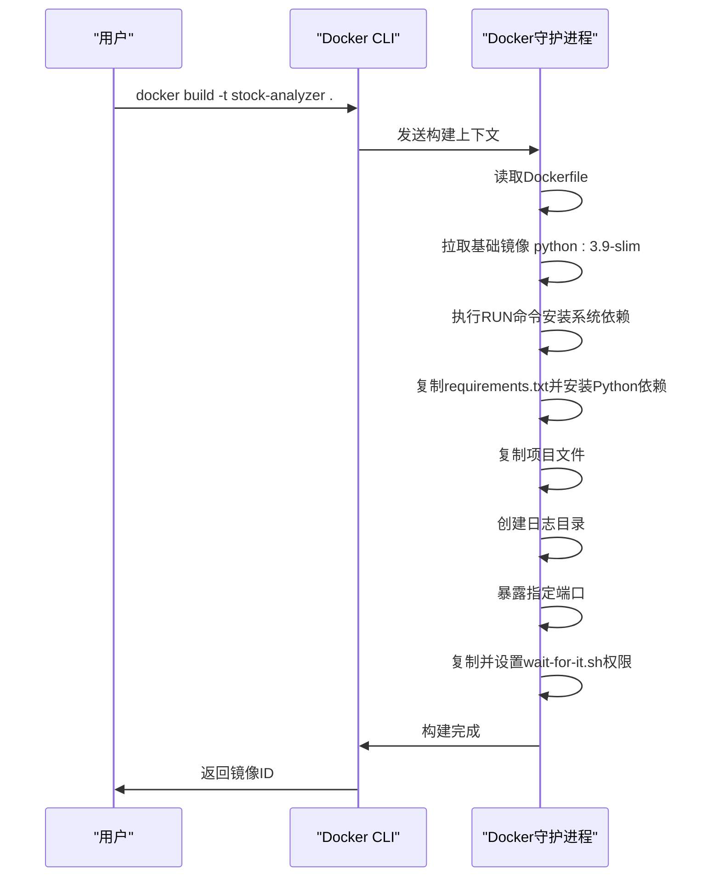

**Diagram sources**
- [deploy.py](file://deploy.py#L310-L330)

### 构建命令

使用以下命令构建Docker镜像：

```bash
docker build -t stock-analyzer .
```

构建过程中会执行以下步骤：
1. 从`python:3.9-slim`基础镜像开始
2. 安装必要的系统依赖（gcc, g++, curl）
3. 安装Python依赖包
4. 复制项目文件到镜像
5. 配置启动环境

**Section sources**
- [DEPLOYMENT_SUMMARY.md](file://DEPLOYMENT_SUMMARY.md#L25-L30)

## 容器运行与编排

### 单容器运行

可以使用`docker run`命令直接运行单个容器：

```bash
docker run -d -p 5000:5000 -p 8000:8000 -p 8001:8001 stock-analyzer
```

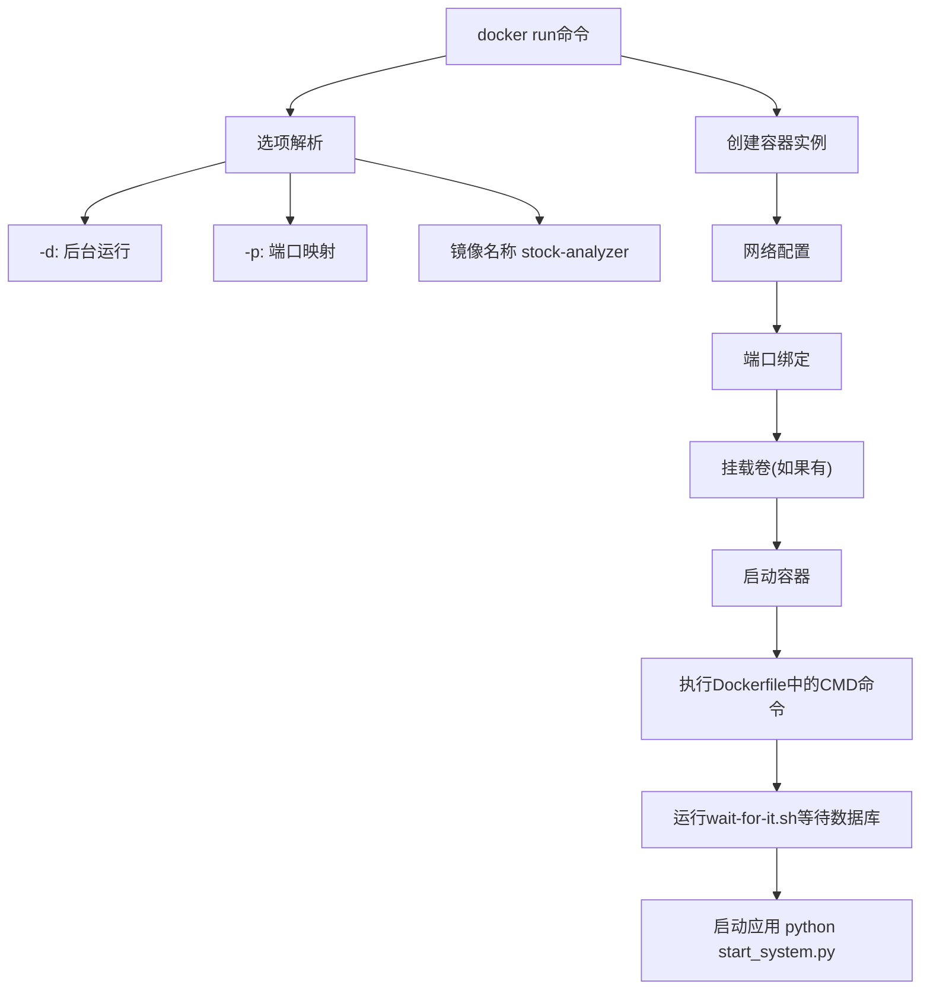

**Diagram sources**
- [deploy.py](file://deploy.py#L318-L320)

### Docker Compose编排

使用Docker Compose可以更方便地管理多容器应用：

```bash
docker-compose up -d
```

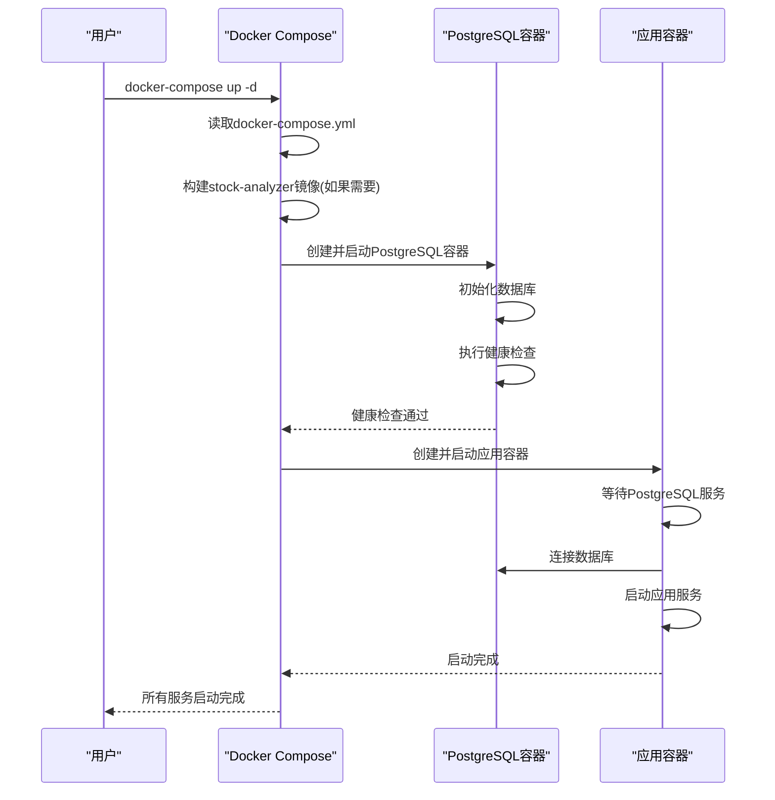

**Diagram sources**
- [deploy.py](file://deploy.py#L340-L360)

**Section sources**
- [DEPLOYMENT_SUMMARY.md](file://DEPLOYMENT_SUMMARY.md#L32-L35)

## 服务依赖与健康检查

### 服务依赖关系

Docker Compose配置中明确定义了服务间的依赖关系，确保服务按正确顺序启动。

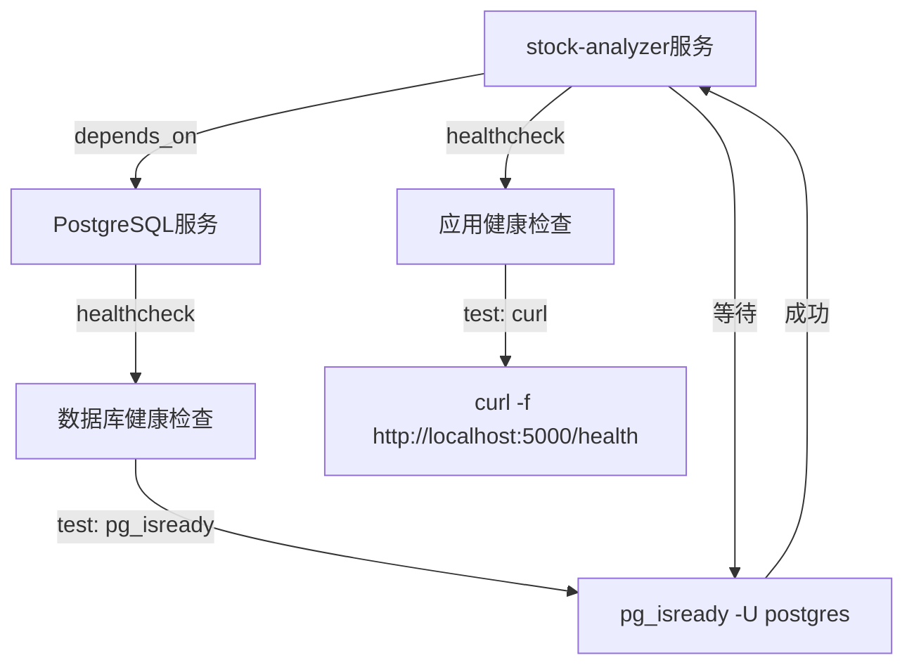

**Diagram sources**
- [deploy.py](file://deploy.py#L340-L360)

### 健康检查配置

健康检查确保服务在完全就绪后才被视为可用。

#### PostgreSQL健康检查

```yaml
healthcheck:
  test: ["CMD-SHELL", "pg_isready -U postgres"]
  interval: 10s
  timeout: 5s
  retries: 5
```

#### 应用服务健康检查

```yaml
healthcheck:
  test: ["CMD", "curl", "-f", "http://localhost:5000/health"]
  interval: 30s
  timeout: 10s
  retries: 3
```

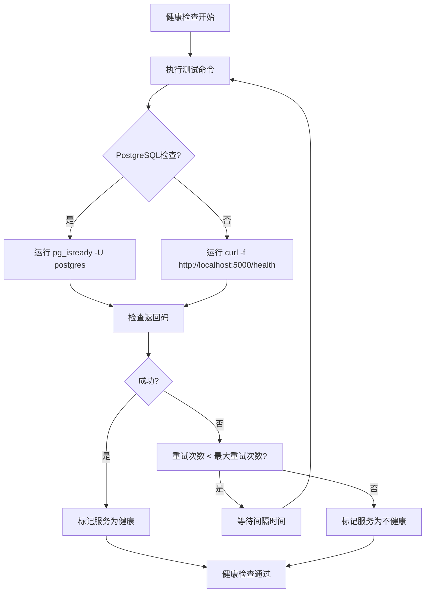

**Diagram sources**
- [deploy.py](file://deploy.py#L348-L350)
- [deploy.py](file://deploy.py#L372-L374)

**Section sources**
- [deploy.py](file://deploy.py#L340-L380)

## 端口映射与环境变量

### 端口映射配置

Docker部署中的端口映射配置确保外部可以访问容器内的服务。

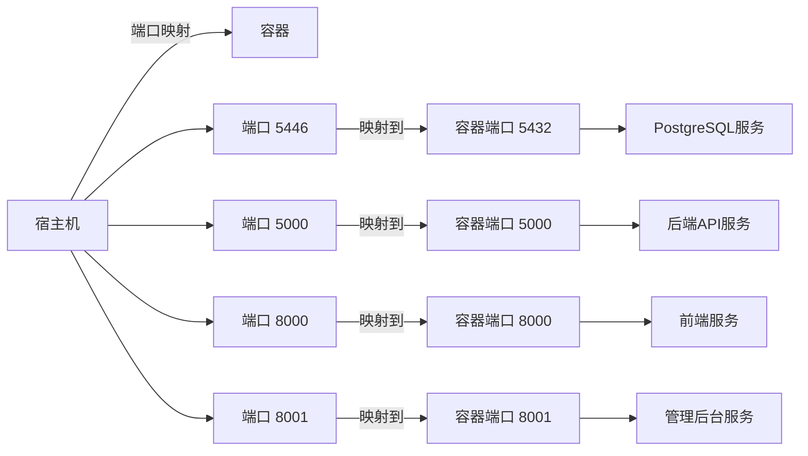

**Diagram sources**
- [deploy.py](file://deploy.py#L344-L346)
- [deploy.py](file://deploy.py#L364-L366)

### 环境变量设置

环境变量用于配置应用运行时的行为。

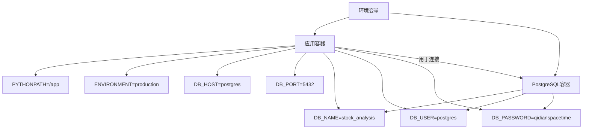

**Diagram sources**
- [deploy.py](file://deploy.py#L342-L343)
- [deploy.py](file://deploy.py#L368-L370)

**Section sources**
- [deploy.py](file://deploy.py#L332-L380)

## 常见问题排查

### 镜像构建失败

当Docker镜像构建失败时，可能的原因和解决方案如下：

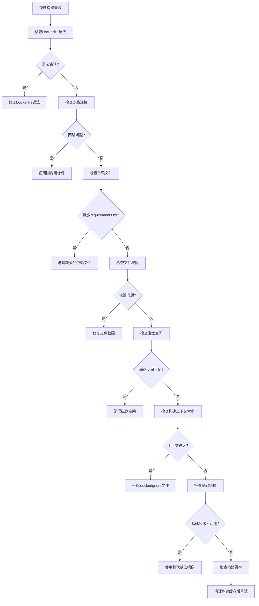

**Diagram sources**
- [deploy.py](file://deploy.py#L300-L380)

### 容器启动异常

容器启动异常的排查流程：

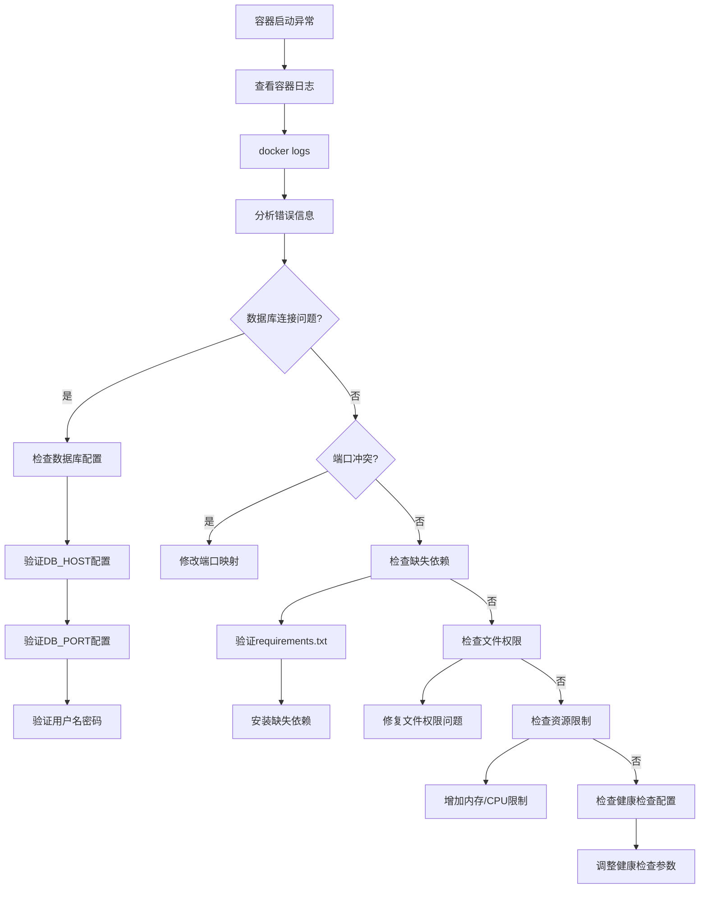

**Diagram sources**
- [deploy.py](file://deploy.py#L340-L380)

### 网络连接问题

网络连接问题的排查方法：

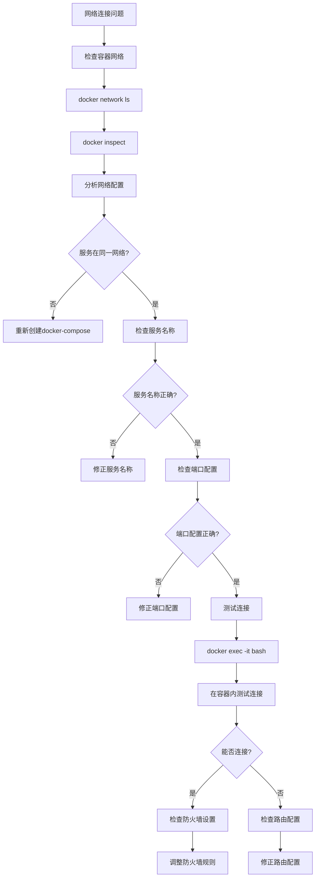

**Diagram sources**
- [deploy.py](file://deploy.py#L340-L380)

**Section sources**
- [DEPLOYMENT_SUMMARY.md](file://DEPLOYMENT_SUMMARY.md#L150-L180)