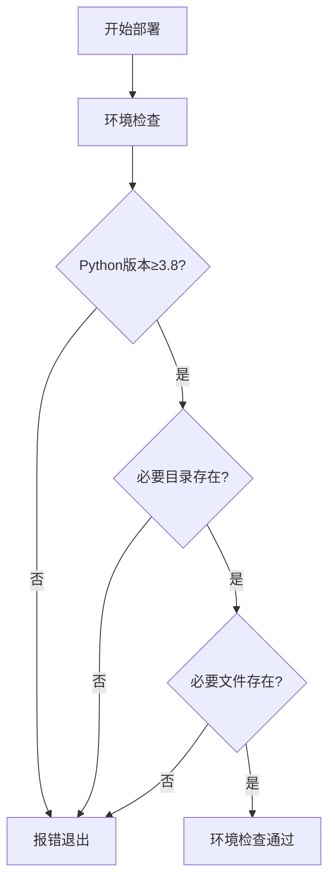
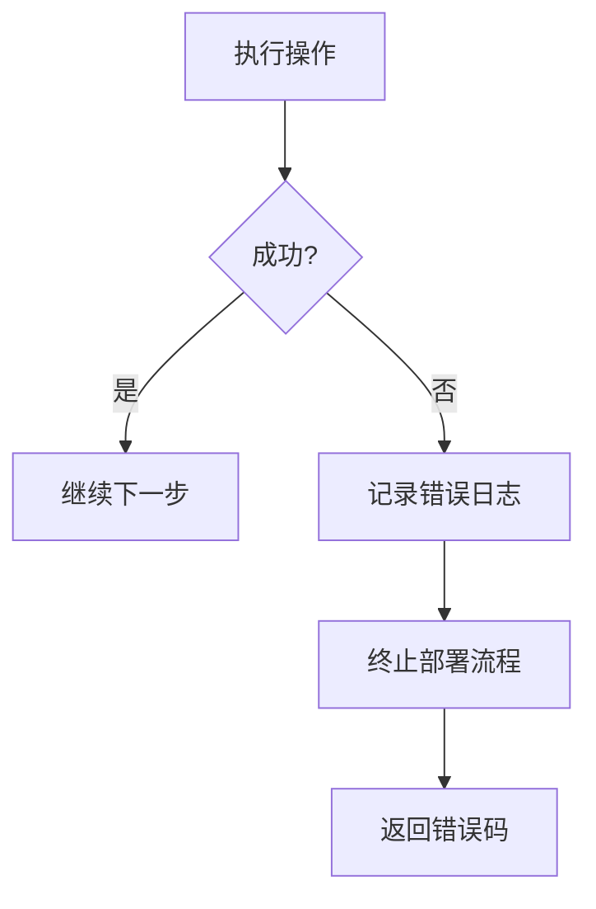

# 一键部署

<cite>
**本文档引用的文件**  
- [deploy.py](file://deploy.py)
- [DEPLOYMENT_SUMMARY.md](file://DEPLOYMENT_SUMMARY.md)
- [deploy_config.json](file://deploy_config.json)
</cite>

## 目录
1. [简介](#简介)
2. [部署脚本参数说明](#部署脚本参数说明)
3. [部署流程详解](#部署流程详解)
4. [配置文件详解](#配置文件详解)
5. [日志与错误处理](#日志与错误处理)
6. [部署验证与访问](#部署验证与访问)
7. [常见问题与故障排除](#常见问题与故障排除)

## 简介
本指南详细说明如何通过 `python deploy.py` 命令实现股票分析系统的新环境一键部署。基于 `deploy.py` 部署脚本和 `DEPLOYMENT_SUMMARY.md` 文档，全面解析部署过程中的关键环节，包括环境检查、依赖安装、数据库初始化、启动脚本生成等。同时介绍日志记录机制和错误处理策略，确保用户能够顺利完成系统部署。

**Section sources**
- [deploy.py](file://deploy.py#L1-L783)
- [DEPLOYMENT_SUMMARY.md](file://DEPLOYMENT_SUMMARY.md#L1-L335)

## 部署脚本参数说明
`deploy.py` 脚本支持多个命令行参数，用于定制化部署流程：

- `--config`: 指定配置文件路径，默认为 `deploy_config.json`
- `--docker`: 创建Docker部署文件（Dockerfile、docker-compose.yml等）
- `--test-only`: 仅运行部署测试，不执行完整部署流程
- `--verbose`: 启用详细输出模式，显示调试信息

这些参数通过 `argparse` 模块解析，允许用户根据实际需求灵活配置部署过程。

**Section sources**
- [deploy.py](file://deploy.py#L460-L470)

## 部署流程详解
部署流程包含多个关键环节，按顺序执行以确保系统正确安装和配置。

### 环境检查
部署器首先执行环境检查，验证以下条件：
- Python版本是否满足要求（3.8+）
- 必要的项目目录是否存在（backend_api、backend_core、frontend、admin）
- 必要的项目文件是否存在（requirements.txt、start_system.py、run.py）
- 数据库环境是否配置正确



**Diagram sources**
- [deploy.py](file://deploy.py#L120-L180)

### 依赖安装
系统自动检测并安装所需的Python依赖包：
- 升级pip到最新版本
- 根据环境类型安装相应的依赖文件（requirements-prod.txt或requirements.txt）
- 安装开发环境额外依赖（如果为开发环境）
- 安装子模块依赖（backend_core和backend_api的requirements.txt）

### 数据库初始化
根据配置文件中的数据库类型执行初始化：
- **PostgreSQL**: 运行 `init_postgresql_db.py` 初始化数据库，执行 `test_deploy_db.py` 测试连接，运行 `migrate_db.py` 进行数据库迁移
- **SQLite**: 创建数据库目录，运行数据库迁移脚本

### 启动脚本生成
根据操作系统类型生成相应的启动脚本：
- **Windows**: 创建 `.bat` 批处理文件（start.bat、start_backend.bat、start_frontend.bat）
- **Unix/Linux/macOS**: 创建 `.sh` 脚本文件并设置执行权限

### Docker文件创建
当使用 `--docker` 参数时，自动生成以下Docker相关文件：
- `Dockerfile`: 定义容器镜像构建过程
- `docker-compose.yml`: 定义多容器服务编排
- `.dockerignore`: 指定忽略文件列表

**Section sources**
- [deploy.py](file://deploy.py#L182-L458)

## 配置文件详解
`deploy_config.json` 文件包含系统部署的所有配置参数：

```json
{
  "python_version": "3.8",
  "ports": {
    "backend": 5000,
    "frontend": 8000,
    "admin": 8001
  },
  "database": {
    "type": "postgresql",
    "host": "192.168.31.237",
    "port": 5446,
    "name": "stock_analysis",
    "user": "postgres",
    "password": "qidianspacetime"
  },
  "services": {
    "backend": true,
    "frontend": true,
    "admin": true,
    "data_collector": true
  }
}
```

关键配置项说明：
- **ports**: 定义各服务的监听端口
- **database**: 数据库连接参数，包括类型、主机、端口、数据库名、用户名和密码
- **services**: 控制哪些服务需要启动

**Section sources**
- [deploy_config.json](file://deploy_config.json#L1-L55)

## 日志与错误处理
系统采用完善的日志记录和错误处理机制，确保部署过程可追踪、可诊断。

### 日志记录机制
部署过程中的所有操作和状态信息都会记录到 `deploy.log` 文件中，同时输出到控制台。日志格式包含时间戳、日志级别和消息内容：

```
2024-01-01 10:00:00 - INFO - 检查部署环境...
2024-01-01 10:00:01 - ERROR - Python版本过低: 3.7, 需要3.8+
```

日志级别包括：
- `INFO`: 一般信息和进度提示
- `WARNING`: 警告信息，非致命问题
- `ERROR`: 错误信息，可能导致部署失败
- `DEBUG`: 详细调试信息（仅在`--verbose`模式下启用）

### 错误处理策略
系统采用分层错误处理机制：
1. **异常捕获**: 使用try-catch结构捕获可能的异常
2. **错误报告**: 详细记录错误信息，包括错误类型和堆栈跟踪
3. **流程控制**: 关键步骤失败时立即终止部署流程
4. **返回码**: 部署成功返回0，失败返回非0值



**Diagram sources**
- [deploy.py](file://deploy.py#L25-L35)
- [deploy.py](file://deploy.py#L460-L470)

**Section sources**
- [deploy.py](file://deploy.py#L25-L35)
- [deploy.py](file://deploy.py#L100-L118)

## 部署验证与访问
部署成功后，可通过以下方式验证系统状态并访问服务。

### 部署成功验证
部署脚本最后会自动运行测试，验证关键组件是否正常工作：
- 数据库连接测试
- API连接测试

如果所有测试通过，脚本会输出成功信息：
```
🎉 部署完成!
📖 请查看 DEPLOYMENT_GUIDE.md 了解详细使用说明
🚀 运行 'python start_system.py' 启动系统
```

### 访问地址
部署成功后，可通过以下地址访问系统各组件：

| 服务 | 访问地址 |
|------|----------|
| 登录页面 | http://localhost:8000/login.html |
| 首页 | http://localhost:8000/index.html |
| 后端API | http://localhost:5000 |
| 管理后台 | http://localhost:8001/ |
| API文档 | http://localhost:5000/docs |

### 启动系统
部署完成后，使用以下命令启动系统：
```bash
python start_system.py
```

或使用生成的启动脚本：
- Windows: `start.bat`
- Linux/macOS: `./start.sh`

**Section sources**
- [DEPLOYMENT_SUMMARY.md](file://DEPLOYMENT_SUMMARY.md#L100-L120)

## 常见问题与故障排除
本节列出部署过程中可能遇到的常见问题及其解决方案。

### 端口冲突
**问题**: 端口被其他进程占用  
**解决方案**: 修改 `deploy_config.json` 中的端口配置，或终止占用端口的进程

### 依赖安装失败
**问题**: pip安装依赖包失败  
**解决方案**: 
```bash
# 升级pip
python -m pip install --upgrade pip

# 清理缓存
pip cache purge

# 重新安装
pip install -r requirements.txt
```

### 数据库问题
**问题**: 数据库连接失败  
**解决方案**:
```bash
# 检查数据库连接
python test_deploy_db.py

# 重新初始化数据库
python migrate_db.py
```

### 权限问题
**问题**: 脚本无执行权限（Linux/macOS）  
**解决方案**:
```bash
chmod +x start.sh start_backend.sh start_frontend.sh
```

### 环境检查失败
**问题**: Python版本过低或缺少必要文件  
**解决方案**: 确保Python版本为3.8+，并检查项目目录结构是否完整

**Section sources**
- [DEPLOYMENT_SUMMARY.md](file://DEPLOYMENT_SUMMARY.md#L250-L300)