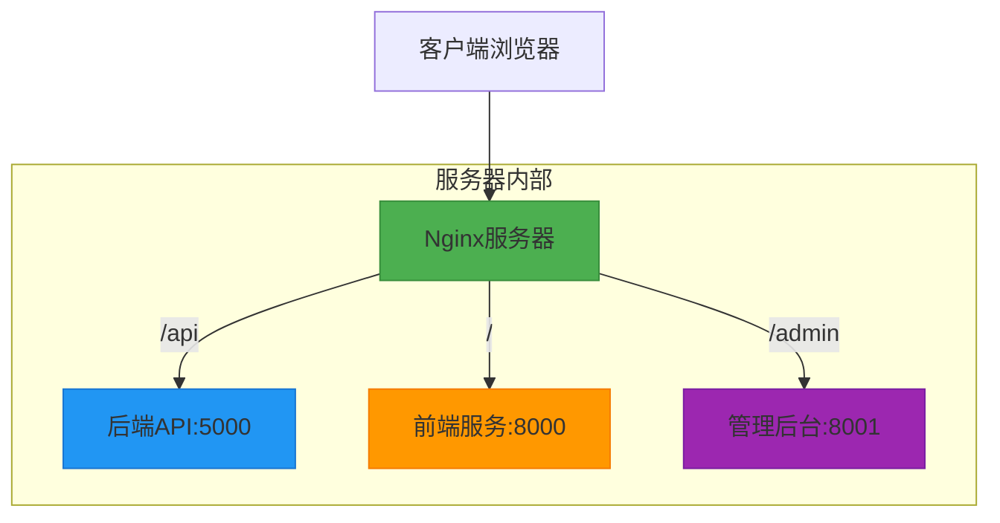

# 手动部署

<cite>
**本文档引用的文件**
- [start_production_services.bat](file://start_production_services.bat)
- [DEPLOYMENT_SUMMARY.md](file://DEPLOYMENT_SUMMARY.md)
- [nginx_complete.conf](file://nginx_complete.conf)
- [start_backend_api.py](file://start_backend_api.py)
- [start_frontend.py](file://start_frontend.py)
</cite>

## 目录
1. [简介](#简介)
2. [环境准备](#环境准备)
3. [依赖安装](#依赖安装)
4. [数据库初始化](#数据库初始化)
5. [服务启动流程](#服务启动流程)
6. [start_production_services.bat 脚本解析](#start_production_servicesbat-脚本解析)
7. [Nginx 配置与域名映射](#nginx-配置与域名映射)
8. [常见问题解决方案](#常见问题解决方案)
9. [总结](#总结)

## 简介
本指南详细说明股票分析系统在生产环境下的手动部署流程。基于 `start_production_services.bat` 启动脚本和 `DEPLOYMENT_SUMMARY.md` 中的手动部署方案，逐步介绍环境准备、依赖安装、数据库初始化及多服务启动的完整过程。同时，深入解析脚本执行逻辑，涵盖后端API、前端服务、管理后台和Nginx的启动顺序与目录切换，并提供端口配置、访问地址（包括 https://www.icemaplecity.com 域名映射）以及常见问题的解决方案。

## 环境准备
在开始部署前，请确保目标服务器满足以下条件：
- 操作系统：Windows Server 或 Windows 10/11（支持Linux环境但本指南以Windows为主）
- Python版本：3.8 或更高版本（通过 `python --version` 验证）
- 磁盘空间：至少5GB可用空间用于代码、依赖和数据库
- 网络权限：允许开放80、443、5000、8000、8001等端口
- 文件路径：建议将项目部署在 `C:\work\stock_quote_analayze` 路径下，以匹配脚本中的默认路径设置

**Section sources**
- [DEPLOYMENT_SUMMARY.md](file://DEPLOYMENT_SUMMARY.md#L25-L30)

## 依赖安装
部署系统前需安装所有必要的Python依赖包。请按照以下步骤操作：

1. 打开命令行终端，进入项目根目录。
2. 安装主项目依赖：
   ```bash
   pip install -r requirements.txt
   ```
3. 安装 backend_core 模块依赖：
   ```bash
   pip install -r backend_core/requirements.txt
   ```
4. 安装 backend_api 模块依赖：
   ```bash
   pip install -r backend_api/requirements.txt
   ```

建议使用虚拟环境隔离依赖，避免与其他项目冲突。可使用如下命令创建并激活虚拟环境：
```bash
python -m venv venv
venv\Scripts\activate
```

**Section sources**
- [DEPLOYMENT_SUMMARY.md](file://DEPLOYMENT_SUMMARY.md#L65-L75)

## 数据库初始化
系统依赖SQLite数据库存储用户、自选股、日志等信息。初始化步骤如下：

1. 确保项目目录中存在 `database` 子目录。
2. 运行数据库迁移脚本以创建表结构：
   ```bash
   python migrate_db.py
   ```
3. 测试数据库连接是否正常：
   ```bash
   python test_deploy_db.py
   ```
4. 如需重置数据库，可删除 `database/stock_analysis.db` 文件后重新运行迁移脚本。

数据库配置位于 `deploy_config.json` 中，支持SQLite默认配置，无需额外修改即可运行。

**Section sources**
- [DEPLOYMENT_SUMMARY.md](file://DEPLOYMENT_SUMMARY.md#L80-L90)

## 服务启动流程
系统由四个核心组件构成：后端API、前端服务、管理后台和Nginx反向代理。启动顺序必须严格遵循以下流程，以确保服务间正确通信。

### 启动顺序说明
1. **后端API服务**：提供RESTful接口，处理数据请求。
2. **前端服务**：静态HTML/JS/CSS服务器，提供用户界面。
3. **管理后台服务**：基于现代框架的管理界面，运行在独立端口。
4. **Nginx服务**：作为反向代理统一入口，实现HTTPS、负载均衡和静态资源缓存。

各服务端口分配如下：
| 服务 | 端口 | 访问路径 |
|------|------|---------|
| 后端API | 5000 | /api |
| 前端服务 | 8000 | / |
| 管理后台 | 8001 | /admin |
| Nginx | 80/443 | 统一入口 |

**Section sources**
- [DEPLOYMENT_SUMMARY.md](file://DEPLOYMENT_SUMMARY.md#L200-L220)

## start_production_services.bat 脚本解析
该批处理脚本用于自动化启动所有生产环境服务。以下是其执行逻辑的逐行解析：

```batch
@echo off
echo ========================================
echo    股票分析系统生产环境启动脚本
echo ========================================
echo.
```
关闭命令回显，显示启动标题。

```batch
echo 1. 启动后端API服务...
cd /d C:\work\stock_quote_analayze\run\backend_api
start "Backend API" cmd /k "python start_backend_api.py"
timeout /t 5 /nobreak > nul
```
切换到后端API运行目录，使用新命令窗口启动 `start_backend_api.py` 脚本，并等待5秒确保服务初始化完成。

```batch
echo 2. 启动前端服务...
cd /d C:\work\stock_quote_analayze\run\frontend
start "Frontend" cmd /k "python start_frontend.py"
timeout /t 5 /nobreak > nul
```
切换到前端运行目录，启动Python内置HTTP服务器以服务前端静态资源。

```batch
echo 3. 启动管理后台...
cd /d C:\work\stock_quote_analayze\run\admin-modern
start "Admin" cmd /k "python -m http.server 8001"
timeout /t 5 /nobreak > nul
```
启动管理后台服务，监听8001端口，使用Python标准HTTP服务器提供静态文件服务。

```batch
echo 4. 启动Nginx...
cd /d C:\work\stock_quote_analayze\tools\nginx-1.28.0
start "Nginx" cmd /k "nginx.exe"
```
进入Nginx安装目录，启动Nginx进程作为反向代理服务器。

```batch
echo.
echo 所有服务已启动！
echo 请检查各服务是否正常运行。
echo.
echo 访问地址:
echo   前端应用: https://www.icemaplecity.com/
echo   管理后台: https://www.icemaplecity.com/admin
echo   后端API: https://www.icemaplecity.com/api
echo.
pause
```
输出访问提示信息并暂停，便于查看启动状态。

**Section sources**
- [start_production_services.bat](file://start_production_services.bat#L1-L35)

## Nginx 配置与域名映射
Nginx作为系统的统一入口，负责HTTPS终止、反向代理和静态资源优化。其核心配置位于 `nginx_complete.conf` 文件中。

### 核心功能
- **HTTP到HTTPS重定向**：所有80端口请求自动跳转至443端口。
- **SSL证书配置**：使用Let's Encrypt签发的证书，路径为 `C:/work/.../ssl/`。
- **反向代理规则**：
  - `/api/` → 转发至 `http://127.0.0.1:5000`
  - `/admin/` → 转发至 `http://127.0.0.1:8001`
  - `/` → 转发至 `http://127.0.0.1:8000`
- **Vue Router支持**：通过 `error_page 404 = @fallback` 实现前端路由的history模式兼容。
- **安全头设置**：启用HSTS、X-Frame-Options等安全策略。

### 域名映射
系统通过 `www.icemaplecity.com` 域名对外提供服务。需在DNS服务商处配置A记录指向服务器IP，并确保Nginx配置中的 `server_name` 包含该域名。



**Diagram sources**
- [nginx_complete.conf](file://nginx_complete.conf#L1-L240)

**Section sources**
- [nginx_complete.conf](file://nginx_complete.conf#L1-L240)

## 常见问题解决方案
### 1. 服务启动失败
**现象**：某服务无法启动或立即退出。  
**排查步骤**：
- 检查Python是否已正确安装并加入PATH。
- 确认依赖包是否完整安装（查看是否有ImportError）。
- 检查脚本路径是否正确，特别是 `cd /d` 命令的目标路径是否存在。
- 查看命令行输出的错误日志，定位具体异常。

### 2. 端口冲突
**现象**：服务提示“Address already in use”或无法绑定端口。  
**解决方案**：
- 使用以下命令检查端口占用情况：
  ```cmd
  netstat -ano | findstr :5000
  ```
- 结束占用进程（通过PID）：
  ```cmd
  taskkill /PID <进程号> /F
  ```
- 或修改对应服务的端口配置后重启。

### 3. 权限问题
**现象**：Nginx启动失败或无法读取SSL证书。  
**原因**：Windows系统下对文件夹访问权限限制。  
**解决方法**：
- 确保Nginx运行目录（如 `tools\nginx-1.28.0`）对当前用户有完全控制权限。
- 以管理员身份运行命令提示符启动Nginx。
- 检查SSL证书文件路径是否正确且可读。

### 4. 域名无法访问
**现象**：https://www.icemaplecity.com 无法加载页面。  
**排查方向**：
- 确认DNS解析是否生效（使用 `ping www.icemaplecity.com`）。
- 检查服务器防火墙是否开放80/443端口。
- 验证Nginx配置文件语法正确性：
  ```cmd
  nginx.exe -t
  ```
- 查看Nginx错误日志 `logs/error.log` 获取详细信息。

**Section sources**
- [DEPLOYMENT_SUMMARY.md](file://DEPLOYMENT_SUMMARY.md#L280-L320)

## 总结
本手册详细阐述了股票分析系统的手动部署全流程，涵盖从环境准备到服务启动的各个环节。重点解析了 `start_production_services.bat` 脚本的执行逻辑与Nginx的反向代理配置，确保系统可通过 `https://www.icemaplecity.com` 域名稳定访问。同时提供了针对服务启动失败、端口冲突、权限不足等常见问题的解决方案，帮助运维人员快速定位并解决问题。建议首次部署时严格按照本指南操作，后续可考虑使用一键部署脚本或Docker方案提升效率。