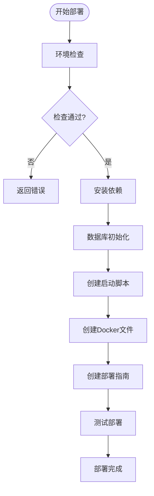
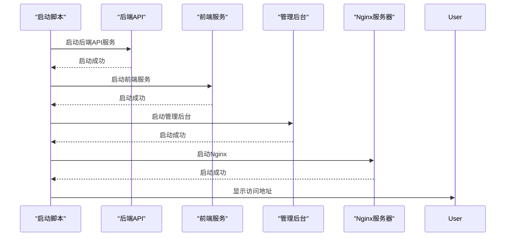

# 部署流程

<cite>
**本文档引用文件**  
- [deploy.py](file://deploy.py)
- [DEPLOYMENT_SUMMARY.md](file://DEPLOYMENT_SUMMARY.md)
- [start_production_services.bat](file://start_production_services.bat)
- [deploy_config.json](file://deploy_config.json)
</cite>

## 目录
1. [部署方案概述](#部署方案概述)
2. [一键部署流程](#一键部署流程)
3. [Docker部署流程](#docker部署流程)
4. [手动部署流程](#手动部署流程)
5. [deploy.py脚本详解](#deploypy脚本详解)
6. [生产环境启动脚本分析](#生产环境启动脚本分析)
7. [常见问题排查与解决方案](#常见问题排查与解决方案)

## 部署方案概述

股票分析系统提供三种主要部署方案：一键部署、Docker部署和手动部署。系统基于FastAPI + SQLAlchemy + HTML/CSS/JavaScript技术栈，支持实时行情、历史数据、个股分析、自选股管理等核心功能。

**Section sources**
- [DEPLOYMENT_SUMMARY.md](file://DEPLOYMENT_SUMMARY.md#L1-L50)

## 一键部署流程

一键部署是推荐的部署方式，通过`deploy.py`脚本自动完成环境检查、依赖安装、数据库初始化和启动脚本生成等步骤。

### 执行步骤
1. 运行部署脚本：
```bash
python deploy.py
```

2. 启动系统服务：
```bash
python start_system.py
```

### 部署包部署
对于Windows用户，可双击运行`deploy.bat`；对于Linux/macOS用户，需先设置执行权限后运行：
```bash
chmod +x deploy.sh
./deploy.sh
```

该方案会自动检测Python版本（需3.8+）、检查必要目录和文件、安装依赖、初始化数据库并创建相应的启动脚本。

**Section sources**
- [deploy.py](file://deploy.py#L1-L100)
- [DEPLOYMENT_SUMMARY.md](file://DEPLOYMENT_SUMMARY.md#L20-L50)

## Docker部署流程

Docker部署提供了容器化的部署方案，确保环境一致性。

### 构建镜像
```bash
docker build -t stock-analyzer .
```

### 运行容器
单容器运行方式：
```bash
docker run -d -p 5000:5000 -p 8000:8000 -p 8001:8001 stock-analyzer
```

使用Docker Compose方式：
```bash
docker-compose up -d
```

Docker部署会自动创建PostgreSQL数据库服务和股票分析系统服务，通过健康检查确保数据库就绪后再启动应用服务。容器暴露5000（后端API）、8000（前端）和8001（管理后台）端口。

**Section sources**
- [deploy.py](file://deploy.py#L500-L580)
- [DEPLOYMENT_SUMMARY.md](file://DEPLOYMENT_SUMMARY.md#L52-L70)

## 手动部署流程

手动部署适用于需要精细控制部署过程的场景。

### 环境准备
```bash
# 检查Python版本
python --version

# 创建虚拟环境（可选）
python -m venv venv
source venv/bin/activate  # Linux/macOS
venv\Scripts\activate     # Windows
```

### 安装依赖
```bash
# 安装主项目依赖
pip install -r requirements.txt

# 安装backend_core依赖
pip install -r backend_core/requirements.txt

# 安装backend_api依赖
pip install -r backend_api/requirements.txt
```

### 数据库初始化
```bash
# 运行数据库迁移
python migrate_db.py

# 测试数据库连接
python test_deploy_db.py
```

### 启动服务
```bash
# 一键启动所有服务
python start_system.py

# 或分别启动
python run.py              # 后端API
python start_frontend.py   # 前端服务
```

**Section sources**
- [DEPLOYMENT_SUMMARY.md](file://DEPLOYMENT_SUMMARY.md#L72-L100)

## deploy.py脚本详解

`deploy.py`是系统的核心部署脚本，实现了完整的部署流程自动化。

### 参数配置
脚本支持以下命令行参数：
- `--config`: 指定配置文件路径（默认为deploy_config.json）
- `--docker`: 创建Docker部署文件
- `--test-only`: 仅运行部署测试
- `--verbose`: 详细输出日志

### 执行流程


**Diagram sources**
- [deploy.py](file://deploy.py#L100-L783)

### 关键环节
#### 环境检查
检查Python版本（需3.8+）、必要目录（backend_api、backend_core、frontend、admin）和必要文件（requirements.txt、start_system.py、run.py）。

#### 依赖安装
自动升级pip，根据环境类型安装相应的依赖文件（requirements-prod.txt、requirements.txt或requirements-dev.txt），并安装子模块依赖。

#### 数据库初始化
根据配置文件中的数据库类型（PostgreSQL或SQLite）执行相应的初始化操作，包括运行数据库迁移和连接测试。

#### 启动脚本生成
根据操作系统类型生成相应的启动脚本：Windows系统生成.bat批处理文件，Unix/Linux系统生成.sh脚本并设置执行权限。

**Section sources**
- [deploy.py](file://deploy.py#L100-L499)

## 生产环境启动脚本分析

`start_production_services.bat`是生产环境的Windows批处理启动脚本，按特定顺序启动各项服务。

### 执行顺序


**Diagram sources**
- [start_production_services.bat](file://start_production_services.bat#L1-L35)

### 启动逻辑
1. **后端API服务**：进入backend_api目录，通过`start_backend_api.py`启动FastAPI后端服务
2. **前端服务**：进入frontend目录，通过`start_frontend.py`启动前端服务
3. **管理后台**：进入admin-modern目录，使用Python内置HTTP服务器在8001端口启动管理后台
4. **Nginx服务器**：进入nginx目录，启动nginx.exe实现反向代理和静态资源服务

脚本使用`timeout /t 5 /nobreak > nul`命令在启动每个服务后暂停5秒，确保服务有足够时间初始化。

**Section sources**
- [start_production_services.bat](file://start_production_services.bat#L1-L35)

## 常见问题排查与解决方案

### 端口冲突
**问题现象**：服务启动失败，提示端口已被占用
**解决方案**：
1. 检查端口占用情况：
```bash
netstat -tulpn | grep :5000
netstat -tulpn | grep :8000
```
2. 修改`deploy_config.json`中的端口配置

### 依赖安装失败
**问题现象**：pip安装依赖包时出现错误
**解决方案**：
1. 升级pip：
```bash
python -m pip install --upgrade pip
```
2. 清理缓存并重新安装：
```bash
pip cache purge
pip install -r requirements.txt
```

### 数据库问题
**问题现象**：数据库连接失败或初始化异常
**解决方案**：
1. 检查数据库文件权限：
```bash
ls -la database/
```
2. 重新初始化数据库：
```bash
python migrate_db.py
```
3. 测试数据库连接：
```bash
python test_deploy_db.py
```

### 权限问题
**问题现象**：脚本无法执行
**解决方案**：
Linux/macOS系统设置执行权限：
```bash
chmod +x *.sh
chmod +x deploy.sh
```

### 日志查看
部署过程中可通过以下命令查看日志：
```bash
# 查看部署日志
tail -f deploy.log

# 查看应用日志
tail -f logs/app.log
```

**Section sources**
- [DEPLOYMENT_SUMMARY.md](file://DEPLOYMENT_SUMMARY.md#L200-L250)
- [deploy.py](file://deploy.py#L10-L50)