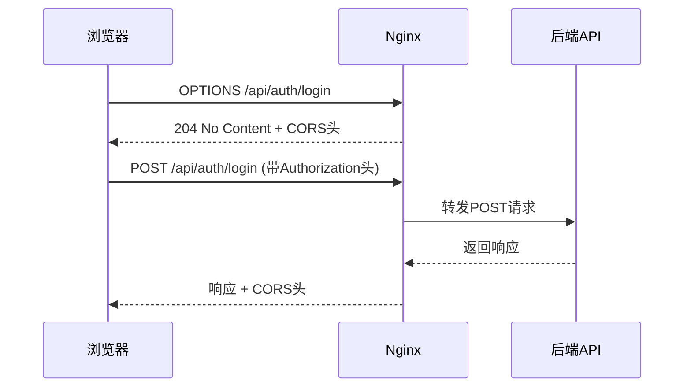

# API代理配置

<cite>
**本文档引用的文件**
- [nginx_complete.conf](file://nginx_complete.conf)
- [生产环境说明.md](file://生产环境说明.md)
- [backend_api/main.py](file://backend_api/main.py)
- [backend_api/config.py](file://backend_api/config.py)
</cite>

## 目录
1. [API代理配置](#api代理配置)
2. [上游服务器定义](#上游服务器定义)
3. [代理规则与请求头设置](#代理规则与请求头设置)
4. [连接与超时设置](#连接与超时设置)
5. [CORS跨域请求处理](#cors跨域请求处理)
6. [生产环境故障排查](#生产环境故障排查)

## 上游服务器定义

Nginx配置文件中通过`upstream`指令定义了后端API服务的上游服务器。`backend_api`作为后端API服务的逻辑名称，指向运行在本地5000端口的后端应用。

**Diagram sources**
- [nginx_complete.conf](file://nginx_complete.conf#L32-L34)

**Section sources**
- [nginx_complete.conf](file://nginx_complete.conf#L32-L34)
- [生产环境说明.md](file://生产环境说明.md#L48-L53)

## 代理规则与请求头设置

`location /api/`块定义了API请求的代理规则。所有以`/api/`开头的请求将被代理到`backend_api`上游服务器。通过`proxy_set_header`指令，Nginx在转发请求时设置了多个关键请求头，确保后端服务能够获取到原始请求的真实信息。

- **Host**: 保持原始请求的Host头，用于虚拟主机识别
- **X-Real-IP**: 设置为客户端的真实IP地址
- **X-Forwarded-For**: 追加客户端IP到请求头链中，便于追踪原始请求路径
- **X-Forwarded-Proto**: 传递原始请求的协议（HTTP/HTTPS）
- **X-Forwarded-Host**: 传递原始请求的主机名
- **X-Forwarded-Port**: 传递原始请求的端口

这些请求头的设置对于后端服务正确处理请求、生成正确的响应链接以及记录准确的访问日志至关重要。

**Section sources**
- [nginx_complete.conf](file://nginx_complete.conf#L85-L94)

## 连接与超时设置

为了确保API服务的稳定性和响应性，Nginx配置了三项关键的超时参数：

- **proxy_connect_timeout**: 连接后端服务器的超时时间，设置为30秒。若Nginx无法在30秒内与后端API建立连接，则请求失败。
- **proxy_send_timeout**: 向后端服务器发送请求的超时时间，设置为30秒。此超时适用于两次写操作之间的间隔，而非整个请求的发送时间。
- **proxy_read_timeout**: 从后端服务器读取响应的超时时间，设置为30秒。此超时同样适用于两次读操作之间的间隔。

这些超时设置在保证服务响应速度的同时，也为后端API处理复杂业务逻辑（如数据查询、计算）提供了合理的时间窗口。过短的超时可能导致正常请求被中断，而过长的超时则会占用Nginx工作进程，影响整体性能。

**Section sources**
- [nginx_complete.conf](file://nginx_complete.conf#L95-L97)

## CORS跨域请求处理

现代Web应用的前端和后端通常部署在不同的域名或端口上，这会触发浏览器的同源策略，导致跨域请求被阻止。Nginx通过在`location /api/`块中配置CORS（跨域资源共享）头来解决此问题。

### OPTIONS预检请求处理

对于包含自定义头（如Authorization）或使用非简单方法（如PUT、DELETE）的请求，浏览器会先发送一个`OPTIONS`预检请求。Nginx通过`if`指令拦截`OPTIONS`请求，并返回特定的CORS响应头，告知浏览器该跨域请求是被允许的。

- **Access-Control-Allow-Origin**: 设置为`*`，表示允许任何来源的请求。在生产环境中，建议明确指定前端域名以提高安全性。
- **Access-Control-Allow-Methods**: 列出允许的HTTP方法，包括GET、POST、PUT、DELETE和OPTIONS。
- **Access-Control-Allow-Headers**: 列出允许的请求头，涵盖了常见的自定义头。
- **Access-Control-Max-Age**: 设置预检请求结果的缓存时间（1728000秒，约20天），减少浏览器重复发送预检请求的次数。
- **Content-Type**: 明确指定响应内容类型为`text/plain`。
- **Content-Length**: 设置为0，因为预检响应体为空。
- **return 204**: 返回204 No Content状态码，表示请求已成功处理，但没有响应体。

### 实际请求的CORS头

对于非`OPTIONS`的API请求，Nginx也会在响应中添加`Access-Control-Allow-Origin`、`Access-Control-Allow-Methods`和`Access-Control-Allow-Headers`头，确保浏览器能够正确处理响应。

值得注意的是，后端FastAPI应用（`backend_api/main.py`）也通过`CORSMiddleware`配置了CORS。Nginx和后端的双重CORS配置提供了冗余保障，但需确保两者配置一致，避免冲突。

**Diagram sources**
- [nginx_complete.conf](file://nginx_complete.conf#L98-L108)
- [backend_api/main.py](file://backend_api/main.py#L50-L65)

**Section sources**
- [nginx_complete.conf](file://nginx_complete.conf#L98-L108)
- [backend_api/main.py](file://backend_api/main.py#L50-L65)
- [backend_api/config.py](file://backend_api/config.py#L44-L48)

## 生产环境故障排查

结合`生产环境说明.md`中的端口信息，以下是针对API代理常见问题的诊断步骤与解决方案。

### 后端服务不可达

**症状**: Nginx日志中出现`connect() failed (111: Connection refused)`错误。

**诊断步骤**:
1.  检查后端API服务是否正在运行：`netstat -ano | findstr :5000`
2.  根据`生产环境说明.md`，确认后端API的启动命令和应用目录。
3.  检查`backend_api`日志文件，查看应用启动时是否有错误。

**解决方案**:
- 使用`start_backend_api.py`脚本启动后端服务。
- 确认后端应用监听的地址是`0.0.0.0:5000`而非`127.0.0.1:5000`，以确保能被Nginx访问。

### 超时错误

**症状**: Nginx日志中出现`upstream timed out (110: Connection timed out)`错误。

**诊断步骤**:
1.  确认后端服务正在运行且响应正常。
2.  检查后端API处理特定请求的性能，是否存在数据库查询慢、外部API调用阻塞等问题。
3.  查看后端应用日志，确认请求是否已到达后端。

**解决方案**:
- 优化后端API的性能瓶颈。
- 如果业务逻辑确实需要较长时间，可适当增加`proxy_read_timeout`的值，但需谨慎评估对Nginx资源的影响。

### CORS失败

**症状**: 浏览器开发者工具中出现`CORS policy`错误。

**诊断步骤**:
1.  检查`OPTIONS`预检请求的响应头，确认`Access-Control-Allow-Origin`等头是否存在且值正确。
2.  确认前端请求的`Origin`头是否在Nginx或后端允许的范围内。
3.  检查Nginx配置文件中`add_header`指令是否正确放置在`location /api/`块内。

**解决方案**:
- 确保Nginx的`if ($request_method = 'OPTIONS')`块正确返回了CORS头。
- 检查后端FastAPI的`CORSMiddleware`配置，确保`allow_origins`包含了前端的域名和端口。
- 使用`curl`命令模拟`OPTIONS`请求，直接测试Nginx的响应。

**Section sources**
- [生产环境说明.md](file://生产环境说明.md#L58-L87)
- [nginx_complete.conf](file://nginx_complete.conf#L98-L108)
- [fix_production_issue.bat](file://fix_production_issue.bat)
- [backend_api/main.py](file://backend_api/main.py#L50-L65)