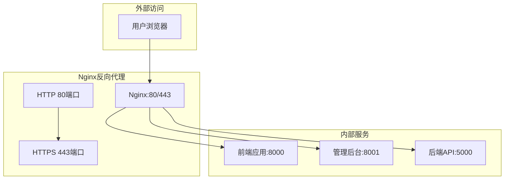
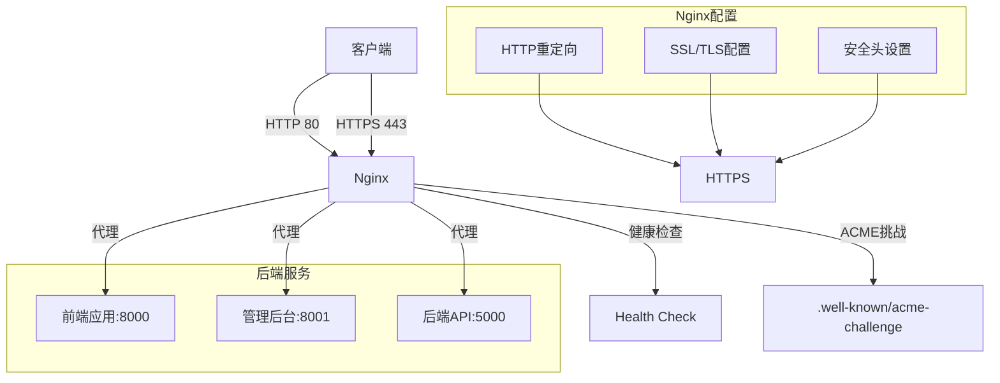
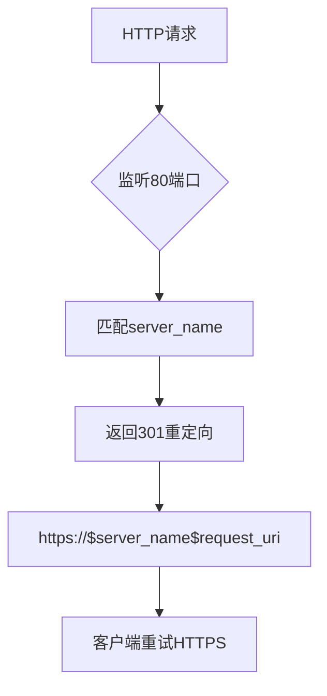
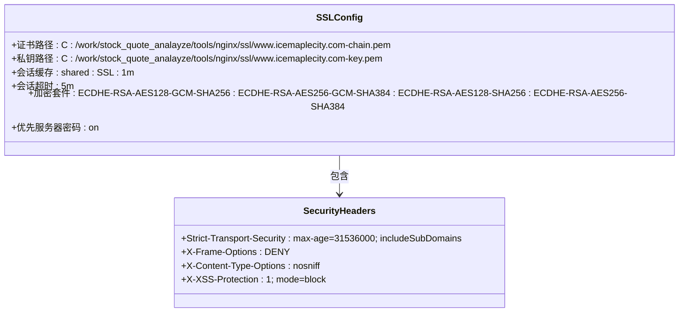
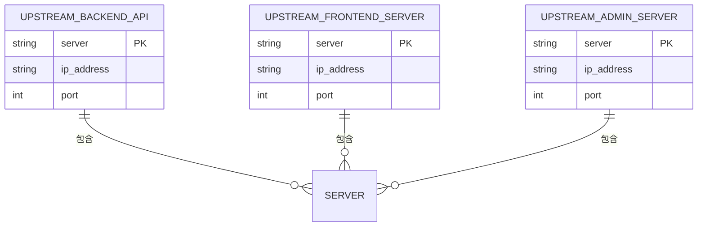
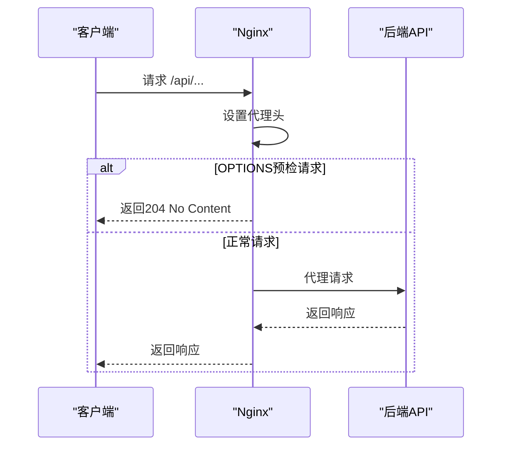
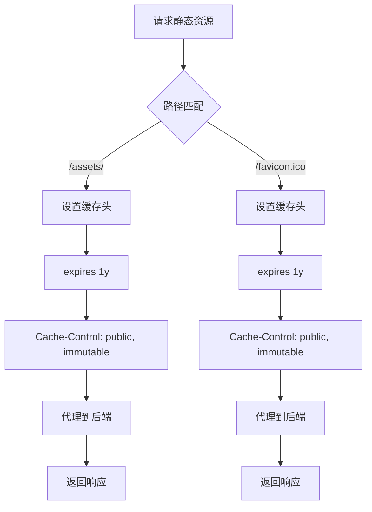
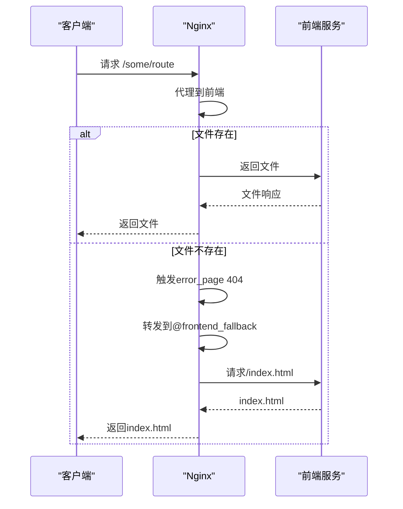
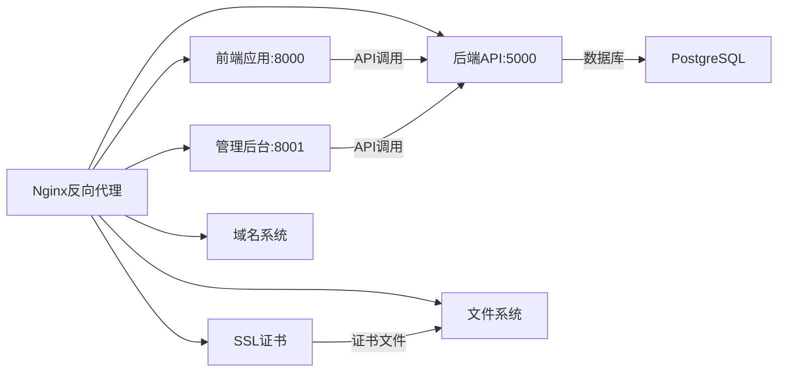

# Nginx反向代理配置

<cite>
**本文档引用文件**   
- [nginx_complete.conf](file://nginx_complete.conf)
- [生产环境说明.md](file://生产环境说明.md)
</cite>

## 目录
1. [引言](#引言)
2. [项目结构](#项目结构)
3. [核心组件](#核心组件)
4. [架构概述](#架构概述)
5. [详细组件分析](#详细组件分析)
6. [依赖分析](#依赖分析)
7. [性能考虑](#性能考虑)
8. [故障排查指南](#故障排查指南)
9. [结论](#结论)

## 引言
本文档基于`nginx_complete.conf`配置文件和`生产环境说明.md`中的服务器信息，深入分析Nginx在股票分析系统生产环境中的完整反向代理配置。文档详细说明了HTTP到HTTPS的重定向、SSL证书安全配置、upstream上游服务定义、API路由代理设置、静态资源缓存策略、Vue Router history模式的fallback处理机制、健康检查端点以及ACME挑战路径等关键配置。同时提供Nginx配置的最佳实践、性能优化建议和故障排查指南。

## 项目结构
本项目采用前后端分离架构，Nginx作为反向代理服务器统一对外提供服务。前端应用、管理后台和后端API分别运行在不同端口，通过Nginx进行统一的流量管理和安全控制。



**Diagram sources**
- [nginx_complete.conf](file://nginx_complete.conf#L45-L50)
- [生产环境说明.md](file://生产环境说明.md#L25-L30)

**Section sources**
- [nginx_complete.conf](file://nginx_complete.conf#L1-L240)
- [生产环境说明.md](file://生产环境说明.md#L1-L186)

## 核心组件
Nginx配置的核心组件包括：HTTP到HTTPS的自动重定向、SSL/TLS安全配置、upstream上游服务器定义、API代理配置、静态资源缓存策略、Vue Router history模式支持、健康检查端点和ACME挑战路径。这些组件共同构成了一个安全、高效、可靠的反向代理系统。

**Section sources**
- [nginx_complete.conf](file://nginx_complete.conf#L32-L240)
- [生产环境说明.md](file://生产环境说明.md#L20-L186)

## 架构概述
系统采用Nginx作为反向代理层，实现统一的入口管理、安全控制和负载均衡。外部用户通过域名访问Nginx，Nginx根据请求路径将流量分发到不同的后端服务。



**Diagram sources**
- [nginx_complete.conf](file://nginx_complete.conf#L45-L240)
- [生产环境说明.md](file://生产环境说明.md#L40-L60)

## 详细组件分析

### HTTP到HTTPS重定向配置
Nginx配置了HTTP到HTTPS的自动重定向，确保所有流量都通过加密连接传输，提高系统安全性。



**Diagram sources**
- [nginx_complete.conf](file://nginx_complete.conf#L45-L50)

**Section sources**
- [nginx_complete.conf](file://nginx_complete.conf#L45-L50)
- [生产环境说明.md](file://生产环境说明.md#L25-L30)

### SSL证书与安全配置
Nginx配置了完整的SSL/TLS安全设置，包括证书路径、加密套件选择和安全头设置，确保通信安全。

#### SSL配置详情


**Diagram sources**
- [nginx_complete.conf](file://nginx_complete.conf#L65-L78)

**Section sources**
- [nginx_complete.conf](file://nginx_complete.conf#L65-L78)
- [生产环境说明.md](file://生产环境说明.md#L25-L30)

### Upstream上游服务器定义
Nginx定义了三个upstream服务器组，分别对应后端API、前端应用和管理后台服务。



**Diagram sources**
- [nginx_complete.conf](file://nginx_complete.conf#L32-L40)

**Section sources**
- [nginx_complete.conf](file://nginx_complete.conf#L32-L40)

### API路由代理配置
API路由配置了完整的代理设置，包括请求头传递、超时设置和CORS预检请求处理。

#### API代理流程


**Diagram sources**
- [nginx_complete.conf](file://nginx_complete.conf#L82-L103)

**Section sources**
- [nginx_complete.conf](file://nginx_complete.conf#L82-L103)

### 静态资源缓存策略
Nginx为静态资源配置了长期缓存策略，提高页面加载性能。



**Diagram sources**
- [nginx_complete.conf](file://nginx_complete.conf#L105-L111)

**Section sources**
- [nginx_complete.conf](file://nginx_complete.conf#L105-L111)

### Vue Router history模式处理
Nginx配置了Vue Router history模式的fallback机制，确保前端路由正常工作。

#### 前端路由处理流程


**Diagram sources**
- [nginx_complete.conf](file://nginx_complete.conf#L189-L217)

**Section sources**
- [nginx_complete.conf](file://nginx_complete.conf#L189-L217)

### 健康检查与ACME挑战配置
Nginx配置了健康检查端点和ACME挑战路径，支持系统监控和证书自动更新。

```mermaid
graph TD
A[健康检查] --> B[/health]
B --> C[返回200 OK]
C --> D["healthy\n"]
D --> E[Content-Type: text/plain]
F[ACME挑战] --> G[/.well-known/acme-challenge/]
G --> H[root html]
H --> I[try_files $uri =404]
I --> J[访问日志]
J --> K[acme_access.log]
I --> L[错误日志]
L --> M[acme_error.log debug]
```

**Diagram sources**
- [nginx_complete.conf](file://nginx_complete.conf#L218-L240)

**Section sources**
- [nginx_complete.conf](file://nginx_complete.conf#L218-L240)

## 依赖分析
Nginx反向代理配置依赖于多个外部组件和服务，包括SSL证书、后端应用服务和域名系统。



**Diagram sources**
- [nginx_complete.conf](file://nginx_complete.conf#L32-L240)
- [生产环境说明.md](file://生产环境说明.md#L1-L186)

**Section sources**
- [nginx_complete.conf](file://nginx_complete.conf#L32-L240)
- [生产环境说明.md](file://生产环境说明.md#L1-L186)

## 性能考虑
Nginx配置考虑了多个性能优化方面，包括连接保持、静态资源缓存和代理超时设置。

### 性能优化建议
- **连接保持**: 配置`keepalive_timeout 65`，保持客户端连接，减少TCP握手开销
- **静态资源缓存**: 为静态资源设置1年缓存，减少重复请求
- **代理超时**: 设置30秒的连接、发送和读取超时，平衡性能和资源使用
- **Gzip压缩**: 虽然当前配置中注释了gzip，但在生产环境中建议启用以减少传输数据量
- **worker进程**: 配置`worker_processes 1`，在多核服务器上可考虑增加以充分利用CPU资源

[无具体文件分析，不添加来源]

## 故障排查指南
当Nginx反向代理出现问题时，可按照以下步骤进行排查：

### 常见问题及解决方案
1. **HTTPS访问失败**
   - 检查SSL证书路径和权限
   - 验证证书是否过期
   - 确认443端口是否被占用

2. **API调用失败**
   - 检查后端API服务是否运行
   - 查看Nginx错误日志
   - 验证代理头设置是否正确

3. **前端路由404错误**
   - 确认fallback配置是否正确
   - 检查`proxy_intercept_errors`和`error_page`设置
   - 验证`@frontend_fallback`位置块配置

4. **静态资源加载慢**
   - 检查缓存头是否正确设置
   - 验证`expires`和`Cache-Control`指令
   - 确认代理是否正常工作

**Section sources**
- [nginx_complete.conf](file://nginx_complete.conf#L1-L240)
- [生产环境说明.md](file://生产环境说明.md#L1-L186)

## 结论
本文档详细分析了股票分析系统中Nginx反向代理的完整配置。通过HTTP到HTTPS重定向、SSL安全配置、upstream定义、API代理、静态资源缓存、Vue Router支持、健康检查和ACME挑战等配置，构建了一个安全、高效、可靠的反向代理系统。建议定期检查SSL证书有效期，监控Nginx日志，根据实际负载调整worker进程数，并考虑启用gzip压缩以进一步优化性能。

[无具体文件分析，不添加来源]