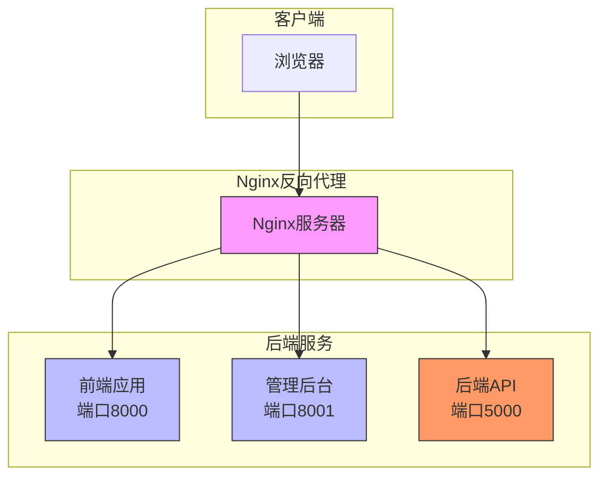
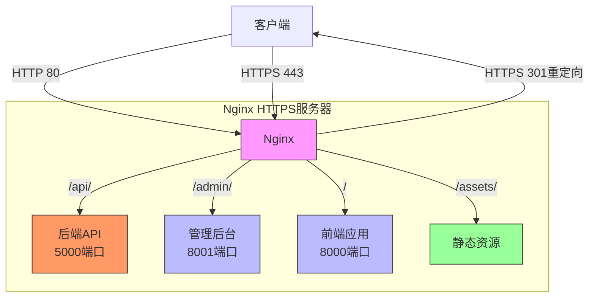
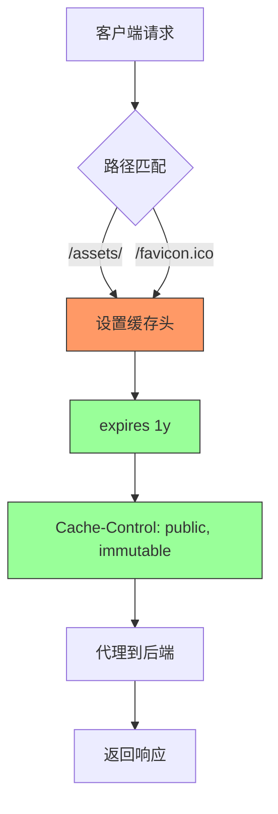
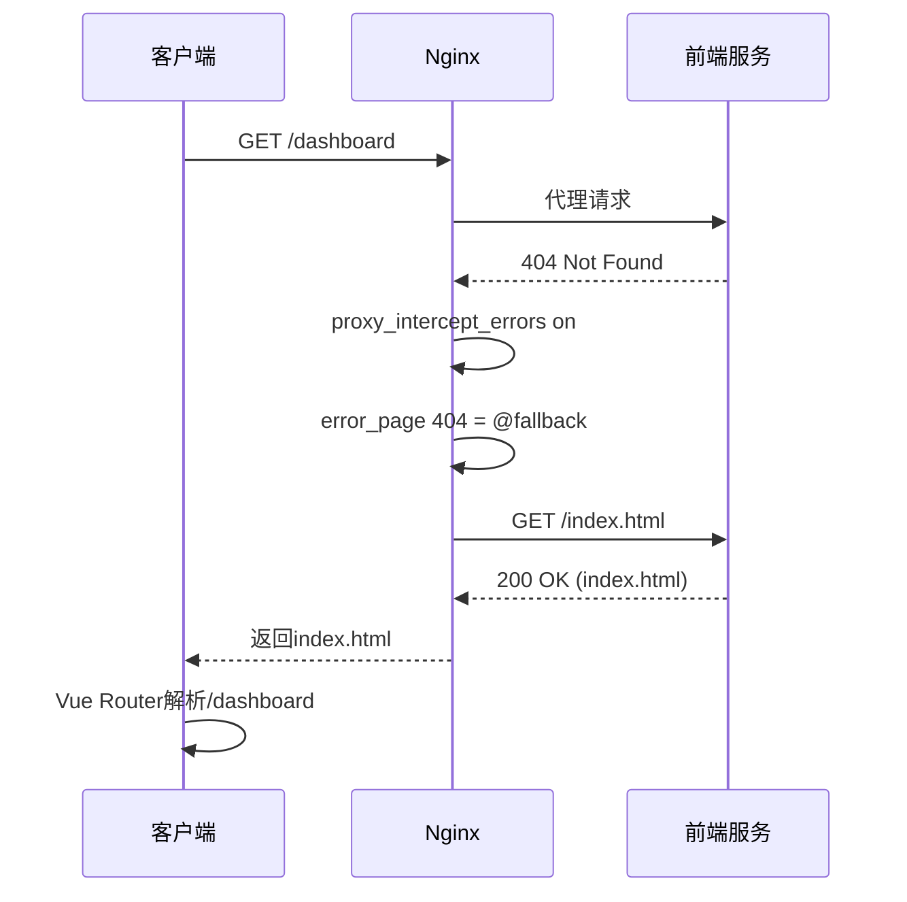
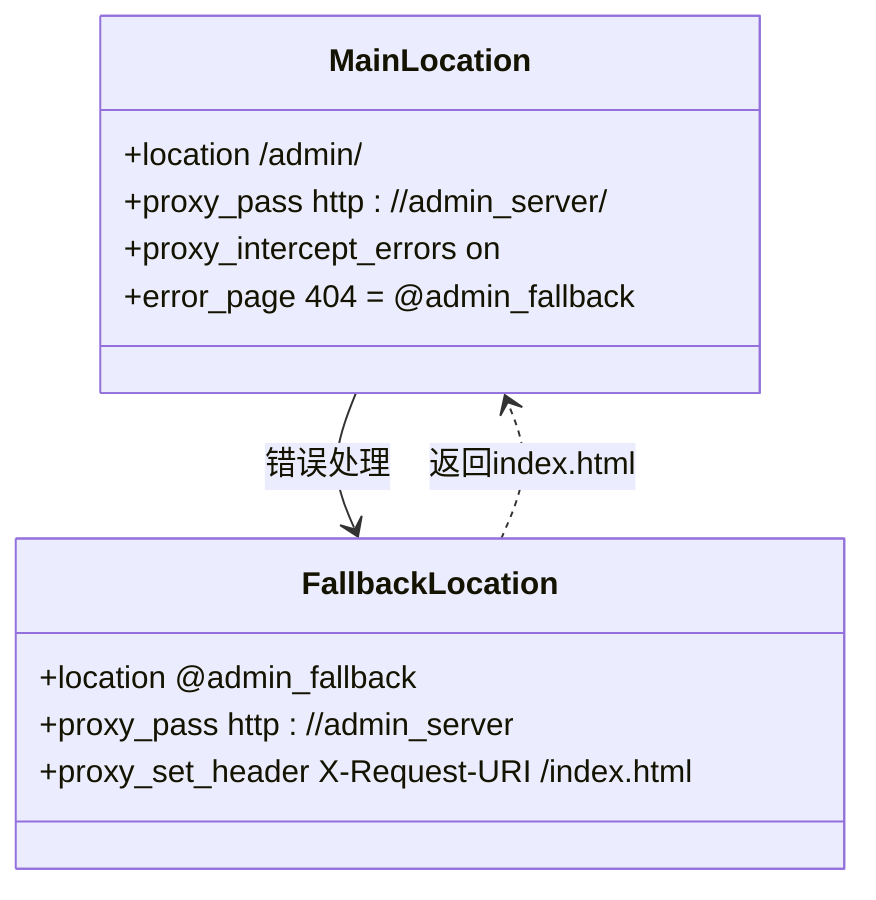
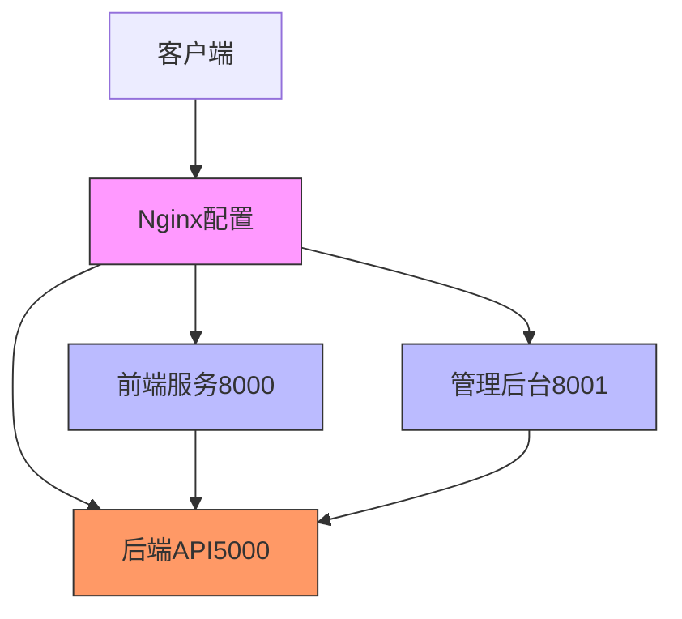

# 前端路由配置

<cite>
**本文档引用的文件**   
- [nginx_complete.conf](file://nginx_complete.conf)
- [生产环境说明.md](file://生产环境说明.md)
- [admin/src/router/index.ts](file://admin/src/router/index.ts)
- [frontend/index.html](file://frontend/index.html)
- [admin/index.html](file://admin/index.html)
</cite>

## 目录
1. [简介](#简介)
2. [项目结构](#项目结构)
3. [核心组件](#核心组件)
4. [架构概述](#架构概述)
5. [详细组件分析](#详细组件分析)
6. [依赖分析](#依赖分析)
7. [性能考虑](#性能考虑)
8. [故障排除指南](#故障排除指南)
9. [结论](#结论)

## 简介
本文档详细说明了基于nginx_complete.conf文件的Nginx前端路由配置，重点阐述Vue Router的history模式在Nginx中的实现机制。文档涵盖静态资源的缓存策略、主路由的代理配置以及关键的fallback处理机制，确保前端应用在页面刷新时能够正确返回index.html文件。结合生产环境说明.md中的访问路径信息，提供前端路由配置的验证方法和常见问题的解决策略。

## 项目结构
本项目采用前后端分离架构，包含前端、管理后台和后端API三个主要部分，通过Nginx进行统一的反向代理和路由分发。

**Diagram sources**
- [nginx_complete.conf](file://nginx_complete.conf#L1-L240)
- [生产环境说明.md](file://生产环境说明.md#L1-L186)

**Section sources**
- [nginx_complete.conf](file://nginx_complete.conf#L1-L240)
- [生产环境说明.md](file://生产环境说明.md#L1-L186)

## 核心组件
本文档的核心组件包括Nginx的location配置块，用于处理前端和管理后台的路由请求。关键配置包括静态资源的缓存策略、API代理设置以及Vue Router history模式的fallback机制。通过upstream指令定义了三个后端服务：backend_api（5000端口）、frontend_server（8000端口）和admin_server（8001端口），实现了请求的正确分发。

**Section sources**
- [nginx_complete.conf](file://nginx_complete.conf#L30-L45)
- [nginx_complete.conf](file://nginx_complete.conf#L85-L109)

## 架构概述
系统采用HTTPS安全架构，所有HTTP请求都会被重定向到HTTPS。Nginx作为反向代理服务器，负责将不同路径的请求转发到相应的后端服务。前端应用和管理后台均采用Vue框架，使用history模式进行路由管理，需要特殊的Nginx配置来处理客户端路由。

**Diagram sources**
- [nginx_complete.conf](file://nginx_complete.conf#L52-L239)
- [生产环境说明.md](file://生产环境说明.md#L1-L186)

## 详细组件分析

### 静态资源缓存策略
Nginx配置了针对静态资源的高效缓存策略，确保前端性能优化。对于/assets/路径和favicon.ico文件，设置了长达1年的过期时间和immutable缓存控制头，最大限度地利用浏览器缓存。

**Diagram sources**
- [nginx_complete.conf](file://nginx_complete.conf#L109-L122)
- [nginx_complete.conf](file://nginx_complete.conf#L174-L182)

**Section sources**
- [nginx_complete.conf](file://nginx_complete.conf#L109-L122)
- [nginx_complete.conf](file://nginx_complete.conf#L174-L182)

### Vue Router history模式实现
Vue Router的history模式允许创建真实的URL路径而无需hash符号，但需要服务器配置支持。当用户直接访问非根路径时，服务器必须返回index.html文件，由前端JavaScript接管路由。

**Diagram sources**
- [nginx_complete.conf](file://nginx_complete.conf#L141-L176)
- [nginx_complete.conf](file://nginx_complete.conf#L209-L211)
- [admin/src/router/index.ts](file://admin/src/router/index.ts#L0-L102)

**Section sources**
- [nginx_complete.conf](file://nginx_complete.conf#L141-L176)
- [nginx_complete.conf](file://nginx_complete.conf#L209-L211)
- [admin/src/router/index.ts](file://admin/src/router/index.ts#L0-L102)

### fallback机制详解
Nginx的fallback机制是支持Vue Router history模式的关键。通过proxy_intercept_errors和error_page指令的组合，当后端服务返回404时，Nginx会内部重定向到自定义的@fallback location，返回index.html文件。

**Diagram sources**
- [nginx_complete.conf](file://nginx_complete.conf#L141-L176)
- [nginx_complete.conf](file://nginx_complete.conf#L209-L211)

**Section sources**
- [nginx_complete.conf](file://nginx_complete.conf#L141-L176)
- [nginx_complete.conf](file://nginx_complete.conf#L209-L211)

## 依赖分析
系统各组件之间存在明确的依赖关系。前端和管理后台依赖后端API提供数据服务，而所有客户端请求都通过Nginx反向代理进行路由。Nginx配置文件依赖于后端服务的可用性，确保代理目标正确运行。

**Diagram sources**
- [nginx_complete.conf](file://nginx_complete.conf#L30-L45)
- [生产环境说明.md](file://生产环境说明.md#L1-L186)

**Section sources**
- [nginx_complete.conf](file://nginx_complete.conf#L30-L45)
- [生产环境说明.md](file://生产环境说明.md#L1-L186)

## 性能考虑
Nginx配置中包含了多项性能优化措施。静态资源设置了1年的缓存有效期和immutable标志，减少重复请求。启用了sendfile系统调用以提高文件传输效率，并设置了合理的keepalive超时时间（65秒）以平衡连接复用和资源占用。

## 故障排除指南
### 404错误问题
当出现404错误时，首先检查Nginx的error_page和proxy_intercept_errors配置是否正确启用。确保fallback location能够正确返回index.html文件。同时验证后端服务是否正常运行。

### 静态资源加载失败
检查静态资源的location配置路径是否正确匹配。确认proxy_pass指令是否包含正确的$request_uri变量。验证缓存头设置是否符合预期。

### 路由刷新失败
如果页面刷新导致路由失效，检查Vue Router的history模式配置是否与Nginx的base路径匹配。在管理后台中，createWebHistory的参数应为'/admin/'，确保路由前缀一致。

**Section sources**
- [nginx_complete.conf](file://nginx_complete.conf#L141-L176)
- [admin/src/router/index.ts](file://admin/src/router/index.ts#L50-L52)
- [nginx_complete.conf](file://nginx_complete.conf#L209-L211)

## 结论
本文档详细阐述了Nginx前端路由配置的关键机制，特别是Vue Router history模式的实现。通过合理的location配置、缓存策略和fallback机制，确保了单页应用在生产环境中的稳定运行。配置中的proxy_intercept_errors和error_page指令组合是解决客户端路由刷新问题的核心，而静态资源的缓存设置则显著提升了前端性能。