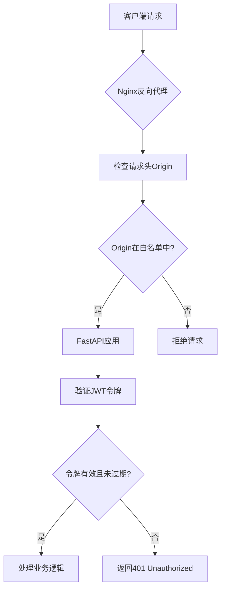
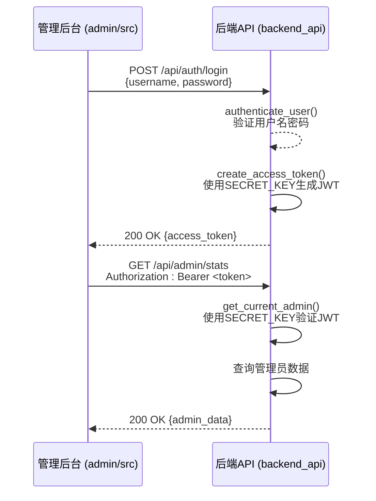

# 安全配置

<cite>
**本文档引用的文件**
- [deploy_config.json](file://deploy_config.json)
- [生产环境说明.md](file://生产环境说明.md)
- [backend_api/auth.py](file://backend_api/auth.py)
- [admin/src/services/auth.service.ts](file://admin/src/services/auth.service.ts)
</cite>

## 目录
1. [引言](#引言)
2. [CORS跨域源配置](#cors跨域源配置)
3. [JWT密钥管理](#jwt密钥管理)
4. [JWT过期时间设置](#jwt过期时间设置)
5. [生产环境安全实践](#生产环境安全实践)
6. [安全漏洞示例与修复](#安全漏洞示例与修复)
7. [前后端安全机制实现](#前后端安全机制实现)
8. [总结](#总结)

## 引言
本文档基于 `deploy_config.json` 中的 `security` 配置项，详细说明股票分析系统在安全配置方面的关键要素。重点涵盖CORS跨域源（cors_origins）的配置方法与风险控制、JWT密钥（jwt_secret）的生成与轮换策略、JWT过期时间（jwt_expire_hours）的合理设置建议。结合生产环境的实际部署情况，强调必须更换默认密钥、限制CORS源范围、避免使用通配符等安全最佳实践。同时提供典型安全漏洞示例及修复方案，并说明在后端 `backend_api/auth.py` 和前端 `admin/src/services/auth.service.ts` 中的具体实现方式。

**Section sources**
- [deploy_config.json](file://deploy_config.json#L50-L55)
- [生产环境说明.md](file://生产环境说明.md#L0-L186)

## CORS跨域源配置

### 配置方法
CORS（跨域资源共享）配置位于 `deploy_config.json` 文件的 `security.cors_origins` 字段。该字段是一个字符串数组，用于指定哪些前端源可以安全地访问后端API服务。

```json
"security": {
  "cors_origins": ["http://localhost:8000", "http://localhost:8001"],
  ...
}
```

当前配置允许来自 `http://localhost:8000`（前端应用）和 `http://localhost:8001`（管理后台）的请求。系统通过读取此配置，在启动时动态设置FastAPI的CORS中间件，确保只有列表中的源才能发起跨域请求。

### 安全风险控制
使用通配符 `*` 允许所有源访问是严重的安全风险，可能导致跨站请求伪造（CSRF）攻击。攻击者可以创建恶意网站，利用用户的登录状态向API发起请求，窃取或篡改数据。

**安全建议**：
- **禁止使用通配符**：生产环境中绝对禁止使用 `["*"]`。
- **精确指定源**：只列出实际需要访问API的前端域名和端口。
- **区分环境**：开发环境可包含 `localhost`，生产环境应使用正式域名（如 `https://www.icemaplecity.com`）。

**Section sources**
- [deploy_config.json](file://deploy_config.json#L52-L52)
- [生产环境说明.md](file://生产环境说明.md#L7-L8)

## JWT密钥管理

### 密钥生成
JWT（JSON Web Token）密钥用于对令牌进行签名和验证，确保其完整性和真实性。`deploy_config.json` 中的 `security.jwt_secret` 字段定义了该密钥。

```json
"security": {
  "jwt_secret": "your-secret-key-change-in-production",
  ...
}
```

**生成强密钥的方法**：
1. **使用密码学安全的随机数生成器**：例如在Python中使用 `secrets.token_urlsafe(32)` 生成64字符的随机字符串。
2. **避免弱密钥**：不要使用字典单词、常见短语或简单模式。
3. **密钥长度**：建议至少32字节（256位）。

### 密钥轮换策略
密钥轮换是重要的安全实践，可以降低密钥泄露带来的长期风险。

**轮换步骤**：
1. **生成新密钥**：在安全环境中生成新的强密钥。
2. **双密钥验证期**：在系统中同时配置新旧两个密钥，允许使用旧密钥签发的令牌继续有效。
3. **更新配置**：将 `deploy_config.json` 中的 `jwt_secret` 更新为新密钥。
4. **部署与重启**：重新部署服务，使新密钥生效。
5. **设置过期时间**：给旧密钥设置一个合理的过期窗口（如24小时），之后停止验证。
6. **移除旧密钥**：确认所有旧令牌已过期后，从代码中移除对旧密钥的支持。

**Section sources**
- [deploy_config.json](file://deploy_config.json#L53-L53)
- [backend_api/auth.py](file://backend_api/auth.py#L25-L27)

## JWT过期时间设置

### 设置建议
`deploy_config.json` 中的 `security.jwt_expire_hours` 字段定义了JWT令牌的有效期，当前设置为24小时。

```json
"security": {
  "jwt_expire_hours": 24
}
```

**过期时间权衡**：
- **短过期时间**（如1-2小时）：安全性高，即使令牌泄露，攻击者可用的时间窗口很短。但用户体验差，用户需要频繁重新登录。
- **长过期时间**（如24小时以上）：用户体验好，但安全风险高。

**推荐策略**：
- **生产环境**：建议设置为 **2-8小时**。平衡安全与用户体验。
- **敏感操作**：对于修改密码、资金交易等敏感操作，应要求用户重新进行身份验证，即使主令牌未过期。
- **刷新令牌**：实现刷新令牌（Refresh Token）机制，主访问令牌（Access Token）短过期，刷新令牌长过期且存储更安全，用于获取新的访问令牌。

**Section sources**
- [deploy_config.json](file://deploy_config.json#L54-L54)
- [backend_api/auth.py](file://backend_api/auth.py#L27-L28)

## 生产环境安全实践

### 必须执行的安全措施
根据 `生产环境说明.md` 中的部署信息，生产环境必须严格遵守以下安全规定：

1. **更换默认密钥**：
   - **风险**：使用默认密钥 `your-secret-key-change-in-production` 等同于没有加密，任何攻击者都可以伪造令牌。
   - **行动**：在部署到生产环境前，必须使用 `secrets.token_urlsafe(32)` 生成的强密钥替换默认值。

2. **限制CORS源范围**：
   - **风险**：开发环境的 `localhost` 源在生产环境中无效，且可能被恶意利用。
   - **行动**：将 `cors_origins` 更新为生产环境的正式域名，例如 `["https://www.icemaplecity.com"]`。

3. **避免使用通配符**：
   - **风险**：Nginx配置中发现 `add_header 'Access-Control-Allow-Origin' '*'`，这会覆盖应用层的CORS设置，导致严重安全漏洞。
   - **行动**：必须移除Nginx配置中的通配符CORS头，完全依赖应用层（FastAPI）的精确CORS控制。



**Diagram sources**
- [nginx_complete.conf](file://nginx_complete.conf#L85-L109)
- [deploy_config.json](file://deploy_config.json#L52-L52)

**Section sources**
- [生产环境说明.md](file://生产环境说明.md#L0-L186)
- [deploy_config.json](file://deploy_config.json#L50-L55)

## 安全漏洞示例与修复

### 漏洞示例：弱密钥导致令牌伪造
**场景**：攻击者发现系统使用默认JWT密钥 `your-secret-key-change-in-production`。
**攻击步骤**：
1. 攻击者使用任意工具（如jwt.io）生成一个伪造的JWT令牌，将 `sub`（用户名）设置为 `admin`，`is_admin` 设置为 `true`。
2. 攻击者将此伪造的令牌放入HTTP请求的 `Authorization` 头。
3. 由于后端使用相同的弱密钥进行验证，无法识别令牌是伪造的，攻击者成功以管理员身份访问系统。

### 修复方案
1. **立即更换密钥**：按照“密钥生成”部分的建议，生成并部署一个强密钥。
2. **强制用户重新登录**：密钥更换后，所有使用旧密钥签发的令牌立即失效，用户需要重新登录。
3. **审计日志**：检查 `backend_api/test/test_admin_cors.py` 等测试文件，确保有针对异常登录行为的监控。

**Section sources**
- [deploy_config.json](file://deploy_config.json#L53-L53)
- [backend_api/auth.py](file://backend_api/auth.py#L25-L27)

## 前后端安全机制实现

### 后端实现 (backend_api/auth.py)
后端安全机制的核心在 `backend_api/auth.py` 文件中实现。

- **JWT配置**：从 `config.py` 或环境变量中读取 `SECRET_KEY`、`ALGORITHM` 和 `ACCESS_TOKEN_EXPIRE_MINUTES`。
- **令牌创建**：`create_access_token` 函数使用 `jwt.encode` 和 `SECRET_KEY` 签名令牌。
- **令牌验证**：`get_current_user` 和 `get_current_admin` 函数使用 `jwt.decode` 和 `SECRET_KEY` 验证令牌，并从中提取用户信息。
- **密码安全**：使用 `bcrypt` 算法（通过 `CryptContext`）对用户密码进行哈希存储，防止明文泄露。



**Diagram sources**
- [backend_api/auth.py](file://backend_api/auth.py#L25-L28)
- [backend_api/auth.py](file://backend_api/auth.py#L75-L80)
- [backend_api/auth.py](file://backend_api/auth.py#L100-L110)

**Section sources**
- [backend_api/auth.py](file://backend_api/auth.py#L0-L197)

### 前端实现 (admin/src/services/auth.service.ts)
前端安全机制在 `admin/src/services/auth.service.ts` 中实现。

- **登录请求**：`AuthService.login` 方法将用户名和密码通过 `FormData` 发送到 `/auth/login` 接口。
- **令牌存储**：登录成功后，返回的JWT令牌应安全地存储在 `localStorage` 或 `sessionStorage` 中。
- **请求携带令牌**：后续所有API请求都应在 `Authorization` 头中携带 `Bearer <token>`。
- **登出处理**：`AuthService.logout` 方法应清除本地存储的令牌，并可选择性地调用后端的登出接口使令牌失效。

**Section sources**
- [admin/src/services/auth.service.ts](file://admin/src/services/auth.service.ts#L0-L32)

## 总结
安全配置是股票分析系统稳定运行的基石。必须严格管理 `deploy_config.json` 中的 `security` 配置项：使用强密钥并定期轮换JWT密钥，精确配置CORS源并杜绝通配符，合理设置JWT过期时间。生产环境部署时，务必更换默认密钥，遵循 `生产环境说明.md` 中的规范。后端通过 `auth.py` 实现安全的认证逻辑，前端通过 `auth.service.ts` 正确处理令牌。通过这些措施，可以有效防范令牌伪造、跨站攻击等安全威胁，保障系统和用户数据的安全。