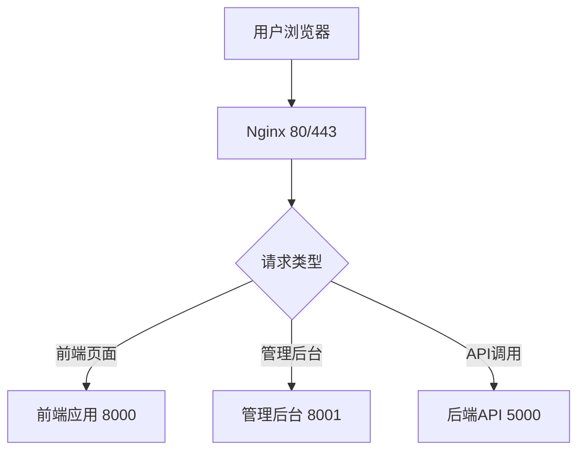
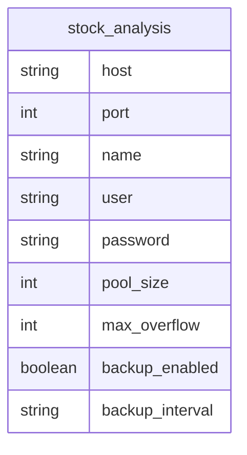

# 应用配置管理

<cite>
**本文档引用文件**  
- [deploy_config.json](file://deploy_config.json)
- [生产环境说明.md](file://生产环境说明.md)
- [backend_api/config.py](file://backend_api/config.py)
- [backend_core/config/config.py](file://backend_core/config/config.py)
- [admin/src/config/environment.ts](file://admin/src/config/environment.ts)
</cite>

## 目录
1. [简介](#简介)
2. [Python运行环境配置](#python运行环境配置)
3. [端口分配策略](#端口分配策略)
4. [数据库连接配置](#数据库连接配置)
5. [服务开关控制](#服务开关控制)
6. [环境模式设置](#环境模式设置)
7. [安全配置](#安全配置)
8. [监控配置](#监控配置)
9. [配置最佳实践与常见问题](#配置最佳实践与常见问题)
10. [附录](#附录)

## 简介
本文档基于`deploy_config.json`配置文件，详细说明股票分析系统中各项应用级配置参数的含义、修改方法及生产环境中的实际部署参数。结合`生产环境说明.md`中的部署信息，提供配置最佳实践、安全建议和常见问题解决方案，帮助运维人员和开发人员正确管理应用配置。

**Section sources**
- [deploy_config.json](file://deploy_config.json#L1-L55)
- [生产环境说明.md](file://生产环境说明.md#L1-L187)

## Python运行环境配置
`python_version` 配置项指定系统运行所需的Python版本。当前配置为`3.8`，确保所有后端服务（Backend-API和Backend-Core）在该版本下运行，以保证依赖库的兼容性。

在生产环境中，必须确保服务器上安装了指定版本的Python，并通过虚拟环境隔离依赖。建议使用`pyenv`或`conda`管理Python版本。

**Section sources**
- [deploy_config.json](file://deploy_config.json#L2-L2)

## 端口分配策略
`ports` 配置项定义了各服务的监听端口：
- **backend**: 5000，后端API服务端口
- **frontend**: 8000，前端应用服务端口
- **admin**: 8001，管理后台服务端口

该配置需与Nginx反向代理设置保持一致。生产环境中，Nginx将外部80/443端口转发至对应内部端口。修改端口时需同步更新Nginx配置和防火墙规则。



**Diagram sources**
- [deploy_config.json](file://deploy_config.json#L3-L8)
- [生产环境说明.md](file://生产环境说明.md#L50-L55)

**Section sources**
- [deploy_config.json](file://deploy_config.json#L3-L8)
- [生产环境说明.md](file://生产环境说明.md#L50-L55)

## 数据库连接配置
`database` 配置项包含PostgreSQL数据库的连接参数和连接池设置。

### 连接参数
- **type**: 数据库类型，固定为`postgresql`
- **host**: 数据库服务器IP，开发环境为`192.168.31.237`，生产环境为`192.168.16.4`
- **port**: 数据库端口，开发环境为`5446`，生产环境为`5432`
- **name**: 数据库名称，`stock_analysis`
- **user**: 数据库用户名，`postgres`
- **password**: 数据库密码

### 连接池设置
- **pool_size**: 初始连接池大小，建议生产环境设置为10-20
- **max_overflow**: 最大溢出连接数，建议设置为20-30

### 备份策略
- **backup_enabled**: 是否启用自动备份，生产环境应为`true`
- **backup_interval**: 备份频率，当前配置为`daily`（每日备份）

生产环境密码为`qidianspacetime$91`，比开发环境更复杂，符合安全要求。



**Diagram sources**
- [deploy_config.json](file://deploy_config.json#L9-L22)
- [生产环境说明.md](file://生产环境说明.md#L5-L20)

**Section sources**
- [deploy_config.json](file://deploy_config.json#L9-L22)
- [生产环境说明.md](file://生产环境说明.md#L5-L20)

## 服务开关控制
`services` 配置项用于控制各模块的启用状态：
- **backend**: 后端API服务
- **frontend**: 前端应用服务
- **admin**: 管理后台服务
- **data_collector**: 数据采集模块

在部署时，可根据需要关闭某些服务。例如，在维护期间可临时关闭`data_collector`，避免数据采集影响数据库性能。

**Section sources**
- [deploy_config.json](file://deploy_config.json#L23-L28)

## 环境模式设置
`environment` 配置项定义系统运行环境，当前为`production`（生产环境）。不同环境对应不同的配置：
- **production**: 生产环境，启用安全配置，日志级别为INFO
- **development**: 开发环境，可启用调试模式
- **testing**: 测试环境，使用测试数据库

`debug` 和 `log_level` 配置需与环境模式匹配。生产环境应保持`debug: false`以确保安全。

**Section sources**
- [deploy_config.json](file://deploy_config.json#L29-L32)

## 安全配置
`security` 配置项包含关键安全参数：

### CORS跨域源
`cors_origins` 定义允许跨域访问的源，当前仅允许本地前端和管理后台访问。生产环境中应更新为实际域名：
```json
["https://www.icemaplecity.com"]
```

### JWT安全配置
- **jwt_secret**: JWT签名密钥，**必须在生产环境中更改**，当前默认值不安全
- **jwt_expire_hours**: 令牌有效期，24小时较为合理，可根据安全策略调整

建议定期轮换JWT密钥，并使用强随机生成器创建密钥。

**Section sources**
- [deploy_config.json](file://deploy_config.json#L40-L44)
- [backend_api/auth.py](file://backend_api/auth.py#L15-L30)

## 监控配置
`monitoring` 配置项定义系统监控策略：

### 健康检查
- **health_check_enabled**: 启用健康检查
- **health_check_interval**: 检查间隔（秒），60秒较为合理

### 日志轮转
- **enabled**: 启用日志轮转
- **max_size**: 单个日志文件最大大小，100MB可防止单文件过大
- **backup_count**: 保留历史日志文件数量，5个备份平衡存储与追溯需求

生产环境中应确保日志目录有足够磁盘空间，并配置外部监控系统收集日志。

**Section sources**
- [deploy_config.json](file://deploy_config.json#L45-L53)

## 配置最佳实践与常见问题

### 配置最佳实践
1. **环境分离**: 开发、测试、生产环境使用不同配置
2. **密码安全**: 生产环境密码应复杂且定期更换
3. **密钥管理**: JWT密钥不应硬编码，建议使用环境变量或密钥管理服务
4. **备份验证**: 定期验证数据库备份的可恢复性

### 常见问题解决方案

#### 数据库连接失败
**症状**: 服务启动时报错"无法连接数据库"
**排查步骤**:
1. 检查数据库服务是否运行
2. 验证`host`和`port`配置是否正确
3. 检查防火墙是否开放相应端口
4. 验证用户名密码是否正确

#### 服务端口冲突
**症状**: 服务无法启动，提示"端口已被占用"
**解决方案**:
1. 使用`netstat -ano | findstr :端口号`查找占用进程
2. 终止占用进程或修改服务端口
3. 确保Nginx配置与服务端口一致

#### JWT令牌无效
**症状**: API调用返回401未授权
**排查步骤**:
1. 检查`jwt_secret`是否匹配
2. 验证令牌是否过期
3. 确认CORS配置允许当前源访问

**Section sources**
- [deploy_config.json](file://deploy_config.json#L1-L55)
- [生产环境说明.md](file://生产环境说明.md#L1-L187)

## 附录
### 配置文件模板
```json
{
  "python_version": "3.8",
  "ports": {
    "backend": 5000,
    "frontend": 8000,
    "admin": 8001
  },
  "database": {
    "type": "postgresql",
    "host": "192.168.16.4",
    "port": 5432,
    "name": "stock_analysis",
    "user": "postgres",
    "password": "your_production_password",
    "pool_size": 15,
    "max_overflow": 25,
    "backup_enabled": true,
    "backup_interval": "daily"
  },
  "security": {
    "cors_origins": ["https://www.icemaplecity.com"],
    "jwt_secret": "your_strong_secret_key",
    "jwt_expire_hours": 24
  }
}
```

**Section sources**
- [deploy_config.json](file://deploy_config.json#L1-L55)