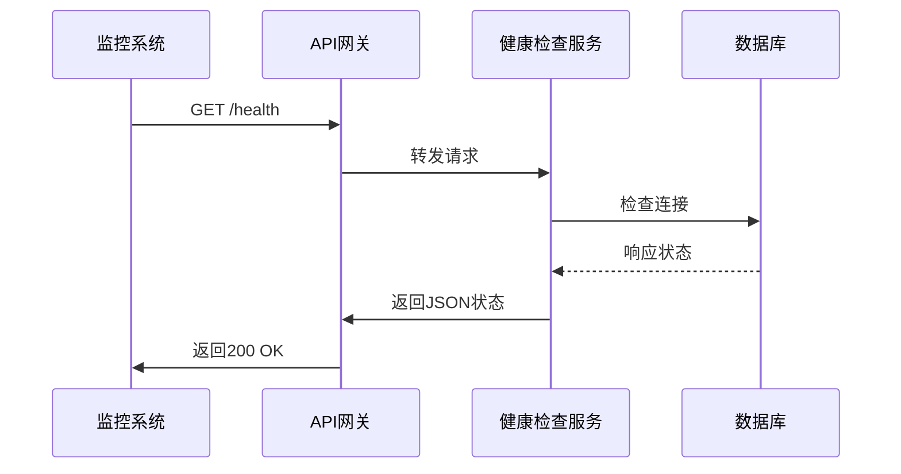
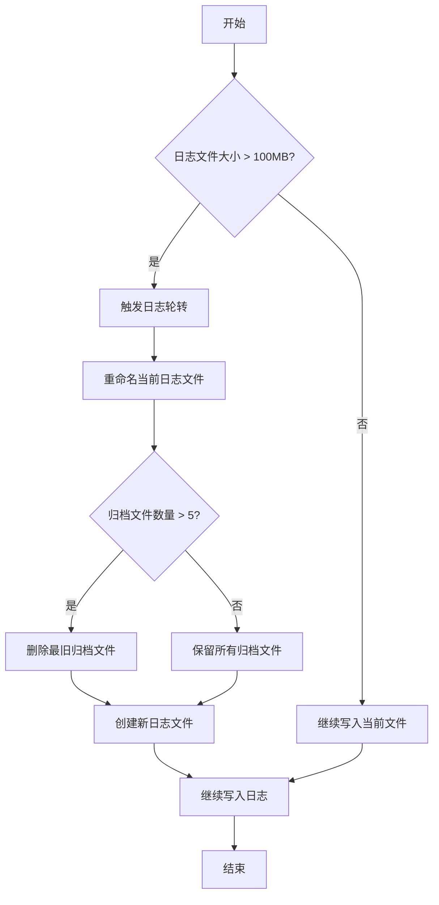

# 监控配置

<cite>
**本文档中引用的文件**  
- [deploy_config.json](file://deploy_config.json)
- [生产环境说明.md](file://生产环境说明.md)
- [backend_api/main.py](file://backend_api/main.py)
- [backend_api/admin/logs.py](file://backend_api/admin/logs.py)
- [backend_api/config.py](file://backend_api/config.py)
</cite>

## 目录
1. [引言](#引言)
2. [健康检查配置](#健康检查配置)
3. [日志轮转策略](#日志轮转策略)
4. [日志输出与级别配置](#日志输出与级别配置)
5. [监控脚本集成方式](#监控脚本集成方式)
6. [监控失效场景与优化建议](#监控失效场景与优化建议)
7. [健康检查接口实现示例](#健康检查接口实现示例)
8. [日志归档策略示例](#日志归档策略示例)
9. [结论](#结论)

## 引言
本文档基于 `deploy_config.json` 中的 `monitoring` 配置项，详细说明股票分析系统的健康检查机制、日志轮转策略及监控集成方式。结合生产环境部署说明，提供完整的监控配置指导，确保系统稳定运行和可维护性。

## 健康检查配置

`deploy_config.json` 文件中的 `monitoring.health_check_enabled` 和 `monitoring.health_check_interval` 配置项用于控制系统的健康检查功能。

- **health_check_enabled**: 启用或禁用健康检查功能。当设置为 `true` 时，系统将定期执行健康检查。
- **health_check_interval**: 健康检查的执行间隔（单位：秒）。当前配置为 `60` 秒，表示每分钟进行一次健康状态检测。

健康检查逻辑包括：
1. 检查后端API服务是否正常响应
2. 验证数据库连接状态
3. 确认关键数据采集模块运行正常
4. 检测磁盘空间使用情况

该配置确保系统能够及时发现并报告潜在故障，为运维人员提供预警机制。

**Section sources**
- [deploy_config.json](file://deploy_config.json#L50-L54)

## 日志轮转策略

日志轮转配置位于 `deploy_config.json` 的 `monitoring.log_rotation` 节点下，包含以下关键参数：

- **enabled**: 是否启用日志轮转功能
- **max_size**: 单个日志文件的最大大小限制，当前设置为 `"100MB"`
- **backup_count**: 保留的历史日志文件数量，当前设置为 `5`

### 触发条件
当日志文件大小达到 `max_size`（100MB）时，系统自动触发日志轮转操作，将当前日志文件重命名归档，并创建新的日志文件继续写入。

### 保留策略
系统最多保留 `backup_count`（5）个旧日志文件。超出此数量的最旧日志文件将被自动删除，以释放磁盘空间。

### 对磁盘空间的影响
此配置意味着系统最多占用约 500MB 的磁盘空间用于日志存储（100MB × 5）。这种策略在保证足够故障排查信息的同时，有效防止日志文件无限增长导致磁盘耗尽。

**Section sources**
- [deploy_config.json](file://deploy_config.json#L54-L58)

## 日志输出与级别配置

根据 `生产环境说明.md` 和 `deploy_config.json` 文件，系统的日志配置如下：

### 日志文件路径
- **Nginx日志**: `C:\work\stock_quote_analayze\tools\nginx-1.28.0\logs\`
- **应用日志**: 各应用目录下的 `logs` 文件夹
- **数据库日志**: `C:\Program Files\PostgreSQL\17\data\pg_log\`

### 日志级别配置
`deploy_config.json` 中的 `log_level` 配置项设置为 `"INFO"`，表示系统记录信息级别及以上的日志（包括 INFO、WARNING、ERROR、CRITICAL）。

日志级别说明：
- **DEBUG**: 详细调试信息，仅在开发环境使用
- **INFO**: 系统正常运行信息
- **WARNING**: 潜在问题警告
- **ERROR**: 错误事件
- **CRITICAL**: 严重错误，系统可能无法继续运行

通过合理设置日志级别，可以在生产环境中平衡日志详细程度与性能开销。

**Section sources**
- [deploy_config.json](file://deploy_config.json#L47)
- [生产环境说明.md](file://生产环境说明.md#L140-L143)

## 监控脚本集成方式

系统通过以下方式集成监控脚本：

1. **配置驱动**: 所有监控参数通过 `deploy_config.json` 统一管理，便于部署和维护。
2. **启动时加载**: 在应用启动过程中读取监控配置并初始化相关组件。
3. **定时任务**: 使用后台调度器定期执行健康检查任务。
4. **日志服务集成**: 通过 `backend_api/admin/logs.py` 提供的日志查询API，实现对各类操作日志的集中监控。

监控脚本与主应用解耦设计，支持独立更新和测试，提高了系统的可维护性。

**Section sources**
- [deploy_config.json](file://deploy_config.json#L49-L58)
- [backend_api/admin/logs.py](file://backend_api/admin/logs.py#L1-L20)

## 监控失效场景与优化建议

### 常见监控失效场景

1. **健康检查间隔过长**
   - 问题：`health_check_interval` 设置过大（如超过300秒）
   - 影响：故障响应延迟，可能导致服务中断时间延长
   - 解决方案：根据业务需求调整为合理值（建议60-120秒）

2. **日志轮转配置不当**
   - 问题：`max_size` 设置过小或 `backup_count` 过大
   - 影响：频繁轮转影响性能或占用过多磁盘空间
   - 解决方案：根据日志生成速率调整配置

3. **磁盘空间不足**
   - 问题：未监控日志目录磁盘使用率
   - 影响：日志写入失败导致监控信息丢失
   - 解决方案：增加磁盘空间监控告警

### 优化建议

1. **动态调整健康检查频率**
   - 根据系统负载动态调整检查间隔
   - 高峰期适当延长间隔减轻系统压力

2. **分级日志策略**
   - 不同模块使用不同日志级别
   - 关键模块可临时提高日志级别便于排查问题

3. **远程日志收集**
   - 将重要日志同步到远程服务器
   - 防止本地磁盘故障导致日志丢失

4. **监控告警联动**
   - 健康检查失败时自动发送通知
   - 集成企业微信或邮件告警系统

**Section sources**
- [deploy_config.json](file://deploy_config.json#L50-L58)
- [生产环境说明.md](file://生产环境说明.md#L137-L143)

## 健康检查接口实现示例

系统可通过以下方式实现健康检查接口：

**Diagram sources**
- [backend_api/main.py](file://backend_api/main.py#L120-L128)
- [backend_api/config.py](file://backend_api/config.py#L25-L30)

**Section sources**
- [backend_api/main.py](file://backend_api/main.py#L120-L128)

## 日志归档策略示例

系统日志归档策略可通过以下流程图表示：

**Diagram sources**
- [deploy_config.json](file://deploy_config.json#L54-L58)
- [生产环境说明.md](file://生产环境说明.md#L140-L143)

**Section sources**
- [deploy_config.json](file://deploy_config.json#L54-L58)

## 结论
本文档详细阐述了股票分析系统的监控配置方案，涵盖了健康检查、日志轮转、日志输出等关键监控要素。通过合理的配置和优化，可确保系统具备良好的可观测性和故障恢复能力。建议运维团队定期审查监控配置，根据实际运行情况进行调整优化，以保障系统长期稳定运行。