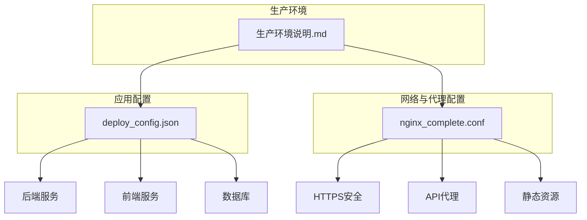
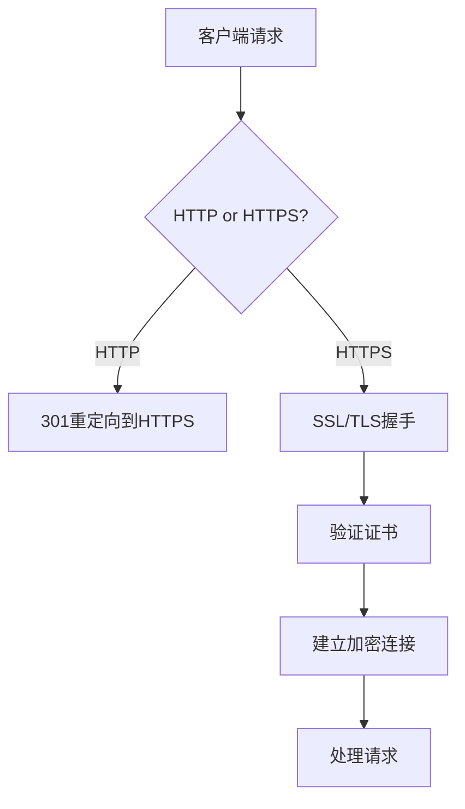
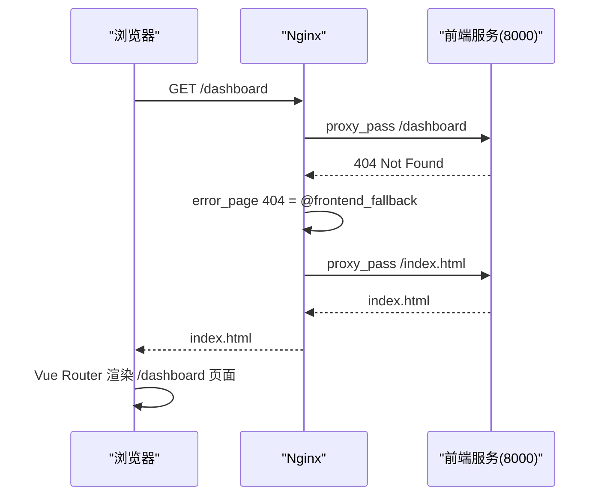

# 配置管理

<cite>
**本文档引用的文件**  
- [deploy_config.json](file://deploy_config.json)
- [nginx_complete.conf](file://nginx_complete.conf)
- [生产环境说明.md](file://生产环境说明.md)
</cite>

## 目录
1. [简介](#简介)
2. [系统配置文件概览](#系统配置文件概览)
3. [deploy_config.json 详细配置说明](#deploy_configjson-详细配置说明)
4. [nginx_complete.conf 反向代理配置分析](#nginx_completeconf-反向代理配置分析)
5. [生产环境配置实践与安全建议](#生产环境配置实践与安全建议)
6. [总结](#总结)

## 简介
本文档旨在全面解析股票分析系统的两大核心配置文件：`deploy_config.json` 和 `nginx_complete.conf`。通过深入分析配置项的含义、作用及修改方法，结合生产环境的实际部署情况，为系统管理员和开发人员提供清晰的配置管理指南。文档涵盖端口配置、数据库连接、服务开关、HTTPS安全设置、API路由代理、静态资源处理、CORS跨域配置以及Vue Router history模式支持等关键内容，并提供最佳实践和安全建议。

## 系统配置文件概览
系统配置主要由两个核心文件构成：`deploy_config.json` 和 `nginx_complete.conf`。前者是应用层的部署配置，定义了服务端口、数据库连接、服务开关等；后者是Nginx服务器的反向代理配置，负责处理HTTPS、路由分发、静态资源缓存和安全策略。

**Diagram sources**
- [deploy_config.json](file://deploy_config.json)
- [nginx_complete.conf](file://nginx_complete.conf)
- [生产环境说明.md](file://生产环境说明.md)

**Section sources**
- [deploy_config.json](file://deploy_config.json)
- [nginx_complete.conf](file://nginx_complete.conf)

## deploy_config.json 详细配置说明
`deploy_config.json` 是系统的主部署配置文件，采用JSON格式，结构清晰，易于修改。它定义了Python版本、服务端口、数据库连接、服务开关、环境变量、数据源配置、安全设置和监控策略等。

### 端口配置
端口配置定义了系统各组件的监听端口，确保服务间正确通信。
- **backend**: 后端API服务端口，默认为5000。
- **frontend**: 前端应用服务端口，默认为8000。
- **admin**: 管理后台服务端口，默认为8001。

**Section sources**
- [deploy_config.json](file://deploy_config.json#L3-L8)

### 数据库连接
数据库配置部分定义了与PostgreSQL数据库的连接参数。
- **type**: 数据库类型，固定为`postgresql`。
- **host**: 数据库服务器IP地址，当前为`192.168.31.237`。
- **port**: 数据库端口，当前为5446。
- **name**: 数据库名称，为`stock_analysis`。
- **user**: 数据库用户名，为`postgres`。
- **password**: 数据库密码，为`qidianspacetime`。
- **pool_size** 和 **max_overflow**: 定义数据库连接池大小，优化性能。
- **backup_enabled** 和 **backup_interval**: 控制数据库备份策略。

**Section sources**
- [deploy_config.json](file://deploy_config.json#L9-L22)

### 服务开关
服务开关控制各核心服务的启用状态。
- **backend**: 后端API服务，`true`表示启用。
- **frontend**: 前端应用服务，`true`表示启用。
- **admin**: 管理后台服务，`true`表示启用。
- **data_collector**: 数据采集服务，`true`表示启用。

**Section sources**
- [deploy_config.json](file://deploy_config.json#L23-L27)

### 安全配置
安全配置包含CORS跨域策略和JWT认证设置。
- **cors_origins**: 允许跨域请求的源列表，当前仅允许本地开发环境。
- **jwt_secret**: JWT令牌的密钥，**必须在生产环境中更改**。
- **jwt_expire_hours**: JWT令牌的有效期，单位为小时。

**Section sources**
- [deploy_config.json](file://deploy_config.json#L48-L53)

### 其他配置
- **environment**: 当前环境，`production`表示生产环境。
- **debug**: 调试模式开关，`false`表示关闭。
- **log_level**: 日志级别，`INFO`表示记录信息级别及以上的日志。
- **data_sources**: 数据源配置，可启用或禁用`akshare`和`tushare`。

**Section sources**
- [deploy_config.json](file://deploy_config.json#L28-L47)
- [deploy_config.json](file://deploy_config.json#L54-L55)

## nginx_complete.conf 反向代理配置分析
`nginx_complete.conf` 是Nginx服务器的完整配置文件，实现了HTTP到HTTPS的重定向、HTTPS安全通信、API路由代理、静态资源处理、CORS跨域支持和Vue Router history模式支持。

### HTTPS安全设置
Nginx配置了严格的HTTPS安全策略，确保数据传输安全。
- **ssl_certificate** 和 **ssl_certificate_key**: 指定SSL证书和私钥的路径。
- **ssl_ciphers**: 定义了强加密套件，优先使用ECDHE算法。
- **安全头**: 通过`add_header`指令添加了多项安全头：
  - `Strict-Transport-Security`: 强制浏览器使用HTTPS。
  - `X-Frame-Options`: 防止点击劫持。
  - `X-Content-Type-Options`: 防止MIME类型嗅探。
  - `X-XSS-Protection`: 启用XSS过滤。

**Diagram sources**
- [nginx_complete.conf](file://nginx_complete.conf#L100-L118)

**Section sources**
- [nginx_complete.conf](file://nginx_complete.conf#L100-L118)

### API路由代理
Nginx将所有以`/api/`开头的请求代理到后端API服务。
- **proxy_pass**: 将请求转发到`upstream backend_api`（127.0.0.1:5000）。
- **proxy_set_header**: 设置一系列头信息，确保后端能获取真实的客户端信息。
- **超时设置**: `proxy_connect_timeout`, `proxy_send_timeout`, `proxy_read_timeout` 均设为30秒。

**Section sources**
- [nginx_complete.conf](file://nginx_complete.conf#L120-L138)

### 静态资源处理
Nginx高效地处理前端和管理后台的静态资源。
- **/admin/assets/** 和 **/assets/**: 代理到对应的服务，并设置一年的缓存过期时间（`expires 1y`）和不可变缓存头（`Cache-Control: public, immutable`），极大提升性能。
- **favicon.ico**: 单独配置，同样启用长期缓存。

**Section sources**
- [nginx_complete.conf](file://nginx_complete.conf#L140-L158)

### CORS跨域配置
Nginx直接在`/api/`位置块中处理CORS。
- **OPTIONS预检请求**: 使用`if`指令拦截`OPTIONS`请求，返回204状态码和必要的CORS头。
- **常规请求**: 在所有API响应中添加`Access-Control-Allow-Origin: *`等头信息，允许任何源的跨域请求。

**Section sources**
- [nginx_complete.conf](file://nginx_complete.conf#L130-L137)

### Vue Router history模式支持
为支持前端和管理后台的单页应用（SPA）的history路由模式，Nginx配置了`error_page 404 = @fallback`。
- 当请求的资源在后端服务中不存在时（返回404），Nginx会将请求重定向到`@frontend_fallback`或`@admin_fallback`。
- 这些`fallback`位置块会将请求代理回前端服务，并返回`index.html`，由Vue Router接管路由。

**Diagram sources**
- [nginx_complete.conf](file://nginx_complete.conf#L190-L202)
- [nginx_complete.conf](file://nginx_complete.conf#L218-L228)

**Section sources**
- [nginx_complete.conf](file://nginx_complete.conf#L190-L202)
- [nginx_complete.conf](file://nginx_complete.conf#L218-L228)

## 生产环境配置实践与安全建议
结合`生产环境说明.md`中的实际配置，以下是配置最佳实践和安全建议。

### 配置一致性
`deploy_config.json`中的端口配置（如后端5000，前端8000）与`生产环境说明.md`中Nginx的反向代理配置完全一致，确保了从Nginx到后端服务的正确路由。

**Section sources**
- [deploy_config.json](file://deploy_config.json#L3-L8)
- [生产环境说明.md](file://生产环境说明.md#L2.2)

### 数据库安全
`生产环境说明.md`中数据库密码为`qidianspacetime$91`，而`deploy_config.json`中为`qidianspacetime`。这表明生产环境使用了更强的密码，符合安全实践。**强烈建议在`deploy_config.json`中也使用强密码，并通过环境变量注入，而非硬编码。**

**Section sources**
- [deploy_config.json](file://deploy_config.json#L15)
- [生产环境说明.md](file://生产环境说明.md#L1.1)

### JWT密钥安全
`deploy_config.json`中的`jwt_secret`为默认值`your-secret-key-change-in-production`。**必须在生产环境中将其替换为一个长且随机的密钥**，以防止令牌被伪造。

**Section sources**
- [deploy_config.json](file://deploy_config.json#L51)

### Nginx配置优化
`nginx_complete.conf`中的`upstream`服务器地址为`127.0.0.1`，这在单机部署时是正确的。`生产环境说明.md`确认了所有服务均部署在同一台服务器（192.168.16.4）上。

**Section sources**
- [nginx_complete.conf](file://nginx_complete.conf#L60-L66)
- [生产环境说明.md](file://生产环境说明.md#L4.1)

### 安全建议总结
1. **敏感信息保护**: 将数据库密码、JWT密钥等敏感信息从`deploy_config.json`移除，改用环境变量或密钥管理服务。
2. **CORS策略收紧**: 将`Access-Control-Allow-Origin: *`改为具体的生产域名（如`https://www.icemaplecity.com`），避免开放给所有源。
3. **定期更新证书**: 确保SSL证书有效，并配置自动续期。
4. **日志监控**: 启用并定期检查Nginx和应用日志，及时发现异常访问。

## 总结
本文档详细解析了`deploy_config.json`和`nginx_complete.conf`两个核心配置文件。`deploy_config.json`是应用部署的“蓝图”，定义了服务、数据库和安全策略；`nginx_complete.conf`是系统的“网关”，负责安全、高效的流量分发。通过结合`生产环境说明.md`，我们验证了配置的一致性，并提出了关键的安全改进建议。遵循本文档的指导，可以确保系统稳定、安全地运行。