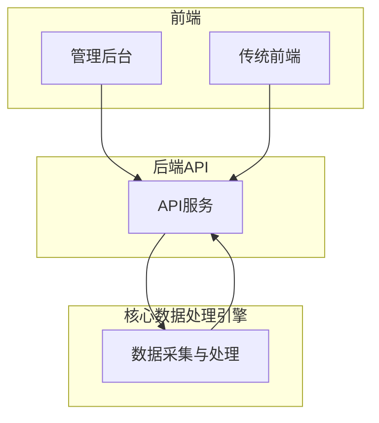
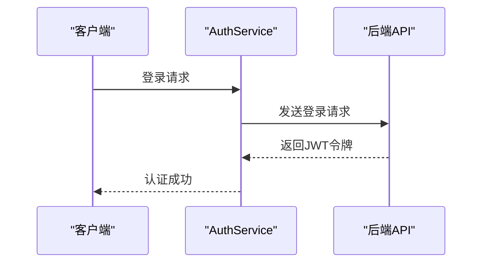
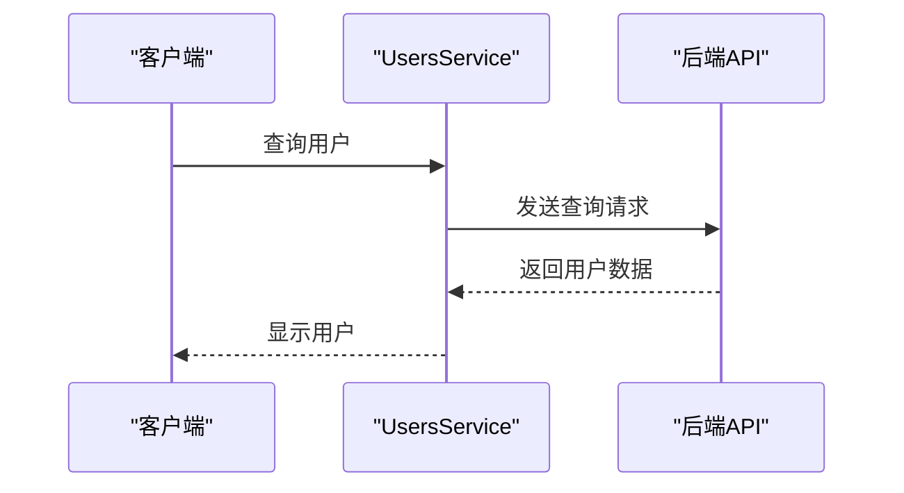
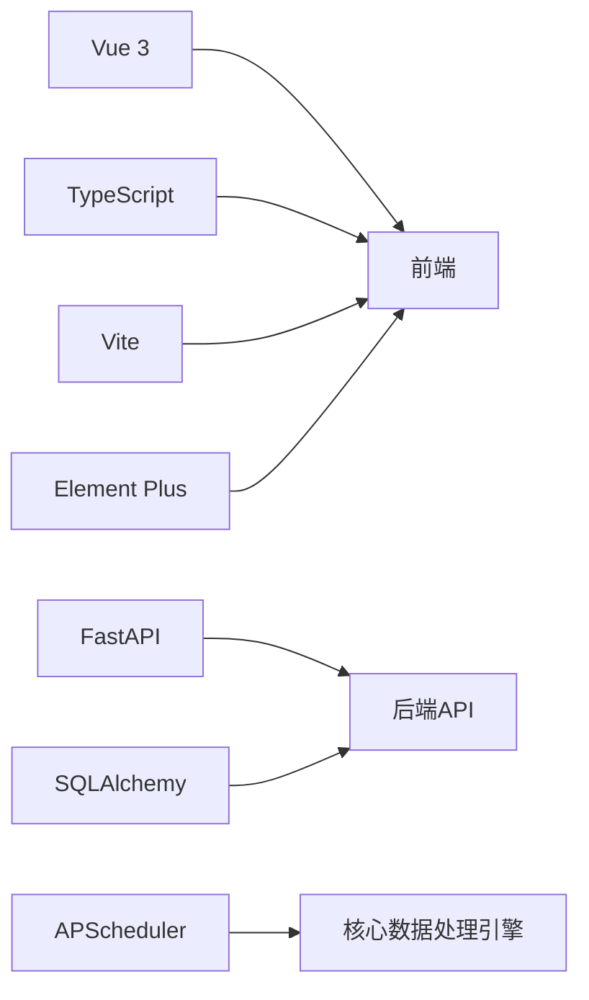

# 项目概述

<cite>
**本文档引用文件**   
- [main.ts](file://admin/src/main.ts)
- [main.py](file://backend_api/main.py)
- [config.py](file://backend_api/config.py)
- [config.py](file://backend_core/config/config.py)
- [auth.service.ts](file://admin/src/services/auth.service.ts)
- [logs.service.ts](file://admin/src/services/logs.service.ts)
- [quotes.service.ts](file://admin/src/services/quotes.service.ts)
- [users.service.ts](file://admin/src/services/users.service.ts)
- [auth.ts](file://admin/src/stores/auth.ts)
- [logs.ts](file://admin/src/stores/logs.ts)
- [users.ts](file://admin/src/stores/users.ts)
- [LoginView.vue](file://admin/src/views/LoginView.vue)
- [DashboardView.vue](file://admin/src/views/DashboardView.vue)
- [LogsView.vue](file://admin/src/views/LogsView.vue)
- [UsersView.vue](file://admin/src/views/UsersView.vue)
- [QuotesView.vue](file://admin/src/views/QuotesView.vue)
- [MonitoringView.vue](file://admin/src/views/MonitoringView.vue)
- [ModelsView.vue](file://admin/src/ModelsView.vue)
- [DataCollectView.vue](file://admin/src/views/DataCollectView.vue)
- [DataSourceView.vue](file://admin/src/views/DataSourceView.vue)
- [AnnouncementsView.vue](file://admin/src/views/AnnouncementsView.vue)
- [ContentView.vue](file://admin/src/views/ContentView.vue)
- [api.config.ts](file://admin/src/config/api.config.ts)
- [environment.ts](file://admin/src/config/environment.ts)
- [README.md](file://README.md)
- [DEPLOYMENT_SUMMARY.md](file://DEPLOYMENT_SUMMARY.md)
- [START_GUIDE.md](file://START_GUIDE.md)
- [系统部署架构图.md](file://系统部署架构图.md)
</cite>

## 目录

1. [简介](#简介)
2. [项目结构](#项目结构)
3. [核心组件](#核心组件)
4. [架构概述](#架构概述)
5. [详细组件分析](#详细组件分析)
6. [依赖分析](#依赖分析)
7. [性能考虑](#性能考虑)
8. [故障排除指南](#故障排除指南)
9. [结论](#结论)

## 简介

股票行情分析系统（stock_quote_analayze）是一个集股票数据采集、技术分析、预测模型和用户管理于一体的全栈金融分析平台。该系统旨在为金融分析师、系统管理员和开发人员提供一个功能全面、易于使用的工具，以支持其在股票市场中的决策和操作。系统的设计哲学强调模块化架构、前后端分离和可扩展性设计，确保了系统的灵活性和可维护性。

## 项目结构

该项目采用分层架构，主要分为三个部分：前端（admin管理后台与传统frontend）、后端API（backend_api）和核心数据处理引擎（backend_core）。每个部分都有其特定的职责和功能，通过清晰的接口进行通信。



**图源**
- [系统部署架构图.md](file://系统部署架构图.md)

**本节来源**
- [README.md](file://README.md)
- [DEPLOYMENT_SUMMARY.md](file://DEPLOYMENT_SUMMARY.md)
- [START_GUIDE.md](file://START_GUIDE.md)

## 核心组件

### 前端管理后台（admin）

前端管理后台基于 Vue 3 + TypeScript + Vite + Element Plus 构建，提供了现代化的用户界面。它包括多个视图组件，如登录视图、仪表板视图、日志视图、用户视图、行情视图等，以及相应的服务和状态管理模块。

**本节来源**
- [main.ts](file://admin/src/main.ts)
- [LoginView.vue](file://admin/src/views/LoginView.vue)
- [DashboardView.vue](file://admin/src/views/DashboardView.vue)
- [LogsView.vue](file://admin/src/views/LogsView.vue)
- [UsersView.vue](file://admin/src/views/UsersView.vue)
- [QuotesView.vue](file://admin/src/views/QuotesView.vue)
- [MonitoringView.vue](file://admin/src/views/MonitoringView.vue)
- [ModelsView.vue](file://admin/src/ModelsView.vue)
- [DataCollectView.vue](file://admin/src/views/DataCollectView.vue)
- [DataSourceView.vue](file://admin/src/views/DataSourceView.vue)
- [AnnouncementsView.vue](file://admin/src/views/AnnouncementsView.vue)
- [ContentView.vue](file://admin/src/views/ContentView.vue)

### 后端API（backend_api）

后端API基于 FastAPI 构建，提供了 RESTful API 服务。它包括多个路由模块，如认证路由、用户管理路由、日志路由、行情路由等，以及数据库配置和中间件配置。

**本节来源**
- [main.py](file://backend_api/main.py)
- [config.py](file://backend_api/config.py)

### 核心数据处理引擎（backend_core）

核心数据处理引擎负责数据的采集和处理，包括历史数据采集、实时数据采集、新闻采集等。它通过定时任务调度器（APScheduler）定期执行数据采集任务，并将数据存储到数据库中。

**本节来源**
- [config.py](file://backend_core/config/config.py)
- [main.py](file://backend_core/data_collectors/main.py)

## 架构概述

系统采用前后端分离的架构设计，前端通过 HTTP 请求与后端API进行通信，后端API则负责处理业务逻辑和数据访问。核心数据处理引擎独立运行，通过定时任务定期采集数据并存储到数据库中。这种设计使得系统具有良好的可扩展性和可维护性。


**图源**
- [系统部署架构图.md](file://系统部署架构图.md)

**本节来源**
- [README.md](file://README.md)
- [DEPLOYMENT_SUMMARY.md](file://DEPLOYMENT_SUMMARY.md)
- [START_GUIDE.md](file://START_GUIDE.md)

## 详细组件分析

### 用户认证与管理

用户认证与管理是系统的核心功能之一。前端通过 `auth.service.ts` 提供的 `AuthService` 类实现用户登录、登出和令牌验证功能。后端通过 `auth_routes.py` 提供的路由处理用户认证请求，并使用 JWT 进行身份验证。



**图源**
- [auth.service.ts](file://admin/src/services/auth.service.ts)
- [auth_routes.py](file://backend_api/auth_routes.py)

**本节来源**
- [auth.service.ts](file://admin/src/services/auth.service.ts)
- [auth_routes.py](file://backend_api/auth_routes.py)

### 日志管理

日志管理功能允许管理员查看和导出系统日志。前端通过 `logs.service.ts` 提供的 `LogsService` 类实现日志查询、统计和导出功能。后端通过 `logs.py` 提供的路由处理日志请求，并从数据库中获取日志数据。


**图源**
- [logs.service.ts](file://admin/src/services/logs.service.ts)
- [logs.py](file://backend_api/admin/logs.py)

**本节来源**
- [logs.service.ts](file://admin/src/services/logs.service.ts)
- [logs.py](file://backend_api/admin/logs.py)

### 行情数据管理

行情数据管理功能允许用户查看和刷新股票、指数和行业板块的实时行情数据。前端通过 `quotes.service.ts` 提供的 `QuotesService` 类实现行情数据查询和刷新功能。后端通过 `quotes_routes.py` 提供的路由处理行情请求，并从数据库中获取行情数据。


**图源**
- [quotes.service.ts](file://admin/src/services/quotes.service.ts)
- [quotes_routes.py](file://backend_api/quotes_routes.py)

**本节来源**
- [quotes.service.ts](file://admin/src/services/quotes.service.ts)
- [quotes_routes.py](file://backend_api/quotes_routes.py)

### 用户管理

用户管理功能允许管理员查看、创建、更新和删除用户。前端通过 `users.service.ts` 提供的 `UsersService` 类实现用户管理功能。后端通过 `users.py` 提供的路由处理用户请求，并从数据库中获取用户数据。



**图源**
- [users.service.ts](file://admin/src/services/users.service.ts)
- [users.py](file://backend_api/admin/users.py)

**本节来源**
- [users.service.ts](file://admin/src/services/users.service.ts)
- [users.py](file://backend_api/admin/users.py)

## 依赖分析

系统依赖于多个外部库和框架，包括 Vue 3、TypeScript、Vite、Element Plus、FastAPI、SQLAlchemy 等。这些依赖项通过 `package.json` 和 `requirements.txt` 文件进行管理。



**图源**
- [package.json](file://admin/package.json)
- [requirements.txt](file://backend_api/requirements.txt)
- [requirements.txt](file://backend_core/requirements.txt)

**本节来源**
- [package.json](file://admin/package.json)
- [requirements.txt](file://backend_api/requirements.txt)
- [requirements.txt](file://backend_core/requirements.txt)

## 性能考虑

为了提高系统的性能，可以采取以下措施：
- 使用缓存机制减少数据库查询次数。
- 优化数据库索引以提高查询速度。
- 使用异步处理提高响应速度。
- 配置CDN加速静态资源加载。

## 故障排除指南

### 常见问题

#### 1. 端口冲突
```bash
# 检查端口占用
netstat -tulpn | grep :5000
netstat -tulpn | grep :8000

# 修改配置文件中的端口
```

#### 2. 依赖安装失败
```bash
# 升级pip
python -m pip install --upgrade pip

# 清理缓存
pip cache purge

# 重新安装
pip install -r requirements.txt
```

#### 3. 数据库问题
```bash
# 检查数据库文件
ls -la database/

# 重新初始化数据库
python migrate_db.py

# 测试数据库连接
python test_deploy_db.py
```

#### 4. 权限问题
```bash
# Linux/macOS设置执行权限
chmod +x *.sh
chmod +x deploy.sh
```

### 日志查看
```bash
# 查看部署日志
tail -f deploy.log

# 查看应用日志
tail -f logs/app.log

# 查看系统日志
journalctl -u stock-analyzer -f
```

**本节来源**
- [DEPLOYMENT_SUMMARY.md](file://DEPLOYMENT_SUMMARY.md)
- [START_GUIDE.md](file://START_GUIDE.md)

## 结论

股票行情分析系统（stock_quote_analayze）是一个功能全面、设计合理的全栈金融分析平台。通过模块化架构、前后端分离和可扩展性设计，系统能够满足金融分析师、系统管理员和开发人员的需求。本文档详细介绍了系统的项目结构、核心组件、架构概述、详细组件分析、依赖分析、性能考虑和故障排除指南，为初学者提供了概念性引导，为高级用户提供了系统级视角，帮助理解各组件间的依赖与交互。