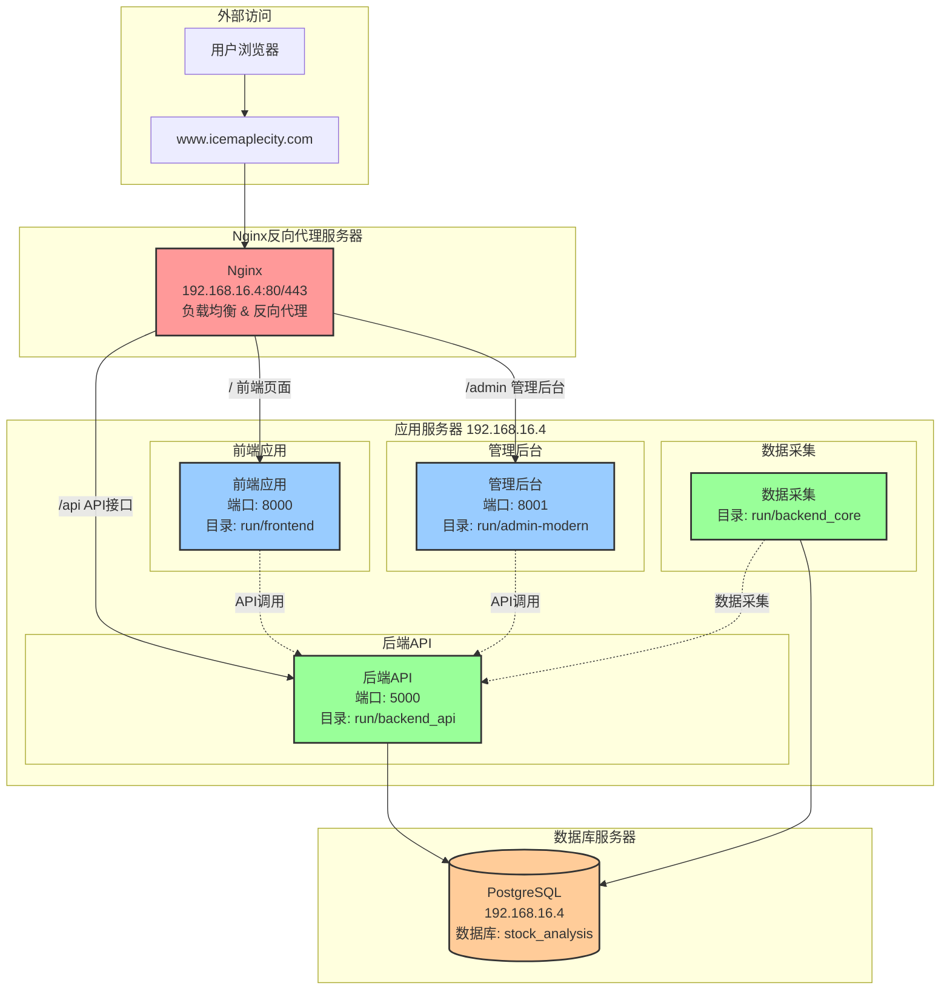
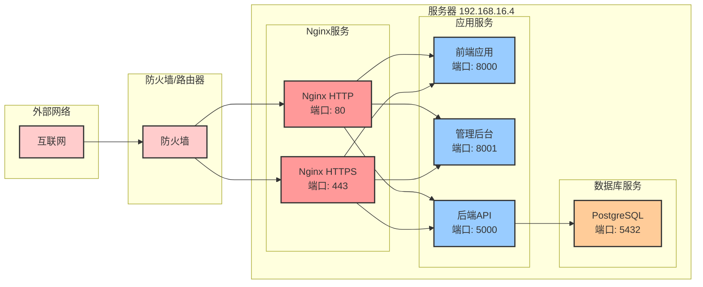
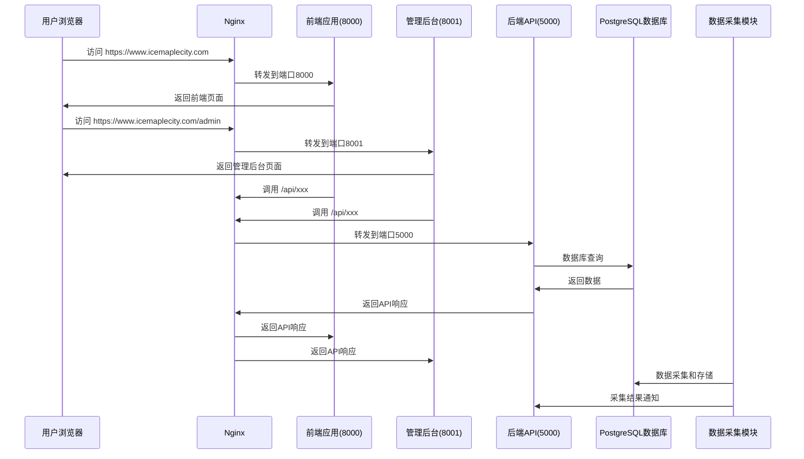
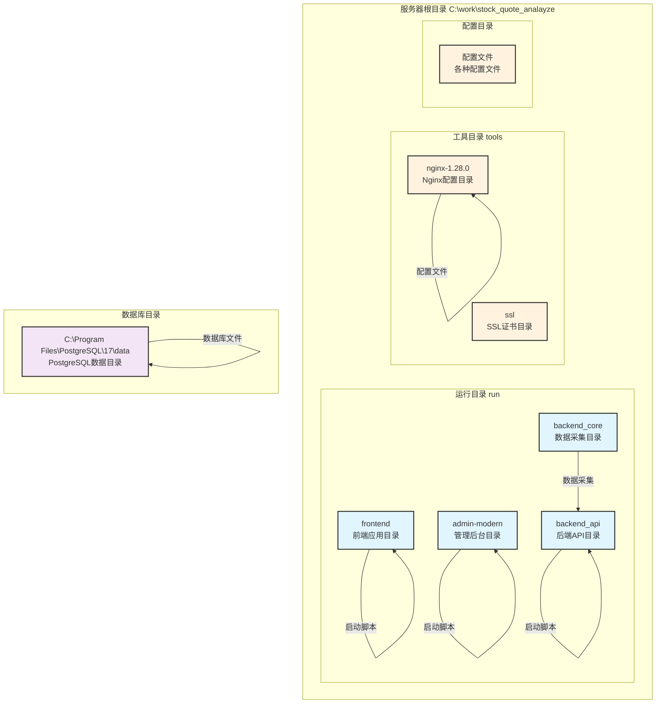
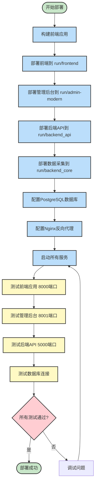

# 股票分析系统部署架构图

## 整体架构图

```mermaid
graph TB
    subgraph "外部访问"
        User[用户浏览器]
        Domain[www.icemaplecity.com]
    end
    
    subgraph "Nginx反向代理服务器"
        Nginx[Nginx<br/>192.168.16.4:80/443<br/>负载均衡 & 反向代理]
    end
    
    subgraph "应用服务器 192.168.16.4"
        subgraph "前端应用"
            Frontend[前端应用<br/>端口: 8000<br/>目录: run/frontend]
        end
        
        subgraph "管理后台"
            AdminModern[管理后台<br/>端口: 8001<br/>目录: run/admin-modern]
        end
        
        subgraph "后端API"
            BackendAPI[后端API<br/>端口: 5000<br/>目录: run/backend_api]
        end
        
        subgraph "数据采集"
            BackendCore[数据采集<br/>目录: run/backend_core]
        end
    end
    
    subgraph "数据库服务器"
        PostgreSQL[(PostgreSQL<br/>192.168.16.4<br/>数据库: stock_analysis)]
    end
    
    %% 外部访问到Nginx
    User --> Domain
    Domain --> Nginx
    
    %% Nginx路由分发
    Nginx -->|"/" 前端页面| Frontend
    Nginx -->|"/admin" 管理后台| AdminModern
    Nginx -->|"/api" API接口| BackendAPI
    
    %% 应用间关系
    Frontend -.->|API调用| BackendAPI
    AdminModern -.->|API调用| BackendAPI
    BackendCore -.->|数据采集| BackendAPI
    
    %% 数据库连接
    BackendAPI --> PostgreSQL
    BackendCore --> PostgreSQL
    
    %% 样式
    classDef nginx fill:#ff9999,stroke:#333,stroke-width:2px
    classDef frontend fill:#99ccff,stroke:#333,stroke-width:2px
    classDef backend fill:#99ff99,stroke:#333,stroke-width:2px
    classDef database fill:#ffcc99,stroke:#333,stroke-width:2px
    
    class Nginx nginx
    class Frontend,AdminModern frontend
    class BackendAPI,BackendCore backend
    class PostgreSQL database
```

## 网络端口架构图

```mermaid
graph LR
    subgraph "外部网络"
        Internet[互联网]
    end
    
    subgraph "防火墙/路由器"
        Firewall[防火墙]
    end
    
    subgraph "服务器 192.168.16.4"
        subgraph "Nginx服务"
            Nginx80[Nginx HTTP<br/>端口: 80]
            Nginx443[Nginx HTTPS<br/>端口: 443]
        end
        
        subgraph "应用服务"
            App8000[前端应用<br/>端口: 8000]
            App8001[管理后台<br/>端口: 8001]
            App5000[后端API<br/>端口: 5000]
        end
        
        subgraph "数据库服务"
            DB5432[PostgreSQL<br/>端口: 5432]
        end
    end
    
    Internet --> Firewall
    Firewall --> Nginx80
    Firewall --> Nginx443
    
    Nginx80 --> App8000
    Nginx80 --> App8001
    Nginx80 --> App5000
    
    Nginx443 --> App8000
    Nginx443 --> App8001
    Nginx443 --> App5000
    
    App5000 --> DB5432
    
    %% 样式
    classDef external fill:#ffcccc,stroke:#333,stroke-width:2px
    classDef nginx fill:#ff9999,stroke:#333,stroke-width:2px
    classDef app fill:#99ccff,stroke:#333,stroke-width:2px
    classDef db fill:#ffcc99,stroke:#333,stroke-width:2px
    
    class Internet,Firewall external
    class Nginx80,Nginx443 nginx
    class App8000,App8001,App5000 app
    class DB5432 db
```

## 数据流架构图

```mermaid
sequenceDiagram
    participant U as 用户浏览器
    participant N as Nginx
    participant F as 前端应用(8000)
    participant A as 管理后台(8001)
    participant B as 后端API(5000)
    participant D as PostgreSQL数据库
    participant C as 数据采集模块
    
    %% 前端页面访问
    U->>N: 访问 https://www.icemaplecity.com
    N->>F: 转发到端口8000
    F->>U: 返回前端页面
    
    %% 管理后台访问
    U->>N: 访问 https://www.icemaplecity.com/admin
    N->>A: 转发到端口8001
    A->>U: 返回管理后台页面
    
    %% API调用
    F->>N: 调用 /api/xxx
    A->>N: 调用 /api/xxx
    N->>B: 转发到端口5000
    B->>D: 数据库查询
    D->>B: 返回数据
    B->>N: 返回API响应
    N->>F: 返回API响应
    N->>A: 返回API响应
    
    %% 数据采集
    C->>D: 数据采集和存储
    C->>B: 采集结果通知
```

## 目录结构图

```mermaid
graph TD
    subgraph "服务器根目录 C:\work\stock_quote_analayze"
        subgraph "运行目录 run"
            FrontendDir[frontend<br/>前端应用目录]
            AdminDir[admin-modern<br/>管理后台目录]
            APIDir[backend_api<br/>后端API目录]
            CoreDir[backend_core<br/>数据采集目录]
        end
        
        subgraph "工具目录 tools"
            NginxDir[nginx-1.28.0<br/>Nginx配置目录]
            SSLDir[ssl<br/>SSL证书目录]
        end
        
        subgraph "配置目录"
            ConfigDir[配置文件<br/>各种配置文件]
        end
    end
    
    subgraph "数据库目录"
        PGDir[C:\Program Files\PostgreSQL\17\data<br/>PostgreSQL数据目录]
    end
    
    FrontendDir -->|启动脚本| FrontendDir
    AdminDir -->|启动脚本| AdminDir
    APIDir -->|启动脚本| APIDir
    CoreDir -->|数据采集| APIDir
    
    NginxDir -->|配置文件| NginxDir
    PGDir -->|数据库文件| PGDir
    
    %% 样式
    classDef dir fill:#e1f5fe,stroke:#333,stroke-width:2px
    classDef config fill:#fff3e0,stroke:#333,stroke-width:2px
    classDef db fill:#f3e5f5,stroke:#333,stroke-width:2px
    
    class FrontendDir,AdminDir,APIDir,CoreDir dir
    class NginxDir,SSLDir,ConfigDir config
    class PGDir db
```

## 部署流程图

```mermaid
flowchart TD
    Start([开始部署]) --> Build[构建前端应用]
    Build --> DeployFrontend[部署前端到 run/frontend]
    DeployFrontend --> DeployAdmin[部署管理后台到 run/admin-modern]
    DeployAdmin --> DeployAPI[部署后端API到 run/backend_api]
    DeployAPI --> DeployCore[部署数据采集到 run/backend_core]
    
    DeployCore --> ConfigDB[配置PostgreSQL数据库]
    ConfigDB --> ConfigNginx[配置Nginx反向代理]
    ConfigNginx --> StartServices[启动所有服务]
    
    StartServices --> TestFrontend[测试前端应用 8000端口]
    TestFrontend --> TestAdmin[测试管理后台 8001端口]
    TestAdmin --> TestAPI[测试后端API 5000端口]
    TestAPI --> TestDB[测试数据库连接]
    
    TestDB --> CheckAll{所有测试通过?}
    CheckAll -->|是| Success([部署成功])
    CheckAll -->|否| Debug[调试问题]
    Debug --> StartServices
    
    %% 样式
    classDef start fill:#c8e6c9,stroke:#333,stroke-width:2px
    classDef process fill:#bbdefb,stroke:#333,stroke-width:2px
    classDef test fill:#fff9c4,stroke:#333,stroke-width:2px
    classDef decision fill:#ffcdd2,stroke:#333,stroke-width:2px
    classDef success fill:#c8e6c9,stroke:#333,stroke-width:2px
    
    class Start,Success start
    class Build,DeployFrontend,DeployAdmin,DeployAPI,DeployCore,ConfigDB,ConfigNginx,StartServices process
    class TestFrontend,TestAdmin,TestAPI,TestDB test
    class CheckAll decision
```
